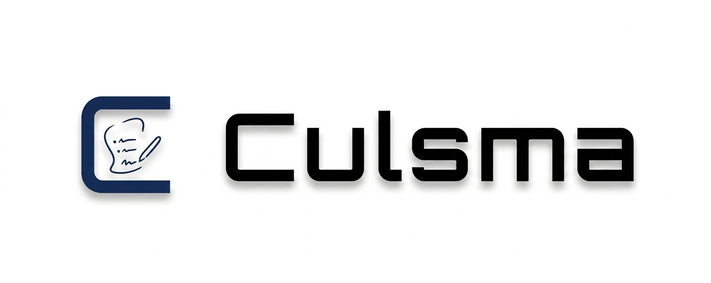

<p align="center">
  
</p>

Culsma is the public reference implementation of the current Culsma language and execution stack.
The public release is distributed as a Python-based CLI.

This repository intentionally contains only the executable core:

- `src/culsma/parser/`
- `src/culsma/pipeline/`
- `src/culsma/runtime/`
- `src/culsma/driver/`
- `src/culsma/stdlib/`
- minimal public `examples/`
- `tests/`

It intentionally leaves out manuscript sources, MCP tooling, editor
integrations, and internal design-workspace documents.

## Install

For the current public release, install directly from the `v1.0.0` tag:

```bash
python -m pip install "culsma @ git+https://github.com/culsma/culsma.git@v1.0.0"
```

Release notes for the first formal release are in [CHANGELOG.md](CHANGELOG.md).

The public language reference is maintained in the companion
`culsma-reference` repository/worktree.

## Repository Layout

```text
src/culsma/parser/    grammar, AST, and source loading
src/culsma/pipeline/  compile, validate, typecheck, and plan lowering
src/culsma/runtime/   execution state, events, and material compute
src/culsma/driver/    backend boundary and concrete drivers
src/culsma/stdlib/    bundled standard-library source
examples/             minimal current-surface examples
tests/                regression and runtime tests
```

## Quick Run

```bash
culsma run --input examples/minimal/public_minimal.culs
```

This prints the primary run result JSON to stdout.

If you want to save the primary result explicitly:

```bash
culsma run --input examples/minimal/public_minimal.culs --output tmp/result.json
```

If you want intermediate and debug artifacts as well:

```bash
culsma run \
  --input examples/minimal/public_minimal.culs \
  --artifacts-dir tmp/run
```

If you are running from a source checkout without the console entrypoint on
`PATH`, use:

```bash
python -m culsma.cli run --input examples/minimal/public_minimal.culs
```

You can also replay a saved run artifact:

```bash
culsma replay --run-json tmp/run/run.json --out tmp/replayed_state.json
```

## Run Tests

```bash
python -m pytest -q
```

## More

- GitHub Releases: [github.com/culsma/culsma/releases](https://github.com/culsma/culsma/releases)
- Changelog: [CHANGELOG.md](CHANGELOG.md)
- Support policy: [SUPPORT.md](SUPPORT.md)

## Scope Notes

- This repository is the public code boundary for the current paper-aligned
  implementation snapshot.
- Example selection is intentionally narrow; only minimal current-surface
  examples are kept in this public boundary.
- This repository is licensed under Apache-2.0. See `LICENSE`.

## Support and Maintenance Policy

Culsma is a public open-source reference implementation of the Culsma language
and execution stack.

The repository is published as-is. Maintainer review is limited to narrowly
scoped, reproducible defects in the current public baseline. General support,
custom integration help, roadmap requests, and broad feature requests are out
of scope for the public issue tracker.
