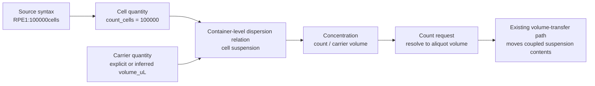
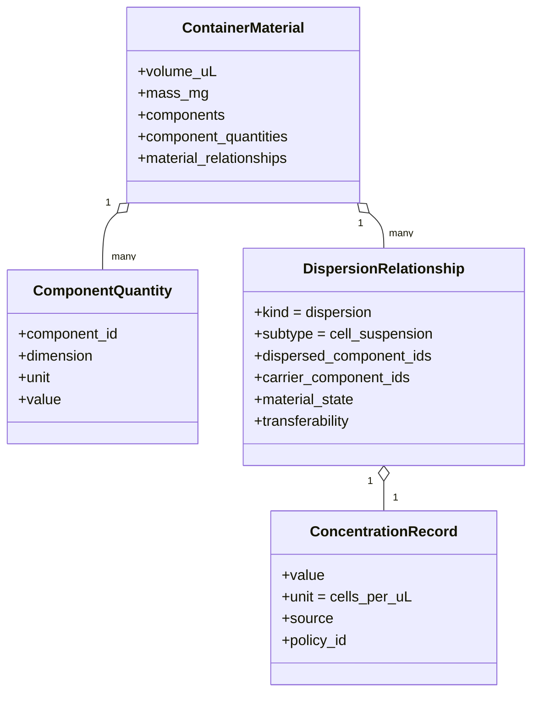
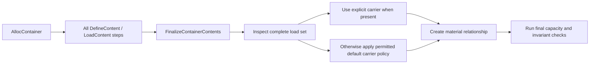
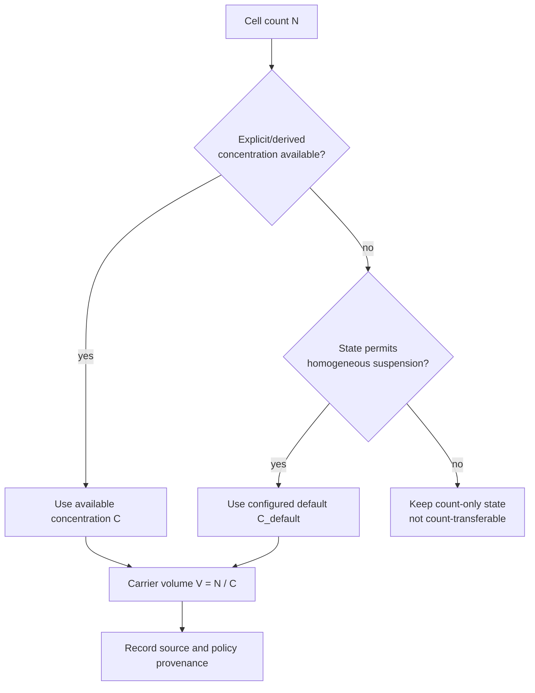
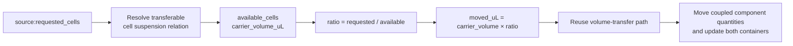
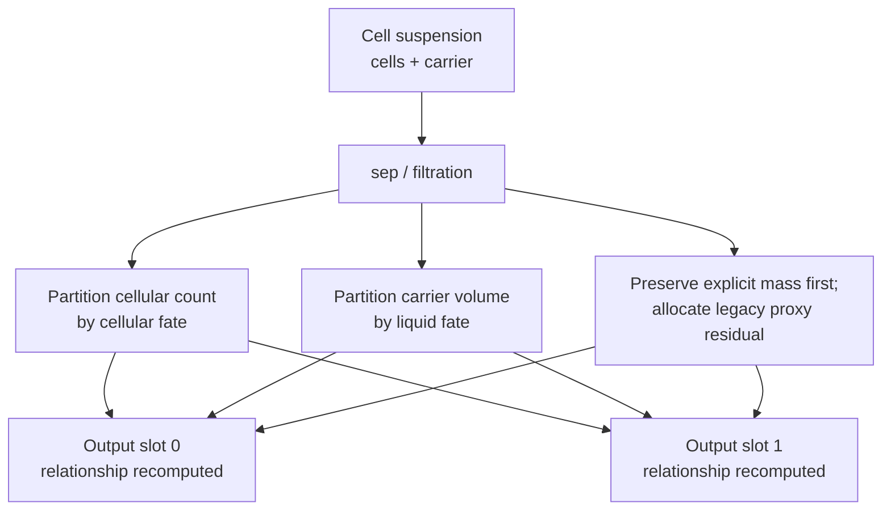
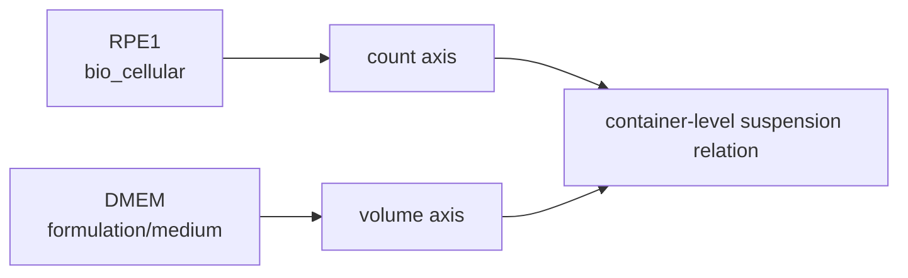
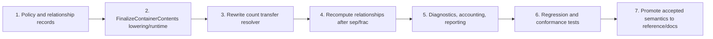

# Cell Suspension Material Model Proposal

> Status: local implementation record; not yet promoted to accepted language semantics.
>
> Scope: constructor cell-count initialization, carrier resolution, count-based
> transfer, and separation behavior. Scientific Model Gateway work remains
> separate.
>
> Implementation status (2026-08-23): phases 1-6 are implemented locally;
> reference/public documentation promotion and prerelease publication remain
> pending acceptance.

## 1. Decision Summary



1. Keep `cells` as an independent count quantity in source and material state.
2. Do not replace cell count permanently with volume.
3. Model a cell suspension as cellular content plus carrier content connected by
   a container-level dispersion relationship.
4. Resolve `source:25000cells` to an aliquot volume from the current suspension
   concentration, then reuse the existing volume-transfer path.
5. Permit count-only suspension initialization by applying a configurable
   default concentration and creating an inferred carrier volume.
6. Do not introduce a canonical `cell_solution` content kind or type.
7. Treat adherent cells and pellets as non-suspension states until a future
   detach or resuspend transition makes them transferable as a homogeneous
   aliquot.

## 2. Goals and Non-Goals

| Area | In scope | Out of scope |
| --- | --- | --- |
| Frontend | Preserve `content(...):100000cells` and `source:25000cells` | New user-authored suspension constructor syntax |
| Constructor | Resolve explicit or inferred carrier after the complete load list | Treat every cellular state as a liquid |
| Runtime | Store count, carrier volume, concentration, state, and provenance | Erase count after conversion to volume |
| Transfer | Convert a requested count into a suspension aliquot volume | Bare-cell teleportation through ordinary `<<` |
| Separation | Partition cells and carrier by independent fates | Predict biological recovery beyond current deterministic policies |
| Extensibility | Use a general dispersion relationship that can later support beads or particles | Implement Scientific Model Gateway phase 1 in this change |

## 3. Authoring Surface

### 3.1 Explicit Cell Count and Carrier

```culs
let cells = tube(
    label = "RPE1 suspension",
    capacity = 500uL,
    load = [
        content(
            kind = bio_cellular,
            type = cell_line,
            code = "RPE1",
            attrs = { state: suspension }
        ):100000cells,
        content(
            kind = formulation,
            type = medium,
            code = "DMEM_F12"
        ):300uL
    ]
);
```

The explicit carrier determines the initial concentration:

```text
100000 cells / 300 uL = 333.333 cells/uL
```

### 3.2 Count-Only Suspension Initialization

```culs
let cells = tube(load = [
    content(
        kind = bio_cellular,
        type = cell_line,
        code = "RPE1",
        attrs = { state: suspension }
    ):100000cells
]);
```

The runtime policy supplies a default concentration and derives an implicit
carrier volume. The initial proposed reference-runtime default is:

```text
default_cell_suspension_concentration = 1000 cells/uL
                                      = 1,000,000 cells/mL

implicit carrier volume = 100000 cells / 1000 cells/uL
                        = 100 uL
```

The value is an implementation policy and recorded assumption, not a universal
scientific constant or grammar-level definition.

### 3.3 Adherent and Pellet States

```culs
content(
    kind = bio_cellular,
    type = cell_line,
    code = "RPE1",
    attrs = { state: adherent }
):100000cells
```

Count-only `adherent` and `pellet` content remains valid initial state, but does
not receive an implicit suspension carrier. Count-based ordinary transfer is
unavailable until a future state transition establishes a transferable
suspension.

## 4. Internal Material Model



Illustrative state:

```yaml
component_quantities:
  RPE1:
    dimension: count
    unit: cells
    value: 100000
  DMEM_F12:
    dimension: volume
    unit: uL
    value: 300
material_relationships:
  - kind: dispersion
    subtype: cell_suspension
    dispersed_component_ids: [RPE1]
    carrier_component_ids: [DMEM_F12]
    material_state: suspension
    transferability: homogeneous_aliquot
    concentration:
      value: 333.333333
      unit: cells_per_uL
      source: derived
      policy_id: explicit_carrier_volume
```

`components` remains a backward-compatible summary. Dimension-specific
arithmetic uses `component_quantities`; numeric values from different dimensions
must not be summed as scientific quantities.

## 5. Constructor Finalization

### 5.1 Current Lowering


The current sequence stores both components but does not establish their
container-level relationship.

### 5.2 Proposed Lowering



`FinalizeContainerContents` is an internal plan/runtime operation, is never
dispatched to physical drivers, and is not directly authorable Culsma syntax.

The lowerer emits it only for constructors containing a cell-count load, after
all load items, so behavior is independent of load order. Volume/mass-only
constructors retain their existing plan shape.

### 5.3 Initialization Decision Table

| Cellular state | Count | Explicit eligible liquid | Finalization behavior |
| --- | ---: | ---: | --- |
| `suspension` | yes | yes | Derive concentration from count and eligible carrier volume |
| `suspension` | yes | no | Apply default concentration; create inferred carrier volume |
| `adherent` | yes | any | Preserve count; represent surface association; do not create suspension carrier |
| `pellet` | yes | no/residual | Preserve count and residual bulk separately; mark non-homogeneous/non-transferable |
| unspecified | yes | yes | Infer suspension with recorded assumption unless contrary metadata exists |
| unspecified | yes | no | Apply default suspension policy with explicit assumption provenance |
| no cellular count | no | any | Preserve existing volume/mass-only constructor behavior |

Eligible carrier content initially includes volume-bearing `formulation`
content classified as medium or buffer. Later revisions may use explicit roles
or a broader carrier-selection policy.

## 6. Default Carrier Policy



Proposed runtime policy object:

```text
CellSuspensionPolicy
  default_concentration_cells_per_uL = 1000.0
  allow_implicit_carrier = true
  unspecified_cellular_state = suspension_with_assumption
```

Required provenance values:

| `source` | Meaning |
| --- | --- |
| `measured` | Supplied by measured/runtime observation |
| `explicit` | Supplied by authored or configured concentration |
| `derived` | Computed from explicit count and carrier volume |
| `default` | Computed from the reference-runtime fallback policy |

Implicit carrier contributes to physical container volume and capacity. It is
not reported as a user-supplied reagent lot; reports expose it as an assumption
or inferred material quantity.

## 7. Count-Based Transfer

### 7.1 Resolution



For a homogeneous suspension:

```text
ratio = requested_cells / available_cells
moved_volume_uL = transferable_carrier_volume_uL * ratio
moved_mass_mg = transferable_bulk_mass_mg * ratio
```

The runtime exposes `resolved_transfer_volume_uL` as the carrier/pipetting
volume. While the compatibility ledger still contains cross-axis bulk proxies,
`moved_bulk_volume_uL` may differ; component quantities always move by the same
`ratio`. Concentration never uses the bulk proxy as its denominator.

Material compute resolves the aliquot on a working copy before driver dispatch.
The driver receives the resolved volume plus the original count request as
resolution provenance. The candidate material state is committed only after
driver success. Container capacity uses physical volume-dimension quantities
and the resolved carrier volume, not the compatibility bulk proxy.

The transfer moves the requested cell count and the same aliquot ratio of the
related carrier and other homogeneously distributed components. It does not
move a bare count independently of physical carrier.

### 7.2 Transfer Rules

1. Count-based transfer requires a transferable suspension relationship.
2. A volume-based transfer from a suspension continues to carry count by the
   transferred volume ratio.
3. Ordinary container sources and indexed contents sources use the same count
   resolver.
4. Count-only adherent or pellet material cannot use ordinary count transfer.
5. If more than one independently addressable cellular population makes the
   requested count ambiguous, runtime rejects the transfer until source syntax
   can identify the intended component.
6. Full-container transfer continues to move the whole material state and its
   relationships.
7. A zero-cell request is a shared no-op across ordinary, partition, and
   indexed-contents paths; it does not require a transferable suspension and
   does not create zero-valued target components.
8. Mixing or dilution produces `derived` concentration provenance while
   retaining default-policy ancestry in `assumption_policy_ids`.

## 8. Separation and State Transitions



After partitioning, each output relationship is recomputed from its own count,
carrier volume, program slot contract, and material state. A centrifuge pellet
may contain residual volume, but is not automatically classified as a
homogeneous suspension. A later resuspension transition is required before
count-resolved pipetting.

The already implemented mixed count/volume/mass bulk fix remains compatible:
explicit quantities are applied first, cross-axis legacy proxy residuals are
allocated by the opposite explicit axis, and total bulk volume/mass is
conserved.

## 9. Content Identity and Quantity-Axis Invariants



1. Canonical cellular content uses the count axis when count is known.
2. Carrier medium/buffer content uses the volume axis.
3. A single content identity cannot merge incompatible quantity dimensions in
   one `component_quantities` record.
4. Legacy cellular volume such as `RPE1:10uL` remains compatibility input but
   represents cellular material with unknown count; it cannot satisfy a count
   transfer without a count/concentration observation.
5. Merging legacy volume-coded cellular content with count-coded content of the
   same identity produces a specific axis-conflict diagnostic rather than a
   late conservation failure.

No canonical `cell_solution` type is added. Suspension is a relationship between
components, not a replacement content identity.

## 10. Diagnostics and Observability

| Proposed code/event | Condition |
| --- | --- |
| `ASSUMED_CELL_SUSPENSION_CONCENTRATION` | Constructor used default concentration and inferred carrier volume |
| `MAT_INVALID_CELL_SUSPENSION_CONCENTRATION` | Concentration is missing, zero, negative, or non-finite where required |
| `MAT_COUNT_TRANSFER_SOURCE_NOT_SUSPENSION` | Count transfer targets adherent, pellet, or otherwise non-transferable material |
| `MAT_COUNT_TRANSFER_AMBIGUOUS` | More than one cellular population is available without a selector |
| `MAT_CONTENT_QUANTITY_AXIS_CONFLICT` | Same content identity would merge incompatible quantity axes |
| `MAT_IMPLICIT_CARRIER_OVERFLOW` | Inferred carrier volume exceeds container capacity |
| `MAT_INSUFFICIENT_COUNT` | Transfer requests more cells than available |

Material deltas and public reports should expose:

```text
requested_cells
resolved_transfer_volume_uL
concentration_cells_per_uL
concentration_source
policy_id
```

## 11. Compatibility

| Existing behavior | Proposed handling |
| --- | --- |
| Volume/mass-only containers | Unchanged |
| `cells` constructor load | Preserved; finalized into a relationship when applicable |
| Volume transfer from cell suspension | Preserved; count moves proportionally |
| RC3 direct count transfer with zero bulk movement | Replaced by concentration-resolved aliquot transfer |
| Count-only cells in a small-capacity tube | May now overflow after inferred carrier is materialized |
| Legacy cellular volume load | Accepted in compatibility mode with unknown count |
| Adherent count in a well/surface | Count preserved without implicit carrier; direct count transfer rejected |

The published `internal-1.0.6rc3` tag remains immutable. This proposal and the
post-tag mixed-axis conservation fix require a later internal prerelease before
promotion to a normal release.

## 12. Implementation Plan



### Phase 1: Runtime Data and Policy

- Add a runtime-configurable `CellSuspensionPolicy`.
- Add typed material relationship/concentration helper functions.
- Preserve relationship and provenance fields through copies and movements.

### Phase 2: Constructor Finalization

- Lower one internal `FinalizeContainerContents` step after all constructor load
  items.
- Resolve explicit eligible carriers before considering the default policy.
- Materialize inferred carrier volume atomically and run capacity checks.
- Establish suspension, adherent, or pellet relationships.

### Phase 3: Transfer Unification

- Replace zero-bulk `_apply_transfer_count` behavior with count-to-volume
  resolution.
- Route the resolved aliquot through the ordinary volume-transfer mechanism.
- Use the same resolver for ordinary, source-partition, and indexed-contents
  count transfers.
- Preflight quantity-axis compatibility before mutation.

### Phase 4: Separation and Reports

- Recompute output relationships after `sep` and `frac`.
- Preserve pellet/non-homogeneous state instead of assuming suspension from
  residual volume alone.
- Add concentration provenance and resolved-volume fields to inspectable deltas
  and reports.

## 13. Verification Matrix

| Area | Required cases |
| --- | --- |
| Parser/typecheck | Existing `cells` syntax remains valid; invalid count forms retain focused diagnostics |
| Constructor | Explicit count + carrier; count-only default carrier; load-order independence; capacity overflow |
| State | Suspension, adherent, pellet, and unspecified-state decision paths |
| Transfer | Count resolves before driver dispatch; volume carries count; preloaded target; insufficient and zero count |
| Consistency | Ordinary, `source.partition`, and `contents[i]` count transfers share carrier resolution fields |
| Identity | Cross-axis same-content merge rejects atomically with specific diagnostic |
| Separation | Cells and carrier follow independent fates; strategy-owned solid slots remain non-transferable |
| Mixed axes | Count + volume + mass conserves compatibility totals while capacity uses physical carrier volume |
| Accounting | Inferred carrier is identified as assumption, not user-supplied reagent inventory |
| Result surface | Count, carrier volume, concentration, source, and policy provenance serialize correctly |
| Compatibility | Volume/mass-only suite and legacy cellular-volume inputs retain documented behavior |

## 14. Promotion Checklist

This document is the local implementation record. After code behavior and tests
are accepted:

1. Promote language and runtime contracts to `culsma-reference`.
2. Specify the default reference-runtime policy and provenance requirements.
3. Update public constructor, transfer, separation, and artifact documentation.
4. Migrate the public Case08 artifact from cellular volume to cell count plus
   carrier state where appropriate.
5. Add conformance mappings for constructor finalization, count-resolved
   transfer, separation relationship recomputation, and diagnostics.
6. Publish a new internal prerelease; do not mutate `internal-1.0.6rc3`.

## 15. Future Gateway Boundary

The kernel can deterministically derive concentration when count and carrier
volume are known. The default concentration policy is a recorded fallback. A
future Scientific Model Gateway may replace or refine the fallback using cell
type, viability, aggregation, recovery, device, or protocol context.

The gateway must not directly mutate material state. It returns a typed,
provenanced prediction; the kernel validates it and applies the resulting state
transition.
