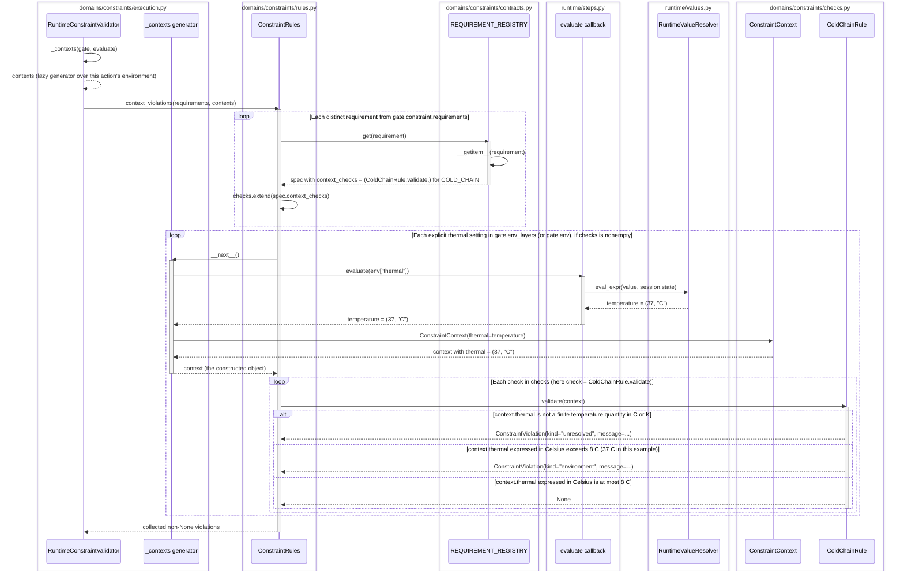

# Constraint Check Invocation

## COLD_CHAIN with an explicit environment temperature

```mermaid
sequenceDiagram
    box domains/constraints/execution.py
        participant A as RuntimeConstraintValidator
        participant G as _contexts generator
    end
    box domains/constraints/rules.py
        participant R as ConstraintRules
    end
    box domains/constraints/contracts.py
        participant S as REQUIREMENT_REGISTRY
    end
    box runtime/steps.py
        participant E as evaluate callback
    end
    box runtime/values.py
        participant V as RuntimeValueResolver
    end
    box domains/constraints/checks.py
        participant X as ConstraintContext
        participant C as ColdChainRule
    end

    A->>A: _contexts(gate, evaluate)
    A-->>A: contexts (lazy generator over this action's environment)
    A->>R: context_violations(requirements, contexts)
    activate R

    loop Each distinct requirement from gate.constraint.requirements
        R->>S: get(requirement)
        activate S
        S->>S: __getitem__(requirement)
        S-->>R: spec with context_checks = (ColdChainRule.validate,) for COLD_CHAIN
        deactivate S
        R->>R: checks.extend(spec.context_checks)
    end

    loop Each explicit thermal setting in gate.env_layers (or gate.env), if checks is nonempty
        R->>G: __next__()
        activate G
        G->>E: evaluate(env["thermal"])
        activate E
        E->>V: eval_expr(value, session.state)
        V-->>E: temperature = (37, "C")
        E-->>G: temperature = (37, "C")
        deactivate E
        G->>X: ConstraintContext(thermal=temperature)
        X-->>G: context with thermal = (37, "C")
        G-->>R: context (the constructed object)
        deactivate G

        loop Each check in checks (here check = ColdChainRule.validate)
            R->>C: validate(context)
            activate C
            alt context.thermal is not a finite temperature quantity in C or K
                C-->>R: ConstraintViolation(kind="unresolved", message=...)
            else context.thermal expressed in Celsius exceeds 8 C (37 C in this example)
                C-->>R: ConstraintViolation(kind="environment", message=...)
            else context.thermal expressed in Celsius is at most 8 C
                C-->>R: None
            end
            deactivate C
        end
    end

    R-->>A: collected non-None violations
    deactivate R
```
