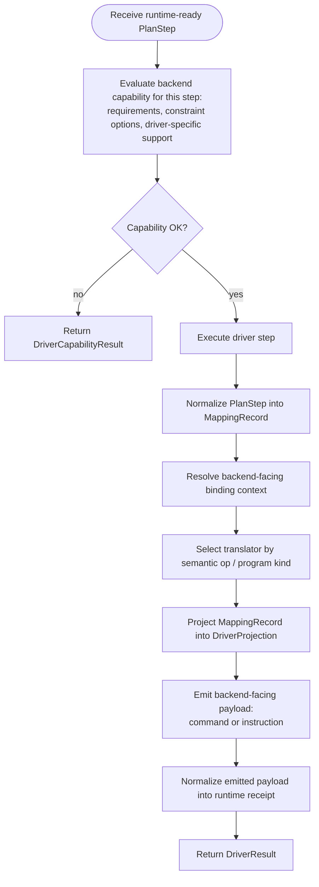
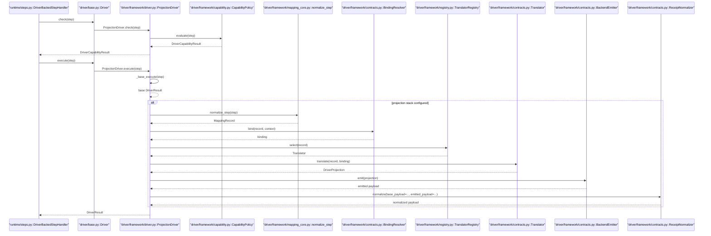
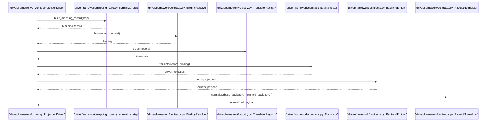
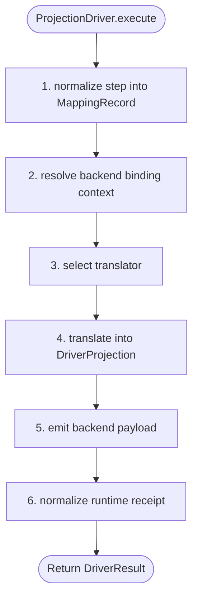
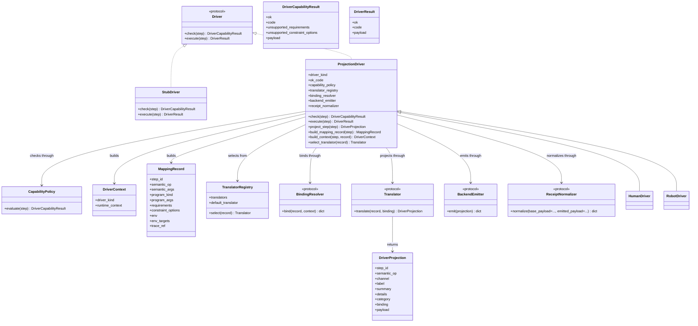

# Driver Module Diagrams

Last updated: 2026-04-25

Related runtime/driver documents:

1. [runtime_module_diagrams.md](https://github.com/culsma/culsma/blob/main/docs/architecture/runtime_module_diagrams.md)

## Scope

This document records the current `driver` structure.

The driver layer consumes runtime-ready `PlanStep` objects and returns:

- capability decisions through `DriverCapabilityResult`
- execution receipts through `DriverResult`

Its job is not to schedule execution, resolve runtime values, or update
material state. Those stay in `runtime/`.

The driver layer does three things:

1. decide whether a backend can execute one step under current constraints
2. project one canonical step into backend-facing command or instruction data
3. normalize backend-facing payloads into stable runtime receipts

The structure is intentionally conservative:

- `driver/base.py` defines the public contracts
- `driver/framework/driver.py` defines the reusable projection template
- `driver/framework/capability.py` owns formal capability checks
- `human_driver/` and `robot_driver/` mostly do component assembly
- `StubDriver` remains a concrete deterministic testing driver, not a base
  class for formal drivers

## Functional Flowchart

## Driver Sequence

## Driver Detail Sequence

## Driver Detail Flowchart

## Class And Module Diagram

