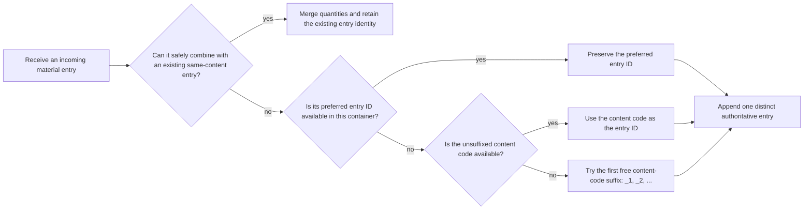
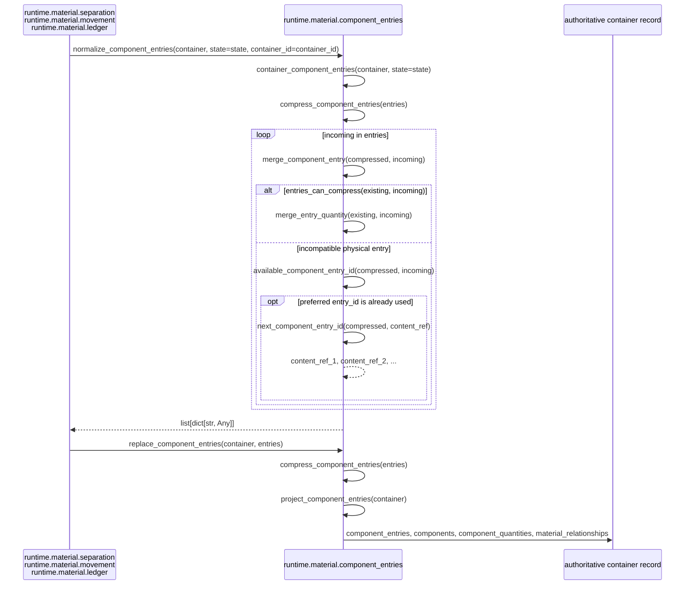

# Component Entry Identity

`runtime.material.component_entries` owns authoritative `component_entries` and
their container-local `entry_id` values. This is general Material Runtime
infrastructure used by separation, physical movement, ledger normalization, and
legacy hydration. The Scientific Model consumes entry IDs but does not create
or rename them.

`next_component_entry_id()` uses collision suffixes such as `content_ref_1`,
`content_ref_2`, and so on.

## 1. Functional Flow

The runtime never derives `content_ref` by removing a suffix from `entry_id`.
`content_ref` remains an independent authoritative field.

## 2. Implementation Sequence

Every message is an exact current module and method name.

## 3. Complete Class Map

```mermaid
classDiagram
    direction LR

    class ComponentEntriesModule["runtime.material.component_entries"] {
        +container_component_entries(container, state) list~dict~
        +normalize_component_entries(container, state, container_id) list~dict~
        +entries_can_compress(left, right) bool
        +compress_component_entries(entries) list~dict~
        +merge_component_entry(entries, incoming) string
        +available_component_entry_id(entries, incoming) string
        +next_component_entry_id(entries, content_ref) string
        +plan_component_entry_transfer(source, target, transitions_by_entry_id, ...) ComponentEntryTransfer
        +replace_component_entries(container, entries)
        +project_component_entries(container)
    }
    class AuthoritativeComponentEntry {
        +entry_id : string
        +content_ref : string
        +amount : float
        +quantity : dict?
        +relation : string
        +associated_with : string?
        +association_target_kind : string?
    }
    class SeparationModule["runtime.material.separation"] {
        +apply_separation_material(...)
        +commit_separation_candidate(candidate, source, outputs_by_part) dict
    }
    class MovementModule["runtime.material.movement"] {
        +apply_material_movement(state, source, target, source_id, destination_id, ratio, material_effect_adapter, request_id) MaterialMovementApplicationResult
        +commit_material_movement(candidate, source, target) ComponentEntryTransfer
    }
    class LedgerModule["runtime.material.ledger"] {
        +normalize_material_state_detail_ledger(state)
    }
    class ScientificModelMaterialAdapter["runtime.material.scientific_model_adapter.ScientificModelMaterialAdapter"] {
        +resolve(...) ResolvedMaterialEffect
        +resolve_movement(...) ResolvedMaterialTransition | MaterialEffectFailure
    }

    ComponentEntriesModule *-- AuthoritativeComponentEntry : owns entry_id
    SeparationModule --> ComponentEntriesModule : normalize and commit
    MovementModule --> ComponentEntriesModule : transfer and commit
    LedgerModule --> ComponentEntriesModule : hydrate and normalize
    ScientificModelMaterialAdapter --> AuthoritativeComponentEntry : consumes identity only

```

