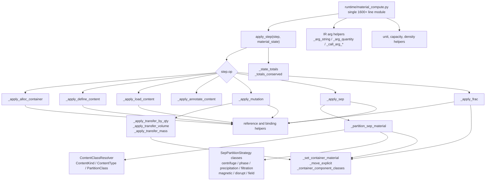
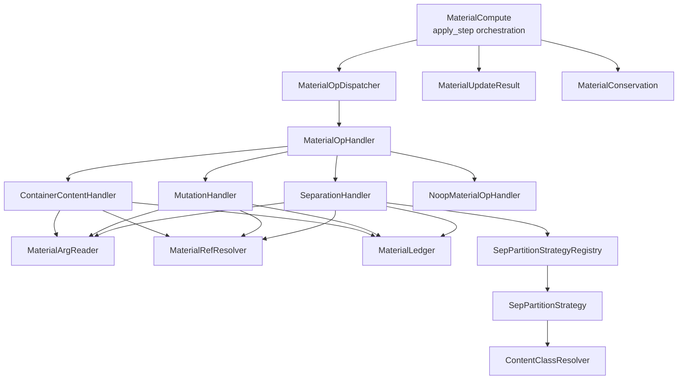
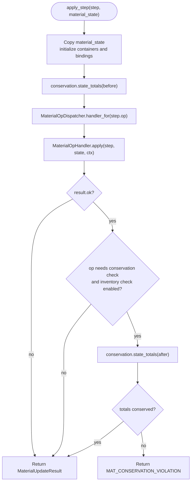
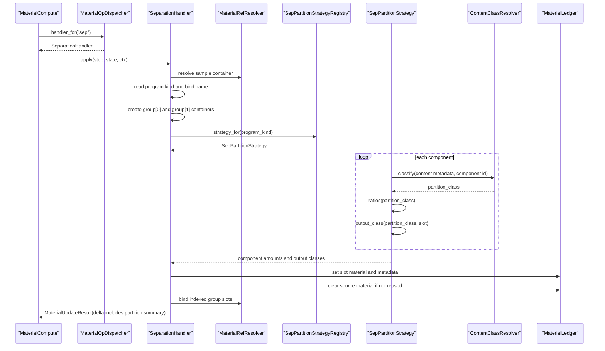
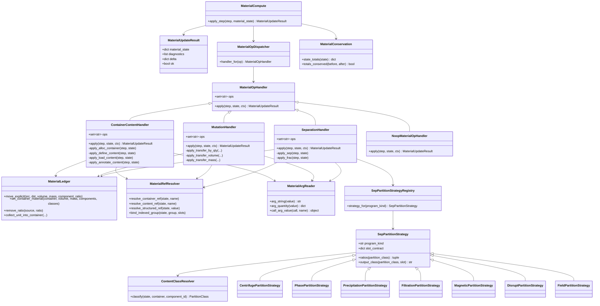

# Material Compute Module Diagrams

Last updated: 2026-05-09

Related runtime document:

1. [runtime_module_diagrams.md](./runtime_module_diagrams.md)

## Scope

This document isolates the runtime material-compute subsystem from the broader
runtime diagrams. The goal is to make the current 1600-line
`runtime/material_compute.py` structure visible before changing its class
structure.

Material compute owns deterministic updates to the runtime material ledger. It
does not parse language source, define protocol semantics, execute physical
drivers, or shape public protocol returns. It receives a resolved `PlanStep`
and a `material_state`, then returns a `MaterialUpdateResult`.

Current responsibilities include:

1. dispatching material operations;
2. allocating containers and defining/loading/annotating content;
3. resolving container, content, and indexed-group references;
4. moving volume, mass, components, and internal component metadata;
5. applying `sep` and `frac` material transforms;
6. classifying content for separation partitioning;
7. checking conservation invariants.

## Current Single-Module Structure

Current issue:

- The single file is doing orchestration, operation handling, state-reference
  resolution, low-level ledger mutation, separation strategy, content
  classification, and invariant checks.
- Adding only a separate partition area would reduce the newest growth but
  would not fix the underlying class responsibility boundary.

## Current Class Structure

Design goal:

- `MaterialCompute` owns apply-step orchestration and conservation gating.
- `MaterialOpDispatcher` maps `step.op` to a `MaterialOpHandler`.
- Each operation family owns its own handler behavior through a common base
  class.
- Low-level ledger mutation is represented as `MaterialLedger`, a shared
  service class used by handlers.
- File placement is intentionally coarse: one `runtime/material/` subpackage
  with four files, grouped by the class families below.

## Current File Grouping

```mermaid
flowchart TB
    Facade["runtime/material_compute.py<br/>compatibility facade"]
    Package["runtime/material/"]

    Facade --> ComputeFile["compute.py"]
    Package --> ComputeFile
    Package --> HandlerFile["handler.py"]
    Package --> PartitionFile["partition.py"]
    Package --> SupportFile["support.py"]

    ComputeFile --> MaterialCompute["MaterialCompute"]
    ComputeFile --> MaterialUpdateResult["MaterialUpdateResult"]
    ComputeFile --> MaterialOpDispatcher["MaterialOpDispatcher"]

    HandlerFile --> MaterialOpHandler["MaterialOpHandler"]
    HandlerFile --> ContainerContentHandler["ContainerContentHandler"]
    HandlerFile --> MutationHandler["MutationHandler"]
    HandlerFile --> SeparationHandler["SeparationHandler"]
    HandlerFile --> NoopMaterialOpHandler["NoopMaterialOpHandler"]

    PartitionFile --> SepPartitionStrategyRegistry["SepPartitionStrategyRegistry"]
    PartitionFile --> SepPartitionStrategy["SepPartitionStrategy"]
    PartitionFile --> ProgramStrategies["Centrifuge / Phase / Precipitation<br/>Filtration / Magnetic / Disrupt / Field"]
    PartitionFile --> ContentClassResolver["ContentClassResolver"]

    SupportFile --> MaterialLedger["MaterialLedger"]
    SupportFile --> MaterialRefResolver["MaterialRefResolver"]
    SupportFile --> MaterialArgReader["MaterialArgReader"]
    SupportFile --> MaterialConservation["MaterialConservation"]
```

This avoids one-file-per-class churn while still splitting the current
single-file material compute boundary into the three real behavior groups:
apply-step orchestration, step-op handling, and separation partition strategy.
Shared lower-level services stay together in `support.py` until they grow large
enough to justify further splitting.

## Current Apply-Step Flow

## Separation Sequence

This keeps the key semantic boundary: material classes are data traits;
separation programs own the behavior that interprets those traits.

## Class Diagram

## Refactor Status

The material compute refactor is implemented with a behavior-preserving split:

1. `MaterialOpHandler` and `MaterialOpDispatcher` route material updates by
   `step.op`.
2. Container/content behavior lives in `ContainerContentHandler`.
3. Mutation and quantified transfer behavior live in `MutationHandler`.
4. `sep` and `frac` behavior live in `SeparationHandler`.
5. `SepPartitionStrategy` and its subclasses remain the second inheritance
   family, owned by separation behavior.
6. Argument reading, reference resolution, ledger mutation, and conservation
   live together in `support.py`.
7. The resulting class groups live in `runtime/material/compute.py`,
   `handler.py`, `partition.py`, and `support.py`.
8. `runtime/material_compute.py` remains as a compatibility facade.

Conformance rule: every stage should keep the existing material tests passing,
especially the separation program tests and DNA cleanup regression.
