# Material Compute Module Diagrams

Last updated: 2026-08-24

Related runtime document:

1. [runtime_module_diagrams.md](./runtime_module_diagrams.md)

## Scope

This document isolates the runtime material-compute subsystem from the broader
runtime diagrams. The goal is to make the current material-compute structure
visible before changing its class structure further.

Material compute owns deterministic updates to the runtime material ledger. It
does not parse language source, define protocol semantics, execute physical
drivers, or shape public protocol returns. It receives a resolved `PlanStep`
and a `material_state`, then returns a `MaterialUpdateResult`.

Current responsibilities include:

1. dispatching material operations;
2. allocating containers, defining/loading content, and finalizing container
   material relationships;
3. resolving container, content, and indexed-group references;
4. resolving count-addressed cell-suspension aliquots from eligible carrier
   volume and moving volume, mass, components, and internal metadata;
5. applying `sep` and `frac` material transforms;
6. classifying content for separation partitioning;
7. checking conservation invariants;
8. distinguishing physical volume used for capacity and driver execution from
   cross-axis bulk compatibility proxies.

## Material Operation Responsibility Flowchart

This top-level flowchart shows the target lifecycle for one material runtime
step. It shows how the runtime decides what material state, if any, changes for
that step.

Read the three diagrams as nested views:

1. Material operation responsibility is the top-level apply-step lifecycle.
2. Material state change expands how a step changes material records,
   quantities, components, or indexed parts.
3. The separation outcome activity diagram expands how `sep` derives and
   records indexed container contents.

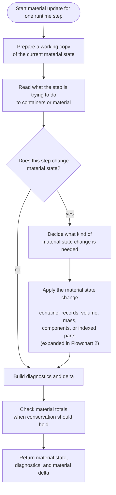

Design goal:

- `MaterialCompute` owns apply-step orchestration and conservation gating.
- `MaterialStateManager` is the single target owner for material-state changes
  after the step has been interpreted.
- `MaterialStateManager` decides whether the step changes container records,
  volume, mass, components, indexed parts, or no material state.
- Reusable behavior is represented by public material services, not
  cross-module imports of underscore-prefixed helper functions.
- `MaterialIndexedPartsStateManager` is an internal collaborator for partitioned or
  indexed container contents. It is not a top-level material-operation branch.
- Separation strategy remains a separate inheritance family because each
  separation program owns a different slot contract and component-fate policy.
  It is a strategy collaborator used while applying separation or
  fractionation, not a top-level material-operation branch.

## Material State Change Flowchart

This flowchart expands the material-state change box from the top-level
material operation flowchart. It shows the target manager deciding and applying
the material change needed by the current step.

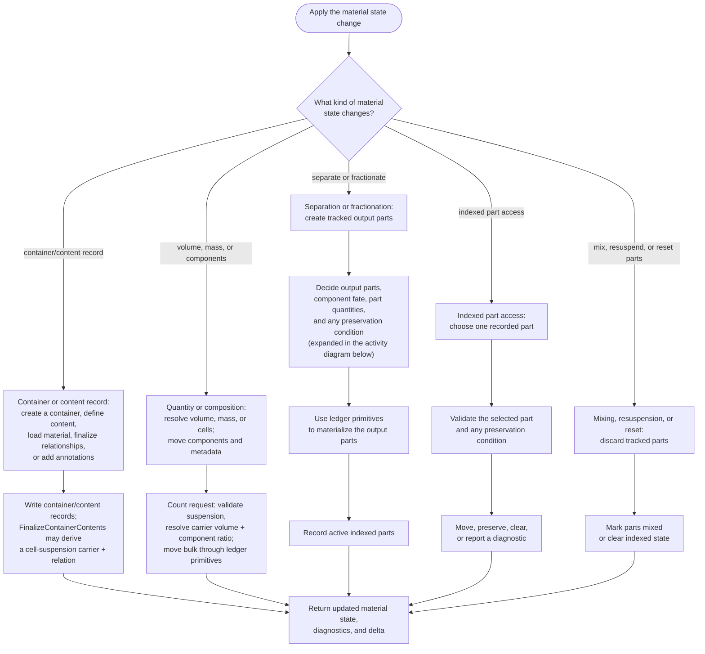

Design judgment:

1. This flowchart is entered only after the top-level flow has decided that the
   step changes material state.
2. Container records, quantities, components, and indexed parts are all material
   state, so the target flow routes them through the same state-change manager.
3. `sep` and `frac` create tracked output parts and attach any preservation
   condition required by later indexed part access.
4. `container.contents[i]` consumes an indexed part. It must validate any
   preservation condition declared by that state before moving or preserving
   material.
5. Mixing, resuspension, and equivalent reset operations intentionally discard
   tracked parts instead of validating them.
6. Preservation checks are scoped to the source, target, group members, wells,
   or shared environment affected by the current operation. They should not scan
   unrelated material state.
7. `suspension.py` owns the runtime policy, implicit-carrier provenance,
   dispersion relationships, and relationship refresh after movement or
   partitioning. It does not add a new content kind.

## Separation Outcome UML Activity Overview

The overview shows the sequential calculation boundary. The following four
activity diagrams expand every major action without depending on implementation
module names.

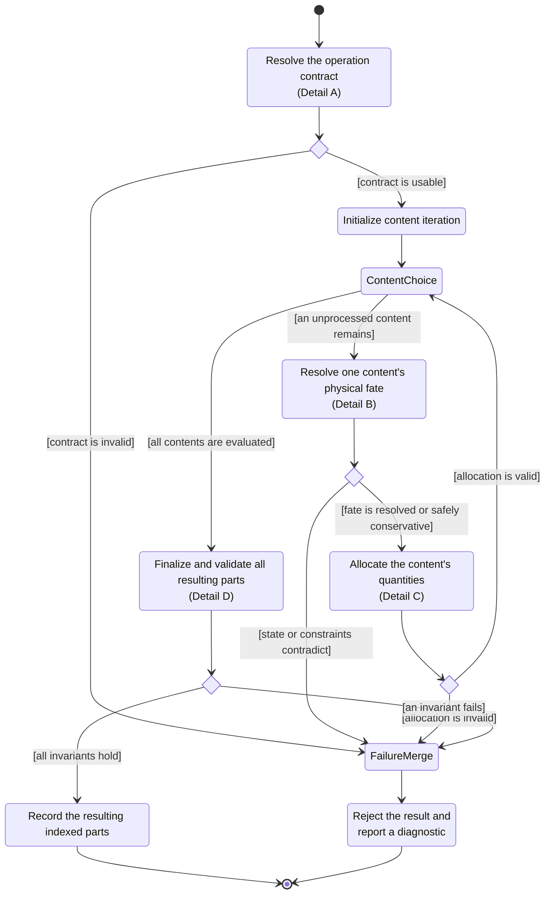

### Detail A: Operation Contract Resolution

This activity determines what the operation means physically before any
content quantity is routed.

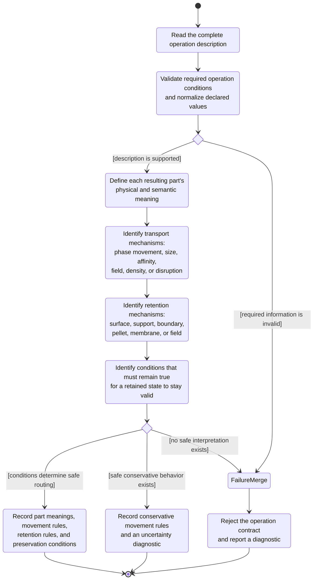

### Detail B: Per-Content Physical Fate

This activity resolves one content independently of its quantity dimension.
Count, volume, and mass describe amount; they do not by themselves establish
whether the content is mobile or retained.

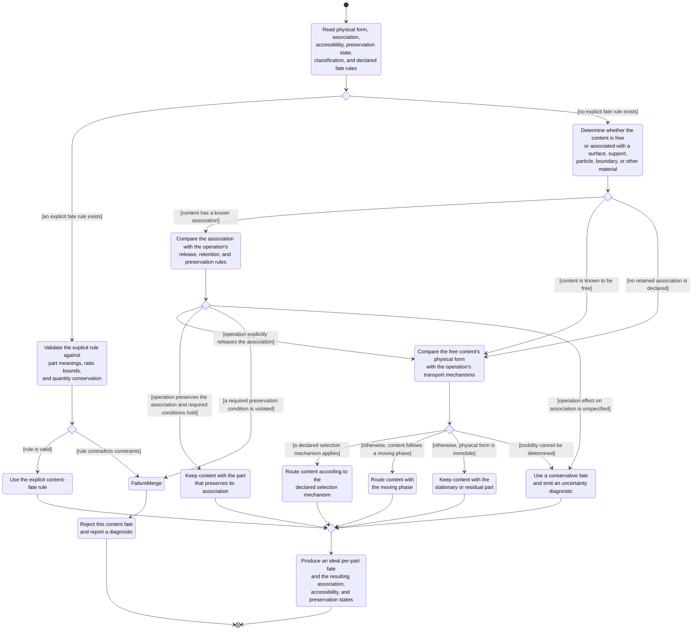

The association path is the implemented decision boundary. It compares
the complete operation contract from Detail A with the content's association
and preservation state. The quantity axis is carried forward for accounting,
but it does not select the retained or mobile branch.

An author may override the reference fate for a named content at the `sep`
boundary. Output names come from the selected program's part contract; both
outputs are required and their ratios must sum to 100%.

```culsma
let parts = sep(
  sample = source,
  program = filtration_program(membrane = "0.2um", drive = "pressure"),
  component_fates = {
    RPE1: { filtrate: 25%, retentate: 75% }
  }
);
```

| Fate source precedence | Meaning |
| --- | --- |
| author-declared content fate | Exact conservative split supplied by the protocol author |
| preserved or released association | Deterministic consequence of the operation contract |
| reference transport prediction | Default split for freely mobile classified content |
| conservative unresolved fate | Equal split plus an uncertainty diagnostic |

### Detail C: Per-Content Quantity Allocation

This activity converts the physical fate into quantities while preserving the
content's authoritative quantity axis.

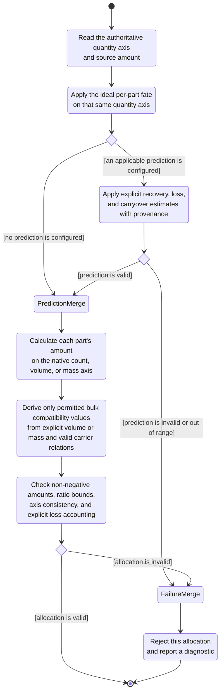

### Detail D: Aggregate Result Finalization

This activity validates the complete separation result before it becomes
container-owned indexed contents.

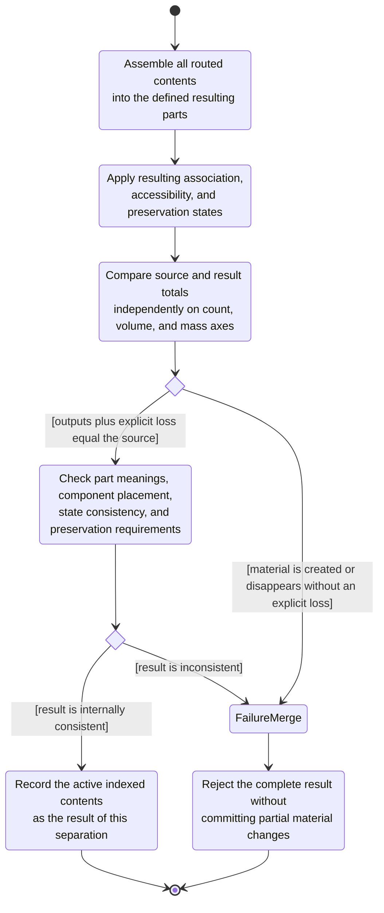

Design judgment:

1. Separation planning receives the complete operation conditions, not only a
   broad separation category.
2. Quantity dimension does not decide mobility. A count-bearing cell component
   may be suspended, pelleted, surface-associated, or otherwise immobilized.
3. Association and accessibility decide whether the operation may move a
   component. A preserved association follows the retaining part by default; a
   prediction model may later add explicit loss.
4. The same separation outcome determines each part's physical state. Solid or
   retained parts must not become transferable suspensions merely because
   residual liquid exists.
5. Concentration uses eligible carrier component quantities. Aggregate
   `container.volume_uL` remains the compatibility bulk ledger and may include
   cross-axis proxy volume.
6. Bulk quantity accounting remains separate from component fate ratios, but
   both belong to the same separation outcome. Dimensioned component
   quantities are authoritative. Any remaining legacy bulk contribution is
   preserved as a cross-axis proxy: mass residual follows partitioned carrier
   volume, while volume residual follows partitioned explicit mass. This covers
   mixed count/volume/mass state without losing bulk totals; insufficient
   information retains the conservative fallback.
7. Indexed contents are projections of the recorded separation outcome;
   indexed access must not rerun or reinterpret the separation model.

## Material Operation Sequence

Read the three sequence diagrams as nested views:

1. Material operation sequence is the top-level target runtime dispatch path.
2. Material state change sequence expands
   `MaterialStateManager.apply_change(...)`.
3. Separation implementation detail shows how the complete program description,
   content state, and optional author fate reach native-axis allocation.

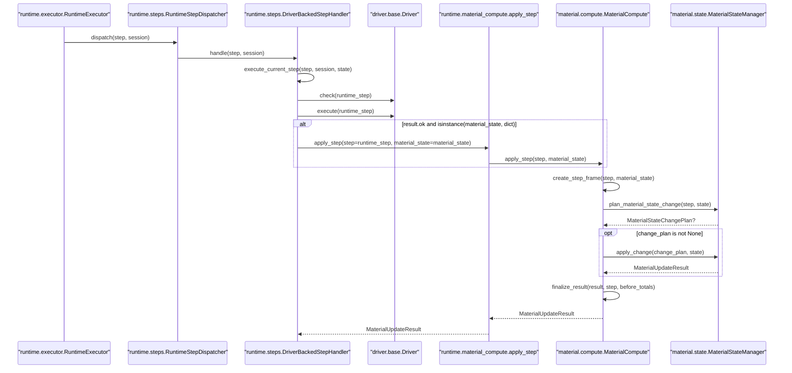

This sequence shows the target control boundary: material runtime steps enter a
single material-state manager, which decides and applies the material state
change before `MaterialCompute` builds diagnostics, conservation checks, and the
result delta.

## Material State Change Sequence

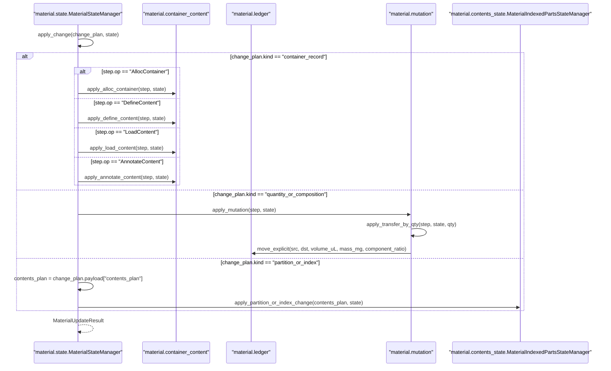

This sequence expands the material-state change from the top sequence. The
manager can update container records, quantities, components, partitioned or
indexed contents.

## Partition And Indexed Contents Sequence

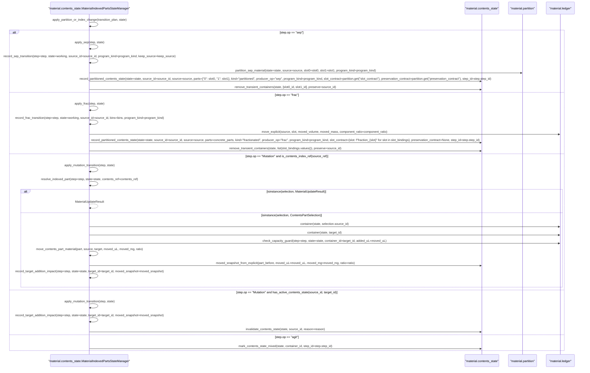

This sequence is the target partition and indexed-part path. `sep`, `frac`,
indexed-part access, and tracked-part reset enter
`MaterialIndexedPartsStateManager` only after `MaterialStateManager` has selected
that kind of material-state change.

## Current Separation Implementation Gap

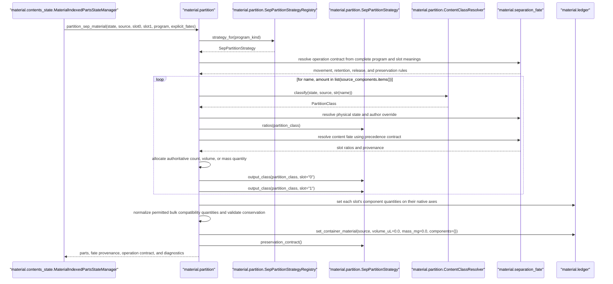

The implementation now retains the complete operation description through fate
resolution. Indexed contents record the resulting parts and serve projections;
they do not rerun the separation decision.

## Target Module Boundaries

The target structure should keep material state management as a real module, not
as helper functions embedded in operation modules:

| Module | Owns | Must not own |
| --- | --- | --- |
| `compute.py` | `MaterialCompute`, apply-step frame setup, conservation gating, result return | operation-specific material behavior |
| `state.py` | `MaterialStateManager`, `MaterialStateChangePlan`, material-state change planning, state-change dispatch | ledger primitives, partition strategy internals, runtime driver dispatch |
| `container_content.py` | container/content record updates | material-state change planning |
| `mutation.py` | mutation transform and mutation source dispatch | top-level material-state change planning |
| `partition.py` | `SepPartitionStrategyRegistry`, `SepPartitionStrategy`, content partition classification | runtime operation lifecycle |
| `contents_state.py` | `MaterialIndexedPartsStateManager`, indexed part records, selection, sep/frac partition/index application, narrow preservation impact, invalidation, and mixed-state impact | top-level material-state change planning, full runtime step dispatch, broad protocol semantics |
| `ledger.py` | volume, mass, component, and metadata mutation primitives | source-expression interpretation |
| `diagnostics.py` | material diagnostic result construction | material state mutation |
| `refs.py` | material reference resolution and binding | transfer policy |
| `args.py` | operation argument extraction and normalization | semantic operation behavior |
| `conservation.py` | material total snapshots and conservation checks | operation dispatch |

## Class Diagram

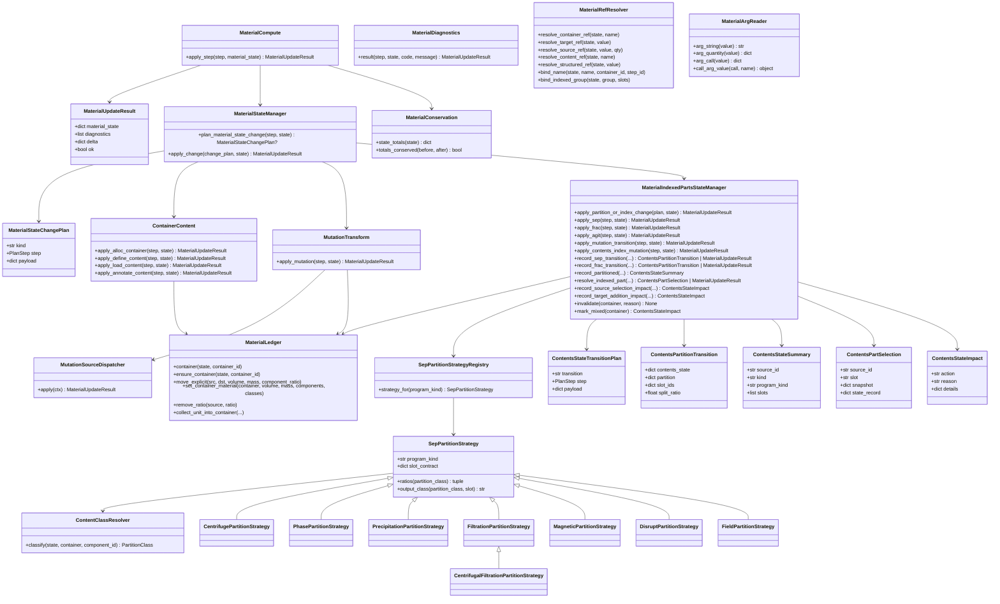

## Refactor Status

The material compute refactor is in a transitional state:

1. `MaterialCompute` asks `MaterialStateManager` to plan material-state changes.
2. `MaterialCompute` calls `MaterialStateManager.apply_change(...)` only when
   the plan says the step changes material state.
3. `MaterialStateManager` dispatches concrete state changes to
   `container_content.py`, `mutation.py`, or `MaterialIndexedPartsStateManager`.
4. `MaterialIndexedPartsStateManager` is an internal collaborator for separation,
   fractionation, indexed part access, and tracked-part reset.
5. `MaterialOpDispatcher`, `MaterialOpHandler`, and the ordinary material
   update branch have been removed from this target path.
6. `SepPartitionStrategy` and its subclasses remain the second inheritance
   family, owned by partition strategy behavior.
7. Argument reading, reference resolution, ledger mutation, diagnostics, and
   conservation now live behind public service modules instead of cross-module
   imports from `support.py`.
8. `runtime/material_compute.py` remains as a compatibility facade.

Conformance rule: every stage should keep the existing material tests passing,
especially the separation program tests and DNA cleanup regression.
