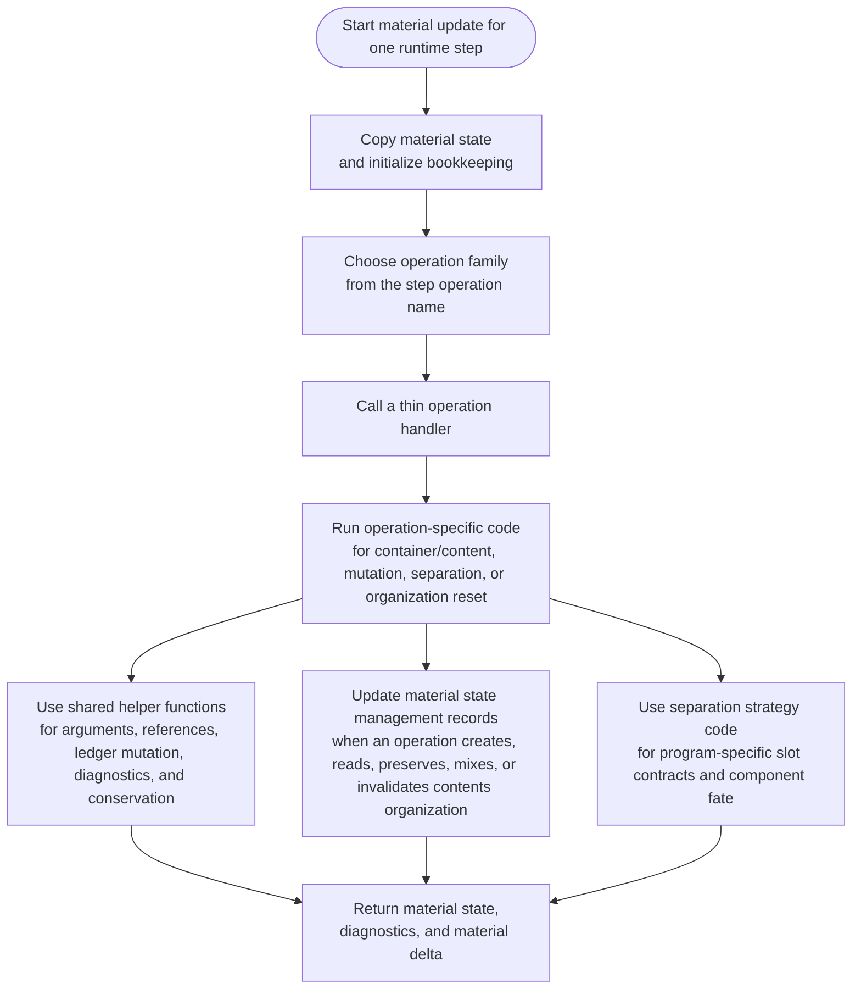
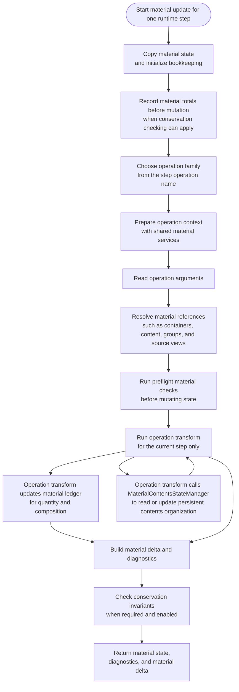
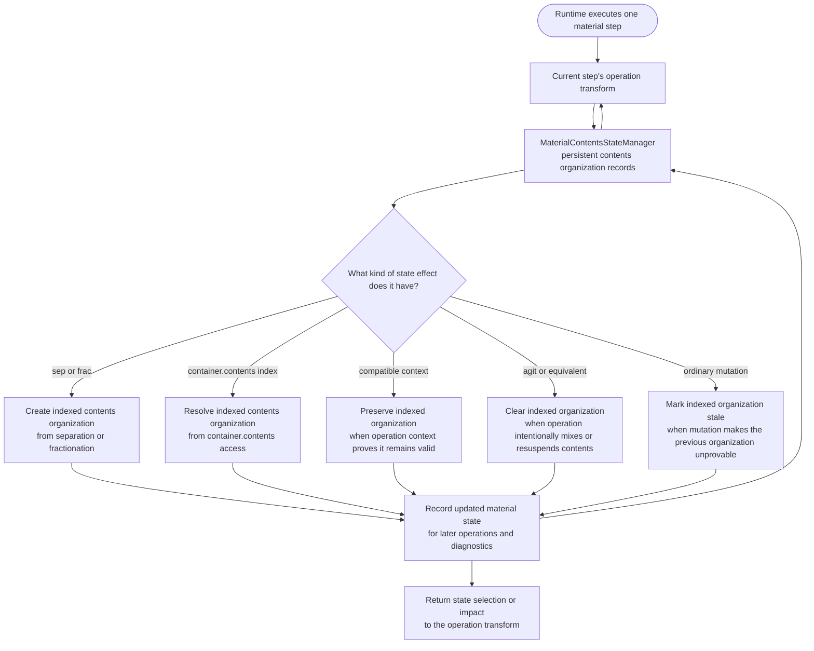
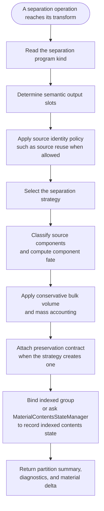
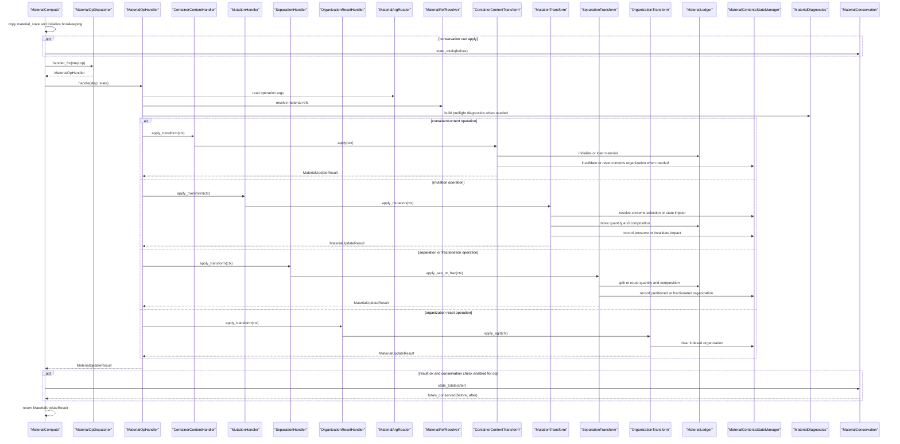
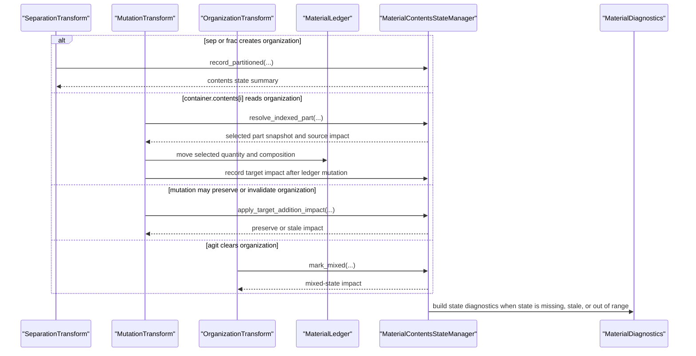
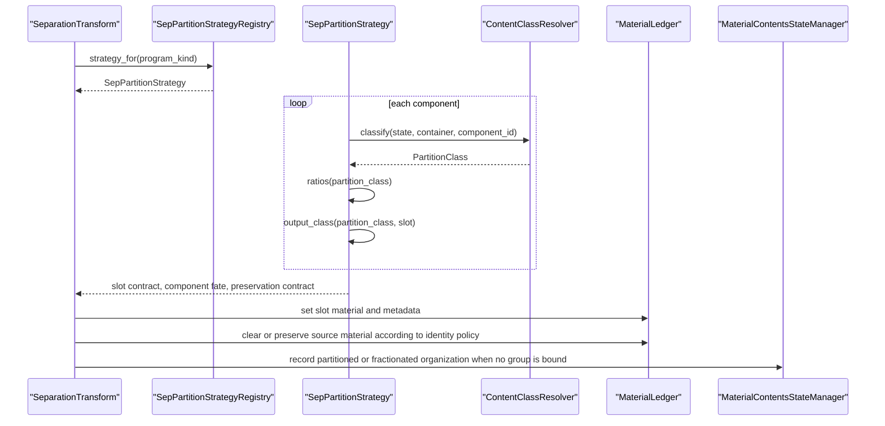

# Material Compute Module Diagrams

Last updated: 2026-06-14

Related runtime document:

1. [runtime_module_diagrams.md](./runtime_module_diagrams.md)

## Scope

This document isolates the runtime material-compute subsystem from the broader
runtime diagrams. The goal is to make the current material-compute structure
visible before changing its class structure further.

Material compute owns deterministic updates to the runtime material ledger. It
does not parse language source, define protocol semantics, execute physical
drivers, or shape public protocol returns. It receives a resolved `PlanStep`
and a `material_state`, then returns a `MaterialUpdateResult`.

Current responsibilities include:

1. dispatching material operations;
2. allocating containers and defining/loading/annotating content;
3. resolving container, content, and indexed-group references;
4. moving volume, mass, components, and internal component metadata;
5. applying `sep` and `frac` material transforms;
6. classifying content for separation partitioning;
7. checking conservation invariants.

## Current Responsibility Flowchart

Current issue:

- The old single-file module has been split, but the split is still
  transitional.
- Operation handlers are thin dispatch adapters rather than owners of a shared
  material-operation lifecycle.
- Shared helper functions still carry argument reading, reference resolution,
  ledger mutation, diagnostics, and conservation.
- Material state management now includes indexed contents organization, but it
  is still implemented as function-level behavior rather than a
  `MaterialContentsStateManager` domain service.
- Separation partitioning is one producer of indexed contents state, not the
  owner of material state management.

## Target Responsibility Flowchart

Design goal:

- `MaterialCompute` owns apply-step orchestration and conservation gating.
- `MaterialOpDispatcher` maps `step.op` to a `MaterialOpHandler`.
- `MaterialOpHandler` owns the shared material-operation lifecycle.
- Each concrete operation handler overrides only the lifecycle phases it needs.
- Reusable behavior is represented by public material services, not
  cross-module imports of underscore-prefixed helper functions.
- `MaterialContentsStateManager` is a horizontal service used by operation
  transforms. It is called by the current step's transform and updates
  persistent state records; it does not schedule or own steps and does not own
  material ledger mutation.
- `MaterialContentsStateManager` owns the lifecycle of container-contents
  organization state, including homogeneous, partitioned, fractionated, mixed,
  stale, indexed selections, and narrow preservation impacts. It is not the
  owner of the broader material-state vector.
- Separation strategy remains a separate inheritance family because each
  separation program owns a different slot contract and component-fate policy.
- Separation is an operation transform that can write organization state through
  material state management. It depends on the state manager as a service; it is
  not a child or owner of the state manager.

## Contents State Management Flowchart

This flowchart shows the state-management slice added for indexed container
contents. Separation is only one operation that can write this state.

Design judgment:

1. `sep` and `frac` can create indexed contents state.
2. `container.contents[i]` resolves an indexed contents-state selection.
3. `Mutation` can either consume, preserve, or invalidate indexed contents
   state.
4. `agit` and equivalent organization-reset operations intentionally clear
   indexed organization.
5. The operation transform calls `MaterialContentsStateManager` for the current
   step. The manager updates persistent state records, but it does not drive the
   runtime step sequence and does not perform material transfer.
6. Separation depends on state management to record organization state; it does
   not own state management.

## Sep Partition Detail Flowchart

Design judgment:

1. Program-specific component fate should stay in strategy classes, not in a
   growing conditional ladder.
2. Bulk volume and mass accounting remain separate from component fate ratios.
3. Indexed group returns and indexed contents state are projections of the
   material transform, not separate material truth.

## Material Operation Sequence

This sequence shows the target control direction: runtime executes one step,
the operation transform calls material services, and
`MaterialContentsStateManager` updates persistent state records.
`MaterialContentsStateManager` does not schedule steps, own runtime steps, or
perform material ledger transfer.

## Contents State Management Sequence

This sequence is the state-management slice. Separation appears as one caller
of the state manager, not as the owner of the state manager. For
`container.contents[i]`, the manager resolves the selected state record and
state impact; `MutationTransform` and `MaterialLedger` still perform the
material transfer.

## Sep Partition Detail Sequence

`separation.py` should remain the operation-transform module for `sep` and
`frac`. Program-specific partition logic should remain separate in
`partition.py`; it is already its own strategy submodule.
`MaterialContentsStateManager` should live as its own material state-management
module, because separation, mutation, and organization reset all use it. Its
scope is contents organization state, not the full material-state vector.

## Target Module Boundaries

The target structure should keep material state management as a real module, not
as helper functions embedded in operation modules:

| Module | Owns | Must not own |
| --- | --- | --- |
| `compute.py` | `MaterialCompute`, `MaterialOpDispatcher`, apply-step orchestration | operation-specific material behavior |
| `handler.py` | `MaterialOpHandler` lifecycle and concrete handler selection | low-level ledger mutation |
| `mutation.py` | mutation transform and mutation source dispatch | persistent contents-state storage rules |
| `separation.py` | `sep` and `frac` operation transforms | program-specific partition strategy internals |
| `partition.py` | `SepPartitionStrategyRegistry`, `SepPartitionStrategy`, content partition classification | runtime operation lifecycle |
| `contents_state.py` | `MaterialContentsStateManager`, container-contents organization lifecycle, indexed contents-state records, selection, narrow preservation impact, invalidation, and mixed-state impact | physical material transfer, full `MaterialUpdateResult` construction, quantity accounting, component-fate strategy, association state, accessibility state, readout projection |
| `ledger.py` | volume, mass, component, and metadata mutation primitives | source-expression interpretation |
| `diagnostics.py` | material diagnostic result construction | material state mutation |
| `refs.py` | material reference resolution and binding | transfer policy |
| `args.py` | operation argument extraction and normalization | semantic operation behavior |
| `conservation.py` | material total snapshots and conservation checks | operation dispatch |

## Class Diagram

```mermaid
classDiagram
    class MaterialUpdateResult {
        +dict material_state
        +list diagnostics
        +dict delta
        +bool ok
    }

    class MaterialCompute {
        +apply_step(step, material_state) MaterialUpdateResult
    }

    class MaterialOpDispatcher {
        +handler_for(op) MaterialOpHandler
    }

    class MaterialOpHandler {
        +set~str~ ops
        +handle(step, state) MaterialUpdateResult
        #prepare(step, state) MaterialOpContext
        #read_args(ctx) None
        #resolve_refs(ctx) None
        #preflight(ctx) MaterialUpdateResult?
        #apply_transform(ctx) MaterialUpdateResult
        #apply_state_impact(ctx, result) MaterialUpdateResult
        #build_result(ctx, result) MaterialUpdateResult
    }

    class MaterialOpContext {
        +PlanStep step
        +dict state
        +MaterialArgReader args
        +MaterialRefResolver refs
        +MaterialLedger ledger
        +MaterialDiagnostics diagnostics
        +MaterialContentsStateManager contents_state
    }

    class ContainerContentHandler {
        +set~str~ ops
        #apply_transform(ctx) MaterialUpdateResult
    }

    class MutationHandler {
        +set~str~ ops
        #apply_transform(ctx) MaterialUpdateResult
    }

    class SeparationHandler {
        +set~str~ ops
        #apply_transform(ctx) MaterialUpdateResult
    }

    class OrganizationResetHandler {
        +set~str~ ops
        #apply_transform(ctx) MaterialUpdateResult
    }

    class NoopMaterialOpHandler {
        #apply_transform(ctx) MaterialUpdateResult
    }

    class ContainerContentTransform {
        +apply(ctx) MaterialUpdateResult
    }

    class MutationTransform {
        +apply_mutation(ctx) MaterialUpdateResult
    }

    class MutationSourceDispatcher {
        +apply(ctx) MaterialUpdateResult
    }

    class SeparationTransform {
        +apply_sep(ctx) MaterialUpdateResult
        +apply_frac(ctx) MaterialUpdateResult
    }

    class OrganizationTransform {
        +apply_agit(ctx) MaterialUpdateResult
    }

    class MaterialContentsStateManager {
        +record_partitioned(...) ContentsStateSummary
        +resolve_indexed_part(...) ContentsPartSelection
        +record_source_selection_impact(...) ContentsStateImpact
        +record_target_addition_impact(...) ContentsStateImpact
        +invalidate(container, reason) None
        +mark_mixed(container) ContentsStateImpact
    }

    class ContentsStateSummary {
        +str source_id
        +str kind
        +str program_kind
        +list slots
    }

    class ContentsPartSelection {
        +str source_id
        +str slot
        +dict snapshot
        +dict state_record
    }

    class ContentsStateImpact {
        +str action
        +str reason
        +dict details
    }

    class MaterialDiagnostics {
        +result(step, state, code, message) MaterialUpdateResult
    }

    class MaterialLedger {
        +container(state, container_id)
        +ensure_container(state, container_id)
        +move_explicit(src, dst, volume, mass, component_ratio)
        +set_container_material(container, volume, mass, components, classes)
        +remove_ratio(source, ratio)
        +collect_unit_into_container(...)
    }

    class MaterialRefResolver {
        +resolve_container_ref(state, name)
        +resolve_target_ref(state, value)
        +resolve_source_ref(state, value, qty)
        +resolve_content_ref(state, name)
        +resolve_structured_ref(state, value)
        +bind_name(state, name, container_id, step_id)
        +bind_indexed_group(state, group, slots)
    }

    class ContentClassResolver {
        +classify(state, container, component_id) PartitionClass
    }

    class MaterialArgReader {
        +arg_string(value) str
        +arg_quantity(value) dict
        +arg_call(value) dict
        +call_arg_value(call, name) object
    }

    class MaterialConservation {
        +state_totals(state) dict
        +totals_conserved(before, after) bool
    }

    class SepPartitionStrategyRegistry {
        +strategy_for(program_kind) SepPartitionStrategy
    }

    class SepPartitionStrategy {
        +str program_kind
        +dict slot_contract
        +ratios(partition_class) tuple
        +output_class(partition_class, slot) str
    }

    class CentrifugePartitionStrategy
    class PhasePartitionStrategy
    class PrecipitationPartitionStrategy
    class FiltrationPartitionStrategy
    class MagneticPartitionStrategy
    class DisruptPartitionStrategy
    class FieldPartitionStrategy

    MaterialCompute --> MaterialUpdateResult
    MaterialCompute --> MaterialOpDispatcher
    MaterialCompute --> MaterialConservation
    MaterialOpDispatcher --> MaterialOpHandler
    MaterialOpHandler --> MaterialOpContext
    MaterialOpHandler <|-- ContainerContentHandler
    MaterialOpHandler <|-- MutationHandler
    MaterialOpHandler <|-- SeparationHandler
    MaterialOpHandler <|-- OrganizationResetHandler
    MaterialOpHandler <|-- NoopMaterialOpHandler

    MaterialOpContext --> MaterialArgReader
    MaterialOpContext --> MaterialRefResolver
    MaterialOpContext --> MaterialLedger
    MaterialOpContext --> MaterialDiagnostics
    MaterialOpContext --> MaterialContentsStateManager

    ContainerContentHandler --> ContainerContentTransform
    MutationHandler --> MutationTransform
    SeparationHandler --> SeparationTransform
    OrganizationResetHandler --> OrganizationTransform

    ContainerContentTransform --> MaterialLedger
    ContainerContentTransform --> MaterialContentsStateManager
    MutationTransform --> MutationSourceDispatcher
    MutationTransform --> MaterialLedger
    MutationTransform --> MaterialContentsStateManager
    SeparationTransform --> MaterialLedger
    SeparationTransform --> MaterialContentsStateManager
    SeparationTransform --> SepPartitionStrategyRegistry
    OrganizationTransform --> MaterialContentsStateManager
    MaterialContentsStateManager --> ContentsStateSummary
    MaterialContentsStateManager --> ContentsPartSelection
    MaterialContentsStateManager --> ContentsStateImpact

    SepPartitionStrategyRegistry --> SepPartitionStrategy
    SepPartitionStrategy --> ContentClassResolver
    SepPartitionStrategy <|-- CentrifugePartitionStrategy
    SepPartitionStrategy <|-- PhasePartitionStrategy
    SepPartitionStrategy <|-- PrecipitationPartitionStrategy
    SepPartitionStrategy <|-- FiltrationPartitionStrategy
    SepPartitionStrategy <|-- MagneticPartitionStrategy
    SepPartitionStrategy <|-- DisruptPartitionStrategy
    SepPartitionStrategy <|-- FieldPartitionStrategy
```

## Refactor Status

The material compute refactor is in a transitional state:

1. `MaterialOpHandler` and `MaterialOpDispatcher` route material updates by
   `step.op`.
2. Current handlers are thin adapters and should grow into a common
   `MaterialOpHandler.handle` lifecycle.
3. Container/content, mutation, separation, and organization reset behavior
   should be expressed as operation transforms.
4. Material contents state is a horizontal state-management service used by
   separation, mutation, and organization reset transforms.
5. `SepPartitionStrategy` and its subclasses remain the second inheritance
   family, owned by partition strategy behavior.
6. Argument reading, reference resolution, ledger mutation, diagnostics, and
   conservation now live behind public service modules instead of cross-module
   imports from `support.py`.
7. `runtime/material_compute.py` remains as a compatibility facade.

Conformance rule: every stage should keep the existing material tests passing,
especially the separation program tests and DNA cleanup regression.
