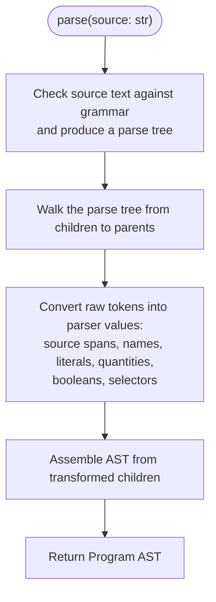
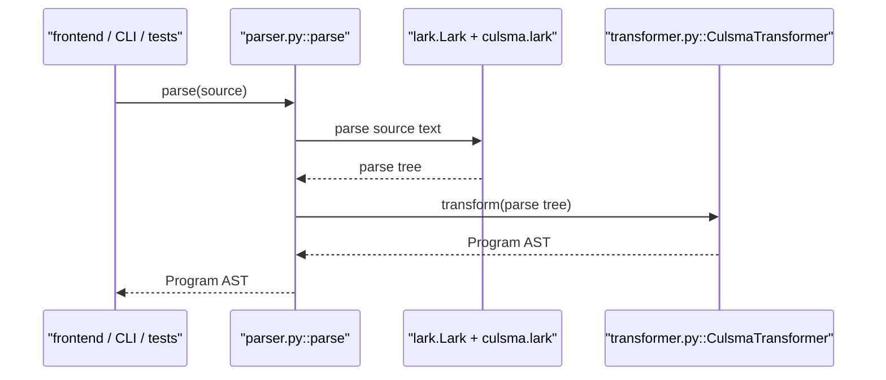
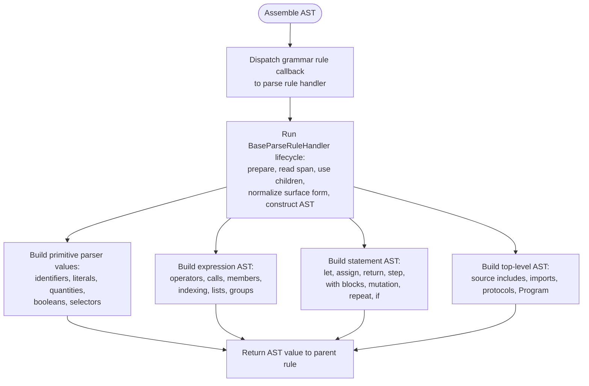
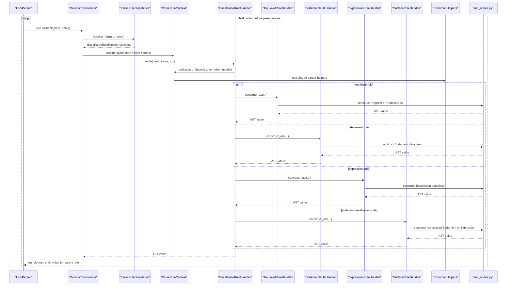
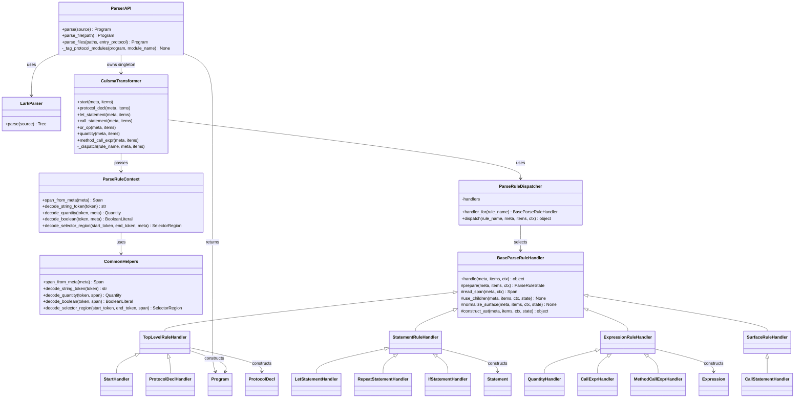

# Parser Module Diagrams

Last updated: 2026-04-23

## Scope

This document has five diagrams only:

1. Functional flowchart: what parser actually does.
2. Runtime sequence: the main runtime call chain.
3. AST assembly detail flowchart: how parse-tree values become AST nodes.
4. Parse rule conversion sequence: how the handler-based transformer runs.
5. Class/module diagram: which files/classes own each part.

Parser consumes Culsma source text or local source files and returns a parser
AST `Program`. It owns grammar parsing, local source include assembly, span
capture, token decoding, parser-surface normalization, and AST construction.
It does not own bundled stdlib loading, installed library resolution, semantic
validation, IR lowering, compile analysis, or runtime execution.

Lark owns grammar parsing and callback-name dispatch. `CulsmaTransformer`
keeps the Lark-required callback method names, then routes each callback into
`ParseRuleDispatcher` and the `BaseParseRuleHandler` lifecycle.

## Functional Flowchart

This flowchart shows the core parser path: one source string becomes one
`Program` AST. File APIs such as `parse_file` and `parse_files` are wrappers
around this path; they read source text, call this parser flow, then tag or
merge returned `Program` objects.

## Runtime Sequence

## AST Assembly Detail Flowchart

This flowchart expands the single "Assemble AST" step from the main parser
flow. These are internal transformer details, not separate parser phases.

## Parse Rule Conversion Sequence

## Class And Module Diagram

