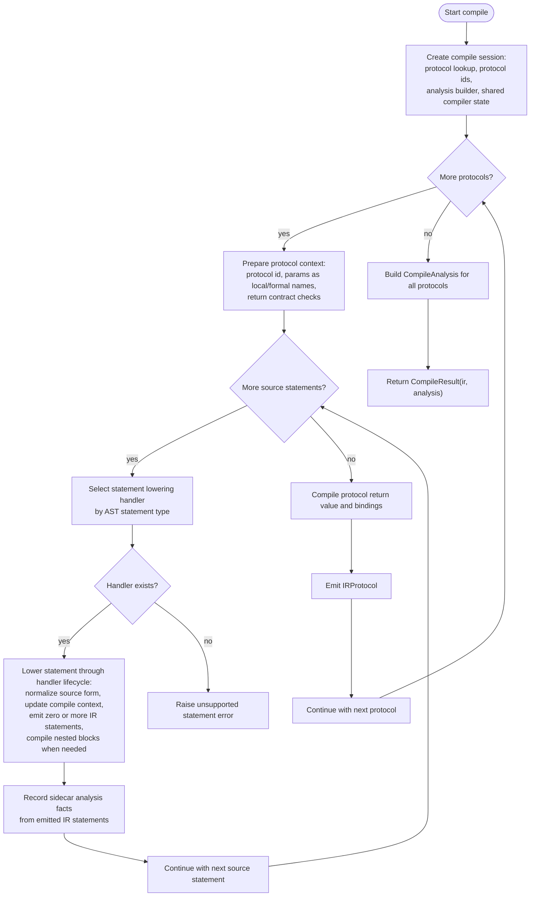
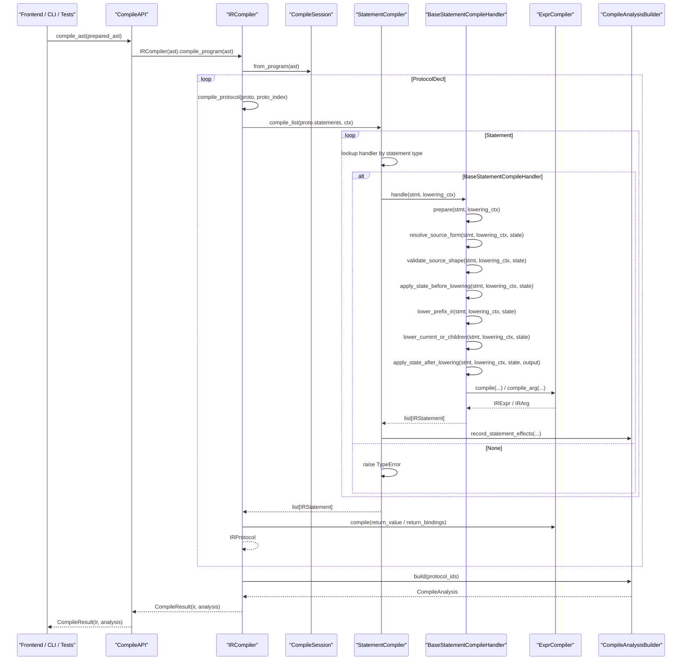
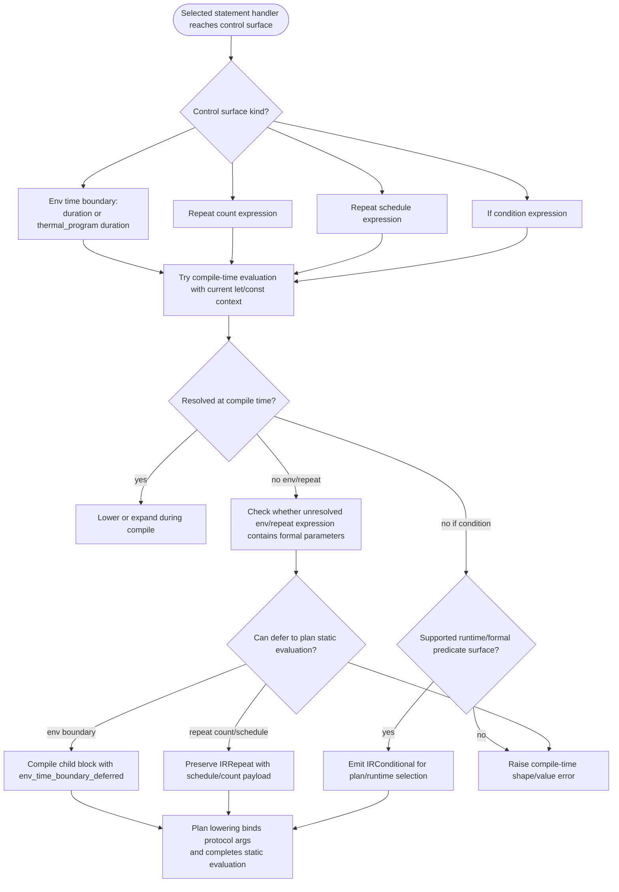
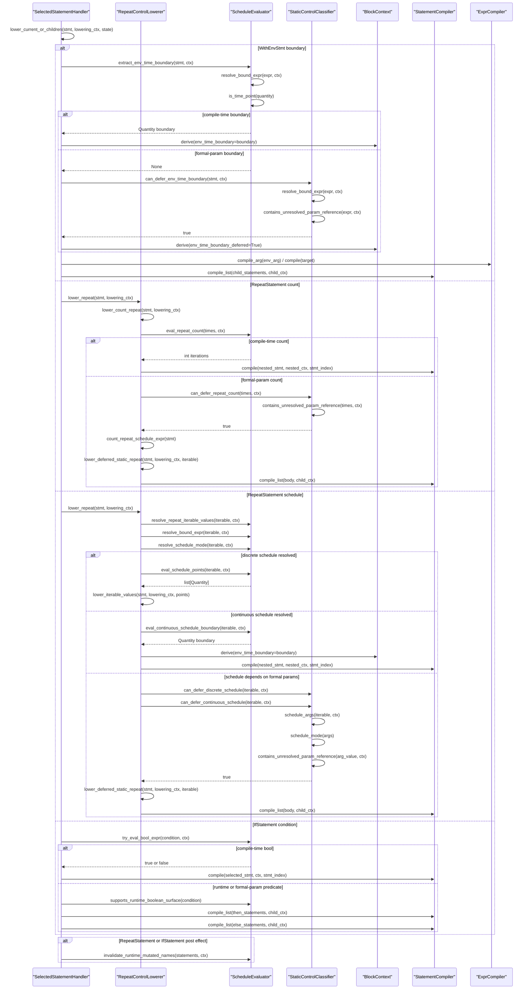
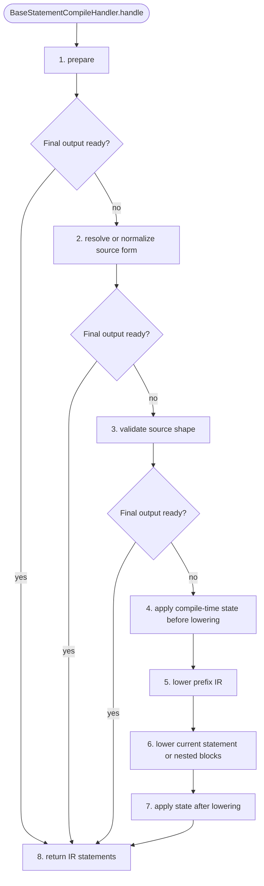

# Compile Module Diagrams

Last updated: 2026-05-26

Related IR document:

1. [ir_structure_diagrams.md](./ir_structure_diagrams.md)

## Scope

This document has six diagrams only:

1. Functional flowchart: what compile actually does.
2. Runtime sequence: the main runtime call chain.
3. Formal-parameter static-control flowchart: how compile decides to defer.
4. Formal-parameter static-control sequence: module API calls for that decision.
5. Statement lowering lifecycle template: the common statement-handler lowering sequence.
6. Class/module diagram: which files/classes own each part.

Compile consumes the prepared AST from frontend resolution and returns
`CompileResult(ir, analysis)`. It owns AST-to-Canonical-IR lowering plus
compile-produced sidecar analysis. It does not do semantic validation,
typecheck, plan lowering, runtime execution, or material-state mutation.
Compile may classify formal-parameter-dependent static control as plan-static
when the control surface cannot be resolved before protocol argument binding;
the actual parameter-bound static evaluation remains owned by plan lowering.
`compile/static_control.py` owns that compile-stage classification boundary.

## Functional Flowchart

## Runtime Sequence

## Formal Parameter Static-Control Detail

This section is an internal compile detail. It explains how the selected
statement handler, running inside the common `BaseStatementCompileHandler`
lifecycle above, decides whether a control surface is resolved during compile
or preserved for parameter-bound static evaluation during plan lowering.
`SelectedStatementHandler` means the concrete handler currently executing that
base lifecycle; it is not a separate module in the compile architecture.
`RepeatControlLowerer` is the repeat-specific compile service called from
`RepeatHandler.lower_current_or_children` to keep the handler lifecycle adapter
separate from repeat control lowering algorithms.

## Statement Lowering Lifecycle Template

The statement lowering refactor makes `BaseStatementCompileHandler.handle`
own the lowering lifecycle. Concrete handlers override only the phases they
need. A phase can return final IR output early when the source form is expanded
or lowered completely by that phase.

| Phase | Semantic boundary | Typical owners |
| --- | --- | --- |
| `prepare` | Require source span, use statement id, create handler state. | every statement handler |
| `resolve_source_form` | Resolve or classify frontend syntax before lowering. | protocol-ref name resolution, readout normalization, with-env hold detection, repeat/if mode selection |
| `validate_source_shape` | Reject source forms that are illegal before IR exists. | forbidden legacy/internal calls, assignment target rules, hold placement, runtime-if predicate support |
| `apply_state_before_lowering` | Update compile-time context visible to current/nested lowering. | let/assign `local_names`, `const_env`, `let_bindings` |
| `lower_prefix_ir` | Emit synthesized IR that must appear before the main lowered statement. | grouped readout prefix lets, env target prefix lets, mutation target prefix lets |
| `lower_current_or_children` | Emit direct IR or compile nested statement blocks. | include, let, assign, step, mutation, with-env, with-constraint, repeat, if, control |
| `apply_state_after_lowering` | Update compile-time context after nested lowering decisions. | invalidate runtime-mutated names after repeat/if |
| `return_ir` | Return `list[IRStatement]` to the statement-list dispatcher. | all handlers |

## Class And Module Diagram

```mermaid
classDiagram
    class CompileAPI {
        +compile_ast(ast) CompileResult
    }

    class IRCompiler {
        +compile_program(ast) CompileResult
        +compile_protocol(proto, proto_index) IRProtocol
    }

    class CompileResult {
        +ir
        +analysis
    }

    class CompileSession {
        +qualified_protocol_lookup
        +protocol_lookup
        +protocol_id_by_name
        +analysis_builder
        +state
    }

    class BlockContext {
        +scope_id
        +const_env
        +let_bindings
        +ir_const_env
        +ir_expr_bindings
        +local_names
        +param_names
        +env_time_boundary
        +env_time_boundary_deferred
        +derive(...)
    }

    class StatementCompiler {
        +compile_list(statements, ctx) list[IRStatement]
        +compile(stmt, ctx, stmt_index) list[IRStatement]
        -_STATEMENT_HANDLERS_BY_TYPE
    }

    class StatementLoweringContext {
        +stmt_id
        +stmt_index
        +block_context
        +statement_compiler
        +session
        +expr_compiler
        +callable_lowering
        +target_resolver
        +schedule_evaluator
        +static_control_classifier
        +repeat_control_lowerer
    }

    class StatementLoweringState {
        +output
    }

    class BaseStatementCompileHandler {
        +handle(stmt, lowering_ctx) list[IRStatement]
        #prepare(stmt, lowering_ctx) StatementLoweringState
        #resolve_source_form(stmt, lowering_ctx, state) None
        #validate_source_shape(stmt, lowering_ctx, state) None
        #apply_state_before_lowering(stmt, lowering_ctx, state) None
        #lower_prefix_ir(stmt, lowering_ctx, state) list[IRStatement]
        #lower_current_or_children(stmt, lowering_ctx, state) list[IRStatement]
        #apply_state_after_lowering(stmt, lowering_ctx, state, output) None
    }

    class IncludeHandler
    class ProtocolRefHandler
    class LetHandler
    class AssignHandler
    class ExprStatementHandler
    class ReturnHandler
    class WithEnvHandler
    class WithConstraintHandler
    class MutationHandler
    class StepCallHandler
    class ControlHandler
    class RepeatHandler
    class IfHandler

    class ExprCompiler {
        +compile(expr) IRExpr
        +compile_arg(arg) IRArg
        +compile_param(param) IRParam
    }

    class CallableLowering {
        +lower_callable(name, args, span)
        +normalize_grouped_readout_call(call, stmt_id, ctx)
        +normalize_grouped_readout_stepcall(stmt, stmt_id, ctx)
    }

    class TargetResolver {
        +expand_env_targets(targets, stmt_id, ctx)
        +infer_env_targets_from_source_statements(statements, stmt_id, ctx)
        +expand_mutation_targets(target, stmt_id, ctx)
        +expand_mutation_sources(sources, target, flattened_targets, ctx)
    }

    class ScheduleEvaluator {
        +try_eval_numeric_expr(expr, ctx)
        +try_eval_bool_expr(expr, ctx)
        +resolve_repeat_iterable_values(expr, ctx)
        +resolve_schedule_mode(expr, ctx)
        +eval_continuous_schedule_boundary(expr, ctx)
        +eval_schedule_points(expr, ctx)
        +eval_repeat_count(expr, ctx)
        +statement_requires_runtime_control(stmt, ctx)
        +static_control_action(statements)
        +invalidate_runtime_mutated_names(statements, ctx)
        +resolve_bound_expr(expr, ctx)
        +extract_env_time_boundary(stmt, ctx)
        +supports_runtime_boolean_surface(expr)
        +is_time_point(point)
    }

    class StaticControlClassifier {
        +can_defer_repeat_count(expr, ctx)
        +can_defer_discrete_schedule(expr, ctx)
        +can_defer_continuous_schedule(expr, ctx)
        +can_defer_env_time_boundary(stmt, ctx)
        +schedule_args(expr, ctx)
        +schedule_mode(args)
        +resolve_bound_expr(expr, ctx)
        +contains_unresolved_param_reference(expr, ctx)
    }

    class RepeatControlLowerer {
        +lower_repeat(stmt, lowering_ctx)
        +lower_binding_repeat(stmt, lowering_ctx)
        +lower_count_repeat(stmt, lowering_ctx)
        +lower_iterable_values(stmt, lowering_ctx, iterable_values)
        +lower_continuous_schedule(stmt, lowering_ctx)
        +lower_deferred_static_repeat(stmt, lowering_ctx, iterable)
        +count_repeat_schedule_expr(stmt)
    }

    class CompileAnalysisBuilder {
        +record_statement_effects(...)
        +build(protocol_ids) CompileAnalysis
    }

    class CompileAnalysis
    class ProtocolAnalysis
    class IRProgram
    class IRProtocol
    class IRStatement

    CompileAPI --> IRCompiler
    IRCompiler --> CompileResult
    IRCompiler --> CompileSession
    IRCompiler --> StatementCompiler
    IRCompiler --> ExprCompiler
    IRCompiler --> CallableLowering
    IRCompiler --> TargetResolver
    IRCompiler --> ScheduleEvaluator
    IRCompiler --> StaticControlClassifier
    IRCompiler --> RepeatControlLowerer
    IRCompiler --> IRProtocol
    CompileResult --> IRProgram
    CompileResult --> CompileAnalysis

    CompileSession --> CompileAnalysisBuilder
    CompileAnalysisBuilder --> CompileAnalysis
    CompileAnalysis --> ProtocolAnalysis

    StatementCompiler --> BlockContext
    StatementCompiler --> StatementLoweringContext
    StatementCompiler --> BaseStatementCompileHandler : exact type mapping
    StatementCompiler --> CompileAnalysisBuilder

    StatementLoweringContext --> CompileSession
    StatementLoweringContext --> BlockContext
    StatementLoweringContext --> ExprCompiler
    StatementLoweringContext --> CallableLowering
    StatementLoweringContext --> TargetResolver
    StatementLoweringContext --> ScheduleEvaluator
    StatementLoweringContext --> StaticControlClassifier
    StatementLoweringContext --> RepeatControlLowerer

    BaseStatementCompileHandler --> StatementLoweringState
    BaseStatementCompileHandler --> IRStatement

    BaseStatementCompileHandler <|-- IncludeHandler
    BaseStatementCompileHandler <|-- ProtocolRefHandler
    BaseStatementCompileHandler <|-- LetHandler
    BaseStatementCompileHandler <|-- AssignHandler
    BaseStatementCompileHandler <|-- ExprStatementHandler
    BaseStatementCompileHandler <|-- ReturnHandler
    BaseStatementCompileHandler <|-- WithEnvHandler
    BaseStatementCompileHandler <|-- WithConstraintHandler
    BaseStatementCompileHandler <|-- MutationHandler
    BaseStatementCompileHandler <|-- StepCallHandler
    BaseStatementCompileHandler <|-- ControlHandler
    BaseStatementCompileHandler <|-- RepeatHandler
    BaseStatementCompileHandler <|-- IfHandler

    LetHandler --> CallableLowering
    LetHandler --> ScheduleEvaluator
    LetHandler --> ExprCompiler
    AssignHandler --> ScheduleEvaluator
    AssignHandler --> ExprCompiler
    WithEnvHandler --> TargetResolver
    WithEnvHandler --> ScheduleEvaluator
    WithEnvHandler --> StaticControlClassifier
    WithEnvHandler --> ExprCompiler
    MutationHandler --> TargetResolver
    MutationHandler --> ExprCompiler
    StepCallHandler --> CallableLowering
    StepCallHandler --> ExprCompiler
    RepeatHandler --> RepeatControlLowerer
    RepeatControlLowerer --> ScheduleEvaluator
    RepeatControlLowerer --> StaticControlClassifier
    RepeatControlLowerer --> StatementCompiler
    RepeatControlLowerer --> ExprCompiler
    IfHandler --> ScheduleEvaluator
```

