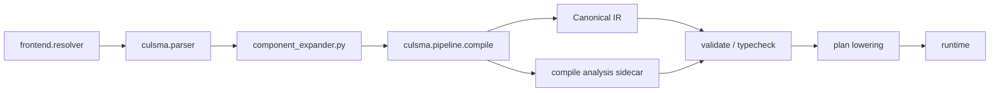
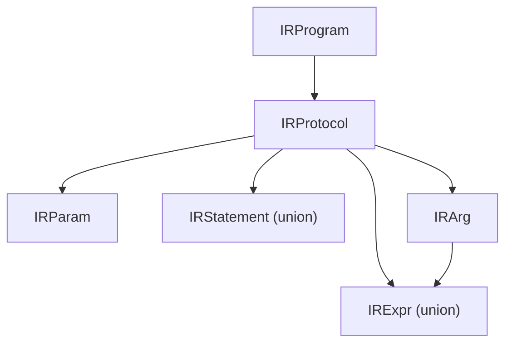
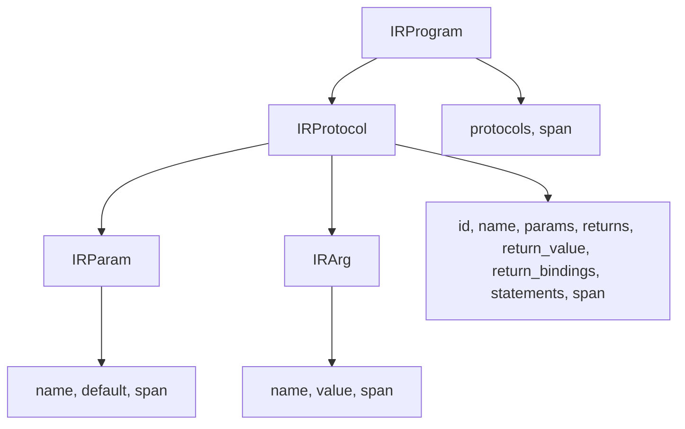
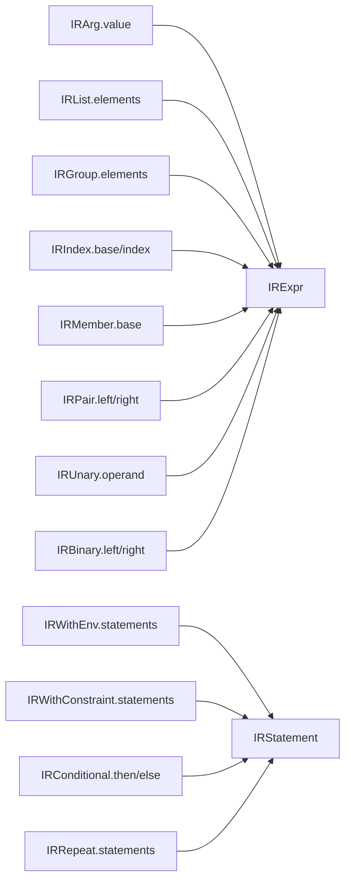

# IR Structure Diagrams

Last updated: 2026-04-19

This document defines the Canonical IR data shape.
It also records the compile-stage IR contract: input preconditions, output invariants, canonicalization rules, downstream guarantees, and ownership.

## Scope

Canonical IR is the boundary object produced by `culsma.pipeline.compile` and consumed by semantic validation, typechecking, plan lowering, and runtime-oriented tooling. Compile may also produce sidecar analysis for downstream stages, but that sidecar is not part of the Canonical IR schema.

## Pipeline Position

## IR Overview

## IR Program And Protocol Shape

## IR Statement Union

```mermaid
flowchart TB
    Statement["IRStatement"]

    Include["IRInclude"]
    Let["IRLet"]
    Assign["IRAssign"]
    Step["IRStep"]
    WithEnv["IRWithEnv"]
    WithConstraint["IRWithConstraint"]
    Mutation["IRMutation"]
    Conditional["IRConditional"]
    Control["IRControl"]
    Repeat["IRRepeat"]

    IncludeFields["id, name, args"]
    LetFields["id, name, value"]
    AssignFields["id, target, value"]
    StepFields["id, name, args"]
    WithEnvFields["id, env_args, targets, statements, explicit_hold"]
    WithConstraintFields["id, requirements, options, statements"]
    MutationFields["id, target, sources"]
    ConditionalFields["id, condition, then_statements, else_statements"]
    ControlFields["id, action"]
    RepeatFields["id, binding, iterable, statements"]

    Statement --> Include
    Statement --> Let
    Statement --> Assign
    Statement --> Step
    Statement --> WithEnv
    Statement --> WithConstraint
    Statement --> Mutation
    Statement --> Conditional
    Statement --> Control
    Statement --> Repeat

    Include --> IncludeFields
    Let --> LetFields
    Assign --> AssignFields
    Step --> StepFields
    WithEnv --> WithEnvFields
    WithConstraint --> WithConstraintFields
    Mutation --> MutationFields
    Conditional --> ConditionalFields
    Control --> ControlFields
    Repeat --> RepeatFields
```

## IR Expr Union

```mermaid
flowchart TB
    Expr["IRExpr"]

    Quantity["IRQuantity"]
    String["IRString"]
    Boolean["IRBoolean"]
    Identifier["IRIdentifier"]
    List["IRList"]
    Group["IRGroup"]
    Call["IRCall"]
    PlateSelector["IRPlateSelector"]
    Index["IRIndex"]
    Member["IRMember"]
    Pair["IRPair"]
    Unary["IRUnary"]
    Binary["IRBinary"]

    QuantityFields["value, unit"]
    StringFields["value"]
    BooleanFields["value"]
    IdentifierFields["name"]
    ListFields["elements"]
    GroupFields["elements"]
    CallFields["name, args"]
    PlateSelectorFields["base, regions"]
    IndexFields["base, index"]
    MemberFields["base, member"]
    PairFields["left, right"]
    UnaryFields["op, operand"]
    BinaryFields["op, left, right"]

    Expr --> Quantity
    Expr --> String
    Expr --> Boolean
    Expr --> Identifier
    Expr --> List
    Expr --> Group
    Expr --> Call
    Expr --> PlateSelector
    Expr --> Index
    Expr --> Member
    Expr --> Pair
    Expr --> Unary
    Expr --> Binary

    Quantity --> QuantityFields
    String --> StringFields
    Boolean --> BooleanFields
    Identifier --> IdentifierFields
    List --> ListFields
    Group --> GroupFields
    Call --> CallFields
    PlateSelector --> PlateSelectorFields
    Index --> IndexFields
    Member --> MemberFields
    Pair --> PairFields
    Unary --> UnaryFields
    Binary --> BinaryFields
```

## Recursive Links

## IR Node Definition

### Program And Protocol Nodes

| Node | Fields |
|---|---|
| `IRProgram` | `protocols: list[IRProtocol]`, `span` |
| `IRProtocol` | `id`, `name`, `params: list[IRParam]`, `returns: list[str]`, `return_value: IRExpr | None`, `return_bindings: list[IRArg]`, `statements: list[IRStatement]`, `span` |
| `IRParam` | `name`, `default: IRExpr | None`, `span` |
| `IRArg` | `name`, `value: IRExpr`, `span` |

### Statement Nodes

| Node | Fields |
|---|---|
| `IRInclude` | `id`, `name`, `args: list[IRArg]`, `span` |
| `IRLet` | `id`, `name`, `value: IRExpr | None`, `span` |
| `IRAssign` | `id`, `target: IRExpr`, `value: IRExpr`, `span` |
| `IRStep` | `id`, `name`, `args: list[IRArg]`, `span` |
| `IRWithEnv` | `id`, `env_args: list[IRArg]`, `targets: list[IRExpr]`, `statements: list[IRStatement]`, `explicit_hold`, `span` |
| `IRWithConstraint` | `id`, `requirements: list[str]`, `options: list[IRArg]`, `statements: list[IRStatement]`, `span` |
| `IRMutation` | `id`, `target: IRExpr | None`, `sources: list[IRExpr]`, `span` |
| `IRConditional` | `id`, `condition: IRExpr`, `then_statements: list[IRStatement]`, `else_statements: list[IRStatement]`, `span` |
| `IRControl` | `id`, `action`, `span` |
| `IRRepeat` | `id`, `binding`, `iterable: IRExpr`, `statements: list[IRStatement]`, `span` |

### Expression Nodes

| Node | Fields |
|---|---|
| `IRQuantity` | `value: float`, `unit: str | None`, `span` |
| `IRString` | `value: str`, `span` |
| `IRBoolean` | `value: bool`, `span` |
| `IRIdentifier` | `name`, `span` |
| `IRList` | `elements: list[IRExpr]`, `span` |
| `IRGroup` | `elements: list[IRExpr]`, `span` |
| `IRCall` | `name`, `args: list[IRArg]`, `span` |
| `IRSelectorRegion` | `start`, `end: str | None`, `span` |
| `IRPlateSelector` | `base: IRIdentifier`, `regions: list[IRSelectorRegion]`, `span` |
| `IRIndex` | `base: IRExpr`, `index: IRExpr`, `span` |
| `IRMember` | `base: IRExpr`, `member`, `span` |
| `IRPair` | `left: IRExpr`, `right: IRExpr`, `span` |
| `IRUnary` | `op`, `operand: IRExpr`, `span` |
| `IRBinary` | `op`, `left: IRExpr`, `right: IRExpr`, `span` |

### Union Definitions

| Alias | Members |
|---|---|
| `IRStatement` | `IRInclude`, `IRLet`, `IRAssign`, `IRStep`, `IRWithEnv`, `IRWithConstraint`, `IRMutation`, `IRConditional`, `IRControl`, `IRRepeat` |
| `IRExpr` | `IRQuantity`, `IRString`, `IRBoolean`, `IRIdentifier`, `IRList`, `IRGroup`, `IRCall`, `IRPlateSelector`, `IRIndex`, `IRMember`, `IRPair`, `IRUnary`, `IRBinary` |

## Structural Rules

1. All IR nodes are `@dataclass(frozen=True)`.
2. Most IR nodes carry `span` for source-location ownership.
3. `IRStatement` and `IRExpr` are Python union types, not inheritance-base hierarchies.
4. `IRProgram` is the root node and owns the only public serialization entry, `to_dict()`.
5. Protocol and statement nodes carry `id` when they need downstream identity.
6. Nested statement bodies are represented only through statement fields such as `IRWithEnv.statements`, `IRWithConstraint.statements`, `IRConditional.then_statements`, `IRConditional.else_statements`, and `IRRepeat.statements`.

## Compile Input Preconditions

`compile_ast(ast)` assumes:

1. The input is a parser `Program` AST.
2. Frontend source and library resolution has already run.
3. Bundled stdlib and user library imports have already been resolved when enabled.
4. Component protocol calls have already been expanded into the prepared AST.
5. Top-level source include and library import declarations are not compile semantics.
6. Parser spans are present on protocol and statement nodes required by compile.

## IR Output Invariants

The compiler must produce a `CompileResult` whose `ir` satisfies these
invariants:

1. The root is `IRProgram`.
2. `IRProgram.protocols` contains only `IRProtocol` nodes.
3. `IRProgram` does not contain top-level source include or library import declarations.
4. Every `IRProtocol` has a stable `id`.
5. Every emitted IR statement has a stable `id`.
6. IR nodes are frozen dataclass values.
7. Source spans are preserved where source ownership exists.
8. Statement bodies contain only `IRStatement` union members.
9. Expression positions contain only `IRExpr` union members.
10. `ReturnStatement` does not survive as an `IRStatement`; protocol return data lives on `IRProtocol.return_value` and `IRProtocol.return_bindings`.
11. `ProtocolRefStatement` does not survive as a distinct IR node; protocol references lower to `IRInclude`.
12. `BreakStmt` and `ContinueStmt` do not survive as distinct IR nodes; they lower to `IRControl(action=...)`.
13. Standalone method-call statements lower to `IRStep`.
14. Method-call expressions do not survive as a dedicated IR expression node.
15. `with env` IR carries explicit `targets` and `explicit_hold`; direct
    source `hold(...)` markers have already been collected into `targets` and
    are not executable `IRWithEnv.statements`.
16. Nested statement bodies are represented through explicit statement-list fields only.

Compile-side analysis is separate from these IR invariants. It may record
resolved include targets and runtime-visible protocol exports, but those facts
must not be serialized as fields on `IRProgram` or `IRProtocol` unless the IR
schema is explicitly revised.

## Canonicalization Rules

| Source AST shape | Canonical IR shape |
|---|---|
| `Program(source_includes, library_imports, protocols)` | `IRProgram(protocols)` |
| `ProtocolDecl(...)` | `IRProtocol(id, name, params, returns, return_value, return_bindings, statements)` |
| `ReturnStatement(...)` | `IRProtocol.return_value` / `IRProtocol.return_bindings` |
| `IncludeStatement(name)` | `IRInclude(id, name, args=[])` |
| `ProtocolRefStatement(module, protocol, args)` | `IRInclude(id, name=<resolved protocol name>, args)` |
| `StepCall(name, args)` | `IRStep(id, name, args)` |
| standalone `MethodCallExpr` statement | `IRStep(id, name=<method>, args=<method call args>)` |
| `WithEnvStmt(env_args, statements)` | `IRWithEnv(id, env_args, targets, statements, explicit_hold)` |
| `MutationStmt(target, sources)` | `IRMutation(id, target, sources)` |
| `IfStatement(...)` | `IRConditional(id, condition, then_statements, else_statements)` or compile-time-expanded statements |
| `RepeatStatement(...)` | `IRRepeat(id, binding, iterable, statements)` or compile-time-expanded statements |
| `BreakStmt` / `ContinueStmt` | `IRControl(id, action)` |
| `MethodCallExpr` in expression position | no dedicated IR node; lowered through expression/callable rules |

## Ownership

| Responsibility | Owner |
|---|---|
| Program-level compile orchestration | `IRCompiler` |
| Protocol lookup and compile-wide state | `CompileSession` |
| Per-block local names, const values, let bindings, and env time boundary | `BlockContext` |
| Statement-to-IR lowering | `StatementCompiler` |
| Expression-to-IR lowering | `ExprCompiler` |
| Callable surface normalization | `CallableLowering` |
| Env/mutation/group/plate target derivation | `TargetResolver` |
| Compile-time schedule, constant, and control evaluation | `ScheduleEvaluator` |
| IR schema nodes | `ir_nodes.py` |

## Downstream Guarantees

Validation, typechecking, plan lowering, and runtime-oriented tooling may rely on:

1. The input object is an `IRProgram`, not parser AST.
2. Statement-level nodes have IDs.
3. Protocol return data is represented on `IRProtocol`, not as body statements.
4. Protocol reference statements are represented as `IRInclude`.
5. Env target information is carried by `IRWithEnv.targets`.
6. Core expression structure is represented only through `IRExpr` union members.
7. Compile-time-expanded control structures have already been expanded or rewritten by compile.
8. Source spans remain available for diagnostics where the source node had ownership.

## Non-Goals

Canonical IR does not define:

1. User-facing source syntax.
2. Library resolution behavior.
3. Component protocol expansion behavior.
4. Semantic validation legality.
5. Unit/type compatibility.
6. Plan dependency graph shape.
7. Runtime material-state truth.

## Regression Hooks

Current regression coverage for this contract is primarily held by:

1. `tests/test_ir_compiler.py`
2. `tests/test_frontend_resolver.py`
3. `tests/test_kernel_validate.py`
4. `tests/test_kernel_typecheck.py`
5. `tests/test_kernel_plan.py`
6. `tests/test_kernel_runtime.py`
