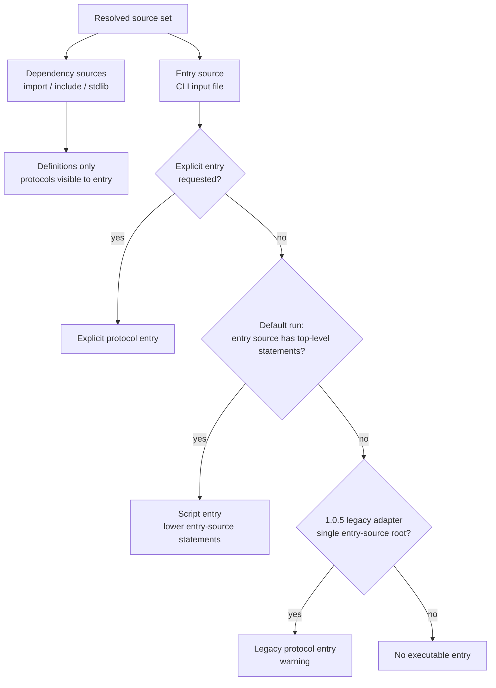
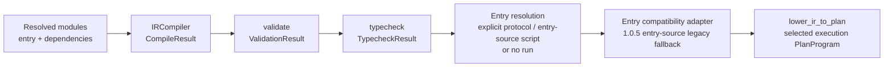
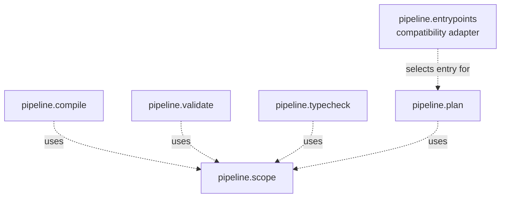

# Pipeline Module Diagrams

Last updated: 2026-06-18

Related documents:

1. [global_architecture_diagrams.md](../../global_architecture_diagrams.md)
2. [ir_structure_diagrams.md](./ir_structure_diagrams.md)
3. [compile_module_diagrams.md](./compile_module_diagrams.md)
4. [validate_module_diagrams.md](./validate_module_diagrams.md)
5. [typecheck_module_diagrams.md](./typecheck_module_diagrams.md)
6. [plan_module_diagrams.md](./plan_module_diagrams.md)
7. [scope_module_diagrams.md](./scope_module_diagrams.md)

## Scope

This document records cross-stage pipeline structure. It is the home for
pipeline-level design decisions that do not belong to one individual stage.

The pipeline layer covers Canonical IR, compile, validation, typecheck, plan
lowering, and shared pipeline semantic services. Parser source syntax, runtime
execution, material compute, and concrete drivers are documented separately.

## Entrypoint And Module Boundary

## Pipeline Stage Overview

## Shared Pipeline Semantics

Shared pipeline services are used by more than one stage and should not be
owned by a single stage handler.

## Scope Service Target

Detailed design:

1. [scope_module_diagrams.md](./scope_module_diagrams.md)
