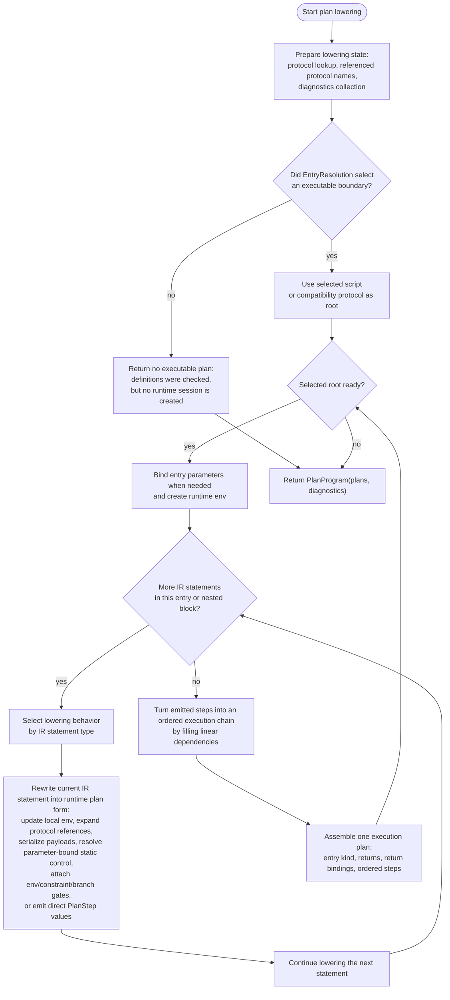
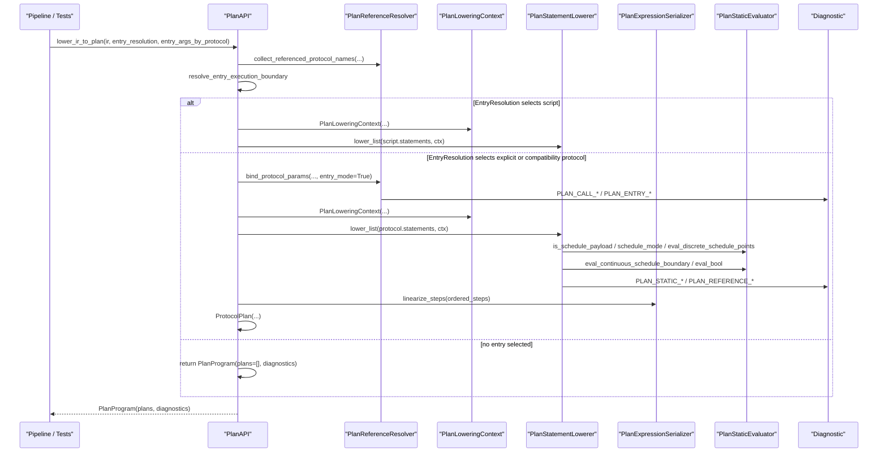
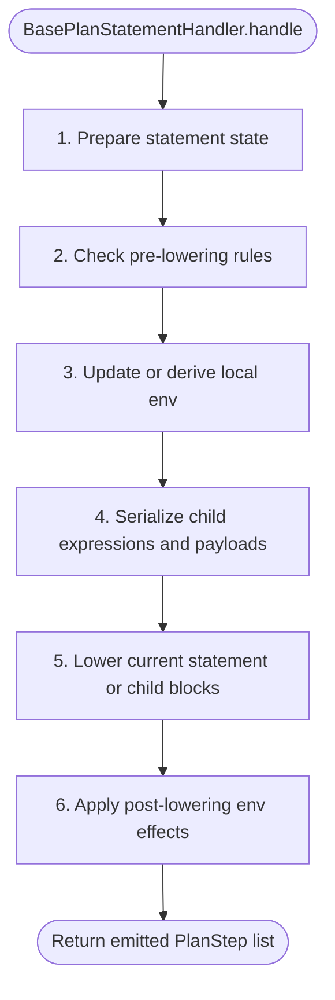
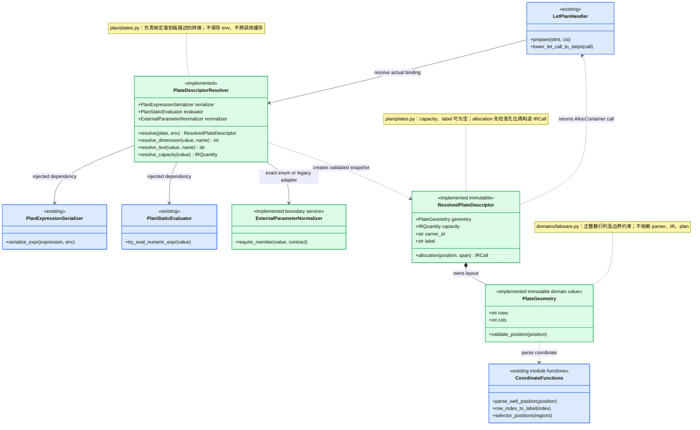
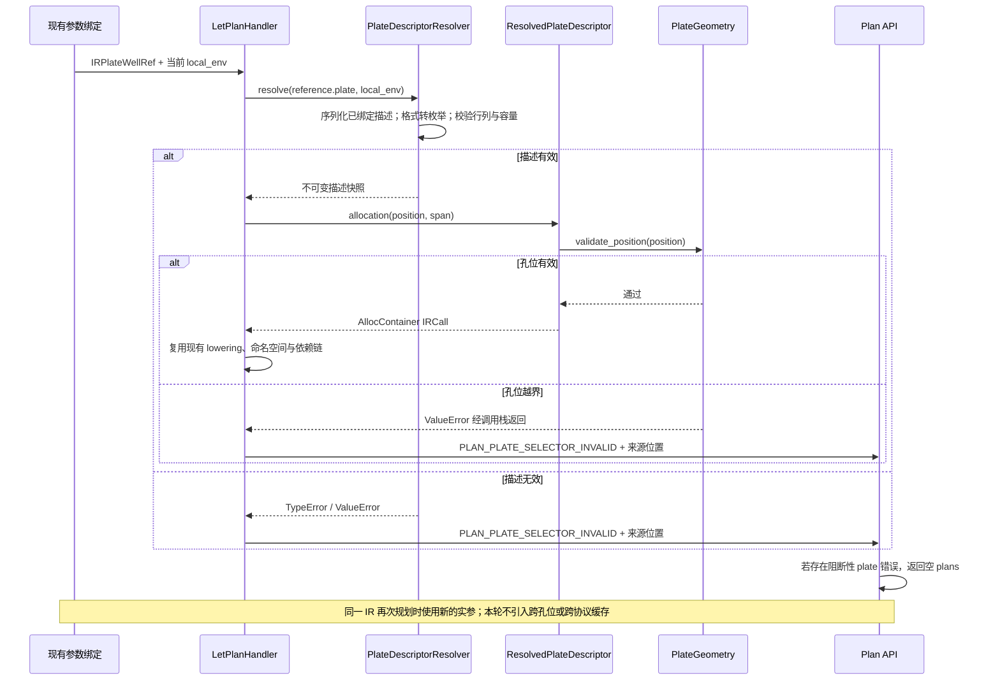

# Plan Module Diagrams

Last updated: 2026-09-23

Related IR / Plan documents:

1. [ir_structure_diagrams.md](./ir_structure_diagrams.md)

## Scope

The current implementation is described by these five diagrams; the implemented plate ownership detail follows separately:

1. Functional flowchart: what plan lowering actually does.
2. Runtime sequence: the current runtime call chain.
3. Plan statement detail sequence: the current statement-lowering internals.
4. Statement lowering lifecycle template.
5. Class/module diagram: the ownership split in the current implementation.

Plan lowering consumes Canonical IR and returns `PlanProgram(plans, diagnostics)`.
It owns protocol-root selection, protocol-call/include expansion, protocol
parameter binding, IR-to-PlanStep lowering, gate propagation for env /
constraint / runtime conditions, local environment serialization, and linear
dependency assignment between emitted steps. It also owns static evaluation
that depends on bound protocol parameters, such as plan-static repeat schedules
and static conditional selection. It does not perform semantic validation, type
checking, runtime execution, or driver realization.

The implementation now follows the same dispatcher plus handler pattern used by
parser rule conversion, statement compile, validation, and typecheck:
`plan/__init__.py` owns the public API, `plan/context.py` owns shared lowering
state, `plan/references.py` owns protocol reference expansion and parameter
binding, `plan/serialization.py` owns expression/env serialization,
`plan/static_eval.py` owns parameter-bound static expression and schedule
evaluation, `plan/plates.py` resolves bound plate descriptors and produces well allocations, and `plan/statements.py` owns statement dispatch and handlers.

## Functional Flowchart

## Runtime Sequence

## Plan Statement Detail Sequence

```mermaid
sequenceDiagram
    participant Lower as "PlanStatementLowerer"
    participant H as "BasePlanStatementHandler"
    participant EnvH as "WithEnvPlanHandler"
    participant RepH as "RepeatPlanHandler"
    participant CondH as "ConditionalPlanHandler"
    participant Ref as "PlanReferenceResolver"
    participant Ser as "PlanExpressionSerializer"
    participant Static as "PlanStaticEvaluator"
    participant Gate as "GateHelpers"
    participant Ctx as "PlanLoweringContext"
    participant Diag as "Diagnostic"

    Lower->>H: handle(stmt, ctx)
    H->>H: prepare(stmt, ctx)
    H->>H: validate_pre_lowering_rules(stmt, ctx, state)
    H->>H: update_or_derive_local_env(stmt, ctx, state)
    H->>H: serialize_child_expressions(stmt, ctx, state)
    alt IRInclude
        H->>Ref: expand_reference_steps(...)
        Ref->>Ref: bind_protocol_params(...)
        Ref->>Ctx: extend_diagnostics(...)
        Ref->>Lower: lower_list(referenced_protocol.statements, child_ctx)
    else IRLet / IRAssign / IRMutation / IRControl / IRStep
        H->>Ser: serialize_expr(...) / serialize_arg_list(...)
        H->>Gate: merge_gate(...)
        H-->>Lower: list[PlanStep]
    else IRWithEnv
        EnvH->>Ser: serialize_arg_list(env_args, local_env)
        EnvH->>Ser: serialize_expr(targets, local_env)
        EnvH->>Gate: merge_gate(env, env_targets)
        EnvH->>Static: env_time_boundary_from_payload(env_payload)
        Static->>Static: is_time_quantity_payload(duration)
        Static-->>EnvH: IRQuantity boundary or None
        EnvH->>Ctx: derive(env_time_boundary)
        EnvH->>Lower: lower_list(executable child statements, child_ctx)
        EnvH->>Ser: invalidate_local_env_names(...)
    else IRWithConstraint
        H->>Ser: serialize_arg_list(options, local_env)
        H->>Gate: append_constraints(...)
        H->>Lower: lower_list(child_statements, child_ctx)
        H->>Ser: invalidate_local_env_names(...)
    else IRRepeat schedule payload
        RepH->>Ser: serialize_expr(iterable, local_env)
        RepH->>Static: is_schedule_payload(iterable)
        RepH->>Static: schedule_mode(iterable)
        Static->>Static: schedule_args(schedule)
        Static->>Static: schedule_mode_from_args(args)
        alt discrete schedule
            RepH->>RepH: lower_static_schedule_repeat(stmt, ctx, iterable)
            RepH->>Static: eval_discrete_schedule_points(schedule, env_time_boundary)
            Static->>Static: schedule_args(schedule)
            Static->>Static: schedule_mode_from_args(args)
            Static->>Static: plan_quantity(start / step / end)
            alt interval time schedule
                Static->>Static: is_time_point(point)
                Static->>Static: expand_time_schedule_points(start, end, step, env_time_boundary)
                Static->>Static: time_quantity_to_seconds(quantity)
                Static->>Static: seconds_to_unit(seconds, unit)
            else interval count schedule
                Static->>Static: is_unitless_int_point(point)
                Static->>Static: is_repeat_count_schedule(args)
                Static->>Static: expand_count_schedule_points(start, end, step)
            else explicit at list
                Static->>Static: validate_schedule_point_list(points)
                Static->>Static: validate_points_within_boundary(points, env_time_boundary)
            end
            Static->>Static: quantity_payload(point)
            Static-->>RepH: list[IRQuantity payload]
            RepH->>Ctx: derive(local_env with loop binding)
            RepH->>Lower: lower_list(body, iteration_ctx)
        else continuous schedule
            RepH->>RepH: lower_static_continuous_schedule(stmt, ctx, iterable)
            RepH->>Static: eval_continuous_schedule_boundary(schedule, env_time_boundary)
            Static->>Static: schedule_args(schedule)
            Static->>Static: schedule_mode_from_args(args)
            Static->>Static: plan_quantity(start / duration / end)
            Static->>Static: is_time_point(point)
            Static->>Static: time_quantity_to_seconds(quantity)
            Static->>Static: seconds_to_unit(seconds, unit)
            Static->>Static: validate_boundary_within_env(boundary, env_time_boundary, message)
            Static->>Static: quantity_payload(boundary)
            Static-->>RepH: IRQuantity boundary payload
            RepH->>Ctx: derive(env_time_boundary=boundary)
            RepH->>Lower: lower_list(body, child_ctx)
        else invalid static schedule
            RepH->>Ctx: emit_diagnostic(PLAN_STATIC_REPEAT_SCHEDULE_INVALID)
        end
    else IRRepeat runtime iterable
        RepH->>Ser: serialize_expr(iterable, local_env)
        RepH->>Ctx: derive(local_env, gate_base)
        RepH->>Lower: lower_list(body, child_ctx)
        RepH->>Ser: linearize_steps(body_steps)
        RepH-->>Lower: repeat_bind PlanStep
    else IRConditional
        CondH->>Ser: serialize_expr(condition, local_env)
        CondH->>Static: eval_bool(condition_payload)
        Static->>Static: try_eval_bool_expr(value)
        Static->>Static: try_eval_numeric_expr(value)
        Static->>Static: compare_values(left, right, op)
        alt static bool
            Static-->>CondH: true | false
            CondH->>Lower: lower_list(selected_branch, ctx)
        else runtime condition
            CondH->>Gate: append_runtime_condition(...)
            CondH->>Ctx: derive(gate_base=then_gate)
            CondH->>Lower: lower_list(then_statements, then_ctx)
            CondH->>Ctx: derive(gate_base=else_gate)
            CondH->>Lower: lower_list(else_statements, else_ctx)
        end
        CondH->>Ser: invalidate_local_env_names(...)
    end
    H->>H: apply_post_lowering_effects(stmt, ctx, state, output)
    H->>Ctx: extend_diagnostics(diagnostics)
    Lower->>Diag: append(diagnostic)
```

## Statement Lowering Lifecycle Template

| Phase | Semantic boundary | Typical owners |
| --- | --- | --- |
| `prepare` | Identify the IR statement shape and compute handler-local lowering state. | every statement handler |
| `validate_pre_lowering_rules` | Check rules that must run before env updates or recursion. | protected parameter redeclare, reference lookup preconditions |
| `update_or_derive_local_env` | Update the local serialized env or derive nested child env scopes. | let, repeat, reference-call param binding |
| `serialize_child_expressions` | Precompute plan payload pieces from IR expressions using the current local env. | let-call lowering, assign, mutation, step, env/constraint gates |
| `lower_current_or_children` | Emit direct `PlanStep` values or recurse into child statements and referenced protocols. | assign, mutation, control, step, with-env, with-constraint, repeat, conditional, include/reference |
| `apply_post_lowering_effects` | Invalidate or rewrite local env names after runtime-mutating nested statements. | let local-runtime refs, assign, with-env, with-constraint, repeat, conditional |

## Class And Module Diagram

```mermaid
classDiagram
    class PlanAPI {
        +lower_ir_to_plan(ir, entry_resolution, entry_args_by_protocol) PlanProgram
    }

    class EntryResolution {
        +entry_kind
        +entry_module
        +protocol_name
        +source
        +diagnostics
    }

    class PlanLoweringContext {
        +protocols_by_name
        +diagnostics
        +local_env
        +gate_base
        +protected_names
        +statement_lowerer
        +serializer
        +reference_resolver
        +step_id_prefix
        +call_path
        +env_time_boundary
        +derive(...) PlanLoweringContext
        +emit_diagnostic(diagnostic) None
        +extend_diagnostics(diagnostics) None
    }

    class PlanStatementLowerer {
        +lower_list(statements, ctx) list
        +lower_statement(stmt, ctx) list
        -handlers_by_type
    }

    class PlanExpressionSerializer {
        +serialize_expr(value, env) object
        +serialize_arg_list(args, env) dict
        +linearize_steps(steps) list
        +invalidate_local_env_names(env, statements) None
        +find_arg_by_name(args, name) IRArg
        +load_content_ref_expr(call, fallback_ref) object
    }

    class PlanStaticEvaluator {
        +is_schedule_payload(value) bool
        +schedule_args(schedule) dict
        +schedule_mode_from_args(args) str
        +schedule_mode(schedule) str
        +eval_bool(value) bool | None
        +try_eval_bool_expr(value) bool | None
        +try_eval_numeric_expr(value) float | None
        +compare_values(left, right, op) bool
        +eval_discrete_schedule_points(schedule, env_time_boundary) list
        +eval_continuous_schedule_boundary(schedule, env_time_boundary) dict
        +is_repeat_count_schedule(args) bool
        +plan_quantity(value) dict
        +validate_schedule_point_list(points) None
        +validate_points_within_boundary(points, env_time_boundary) None
        +validate_boundary_within_env(boundary, env_time_boundary, message) None
        +is_time_point(point) bool
        +is_unitless_int_point(point) bool
        +expand_time_schedule_points(start, end, step, env_time_boundary) list
        +expand_count_schedule_points(start, end, step) list
        +time_quantity_to_seconds(quantity) float
        +seconds_to_unit(seconds, unit) float
        +quantity_payload(quantity) dict
        +env_time_boundary_from_payload(env_payload) object
        +is_time_quantity_payload(value) bool
    }

    class GateHelpers {
        +merge_gate(base, extra) dict
        +append_constraints(base, requirements, options) dict
        +append_runtime_condition(base, expr, negate) dict
    }

    class PlanReferenceResolver {
        +collect_referenced_protocol_names(statements) list
        +bind_protocol_params(target_protocol, call_args, caller_env, ...) tuple
        +expand_reference_steps(ref_name, ref_args, ctx, ...) list
    }

    class PlanStatementLoweringState {
        +output
    }

    class LetPlanState {
        +call
    }

    class BasePlanStatementHandler {
        +handle(stmt, ctx) list
        #prepare(stmt, ctx) PlanStatementLoweringState
        #validate_pre_lowering_rules(stmt, ctx, state) None
        #update_or_derive_local_env(stmt, ctx, state) None
        #serialize_child_expressions(stmt, ctx, state) None
        #lower_current_or_children(stmt, ctx, state) list
        #apply_post_lowering_effects(stmt, ctx, state, output) None
    }

    class LetPlanHandler
    class AssignPlanHandler
    class IncludePlanHandler
    class WithEnvPlanHandler
    class WithConstraintPlanHandler
    class RepeatPlanHandler
    class ConditionalPlanHandler
    class MutationPlanHandler
    class ControlPlanHandler
    class StepPlanHandler

    class PlanProgram
    class ProtocolPlan
    class PlanStep
    class Diagnostic
    class IRProgram
    class IRStatement

    PlanAPI --> PlanLoweringContext : creates
    PlanAPI --> EntryResolution : reads
    PlanAPI --> PlanStatementLowerer : uses
    PlanAPI --> PlanProgram : returns
    PlanLoweringContext --> Diagnostic : appends
    PlanStatementLowerer --> BasePlanStatementHandler : dispatches to
    BasePlanStatementHandler --> PlanLoweringContext : reads / emits through
    BasePlanStatementHandler --> PlanStatementLoweringState : creates
    LetPlanState --|> PlanStatementLoweringState
    BasePlanStatementHandler --> PlanExpressionSerializer : uses
    BasePlanStatementHandler --> PlanReferenceResolver : uses
    BasePlanStatementHandler --> PlanStaticEvaluator : uses
    BasePlanStatementHandler --> GateHelpers : uses
    BasePlanStatementHandler <|-- LetPlanHandler
    BasePlanStatementHandler <|-- AssignPlanHandler
    BasePlanStatementHandler <|-- IncludePlanHandler
    BasePlanStatementHandler <|-- WithEnvPlanHandler
    BasePlanStatementHandler <|-- WithConstraintPlanHandler
    BasePlanStatementHandler <|-- RepeatPlanHandler
    BasePlanStatementHandler <|-- ConditionalPlanHandler
    BasePlanStatementHandler <|-- MutationPlanHandler
    BasePlanStatementHandler <|-- ControlPlanHandler
    BasePlanStatementHandler <|-- StepPlanHandler
    RepeatPlanHandler --> PlanStaticEvaluator
    ConditionalPlanHandler --> PlanStaticEvaluator
    IRProgram --> IRStatement : contains
    PlanProgram --> ProtocolPlan : contains
    ProtocolPlan --> PlanStep : contains
```

## Plate 职责收拢：已实现

原有独立解析与分配函数已由下图结构替换。蓝色为保留的协作者，绿色为本次新增类或调整职责；`+` 表示公开接口。保持既有参数绑定、孔位顺序、身份、容量与诊断行为。

| Req ID | 冻结边界 / 迁移 | 验收入口 |
| --- | --- | --- |
| CLASS-PLATE-OWNER | `plate_dimension/text/capacity` → resolver 公开方法；`plate_well_allocation` 的绑定与构造职责分开 | `tests/test_external_boundary_classes.py`：resolver / descriptor 直接测试 |
| CLASS-PLATE-VALUE | `PlateGeometry` 维护正整数行列和孔位边界；描述对象只能携带已校验的布局、容量和文本 | `tests/test_external_boundary_classes.py`：geometry 构造及边界测试 |
| CLASS-PLATE-BIND | resolver 不持有可变 env；无缓存；相同 IR 的不同实参相互隔离 | `test_actual_format_controls_bounds_without_mutating_ir`、`test_protocols_with_same_plate_name_have_independent_references` |
| CLASS-PLATE-DIAG | 源码类型错误仍归 typecheck；绑定后的描述/孔位错误由 handler 发出 `PLAN_PLATE_SELECTOR_INVALID`；清空计划归 Plan API | `tests/test_plate_plan_binding.py`：保留无部分计划断言，检查诊断 span |
| CLASS-PLATE-COMPAT | 保留纯坐标函数和兼容入口；旧 API 如有消费者，先委托新实现，不保留两套规则 | `tests/test_ir_compiler.py`、`tests/test_plate_plan_binding.py`、`tests/test_external_enum_frontend.py` |

枚举编解码和规范化依赖见 [External boundary 类图](./validate_module_diagrams.md#external-boundary-职责收拢已实现)。这是实现组织调整，不新增语言语法，也不改变独立 reference 的语义契约。
