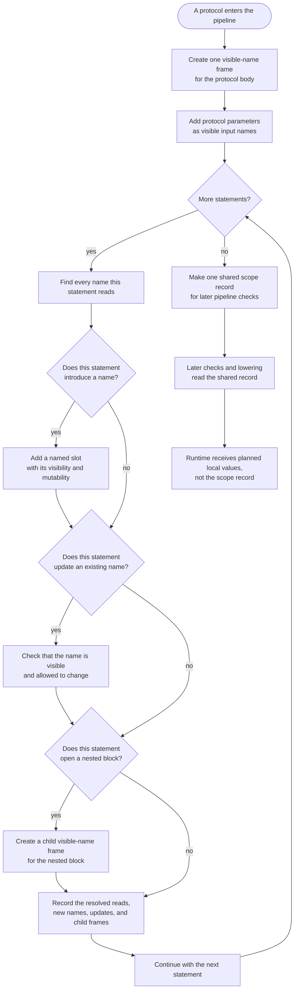
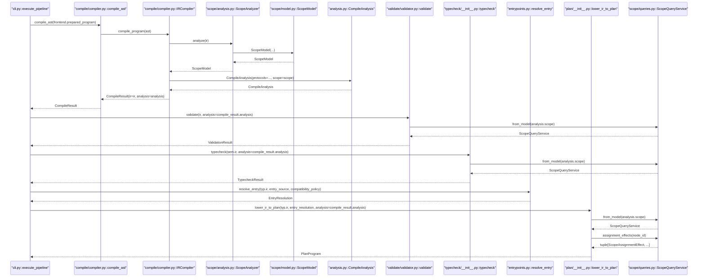
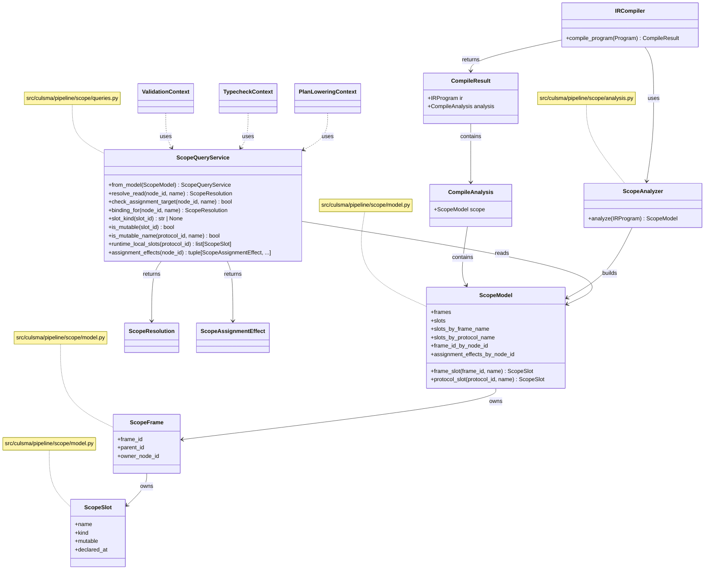

# Scope Module Diagrams

Last updated: 2026-06-18

## Scope Flowchart

```mermaid
flowchart TB
    Start(["A protocol enters the pipeline"])
    Frame["Create one visible-name frame<br/>for the protocol body"]
    Params["Add protocol parameters<br/>as visible input names"]
    StepLoop{"More statements?"}
    Read["Find every name this statement reads"]
    Introduce{"Does this statement<br/>introduce a name?"}
    AddSlot["Add a named slot<br/>with its visibility and mutability"]
    Update{"Does this statement<br/>update an existing name?"}
    CheckUpdate["Check that the name is visible<br/>and allowed to change"]
    Nested{"Does this statement<br/>open a nested block?"}
    ChildFrame["Create a child visible-name frame<br/>for the nested block"]
    Record["Record the resolved reads,<br/>new names, updates, and child frames"]
    Next["Continue with the next statement"]
    Share["Make one shared scope record<br/>for later pipeline checks"]
    Later["Later checks and lowering<br/>read the shared record"]
    Runtime["Runtime receives planned local values,<br/>not the scope record"]

    Start --> Frame
    Frame --> Params
    Params --> StepLoop
    StepLoop -->|yes| Read
    Read --> Introduce
    Introduce -->|yes| AddSlot
    Introduce -->|no| Update
    AddSlot --> Update
    Update -->|yes| CheckUpdate
    Update -->|no| Nested
    CheckUpdate --> Nested
    Nested -->|yes| ChildFrame
    Nested -->|no| Record
    ChildFrame --> Record
    Record --> Next
    Next --> StepLoop
    StepLoop -->|no| Share
    Share --> Later
    Later --> Runtime
```

## Pipeline Sequence

```mermaid
sequenceDiagram
    participant E as "cli.py::execute_pipeline"
    participant API as "compile/compiler.py::compile_ast"
    participant C as "compile/compiler.py::IRCompiler"
    participant SA as "scope/analysis.py::ScopeAnalyzer"
    participant SM as "scope/model.py::ScopeModel"
    participant CA as "analysis.py::CompileAnalysis"
    participant V as "validate/validator.py::validate"
    participant T as "typecheck/__init__.py::typecheck"
    participant ER as "entrypoints.py::resolve_entry"
    participant P as "plan/__init__.py::lower_ir_to_plan"
    participant QS as "scope/queries.py::ScopeQueryService"

    E->>API: compile_ast(frontend.prepared_program)
    API->>C: compile_program(ast)
    C->>SA: analyze(ir)
    SA->>SM: ScopeModel(...)
    SM-->>SA: ScopeModel
    SA-->>C: ScopeModel
    C->>CA: CompileAnalysis(protocols=..., scope=scope)
    CA-->>C: CompileAnalysis
    C-->>API: CompileResult(ir=ir, analysis=analysis)
    API-->>E: CompileResult

    E->>V: validate(ir, analysis=compile_result.analysis)
    V->>QS: from_model(analysis.scope)
    QS-->>V: ScopeQueryService
    V-->>E: ValidationResult

    E->>T: typecheck(sem.ir, analysis=compile_result.analysis)
    T->>QS: from_model(analysis.scope)
    QS-->>T: ScopeQueryService
    T-->>E: TypecheckResult

    E->>ER: resolve_entry(typ.ir, entry_source, compatibility_policy)
    ER-->>E: EntryResolution

    E->>P: lower_ir_to_plan(typ.ir, entry_resolution, analysis=compile_result.analysis)
    P->>QS: from_model(analysis.scope)
    QS-->>P: ScopeQueryService
    P->>QS: assignment_effects(node_id)
    QS-->>P: tuple[ScopeAssignmentEffect, ...]
    P-->>E: PlanProgram
```

## Class Diagram

```mermaid
classDiagram
    class IRCompiler {
        +compile_program(Program) CompileResult
    }

    class CompileResult {
        +IRProgram ir
        +CompileAnalysis analysis
    }

    class CompileAnalysis {
        +ScopeModel scope
    }

    class ScopeAnalyzer {
        +analyze(IRProgram) ScopeModel
    }

    class ScopeModel {
        +frames
        +slots
        +slots_by_frame_name
        +slots_by_protocol_name
        +frame_id_by_node_id
        +assignment_effects_by_node_id
        +frame_slot(frame_id, name) ScopeSlot
        +protocol_slot(protocol_id, name) ScopeSlot
    }

    class ScopeFrame {
        +frame_id
        +parent_id
        +owner_node_id
    }

    class ScopeSlot {
        +name
        +kind
        +mutable
        +declared_at
    }

    class ScopeQueryService {
        +from_model(ScopeModel) ScopeQueryService
        +resolve_read(node_id, name) ScopeResolution
        +check_assignment_target(node_id, name) bool
        +binding_for(node_id, name) ScopeResolution
        +slot_kind(slot_id) str | None
        +is_mutable(slot_id) bool
        +is_mutable_name(protocol_id, name) bool
        +runtime_local_slots(protocol_id) list[ScopeSlot]
        +assignment_effects(node_id) tuple[ScopeAssignmentEffect, ...]
    }

    class ScopeResolution
    class ScopeAssignmentEffect
    class ValidationContext
    class TypecheckContext
    class PlanLoweringContext

    note for ScopeAnalyzer "src/culsma/pipeline/scope/analysis.py"
    note for ScopeModel "src/culsma/pipeline/scope/model.py"
    note for ScopeFrame "src/culsma/pipeline/scope/model.py"
    note for ScopeSlot "src/culsma/pipeline/scope/model.py"
    note for ScopeQueryService "src/culsma/pipeline/scope/queries.py"

    IRCompiler --> ScopeAnalyzer : uses
    IRCompiler --> CompileResult : returns
    CompileResult --> CompileAnalysis : contains
    CompileAnalysis --> ScopeModel : contains
    ScopeAnalyzer --> ScopeModel : builds
    ScopeModel --> ScopeFrame : owns
    ScopeFrame --> ScopeSlot : owns
    ScopeQueryService --> ScopeModel : reads
    ScopeQueryService --> ScopeResolution : returns
    ScopeQueryService --> ScopeAssignmentEffect : returns
    ValidationContext ..> ScopeQueryService : uses
    TypecheckContext ..> ScopeQueryService : uses
    PlanLoweringContext ..> ScopeQueryService : uses
```
