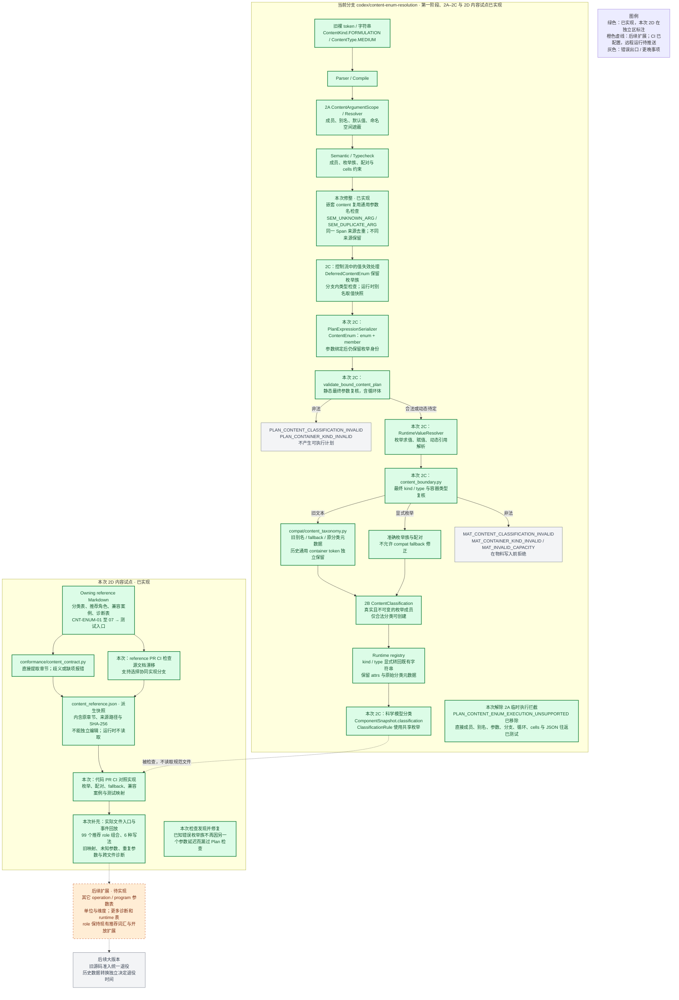
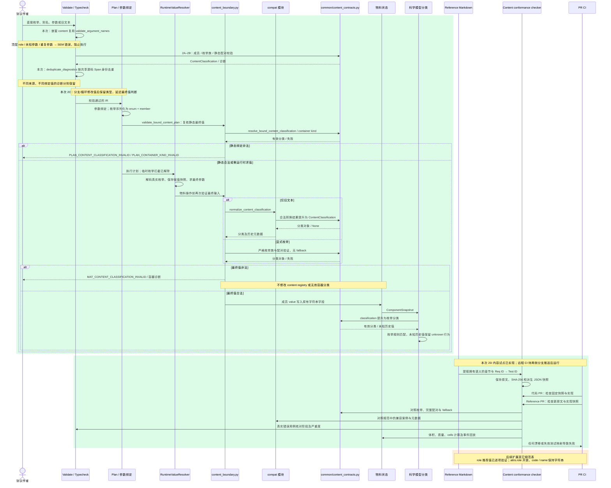

# Content Validation Diagrams

## 流程图

```mermaid
flowchart TB
    subgraph Current["当前分支 codex/content-enum-resolution · 第一阶段、2A–2C 与 2D 内容试点已实现"]
        Source["旧裸 token / 字符串<br/>ContentKind.FORMULATION / ContentType.MEDIUM"] --> Frontend["Parser / Compile"]
        Frontend --> Resolver["2A ContentArgumentScope / Resolver<br/>成员、别名、默认值、命名空间遮蔽"]
        Resolver --> Validate["Semantic / Typecheck<br/>成员、枚举族、配对与 cells 约束"]
        Validate --> Audit["本次修整 · 已实现<br/>嵌套 content 复用通用参数名检查<br/>SEM_UNKNOWN_ARG / SEM_DUPLICATE_ARG<br/>同一 Span 来源去重；不同来源保留"]
        Audit --> Flow["2C：控制流中的值失效处理<br/>DeferredContentEnum 保留枚举族<br/>分支内类型检查；运行时别名取值快照"]
        Flow --> Serialize["本次 2C：PlanExpressionSerializer<br/>ContentEnum：enum + member<br/>参数绑定后仍保留枚举身份"]
        Serialize --> Bound["本次 2C：validate_bound_content_plan<br/>静态最终参数复核，含循环体"]
        Bound -->|非法| PlanReject["PLAN_CONTENT_CLASSIFICATION_INVALID<br/>PLAN_CONTAINER_KIND_INVALID<br/>不产生可执行计划"]
        Bound -->|合法或动态待定| Execute["本次 2C：RuntimeValueResolver<br/>枚举求值、赋值、动态引用解析"]
        Execute --> Boundary["本次 2C：content_boundary.py<br/>最终 kind / type 与容器类型复核"]
        Boundary -->|旧文本| Legacy["compat/content_taxonomy.py<br/>旧别名 / fallback / 原分类元数据<br/>历史通用 container token 独立保留"]
        Boundary -->|显式枚举| Strict["准确枚举族与配对<br/>不允许 compat fallback 修正"]
        Legacy --> Classification["2B ContentClassification<br/>真实且不可变的枚举成员<br/>仅合法分类可创建"]
        Strict --> Classification
        Boundary -->|非法| RuntimeReject["MAT_CONTENT_CLASSIFICATION_INVALID<br/>MAT_CONTAINER_KIND_INVALID / MAT_INVALID_CAPACITY<br/>在物料写入前拒绝"]
        Classification --> Store["Runtime registry<br/>kind / type 显式转回既有字符串<br/>保留 attrs 与原始分类元数据"]
        Store --> Science["本次 2C：科学模型分类<br/>ComponentSnapshot.classification<br/>ClassificationRule 使用共享枚举"]
        Note["本次解除 2A 临时执行拦截<br/>PLAN_CONTENT_ENUM_EXECUTION_UNSUPPORTED 已移除<br/>直接成员、别名、参数、分支、循环、cells 与 JSON 往返已测试"]
    end
    subgraph Conformance["本次 2D 内容试点 · 已实现"]
        Reference["Owning reference Markdown<br/>分类表、推荐角色、兼容案例、诊断表<br/>CNT-ENUM-01 至 07 → 测试入口"]
        Reference --> Extract["conformance/content_contract.py<br/>直接提取章节；歧义或缺项报错"]
        Extract --> Snapshot["content_reference.json · 派生快照<br/>内含原章节、来源路径与 SHA-256<br/>不能独立编辑；运行时不读取"]
        Snapshot --> CheckCI["本次：代码 PR CI 对照实现<br/>枚举、配对、fallback、兼容案例与测试映射"]
        Reference --> RefCI["本次：reference PR CI 检查源文档漂移<br/>支持选择协同实现分支"]
        RefCI --> Snapshot
        CheckCI --> Evidence["本次补充：实际文件入口与事件回放<br/>99 个推荐 role 组合、6 种写法<br/>旧映射、未知参数、重复参数与跨文件诊断"]
        PipelineFix["本次检查发现并修复<br/>已知错误枚举族不再因另一个参数延迟而漏过 Plan 检查"]
    end
    Science -.->|被检查，不读取规范文件| CheckCI
    Evidence -.-> Next["后续扩展 · 待实现<br/>其它 operation / program 参数表<br/>单位与维度；更多诊断和 runtime 表<br/>role 保持现有推荐词汇与开放扩展"]
    Next -.-> Major["后续大版本<br/>旧源码准入统一退役<br/>历史数据转换独立决定退役时间"]
    Legend["图例<br/>绿色：已实现，本次 2D 在独立区标注<br/>橙色虚线：后续扩展；CI 已配置，远程运行待推送<br/>灰色：错误出口 / 更晚事项"]
    classDef current fill:#dcfce7,stroke:#15803d,color:#14532d,stroke-width:2px;
    classDef next fill:#ffedd5,stroke:#c2410c,color:#7c2d12,stroke-dasharray:5 5;
    classDef limit fill:#f3f4f6,stroke:#6b7280,color:#374151;
    class Source,Frontend,Resolver,Validate,Flow,Serialize,Bound,Execute,Boundary,Legacy,Strict,Classification,Store,Science,Note current;
    class Reference,Extract,Snapshot,CheckCI,RefCI,Evidence,PipelineFix current;
    class Audit current;
    class Next next;
    class PlanReject,RuntimeReject,Major limit;
```

## 时序图

```mermaid
sequenceDiagram
    actor Author as 协议作者
    participant Check as Validate / Typecheck
    participant Plan as Plan / 参数绑定
    participant Values as RuntimeValueResolver
    participant Boundary as content_boundary.py
    participant Legacy as compat 模块
    participant Shared as common/content_contracts.py
    participant Material as 物料状态
    participant Science as 科学模型分类
    participant Reference as Reference Markdown
    participant Conformance as Content conformance checker
    participant CI as PR CI

    rect rgb(220, 252, 231)
        Author->>Check: 直接枚举、别名、参数或旧文本
        Check->>Check: 本次：嵌套 content 复用 validate_argument_names
        Note over Author, Check: 顶层 role / 未知参数 / 重复参数 → SEM 错误，阻止执行
        Check->>Shared: 2A–2B：成员 / 枚举族 / 静态配对校验
        Shared-->>Check: ContentClassification / 诊断
        Check->>Check: 本次：deduplicate_diagnostics 按共享源码 Span 身份去重
        Note over Author, Check: 不同来源、不同绑定值的诊断分别保留
        Note over Check, Plan: 本次 2C：分支/循环修改值后保留类型，延迟最终值判断
        Check->>Plan: 校验通过的 IR
        Plan->>Plan: 参数绑定；枚举序列化为 enum + member
        Plan->>Boundary: validate_bound_content_plan：复核静态最终值
        Boundary->>Shared: resolve_bound_content_classification / container kind
        Shared-->>Boundary: 有效分类 / 失败
        alt 静态绑定非法
            Boundary-->>Author: PLAN_CONTENT_CLASSIFICATION_INVALID / PLAN_CONTAINER_KIND_INVALID
        else 静态合法或需运行时求值
            Plan->>Values: 执行计划；临时枚举拦截已解除
            Values->>Values: 解码真实枚举、保存赋值快照、求最终参数
            Values->>Boundary: 物料操作前再次验证最终输入
            alt 仅旧文本
                Boundary->>Legacy: normalize_content_classification
                Legacy->>Shared: 合法转换结果提升为 ContentClassification
                Shared-->>Legacy: 分类对象 / None
                Legacy-->>Boundary: 分类及历史元数据
            else 显式枚举
                Boundary->>Shared: 严格枚举族与配对验证，无 fallback
                Shared-->>Boundary: 分类对象 / 失败
            end
            alt 最终值非法
                Boundary-->>Author: MAT_CONTENT_CLASSIFICATION_INVALID / 容器诊断
                Note over Boundary, Material: 不修改 content registry 或无效容器分类
            else 最终值合法
                Boundary->>Material: 成员 value 写入原有字符串字段
                Material->>Science: ComponentSnapshot
                Science->>Shared: classification 提升为枚举分类
                Shared-->>Science: 有效分类 / 未知历史值
                Science->>Science: 枚举规则匹配，未知历史值保留 unknown 行为
            end
        end
    end
    rect rgb(220, 252, 231)
        Note over Reference, CI: 本次 2D 内容试点已实现；远程 CI 待两侧分支推送后运行
        Reference->>Conformance: 提取拥有语义的章节与 Req ID → Test ID
        Conformance->>Conformance: 保存原文、SHA-256 和派生 JSON 快照
        CI->>Conformance: 代码 PR：检查固定快照与实现
        CI->>Conformance: Reference PR：检查新原文与实现快照
        Conformance->>Shared: 对照枚举、完整配对与 fallback
        Conformance->>Legacy: 对照规范中的兼容案例与元数据
        Conformance->>Check: 真实错误用例核对阶段及严重度
        Conformance->>Material: 体积、质量、cells 计算及事件回放
        Conformance-->>CI: 任何漂移或失效测试映射导致失败
    end
    rect rgb(255, 237, 213)
        Note over Reference, CI: 后续扩展其它规范表<br/>role 推荐值已逐项验证；attrs.role 开放、code / name 保持字符串
    end
```

## 类图

```mermaid
classDiagram
    class OperationContractValidator {
        +validate_argument_names(call, node_id, allowed_args)
        +validate_call(call, node_id, operations)
    }
    class ConstructorValidator {
        +validate_define_content_call(call)
    }
    class SemanticValidator {
        +deduplicate_diagnostics(diagnostics)
    }
    ConstructorValidator ..> OperationContractValidator : 本次：复用现有允许参数表
    SemanticValidator ..> ConstructorValidator
    note for SemanticValidator "本次：同一源码 Span 对象标识展开来源<br/>不同文件相同坐标不合并；无来源时保守保留"
    class SharedContentContracts["common/content_contracts.py"]
    class SharedContentContracts {
        +parse_content_classification(kind, type)
        +serialize_content_enum(value)
        +parse_serialized_content_enum(payload)
        +STANDARD_CONTENT_TYPES_BY_KIND_ENUM : readonly
    }
    class ContentKind {
        <<enumeration>>
    }
    class ContentType {
        <<enumeration>>
    }
    class ContainerKind {
        <<enumeration>>
    }
    class ContentClassification {
        +kind : ContentKind
        +type : ContentType
        +validate()
        +to_dict()
    }
    SharedContentContracts ..> ContentKind
    SharedContentContracts ..> ContentType
    SharedContentContracts ..> ContainerKind
    SharedContentContracts ..> ContentClassification : 严格创建
    ContentClassification --> ContentKind
    ContentClassification --> ContentType
    class ContentArgumentResolver
    class DeferredContentEnum {
        +enum_type
    }
    ContentArgumentResolver ..> DeferredContentEnum : 本次：保留控制流后的枚举族
    class PlanExpressionSerializer
    PlanExpressionSerializer ..> SharedContentContracts : 本次：枚举身份序列化
    class BoundContentPlanValidator["plan/content_enums.py"]
    class BoundContentPlanValidator {
        +validate_bound_content_plan(plan)
        +validate_bound_content_step(step)
    }
    class ContentBoundary["pipeline/content_boundary.py"]
    class ContentBoundary {
        +read_bound_content_token(value, expected_enum)
        +resolve_bound_content_classification(kind, type)
        +resolve_bound_container_kind(value)
        +resolve_runtime_container_kind(value)
    }
    class BoundContentClassification {
        +classification : ContentClassification
        +normalization : NormalizedContentClassification or None
    }
    class NormalizedContentClassification {
        +kind : str
        +type : str
        +attrs
        +original_kind
        +original_type
        +classification : ContentClassification or None
    }
    class LegacyContentTaxonomy["compat/content_taxonomy.py"]
    BoundContentPlanValidator ..> ContentBoundary : 本次：绑定后复核
    ContentBoundary ..> SharedContentContracts
    ContentBoundary ..> LegacyContentTaxonomy : 仅旧输入
    ContentBoundary ..> BoundContentClassification : 返回
    BoundContentClassification --> ContentClassification
    BoundContentClassification --> NormalizedContentClassification
    LegacyContentTaxonomy ..> NormalizedContentClassification
    class RuntimeValueResolver
    RuntimeValueResolver ..> SharedContentContracts : 本次：求值与序列化
    class RuntimeContent["runtime/material/container_content.py"]
    RuntimeContent ..> ContentBoundary : 本次：物料写入前复核
    class ComponentSnapshot {
        +canonical_kind : str
        +canonical_type : str
        +classification : ContentClassification or None
    }
    class ClassificationRule {
        +canonical_kind : ContentKind or None
        +canonical_types : ContentType set or None
        +matches_classification(classification)
    }
    ComponentSnapshot ..> SharedContentContracts : 本次：消费者边界提升
    ClassificationRule ..> ContentClassification : 本次：枚举身份匹配
    class ContentReferenceChecker["conformance/content_contract.py"]
    class ContentReferenceChecker {
        +read_reference(root)
        +validate_snapshot(snapshot)
        +implementation_errors(contract)
        +requirement_hook_errors(contract, root)
        +main(argv)
    }
    class EnumConformanceTests {
        +test_reference_taxonomy_matches_implementation()
        +test_reference_diagnostic_ownership()
        +test_enum_text_calculation_and_event_replay()
        +test_reference_pair_matrix_enforced_by_frontend()
        +test_all_recommended_roles_from_file_entry()
        +test_file_entry_enforces_nested_content_argument_contract()
    }
    class ReferenceMarkdown
    class DerivedReferenceSnapshot {
        +sources : markdown and sha256
        +contract : generated data
    }
    class ContentConformanceCI
    ReferenceMarkdown ..> ContentReferenceChecker : 本次：规范来源
    ContentReferenceChecker ..> DerivedReferenceSnapshot : 本次：生成与校验
    ContentConformanceCI ..> ContentReferenceChecker : 本次：两端 PR 检查
    ContentConformanceCI ..> EnumConformanceTests
    class BroaderConformance {
        <<planned>>
        +operation_and_program_tables()
        +units_and_remaining_diagnostics()
    }
    EnumConformanceTests ..> SharedContentContracts
    EnumConformanceTests ..> RuntimeContent
    EnumConformanceTests ..> ClassificationRule
    note for ContentBoundary "本次 2C：计划与运行时共用公开边界函数<br/>test_content_enum_execution.py 验收<br/>非法最终值在物料写入前拒绝"
    note for BoundContentPlanValidator "原 2A 临时 guard 已移除<br/>本次改为最终绑定值校验，不再禁止合法枚举执行"
    note for NormalizedContentClassification "历史字符串、attrs 与原分类元数据继续保留<br/>旧源码准入退役不影响独立历史适配"
    note for EnumConformanceTests "本次 2D：内容试点与差异检测已完成<br/>本地直接对照 reference，包含事件回放<br/>绿色已实现；橙色为更广泛规范表扩展"
    style SharedContentContracts fill:#dcfce7,stroke:#15803d,color:#14532d
    style OperationContractValidator fill:#dcfce7,stroke:#15803d,color:#14532d
    style ConstructorValidator fill:#dcfce7,stroke:#15803d,color:#14532d
    style SemanticValidator fill:#dcfce7,stroke:#15803d,color:#14532d
    style ContentClassification fill:#dcfce7,stroke:#15803d,color:#14532d
    style DeferredContentEnum fill:#dcfce7,stroke:#15803d,color:#14532d
    style PlanExpressionSerializer fill:#dcfce7,stroke:#15803d,color:#14532d
    style BoundContentPlanValidator fill:#dcfce7,stroke:#15803d,color:#14532d
    style ContentBoundary fill:#dcfce7,stroke:#15803d,color:#14532d
    style BoundContentClassification fill:#dcfce7,stroke:#15803d,color:#14532d
    style RuntimeValueResolver fill:#dcfce7,stroke:#15803d,color:#14532d
    style RuntimeContent fill:#dcfce7,stroke:#15803d,color:#14532d
    style ComponentSnapshot fill:#dcfce7,stroke:#15803d,color:#14532d
    style ClassificationRule fill:#dcfce7,stroke:#15803d,color:#14532d
    style EnumConformanceTests fill:#dcfce7,stroke:#15803d,color:#14532d
    style ContentReferenceChecker fill:#dcfce7,stroke:#15803d,color:#14532d
    style ContentConformanceCI fill:#dcfce7,stroke:#15803d,color:#14532d
    style DerivedReferenceSnapshot fill:#dcfce7,stroke:#15803d,color:#14532d
    style BroaderConformance fill:#ffedd5,stroke:#c2410c,color:#7c2d12,stroke-dasharray:5 5
```
