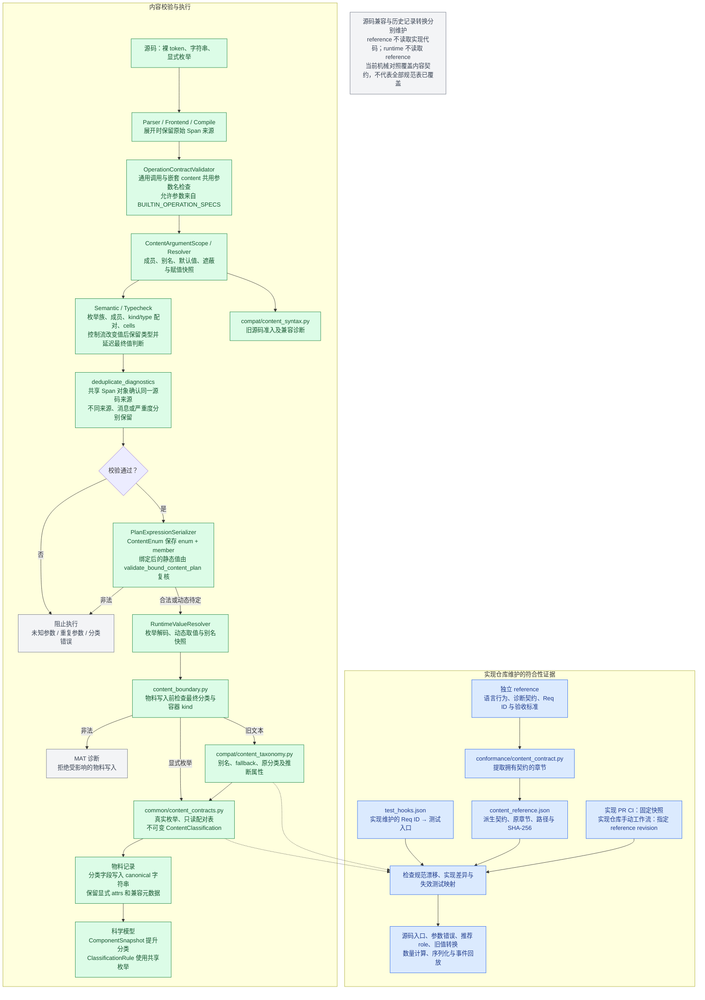
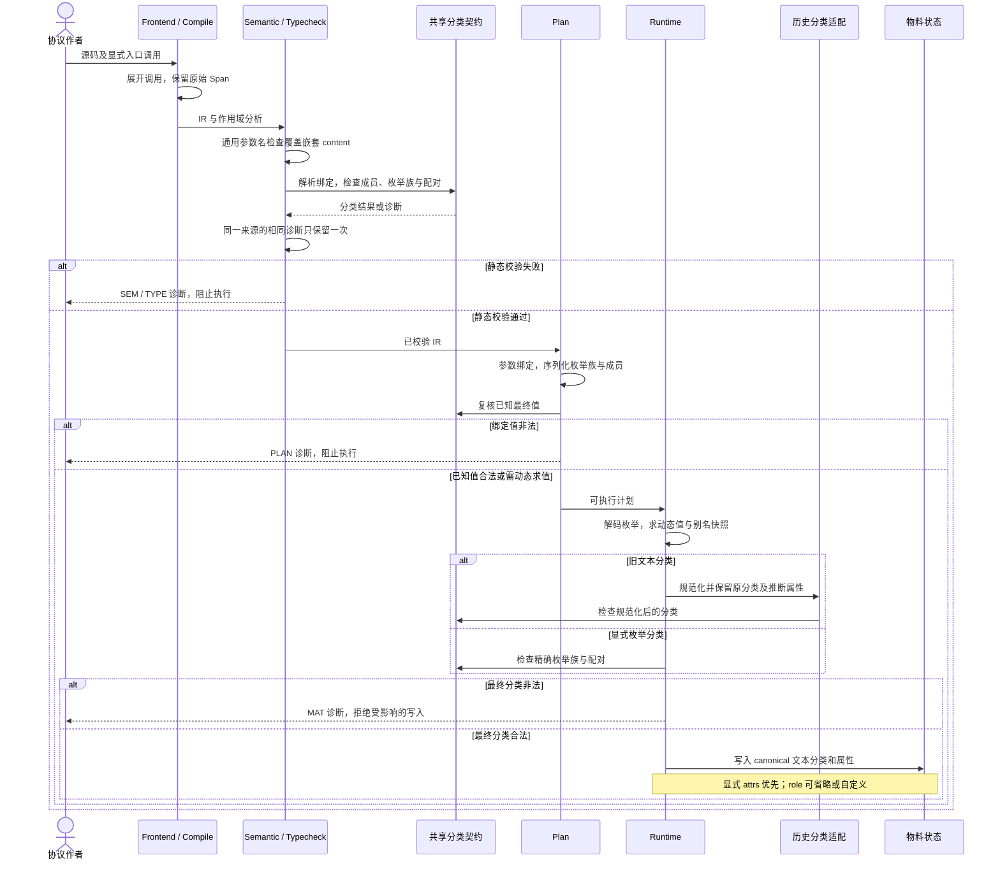
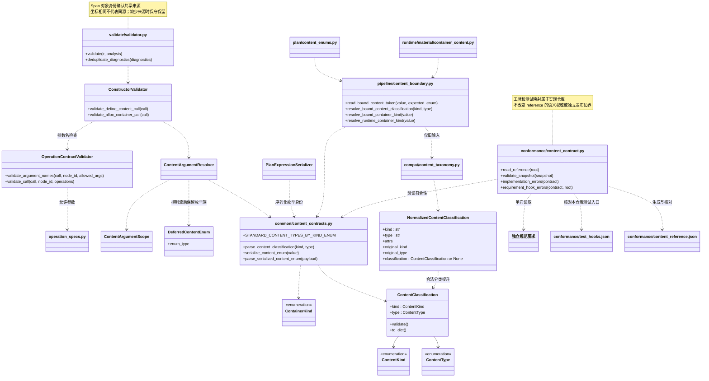

# Content Validation Diagrams

## 流程图

## 时序图

## 类图

符合性工具与测试映射位于实现仓库的 `conformance/`。`test_hooks.json` 保存本实现的测试入口，reference 只提供要求和验收标准。

| 检查入口 | 用途 |
|---|---|
| `python -m conformance.content_contract --check` | 对照固定规范快照、实现及测试映射；实现 PR CI 使用此入口 |
| `python -m conformance.content_contract --reference-root ../culsma-reference --check` | 对照选定 reference 工作树；实现仓库的 Reference Conformance 手动工作流支持指定 revision |
| `python -m conformance.content_contract --reference-root ../culsma-reference --write` | 从已审阅规范重新生成派生快照；随后运行相应行为测试 |
