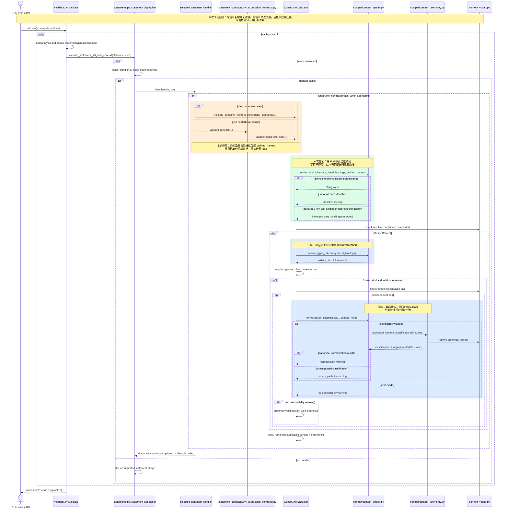

# Validate Module Diagrams

## 流程图

```mermaid
flowchart TB
    Start([Start]) --> Init["Prepare diagnostics, options and operation specifications"]
    Init --> Protocols{"More protocols?"}
    Protocols -->|yes| Context["Load analysis and include/export facts<br/>Create StatementValidationContext"]
    Context --> Statements{"More statements?"}
    Statements -->|no| Protocols
    Statements -->|yes| Dispatch["Select handler by exact statement type"]
    Dispatch --> Found{"Handler exists?"}
    Found -->|no| Statements
    Found -->|yes| Prepare["BaseStatementHandler.handle<br/>prepare"]
    Prepare --> Continue{"Remaining phases<br/>and handler not stopped?"}
    Continue -->|no| Statements
    Continue -->|yes| Phase["Run next lifecycle phase<br/>Append diagnostics and update state"]
    Phase --> Continue
    Phases["1. validate_pre_binding_contracts<br/>2. validate_bindings<br/>3. validate_post_binding_contracts<br/>4. apply_state_before_children<br/>5. validate_child_expressions<br/>6. validate_child_blocks<br/>7. validate_post_child_contracts<br/>8. apply_state_after_children"]
    Phase -.- Phases
    Protocols -->|no| Result["Return ValidationResult(ir, diagnostics)"]
    Result --> Done([End])

    subgraph Changes["本次改动：构造器校验局部展开"]
        ScopeChange["修改：传递 defined_names<br/>statements → statement / expression contracts<br/>含约束选项中的嵌套表达式"]
        KindFix["新增校验逻辑：resolve_kind_token<br/>裸 kind 进入词表校验<br/>已声明变量不当作字面量"]
        ExistingChecks["保留：合法 kind/type 配对<br/>surface 容量限制"]
        SyntaxMove["迁移：兼容警告<br/>constructors.py → compat/content_syntax.py"]
        TaxonomyMove["迁移：别名表、fallback、原分类元数据<br/>content_vocab.py → compat/content_taxonomy.py"]
        ScopeChange --> KindFix --> ExistingChecks
        ExistingChecks -->|非标准分类的兼容处理| SyntaxMove
        SyntaxMove --> TaxonomyMove
    end
    Phase -.->|相关校验阶段展开| ScopeChange

    subgraph Legend["图例：本次分支改动"]
        AddedKey["绿色：新增模块 / 修复逻辑"]
        ModifiedKey["橙色：修改调用或参数传递"]
        MovedKey["蓝色：迁移已有规则，保持行为"]
        ExistingKey["未着色：已有逻辑"]
    end
    classDef added fill:#dcfce7,stroke:#15803d,color:#14532d,stroke-width:2px;
    classDef modified fill:#ffedd5,stroke:#c2410c,color:#7c2d12,stroke-width:2px;
    classDef moved fill:#dbeafe,stroke:#1d4ed8,color:#1e3a8a,stroke-width:2px;
    class KindFix,AddedKey added;
    class ScopeChange,ModifiedKey modified;
    class SyntaxMove,TaxonomyMove,MovedKey moved;
```

## 时序图

```mermaid
sequenceDiagram
actor Caller as CLI / tests / API
participant V as validator.py::validate
participant S as statements.py::statement dispatcher
participant H as selected statement handler
participant Contracts as statement_contracts.py / expression_contracts.py
participant C as ConstructorValidator
participant Syntax as compat/content_syntax.py
participant Taxonomy as compat/content_taxonomy.py
participant Vocab as content_vocab.py

Note over Caller, Vocab: 本次改动图例：绿色＝新增修复逻辑，橙色＝修改调用，蓝色＝规则迁移<br/>未着色部分沿用已有逻辑

Caller ->> V : validate(ir, analysis, options)
loop each protocol
    V ->> V : load analysis and create StatementValidationContext
    V ->> S : validate_statement_list_with_context(statements, ctx)
    loop each statement
        S ->> S : select handler by exact statement type
        alt handler exists
            S ->> H : handle(stmt, ctx)
            opt constructor contract phase, when applicable
                rect rgb(255, 237, 213)
                alt direct operation step
                    H ->> C : validate_container_content_constructor_semantics(...)
                else let / nested expression
                    H ->> Contracts : validate contract(...)
                    Contracts ->> C : validate constructor call(...)
                end
                Note over H, C: 本次修改：向构造器校验继续传递 defined_names<br/>复用已有作用域数据，覆盖嵌套 load
                end
                rect rgb(220, 252, 231)
                Note over C, Syntax: 本次修复：裸 kind 不再绕过校验<br/>字符串绑定、已声明参数保持原有处理
                C ->> Syntax : resolve_kind_token(arg, literal_bindings, defined_names)
                alt string literal or statically bound string
                    Syntax -->> C : string value
                else unbound bare identifier
                    Syntax -->> C : identifier spelling
                else declared / non-text binding or non-text expression
                    Syntax -->> C : None (existing handling preserved)
                end
                end
                C ->> Vocab : check resolved container/content kind
                opt DefineContent
                    rect rgb(219, 234, 254)
                    Note over C, Syntax: 迁移：旧 type token 解析集中到源码适配器
                    C ->> Syntax : resolve_type_token(arg, literal_bindings)
                    Syntax -->> C : existing text token result
                    end
                    C ->> C : require type and check token format
                    opt known kind and valid type format
                        C ->> Vocab : check canonical kind/type pair
                        opt noncanonical pair
                            rect rgb(219, 234, 254)
                            Note over Syntax, Taxonomy: 迁移：兼容警告、旧别名和 fallback<br/>分类转换行为保持一致
                            C ->> Syntax : normalization_diagnostics(..., compat_mode)
                            alt compatibility mode
                                Syntax ->> Taxonomy : normalize_content_classification(kind, type)
                                Taxonomy ->> Vocab : resolve canonical targets
                                Taxonomy -->> Syntax : classification + original metadata + attrs
                                alt canonical normalization result
                                    Syntax -->> C : compatibility warning
                                else unsupported classification
                                    Syntax -->> C : no compatibility warning
                                end
                            else strict mode
                                Syntax -->> C : no compatibility warning
                            end
                            end
                            opt no compatibility warning
                                C ->> C : append invalid content type diagnostic
                            end
                        end
                    end
                end
                C ->> C : apply remaining applicable surface / load checks
            end
            H -->> S : diagnostics and state updated in lifecycle order
        else no handler
            S ->> S : skip unsupported statement shape
        end
    end
end
V -->> Caller : ValidationResult(ir, diagnostics)
```

## 类图

```mermaid
classDiagram
    class ValidatorEntry {
        +validate(ir, analysis, options) ValidationResult
    }

    class StatementDispatcher {
        +validate_statement_list_with_context(statements, ctx) None
        -_STATEMENT_HANDLERS_BY_TYPE
    }

    class StatementValidationContext {
        +literal_bindings
        +expr_bindings
        +group_bindings
        +defined_names
        +active_requirements
        +diagnostics
        +operations
        +analysis
        +protocol_analysis
        +enforce_binding
        +content_whitelist_mode
        +content_type_policy
    }

    class HandlerState {
        +stop
    }

    class ChildExpression {
        +expr
        +node_id
    }

    class ChildBlock {
        +statements
        +defined_names
        +active_requirements
    }

    class BaseStatementHandler {
        +handle(stmt, ctx) None
        #prepare(stmt, ctx) HandlerState
        #validate_pre_binding_contracts(stmt, ctx, state) None
        #validate_bindings(stmt, ctx, state) None
        #validate_post_binding_contracts(stmt, ctx, state) None
        #apply_state_before_children(stmt, ctx, state) None
        #iter_child_expressions(stmt, ctx, state)
        #iter_child_blocks(stmt, ctx, state)
        #validate_post_child_contracts(stmt, ctx, state) None
        #apply_state_after_children(stmt, ctx, state) None
        #validate_expr(expr, ctx, node_id) None
        #recurse(statements, ctx) None
        #copy_block_context(ctx) StatementValidationContext
        #append_diagnostics(ctx, diagnostics) None
    }

    class LetHandler
    class AssignHandler
    class IncludeHandler
    class WithEnvHandler
    class WithConstraintHandler
    class RepeatHandler
    class ConditionalHandler
    class ControlHandler
    class MutationHandler
    class StepHandler

    class StatementContracts {
        +validate_assign_target_contract(...)
        +validate_with_constraint_contract(...)
        +validate_active_constraint_compatibility(...)
        +validate_active_env_constraint_compatibility(...)
        +validate_mutation_contract(...)
        +validate_let_call_contract(...)
        +validate_readout_schema_contract(...)
        +validate_agit_contract(...)
    }

    class ExpressionContracts {
        +validate_expr_contracts(...)
    }

    class BindingValidator
    class OperationContractValidator
    class EnvContractValidator
    class ConstructorValidator {
        +validate_container_content_constructor_semantics(...)
        +validate_alloc_container_call(...)
        +validate_define_content_call(...)
        +validate_surface_capacity_forbidden(...)
    }
    class LegacyContentSyntax["compat/content_syntax.py"]
    class LegacyContentSyntax {
        <<module>>
        +resolve_kind_token(arg, literal_bindings, defined_names)
        +resolve_type_token(arg, literal_bindings)
        +lower_legacy_content_callable(name, args, span)
        +normalization_diagnostics(...)
        +format_content_suggestion(...)
    }
    class LegacyContentTaxonomy["compat/content_taxonomy.py"]
    class LegacyContentTaxonomy {
        <<module>>
        +LEGACY_CONTENT_KINDS
        +LEGACY_TYPE_ALIASES
        +normalize_content_classification(kind, type)
    }
    class NormalizedContentClassification {
        +kind: str
        +type: str
        +attrs: dict
        +original_kind: str
        +original_type: str
        +changed: bool
    }
    class ContentVocabulary["content_vocab.py"]
    class ContentVocabulary {
        <<module>>
        +CONTENT_KIND_WHITELIST
        +CONTAINER_KIND_WHITELIST
        +STANDARD_CONTENT_TYPES_BY_KIND_ENUM
        +is_allowed_content_type(kind, type)
    }
    class ContentKind {
        <<enumeration>>
    }
    class ContentType {
        <<enumeration>>
    }
    class ContainerKind {
        <<enumeration>>
    }
    class CallableLowering
    class GroupIndexValidator
    class ProgramContractValidator
    class ExprResolver
    class CompileAnalysis
    class ProtocolAnalysis
    class ValidationResult

    ValidatorEntry ..> ValidationResult
    ValidatorEntry ..> StatementValidationContext
    ValidatorEntry ..> StatementDispatcher
    ValidatorEntry ..> CompileAnalysis

    StatementDispatcher ..> BaseStatementHandler : exact type mapping
    StatementDispatcher ..> StatementValidationContext

    BaseStatementHandler ..> HandlerState
    BaseStatementHandler ..> ChildExpression
    BaseStatementHandler ..> ChildBlock
    BaseStatementHandler <|-- LetHandler
    BaseStatementHandler <|-- AssignHandler
    BaseStatementHandler <|-- IncludeHandler
    BaseStatementHandler <|-- WithEnvHandler
    BaseStatementHandler <|-- WithConstraintHandler
    BaseStatementHandler <|-- RepeatHandler
    BaseStatementHandler <|-- ConditionalHandler
    BaseStatementHandler <|-- ControlHandler
    BaseStatementHandler <|-- MutationHandler
    BaseStatementHandler <|-- StepHandler

    BaseStatementHandler ..> StatementValidationContext
    BaseStatementHandler ..> ExpressionContracts : 修改：传递 defined_names

    LetHandler ..> StatementContracts : 修改：传递 defined_names
    LetHandler ..> BindingValidator
    LetHandler ..> GroupIndexValidator
    AssignHandler ..> StatementContracts
    AssignHandler ..> BindingValidator
    IncludeHandler ..> CompileAnalysis
    IncludeHandler ..> ProtocolAnalysis
    WithEnvHandler ..> StatementContracts
    WithEnvHandler ..> BindingValidator
    WithEnvHandler ..> EnvContractValidator
    WithConstraintHandler ..> StatementContracts : 修改：约束选项传递 defined_names
    RepeatHandler ..> BindingValidator
    MutationHandler ..> StatementContracts
    MutationHandler ..> BindingValidator
    StepHandler ..> StatementContracts
    StepHandler ..> BindingValidator
    StepHandler ..> ConstructorValidator : 修改：传递 defined_names

    StatementContracts ..> BindingValidator
    StatementContracts ..> OperationContractValidator
    StatementContracts ..> ConstructorValidator : 修改：传递 defined_names
    StatementContracts ..> ExprResolver
    StatementContracts ..> ExpressionContracts : 修改：约束选项保留作用域

    ExpressionContracts ..> GroupIndexValidator
    ExpressionContracts ..> ProgramContractValidator
    ExpressionContracts ..> ConstructorValidator : 修改：递归传递 defined_names
    ExpressionContracts ..> ExprResolver

    CallableLowering ..> LegacyContentSyntax : 修改：旧构造器展开入口
    ConstructorValidator ..> LegacyContentSyntax : 修改：统一 token / 警告入口
    ConstructorValidator ..> ContentVocabulary : canonical contracts
    LegacyContentSyntax ..> LegacyContentTaxonomy : normalization
    LegacyContentTaxonomy ..> ContentVocabulary : canonical targets
    class TypecheckExpressions["typecheck/expressions.py"]
    <<module>> TypecheckExpressions
    class RuntimeContent["runtime/material/container_content.py"]
    <<module>> RuntimeContent
    class RuntimePartition["runtime/material/partition.py"]
    <<module>> RuntimePartition

    ConstructorValidator ..> LegacyContentTaxonomy : known legacy kinds
    TypecheckExpressions ..> LegacyContentTaxonomy : 修改：转换函数导入路径
    RuntimeContent ..> LegacyContentTaxonomy : 修改：转换函数导入路径
    RuntimePartition ..> LegacyContentTaxonomy : 修改：转换函数导入路径
    LegacyContentTaxonomy ..> NormalizedContentClassification : returns
    ContentVocabulary ..> ContentKind
    ContentVocabulary ..> ContentType
    ContentVocabulary ..> ContainerKind

    note for LegacyContentSyntax "本次新增模块：kind 解析修复 + 迁入旧语法规则<br/>后续计划（本次未实现）：显式枚举替换 token 入口，移除旧构造器 hook"

    note for LegacyContentTaxonomy "本次迁移：别名、fallback 和历史元数据从 content_vocab.py 集中到此<br/>历史数据兼容独立退役，无 parser / validator 依赖"

    note for ContentVocabulary "本次移出旧规则<br/>正式枚举、合法 kind/type 配对保留"


    note for ConstructorValidator "本次修改：接入公开兼容函数并使用作用域信息<br/>原有配对、surface、load 校验继续保留"
    note for StatementValidationContext "作用域字段原本已有<br/>本次改变的是向下传递，未新增这些字段"
    note for TypecheckExpressions "此处及两个 runtime 模块仅更换分类转换函数导入路径"
    note for ValidatorEntry "本次改动图例<br/>绿色：新增模块 / 修复逻辑<br/>橙色：修改调用或参数传递<br/>蓝色：迁移已有规则，保持行为<br/>未着色：已有逻辑"

    class CompatTests["tests/test_content_compat.py"]
    class ConstructorTests["tests/test_kernel_validate_container_content.py"]
    class FrontendTests["tests/test_frontend_conformance.py"]
    CompatTests ..> LegacyContentSyntax : 新增：公开函数直接测试
    CompatTests ..> LegacyContentTaxonomy : 新增：转换与元数据测试
    ConstructorTests ..> ConstructorValidator : 新增：裸 kind 漏洞回归
    FrontendTests ..> LegacyContentTaxonomy : 新增：端到端兼容与绑定回归
    style LegacyContentSyntax fill:#dcfce7,stroke:#15803d,color:#14532d,stroke-width:2px
    style CompatTests fill:#dcfce7,stroke:#15803d,color:#14532d,stroke-width:2px
    style BaseStatementHandler fill:#ffedd5,stroke:#c2410c,color:#7c2d12,stroke-width:2px
    style LetHandler fill:#ffedd5,stroke:#c2410c,color:#7c2d12,stroke-width:2px
    style StepHandler fill:#ffedd5,stroke:#c2410c,color:#7c2d12,stroke-width:2px
    style WithConstraintHandler fill:#ffedd5,stroke:#c2410c,color:#7c2d12,stroke-width:2px
    style StatementContracts fill:#ffedd5,stroke:#c2410c,color:#7c2d12,stroke-width:2px
    style ExpressionContracts fill:#ffedd5,stroke:#c2410c,color:#7c2d12,stroke-width:2px
    style ConstructorValidator fill:#ffedd5,stroke:#c2410c,color:#7c2d12,stroke-width:2px
    style CallableLowering fill:#ffedd5,stroke:#c2410c,color:#7c2d12,stroke-width:2px
    style TypecheckExpressions fill:#ffedd5,stroke:#c2410c,color:#7c2d12,stroke-width:2px
    style RuntimeContent fill:#ffedd5,stroke:#c2410c,color:#7c2d12,stroke-width:2px
    style RuntimePartition fill:#ffedd5,stroke:#c2410c,color:#7c2d12,stroke-width:2px
    style ConstructorTests fill:#ffedd5,stroke:#c2410c,color:#7c2d12,stroke-width:2px
    style FrontendTests fill:#ffedd5,stroke:#c2410c,color:#7c2d12,stroke-width:2px
    style LegacyContentTaxonomy fill:#dbeafe,stroke:#1d4ed8,color:#1e3a8a,stroke-width:2px
    style NormalizedContentClassification fill:#dbeafe,stroke:#1d4ed8,color:#1e3a8a,stroke-width:2px
    style ContentVocabulary fill:#dbeafe,stroke:#1d4ed8,color:#1e3a8a,stroke-width:2px

```
