# Content Validation Diagrams

## 流程图

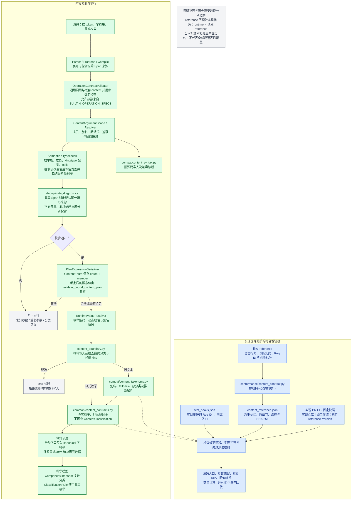
```mermaid
flowchart TB
    subgraph Pipeline["内容校验与执行"]
        Source["源码：裸 token、字符串、显式枚举"] --> Frontend["Parser / Frontend / Compile<br/>展开时保留原始 Span 来源"]
        Frontend --> Names["OperationContractValidator<br/>通用调用与嵌套 content 共用参数名检查<br/>允许参数来自 BUILTIN_OPERATION_SPECS"]
        Names --> Resolver["ContentArgumentScope / Resolver<br/>成员、别名、默认值、遮蔽与赋值快照"]
        Resolver --> Checks["Semantic / Typecheck<br/>枚举族、成员、kind/type 配对、cells<br/>控制流改变值后保留类型并延迟最终值判断"]
        Checks --> Diagnostics["deduplicate_diagnostics<br/>共享 Span 对象确认同一源码来源<br/>不同来源、消息或严重度分别保留"]
        Diagnostics --> Gate{"校验通过？"}
        Gate -->|否| Reject["阻止执行<br/>未知参数 / 重复参数 / 分类错误"]
        Gate -->|是| Plan["PlanExpressionSerializer<br/>ContentEnum 保存 enum + member<br/>绑定后的静态值由 validate_bound_content_plan 复核"]
        Plan -->|非法| Reject
        Plan -->|合法或动态待定| Values["RuntimeValueResolver<br/>枚举解码、动态取值与别名快照"]
        Values --> Boundary["content_boundary.py<br/>物料写入前检查最终分类与容器 kind"]
        Boundary -->|非法| RuntimeReject["MAT 诊断<br/>拒绝受影响的物料写入"]
        Boundary -->|显式枚举| Shared["common/content_contracts.py<br/>真实枚举、只读配对表<br/>不可变 ContentClassification"]
        Boundary -->|旧文本| History["compat/content_taxonomy.py<br/>别名、fallback、原分类及推断属性"]
        History --> Shared
        Shared --> Material["物料记录<br/>分类字段写入 canonical 字符串<br/>保留显式 attrs 和兼容元数据"]
        Material --> Science["科学模型<br/>ComponentSnapshot 提升分类<br/>ClassificationRule 使用共享枚举"]
        Resolver --> LegacySource["compat/content_syntax.py<br/>旧源码准入及兼容诊断"]
    end
    subgraph Conformance["实现仓库维护的符合性证据"]
        Reference["独立 reference<br/>语言行为、诊断契约、Req ID 与验收标准"] --> Extract["conformance/content_contract.py<br/>提取拥有契约的章节"]
        Extract --> Snapshot["content_reference.json<br/>派生契约、原章节、路径与 SHA-256"]
        Hooks["test_hooks.json<br/>实现维护的 Req ID → 测试入口"] --> Checker["检查规范漂移、实现差异与失效测试映射"]
        Snapshot --> Checker
        Shared -.-> Checker
        History -.-> Checker
        Checker --> Evidence["源码入口、参数错误、推荐 role、旧值转换<br/>数量计算、序列化与事件回放"]
        CodeCI["实现 PR CI：固定快照<br/>实现仓库手动工作流：指定 reference revision"] --> Checker
    end
    note["源码兼容与历史记录转换分别维护<br/>reference 不读取实现代码；runtime 不读取 reference<br/>当前机械对照覆盖内容契约，不代表全部规范表已覆盖"]
    classDef stage fill:#dcfce7,stroke:#15803d,color:#14532d;
    classDef evidence fill:#dbeafe,stroke:#2563eb,color:#1e3a8a;
    classDef stop fill:#f3f4f6,stroke:#6b7280,color:#374151;
    class Source,Frontend,Names,Resolver,Checks,Diagnostics,Plan,Values,Boundary,Shared,History,Material,Science,LegacySource stage;
    class Reference,Extract,Snapshot,Hooks,Checker,Evidence,CodeCI evidence;
    class Reject,RuntimeReject,note stop;
```

## 时序图

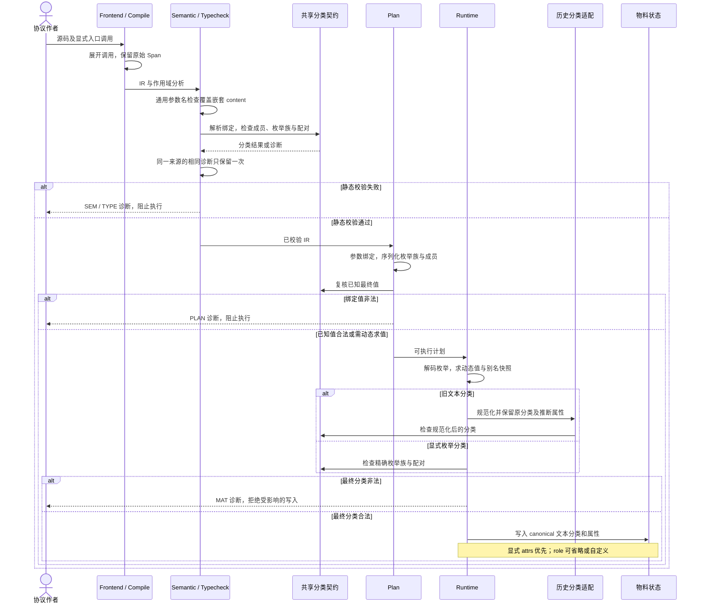
```mermaid
sequenceDiagram
    actor Author as 协议作者
    participant Frontend as Frontend / Compile
    participant Validate as Semantic / Typecheck
    participant Shared as 共享分类契约
    participant Plan as Plan
    participant Runtime as Runtime
    participant Compat as 历史分类适配
    participant Material as 物料状态

    Author->>Frontend: 源码及显式入口调用
    Frontend->>Frontend: 展开调用，保留原始 Span
    Frontend->>Validate: IR 与作用域分析
    Validate->>Validate: 通用参数名检查覆盖嵌套 content
    Validate->>Shared: 解析绑定，检查成员、枚举族与配对
    Shared-->>Validate: 分类结果或诊断
    Validate->>Validate: 同一来源的相同诊断只保留一次
    alt 静态校验失败
        Validate-->>Author: SEM / TYPE 诊断，阻止执行
    else 静态校验通过
        Validate->>Plan: 已校验 IR
        Plan->>Plan: 参数绑定，序列化枚举族与成员
        Plan->>Shared: 复核已知最终值
        alt 绑定值非法
            Plan-->>Author: PLAN 诊断，阻止执行
        else 已知值合法或需动态求值
            Plan->>Runtime: 可执行计划
            Runtime->>Runtime: 解码枚举，求动态值与别名快照
            alt 旧文本分类
                Runtime->>Compat: 规范化并保留原分类及推断属性
                Compat->>Shared: 检查规范化后的分类
            else 显式枚举分类
                Runtime->>Shared: 检查精确枚举族与配对
            end
            alt 最终分类非法
                Runtime-->>Author: MAT 诊断，拒绝受影响的写入
            else 最终分类合法
                Runtime->>Material: 写入 canonical 文本分类和属性
                Note over Runtime, Material: 显式 attrs 优先；role 可省略或自定义
            end
        end
    end
```

## 类图

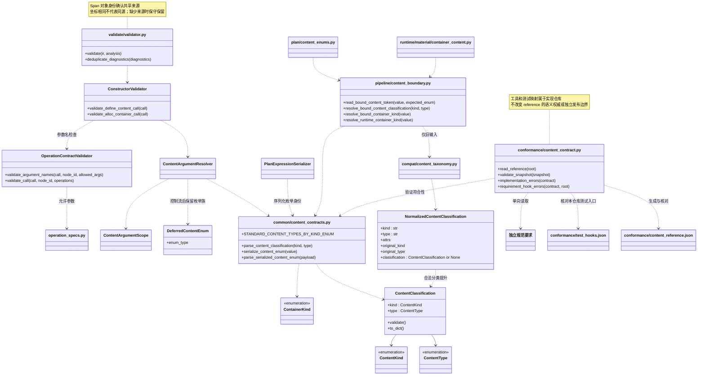
```mermaid
classDiagram
    class OperationContractValidator {
        +validate_argument_names(call, node_id, allowed_args)
        +validate_call(call, node_id, operations)
    }
    class ConstructorValidator {
        +validate_define_content_call(call)
        +validate_alloc_container_call(call)
    }
    class SemanticValidator["validate/validator.py"]
    class SemanticValidator {
        +validate(ir, analysis)
        +deduplicate_diagnostics(diagnostics)
    }
    class BuiltinOperationSpecs["operation_specs.py"]
    ConstructorValidator ..> OperationContractValidator : 参数名检查
    OperationContractValidator ..> BuiltinOperationSpecs : 允许参数
    SemanticValidator ..> ConstructorValidator
    note for SemanticValidator "Span 对象身份确认共享来源<br/>坐标相同不代表同源；缺少来源时保守保留"

    class ContentArgumentResolver
    class ContentArgumentScope
    class DeferredContentEnum {
        +enum_type
    }
    ContentArgumentResolver ..> ContentArgumentScope
    ContentArgumentResolver ..> DeferredContentEnum : 控制流后保留枚举族
    ConstructorValidator ..> ContentArgumentResolver
    class SharedContentContracts["common/content_contracts.py"]
    class SharedContentContracts {
        +parse_content_classification(kind, type)
        +serialize_content_enum(value)
        +parse_serialized_content_enum(payload)
        +STANDARD_CONTENT_TYPES_BY_KIND_ENUM
    }
    class ContentKind {
        <<enumeration>>
    }
    class ContentType {
        <<enumeration>>
    }
    class ContainerKind {
        <<enumeration>>
    }
    class ContentClassification {
        +kind : ContentKind
        +type : ContentType
        +validate()
        +to_dict()
    }
    ContentClassification --> ContentKind
    ContentClassification --> ContentType
    SharedContentContracts ..> ContentClassification
    SharedContentContracts ..> ContainerKind
    ContentArgumentResolver ..> SharedContentContracts

    class PlanExpressionSerializer
    class ContentBoundary["pipeline/content_boundary.py"]
    class ContentBoundary {
        +read_bound_content_token(value, expected_enum)
        +resolve_bound_content_classification(kind, type)
        +resolve_bound_container_kind(value)
        +resolve_runtime_container_kind(value)
    }
    class BoundContentPlanValidator["plan/content_enums.py"]
    class RuntimeContent["runtime/material/container_content.py"]
    class LegacyContentTaxonomy["compat/content_taxonomy.py"]
    class NormalizedContentClassification {
        +kind : str
        +type : str
        +attrs
        +original_kind
        +original_type
        +classification : ContentClassification or None
    }
    PlanExpressionSerializer ..> SharedContentContracts : 序列化枚举身份
    BoundContentPlanValidator ..> ContentBoundary
    RuntimeContent ..> ContentBoundary
    ContentBoundary ..> SharedContentContracts
    ContentBoundary ..> LegacyContentTaxonomy : 仅旧输入
    LegacyContentTaxonomy ..> NormalizedContentClassification
    NormalizedContentClassification ..> ContentClassification : 合法分类提升

    class ContentReferenceChecker["conformance/content_contract.py"]
    class ContentReferenceChecker {
        +read_reference(root)
        +validate_snapshot(snapshot)
        +implementation_errors(contract)
        +requirement_hook_errors(contract, root)
    }
    class ReferenceRequirements["独立规范要求"]
    class ImplementationTestHooks["conformance/test_hooks.json"]
    class DerivedReferenceSnapshot["conformance/content_reference.json"]
    ContentReferenceChecker ..> ReferenceRequirements : 单向读取
    ContentReferenceChecker ..> DerivedReferenceSnapshot : 生成与核对
    ContentReferenceChecker ..> ImplementationTestHooks : 核对本仓库测试入口
    ContentReferenceChecker ..> SharedContentContracts : 验证符合性
    note for ContentReferenceChecker "工具和测试映射属于实现仓库<br/>不改变 reference 的语义权威或独立发布边界"
```

符合性工具与测试映射位于实现仓库的 `conformance/`。`test_hooks.json` 保存本实现的测试入口，reference 只提供要求和验收标准。

| 检查入口 | 用途 |
|---|---|
| `python -m conformance.content_contract --check` | 对照固定规范快照、实现及测试映射；实现 PR CI 使用此入口 |
| `python -m conformance.content_contract --reference-root ../culsma-reference --check` | 对照选定 reference 工作树；实现仓库的 Reference Conformance 手动工作流支持指定 revision |
| `python -m conformance.content_contract --reference-root ../culsma-reference --write` | 从已审阅规范重新生成派生快照；随后运行相应行为测试 |

## 1.0.8 External Enum Contracts

Status: **domain types and DSL/plan/runtime integration implemented; plate geometry resolved after entry binding**. Coordination: [PM #110](https://github.com/culsma/culsma-pm/issues/110).
The integration and local defect diagrams below use only Mermaid class, flowchart, and sequence syntax.
The class diagram is the primary change; flow and sequence describe the boundary integration.

| Boundary | Decision / invariant |
| --- | --- |
| Scope | Closed author-facing enums plus Python extensions for chromatography, stream, requirements and content attrs. Internal discriminators remain outside this change. |
| Baseline | Branch `codex/1.0.8` was fast-forwarded to accepted RC work at `42b562b` before implementation; content contracts and source compatibility are reused. |
| Language ownership | The independent reference owns accepted member spellings, allowed values and compatibility semantics. Closed enum spellings below are implemented and recorded in the owning reference sections; the chromatography Python extension is specified below; stream, requirements and attrs have their own contracts below. |
| Type identity | Validate enum family and member, including through aliases and protocol parameters. Equal serialized text does not make different enum families interchangeable. |
| Compatibility | Existing legal strings and bare tokens pass through a centralized source-compatibility adapter after normal binding resolution. A bound wrong-type value must not fall back to a token. |
| Downstream boundary | Carry validated enum identity through lowering and execution. Serialize using existing field-specific strings; reuse the output's semantic role for keep_source, not its tuple value. Historical-data decoding remains separate from source compatibility. |
| Behavior | Preserve operation-specific quantity membership, customized/schema_ref checks, plate geometry and supported capacity defaults, layout rules, schedule defaults and behavior. |
| Testability | New logical entry points are public and directly testable; acceptance also begins from complete DSL source. |

### Frozen First Delivery: Domain Types

The implemented first delivery owns closed enum definitions and pure parameter contracts in `culsma.domains`, independent of parser, pipeline, runtime and drivers. Existing pipeline imports of program output types remain aliases of the same classes. Source compatibility converts legacy text through `pipeline.compat.external_enums`; domain APIs accept exact enum families only. This foundation was committed as `f14d5a1`. The second delivery adds scoped AST/IR resolution, semantic/type checks, tagged plan values, parameter-bound plan checks and runtime checks before drivers execute.

| Requirement | Invariant / diagnostic boundary | Test hook |
| --- | --- | --- |
| ENUM-DOMAIN | Each domain owns its members and immutable tables; readout allowed sets remain operation-specific | `tests/test_domain_enums.py` |
| ENUM-IDENTITY | Reject another enum family even when its string value compares equal; domain API raises TypeError, unsupported members raise ValueError | `tests/test_domain_enums.py` |
| ENUM-COMPAT | Only the source adapter accepts legacy strings; output roles decode using semantic_role; invalid strings fail | `tests/test_domain_enums.py` |
| ENUM-OWNERS | Existing registries derive vocabulary from domain contracts; existing public output imports retain class identity | `tests/test_domain_enums.py` |
| ENUM-EXTENSION | Closed enums cannot acquire extra members by subclassing. Extensible source classes need domain-specific contracts and separate metadata/execution capabilities; no empty catch-all program base is introduced | tests/test_chromatography_extensions.py, tests/test_stream_vocabulary.py, tests/test_requirement_vocabulary.py, tests/test_content_attribute_vocabulary.py |

| Domain owner | Implemented types / contracts | Existing consumer |
| --- | --- | --- |
| `domains/labware.py` | PlateFormat, geometry and capacity | plate allocation planner |
| `domains/separation.py` | Existing ProgramOutput families, DisruptionMethod, keep_source contract | program registry (backwards-compatible output imports) |
| `domains/readout.py` | ReadoutQuantity, per-operation contracts and schema requirement | readout vocabulary view |
| `domains/agitation.py` | AgitationMode including FLICK | agitation vocabulary view |
| `domains/fractionation.py` | DensityGradientAxis / Order | program registry |
| `domains/scheduling.py` | ScheduleMode and default | plan-time mode resolution |

### Implemented Authoring Surface

The expressions below support direct values, aliases and entry parameters. Actual entry arguments are bound before checking operation/program fields, schedule mode and plate geometry. Plate compilation preserves logical well references; planning checks actual bounds and allocates wells.

| Parameter | Proposed new spelling | Members / restrictions | Current code owner |
| --- | --- | --- | --- |
| `plate.format` | `PlateFormat.WELL_96` | WELL_6, WELL_12, WELL_24, WELL_48, WELL_96, WELL_384; preserve explicit custom rows/cols rules | `domains/labware.py` → `plan/plates.py` |
| `centrifuge_program.keep_source` | `CentrifugeProgramOutput.PELLET` | Reuse existing SUPERNATANT / PELLET; do not create another output vocabulary | `program_registry.py` |
| `img.quantity` | `ReadoutQuantity.FLUORESCENCE` | UV_ABSORBANCE, FLUORESCENCE, COLORIMETRIC, CUSTOMIZED | `validate/statement_contracts.py` |
| `ecp.quantity` | `ReadoutQuantity.PH` | PH, CONDUCTIVITY, DISSOLVED_OXYGEN, ORP, CUSTOMIZED | `validate/statement_contracts.py` |
| `phy.quantity` | `ReadoutQuantity.TEMPERATURE` | TEMPERATURE, PRESSURE, FLOW_RATE, MASS, VOLUME, HUMIDITY, CURRENT, CUSTOMIZED | `validate/statement_contracts.py` |
| `agit.mode` | `AgitationMode.VORTEX` | VORTEX, INVERT, FLICK, SHAKE, STIR; FLICK preserved from the reconciled RC baseline | `validate/statement_contracts.py` |
| `disrupt_program.method` | `DisruptionMethod.SONICATION` | MECHANICAL, SONICATION, SHEAR_HOMOGENIZATION, HIGH_PRESSURE_DISRUPTION, BEAD_IMPACT | `program_registry.py` |
| `density_gradient_program.axis` | `DensityGradientAxis.DENSITY` | DENSITY | `program_registry.py` |
| `density_gradient_program.order` | `DensityGradientOrder.TOP_TO_BOTTOM` | TOP_TO_BOTTOM, BOTTOM_TO_TOP | `program_registry.py` |
| `schedule.mode` | `ScheduleMode.CONTINUOUS` | DISCRETE, CONTINUOUS; preserve omitted-mode default DISCRETE | `compile/schedule.py`, `plan/static_eval.py` |

### Implemented Class Relationships

IMPLEMENTED marks delivered domain types; EXTEND marks the integration paths added in the second delivery; EXISTING marks a reusable output type. ExternalEnumContracts denotes `common/enum_parameters.py::EnumParameter`; SourceCompatibility denotes `pipeline/compat/external_enums.py`. ExternalInputResolver owns scope resolution; external_boundary owns plan/runtime parameter checks. ExternalEnum plan tags preserve family/member identity across JSON; domain wire values remain stable. No common extensible base class is introduced in this phase.

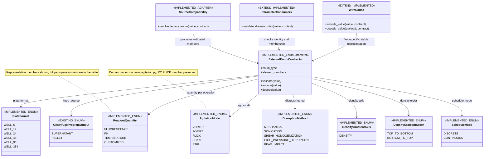
```mermaid
classDiagram
    class PlateFormat {
        <<IMPLEMENTED_ENUM>>
        WELL_6
        WELL_12
        WELL_24
        WELL_48
        WELL_96
        WELL_384
    }
    class CentrifugeProgramOutput {
        <<EXISTING_ENUM>>
        SUPERNATANT
        PELLET
    }
    class ReadoutQuantity {
        <<IMPLEMENTED_ENUM>>
        FLUORESCENCE
        PH
        TEMPERATURE
        CUSTOMIZED
    }
    class AgitationMode {
        <<IMPLEMENTED_ENUM>>
        VORTEX
        INVERT
        FLICK
        SHAKE
        STIR
    }
    class DisruptionMethod {
        <<IMPLEMENTED_ENUM>>
        MECHANICAL
        SONICATION
        SHEAR_HOMOGENIZATION
        HIGH_PRESSURE_DISRUPTION
        BEAD_IMPACT
    }
    class DensityGradientAxis {
        <<IMPLEMENTED_ENUM>>
        DENSITY
    }
    class DensityGradientOrder {
        <<IMPLEMENTED_ENUM>>
        TOP_TO_BOTTOM
        BOTTOM_TO_TOP
    }
    class ScheduleMode {
        <<IMPLEMENTED_ENUM>>
        DISCRETE
        CONTINUOUS
    }
    class ExternalEnumContracts {
        <<IMPLEMENTED_EnumParameter>>
        +enum_type
        +allowed_members
        +validate(value)
        +encode(value)
        +decode(value)
    }
    class SourceCompatibility {
        <<IMPLEMENTED_ADAPTER>>
        +resolve_legacy_enum(value, contract)
    }
    class ParameterConsumers {
        <<EXTEND_IMPLEMENTED>>
        +validate_domain_rules(value, context)
    }
    class WireCodec {
        <<EXTEND_IMPLEMENTED>>
        +encode_value(value, contract)
        +decode_value(payload, contract)
    }
    ExternalEnumContracts --> PlateFormat : plate.format
    ExternalEnumContracts --> CentrifugeProgramOutput : keep_source
    ExternalEnumContracts --> ReadoutQuantity : quantity per operation
    ExternalEnumContracts --> AgitationMode : agit.mode
    ExternalEnumContracts --> DisruptionMethod : disrupt.method
    ExternalEnumContracts --> DensityGradientAxis : density axis
    ExternalEnumContracts --> DensityGradientOrder : density order
    ExternalEnumContracts --> ScheduleMode : schedule.mode
    SourceCompatibility --> ExternalEnumContracts : produces validated members
    ParameterConsumers --> ExternalEnumContracts : checks identity and membership
    WireCodec --> ExternalEnumContracts : field-specific stable representation
    note for ReadoutQuantity "Representative members shown; full per-operation sets are in the table"
    note for AgitationMode "Domain owner: domains/agitation.py; RC FLICK member preserved"
```

### Plate 绑定与展开：已接受的实现契约

编译只记录板描述和逻辑孔位引用（`IRPlateWellRef`）；矩形选择器的文本顺序和重复检查不依赖板规格。实际行列检查、默认容量和 `AllocContainer` 生成均在计划参数绑定之后执行。默认值不得覆盖显式实参；失败时不返回可执行计划。所有新逻辑入口保持公开并可直接测试。

| Req ID | 不变量与归属 | 验收入口 |
| --- | --- | --- |
| PLATE-BIND | 同一 IR 按实际调用参数解析板；显式实参优先于默认值 | `tests/test_plate_plan_binding.py` |
| PLATE-BOUNDS | 计划检查实际规格下的孔位；越界产生 `PLAN_PLATE_SELECTOR_INVALID` 并清空可执行计划 | `tests/test_plate_plan_binding.py` |
| PLATE-TYPE | 源码可判定的错误类型由 typecheck 报告；绑定后的格式、布局或容量错误归计划诊断 | `tests/test_plate_plan_binding.py` |
| PLATE-COMPAT | 旧字符串与枚举等价；自定义 rows/cols、显式容量、24 孔默认容量、选择顺序、重复引用身份保持一致 | `tests/test_plate_plan_binding.py` |
| PLATE-IR | compile 不生成 plate well 的 AllocContainer；plan 生成与既有运行模型兼容的 AllocContainer | `tests/test_ir_compiler.py`, `tests/test_plate_plan_binding.py` |

### Plate 参数绑定与孔位分配：已实现

绿色标记本次调整的边界；格式在计划阶段确定，运行阶段执行已分配的孔位操作。

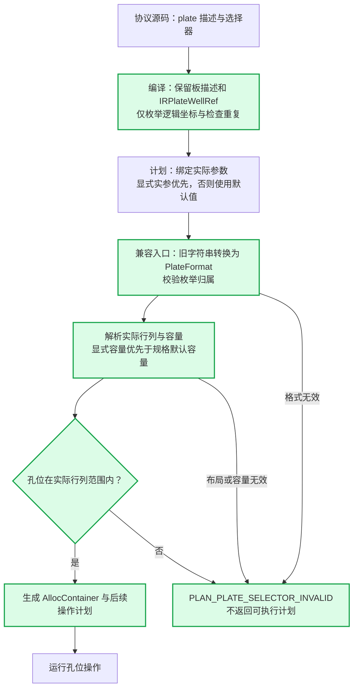
```mermaid
flowchart TB
    Source["协议源码：plate 描述与选择器"] --> Compile["编译：保留板描述和 IRPlateWellRef<br/>仅枚举逻辑坐标与检查重复"]
    Compile --> Bind["计划：绑定实际参数<br/>显式实参优先，否则使用默认值"]
    Bind --> Format["兼容入口：旧字符串转换为 PlateFormat<br/>校验枚举归属"]
    Format --> Geometry["解析实际行列与容量<br/>显式容量优先于规格默认容量"]
    Geometry --> Bounds{"孔位在实际行列范围内？"}
    Bounds -->|是| Allocate["生成 AllocContainer 与后续操作计划"]
    Bounds -->|否| Error["PLAN_PLATE_SELECTOR_INVALID<br/>不返回可执行计划"]
    Format -->|格式无效| Error
    Geometry -->|布局或容量无效| Error
    Allocate --> Run["运行孔位操作"]
    classDef changed fill:#dcfce7,stroke:#16a34a,stroke-width:2px
    class Compile,Format,Geometry,Bounds,Allocate,Error changed
```

### External boundary 职责收拢：已实现

编解码和参数规范化已由独立类承担；计划遍历和诊断已迁入 `plan/external_parameters.py`。绿色为本次调整职责，蓝色为保留的契约和兼容入口。Plate 侧结构见 [Plan 类图与时序图](./plan_module_diagrams.md#plate-职责收拢已实现)。

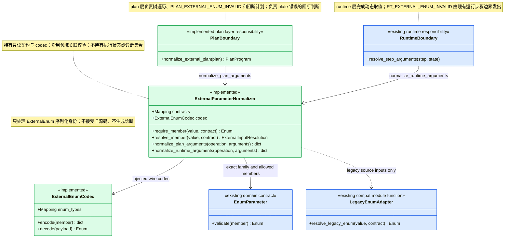
```mermaid
classDiagram
    class ExternalEnumCodec {
        <<implemented>>
        +Mapping enum_types
        +encode(member) dict
        +decode(payload) Enum
    }
    class ExternalParameterNormalizer {
        <<implemented>>
        +Mapping contracts
        +ExternalEnumCodec codec
        +require_member(value, contract) Enum
        +resolve_member(value, contract) ExternalInputResolution
        +normalize_plan_arguments(operation, arguments) dict
        +normalize_runtime_arguments(operation, arguments) dict
    }
    class EnumParameter {
        <<existing domain contract>>
        +validate(member) Enum
    }
    class LegacyEnumAdapter {
        <<existing compat module function>>
        +resolve_legacy_enum(value, contract) Enum
    }
    class PlanBoundary {
        <<implemented plan layer responsibility>>
        +normalize_external_plan(plan) PlanProgram
    }
    class RuntimeBoundary {
        <<existing runtime responsibility>>
        +resolve_step_arguments(step, state)
    }
    ExternalParameterNormalizer --> ExternalEnumCodec : injected wire codec
    ExternalParameterNormalizer --> EnumParameter : exact family and allowed members
    ExternalParameterNormalizer ..> LegacyEnumAdapter : legacy source inputs only
    PlanBoundary --> ExternalParameterNormalizer : normalize_plan_arguments
    RuntimeBoundary --> ExternalParameterNormalizer : normalize_runtime_arguments
    note for ExternalEnumCodec "只处理 ExternalEnum 序列化身份；不接受旧源码、不生成诊断"
    note for ExternalParameterNormalizer "持有只读契约与 codec；沿用领域关联校验；不持有执行状态或诊断集合"
    note for PlanBoundary "plan 层负责树遍历、PLAN_EXTERNAL_ENUM_INVALID 和阻断计划；负责 plate 错误的阻断判断"
    note for RuntimeBoundary "runtime 层完成动态取值；RT_EXTERNAL_ENUM_INVALID 由现有运行步骤边界发出"
    style ExternalEnumCodec fill:#dcfce7,stroke:#16a34a
    style ExternalParameterNormalizer fill:#dcfce7,stroke:#16a34a
    style PlanBoundary fill:#dcfce7,stroke:#16a34a
    style EnumParameter fill:#dbeafe,stroke:#2563eb
    style LegacyEnumAdapter fill:#dbeafe,stroke:#2563eb
    style RuntimeBoundary fill:#dbeafe,stroke:#2563eb
```

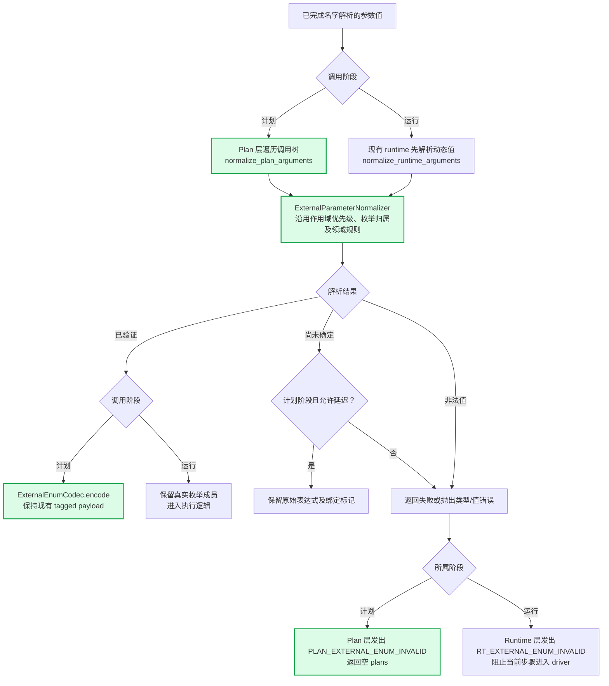
```mermaid
flowchart TB
    Start["已完成名字解析的参数值"] --> Phase{"调用阶段"}
    Phase -->|计划| Plan["Plan 层遍历调用树<br/>normalize_plan_arguments"]
    Phase -->|运行| Runtime["现有 runtime 先解析动态值<br/>normalize_runtime_arguments"]
    Plan --> Resolve["ExternalParameterNormalizer<br/>沿用作用域优先级、枚举归属及领域规则"]
    Runtime --> Resolve
    Resolve --> State{"解析结果"}
    State -->|已验证| Output{"调用阶段"}
    Output -->|计划| Encode["ExternalEnumCodec.encode<br/>保持现有 tagged payload"]
    Output -->|运行| Member["保留真实枚举成员<br/>进入执行逻辑"]
    State -->|尚未确定| Deferred{"计划阶段且允许延迟？"}
    Deferred -->|是| Keep["保留原始表达式及绑定标记"]
    Deferred -->|否| Error["返回失败或抛出类型/值错误"]
    State -->|非法值| Error
    Error --> Owner{"所属阶段"}
    Owner -->|计划| PlanError["Plan 层发出 PLAN_EXTERNAL_ENUM_INVALID<br/>返回空 plans"]
    Owner -->|运行| RuntimeError["Runtime 层发出 RT_EXTERNAL_ENUM_INVALID<br/>阻止当前步骤进入 driver"]
    classDef planned fill:#dcfce7,stroke:#16a34a,stroke-width:2px
    class Plan,Resolve,Encode,PlanError planned
```

| Req ID | 冻结边界 / 迁移 | 验收入口 |
| --- | --- | --- |
| CLASS-ENUM-CODEC | `serialize/deserialize_external_enum` → codec；tagged payload 与错误成员拒绝行为不变 | `tests/test_external_enum_frontend.py`：保留 JSON 回归，`tests/test_external_boundary_classes.py` 验证 codec 公开接口 |
| CLASS-ENUM-NORMALIZE | `resolve_bound_external_enum` 与参数规范化 → normalizer；计划与运行使用独立公开入口；复用现有 resolution 状态，不新增另一套状态枚举 | `tests/test_external_enum_inputs.py`、`tests/test_external_enum_frontend.py`：作用域遮蔽、别名、延迟值与错误族 |
| CLASS-ENUM-OWNER | codec / normalizer 不引用 `PlanProgram` 或输出阶段诊断；计划树遍历及无可执行计划策略归 plan；runtime 负责运行阶段错误 | `tests/test_external_enum_frontend.py`：错误诊断、空计划、driver 前拦截 |
| CLASS-ENUM-COMPAT | 旧文本转换保留在 `compat/external_enums.py`；领域约束保留在各自 domain；已有 `ExternalInputResolver` 继续负责源码作用域解析 | `tests/test_domain_enums.py`、`tests/test_external_enum_inputs.py`、`tests/test_external_enum_frontend.py` |

已完成板描述及分配整理、codec / normalizer 接入和阶段诊断归属迁移。所有有逻辑的方法公开；不引入空泛基类，不改变枚举扩展边界，不将纯工具函数机械改为静态方法。

### Resolution Flow — Implemented Boundary Changes

This is a cross-stage value-resolution flow, not a change to the statement-handler lifecycle or a claim that semantic validation runs typecheck.

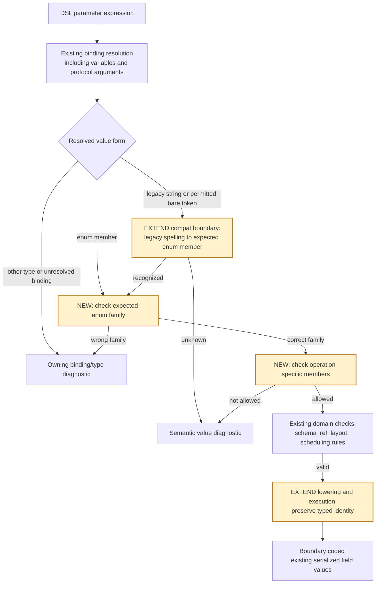
```mermaid
flowchart TB
    Source["DSL parameter expression"] --> Bind["Existing binding resolution<br/>including variables and protocol arguments"]
    Bind --> Shape{"Resolved value form"}
    Shape -->|enum member| Identity["NEW: check expected enum family"]
    Shape -->|legacy string or permitted bare token| Compat["EXTEND compat boundary:<br/>legacy spelling to expected enum member"]
    Shape -->|other type or unresolved binding| TypeError["Owning binding/type diagnostic"]
    Compat -->|recognized| Identity
    Compat -->|unknown| ValueError["Semantic value diagnostic"]
    Identity -->|wrong family| TypeError
    Identity -->|correct family| Allowed["NEW: check operation-specific members"]
    Allowed -->|not allowed| ValueError
    Allowed -->|allowed| Domain["Existing domain checks:<br/>schema_ref, layout, scheduling rules"]
    Domain -->|valid| Lower["EXTEND lowering and execution:<br/>preserve typed identity"]
    Lower --> Wire["Boundary codec:<br/>existing serialized field values"]
    classDef planned fill:#fff3cd,stroke:#b7791f,stroke-width:2px
    class Identity,Compat,Allowed,Lower planned
```

### Call Sequence — Integration and Verification

Participants denote responsibilities across the frontend and execution pipeline; detailed diagnostic IDs and stage hooks are frozen before code changes. Each earliest-decidable failure terminates this value's path without duplicate downstream diagnostics.

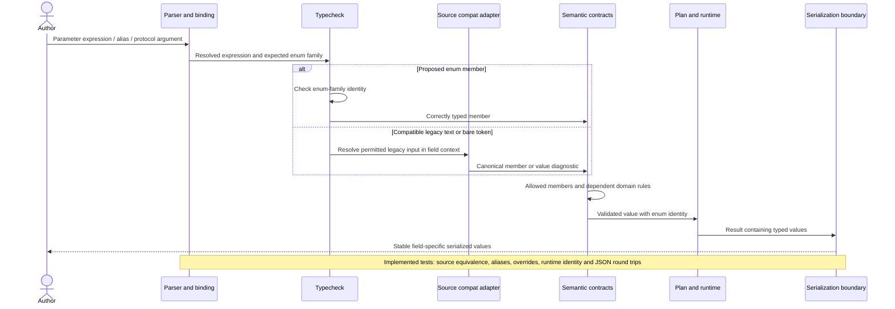
```mermaid
sequenceDiagram
    actor Author
    participant Frontend as Parser and binding
    participant Types as Typecheck
    participant Compat as Source compat adapter
    participant Semantic as Semantic contracts
    participant Exec as Plan and runtime
    participant Codec as Serialization boundary
    Author->>Frontend: Parameter expression / alias / protocol argument
    Frontend->>Types: Resolved expression and expected enum family
    alt Proposed enum member
        Types->>Types: Check enum-family identity
        Types->>Semantic: Correctly typed member
    else Compatible legacy text or bare token
        Types->>Compat: Resolve permitted legacy input in field context
        Compat->>Semantic: Canonical member or value diagnostic
    end
    Semantic->>Semantic: Allowed members and dependent domain rules
    Semantic->>Exec: Validated value with enum identity
    Exec->>Codec: Result containing typed values
    Codec-->>Author: Stable field-specific serialized values
    Note over Frontend,Codec: Implemented tests: source equivalence, aliases, overrides, runtime identity and JSON round trips
```

### Delivery Order and Acceptance Hooks

| Order / requirement | Deliverable | Planned complete-source test hook |
| --- | --- | --- |
| 0 / ENUM-BASELINE | RC baseline reconciled; freeze source reference/call contracts and exact diagnostic ownership before DSL integration | `test_external_enum_reference_conformance` |
| 1 / ENUM-PLATE | Plate format, geometry/selection and compatibility | `test_plate_format_enum_frontend_equivalence` |
| 2 / ENUM-OUTPUT | keep_source reuses centrifuge outputs, rejects other output families | `test_keep_source_enum_frontend_contract` |
| 3 / ENUM-READOUT | Readout enums with per-operation subsets and customized schema rules | `test_readout_quantity_enum_frontend_contract` |
| 4 / ENUM-MODES | Agitation, disruption, density axis/order and scheduling | `test_closed_mode_enums_frontend_contract` |
| Each / ENUM-IDENTITY | Direct members, aliases, protocol parameters, wrong families/members and binding shadowing | `test_external_enum_binding_and_diagnostics` |
| Each / ENUM-WIRE | Old/new execution equivalence, stable serialized values and historical-data decoding | `test_external_enum_runtime_roundtrip` |

The original acceptance hooks above describe the overall target. Implemented evidence is in `tests/test_external_enum_inputs.py` and `tests/test_external_enum_frontend.py`: scoped resolution, alias snapshots, old/new execution equivalence, operation subsets, entry overrides, runtime family rejection, JSON round trips and shadowed legacy names. `TYPE_EXTERNAL_ENUM_MISMATCH` owns parameter shape/family errors; existing semantic value codes remain in use; `PLAN_EXTERNAL_ENUM_INVALID` and `RT_EXTERNAL_ENUM_INVALID` guard later-bound values.

Plate geometry is resolved after entry binding. Regression coverage checks both old-text and enum arguments, overriding defaults, actual bounds, custom layouts and runtime capacity. Chromatography now has Python extension bases and explicit scoped registration as described below. Stream, constraints and attrs now use separate domain vocabularies and scoped Python extensions; their implemented contracts are shown below. Source-level class declarations are outside the selected architecture.

 Wrong value shape/family belongs to typecheck; unresolved references belong to binding; disallowed members and dependent rules belong to semantic validation. Malformed plate selector syntax remains a compile error; bound plate layout failures belong to planning; operation-specific member errors keep their semantic diagnostic codes. Reuse existing diagnostic identities where applicable and settle exact mappings before implementation. Promote accepted language rules into existing owning reference sections without code dependencies.


## 开放词汇扩展：色谱契约

chromatography 的 axis/order、stream、constraint 与 attrs 均已采用领域类扩展。已选择正式 Python 扩展入口：宿主声明领域子类并显式安装注册表，Culsma 引用成员；不新增 class/type 语法。

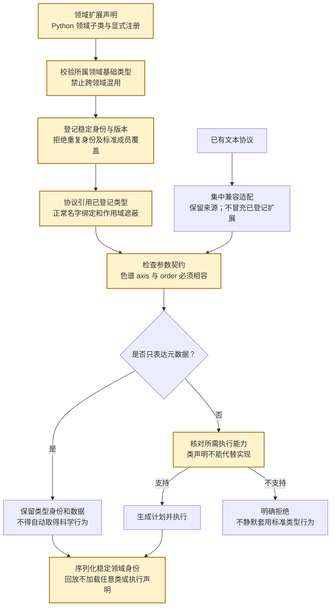
```mermaid
flowchart TB
    Declaration["领域扩展声明<br/>Python 领域子类与显式注册"] --> Family["校验所属领域基础类型<br/>禁止跨领域混用"]
    Family --> Identity["登记稳定身份与版本<br/>拒绝重复身份及标准成员覆盖"]
    Identity --> Reference["协议引用已登记类型<br/>正常名字绑定和作用域遮蔽"]
    Reference --> Contract["检查参数契约<br/>色谱 axis 与 order 必须相容"]
    Legacy["已有文本协议"] --> Compat["集中兼容适配<br/>保留来源；不冒充已登记扩展"]
    Compat --> Contract
    Contract --> Usage{"是否只表达元数据？"}
    Usage -->|是| Metadata["保留类型身份和数据<br/>不得自动取得科学行为"]
    Usage -->|否| Capability["核对所需执行能力<br/>类声明不能代替实现"]
    Capability -->|支持| Execute["生成计划并执行"]
    Capability -->|不支持| Reject["明确拒绝<br/>不静默套用标准类型行为"]
    Metadata --> Wire["序列化稳定领域身份<br/>回放不加载任意类或执行声明"]
    Execute --> Wire
    classDef planned fill:#fff3cd,stroke:#b7791f,stroke-width:2px
    class Declaration,Family,Identity,Reference,Contract,Capability,Wire planned
```

| 语法范围 | 当前实现 | 语义约束 |
| --- | --- | --- |
| 1：chromatography axis/order | fractionation.py 声明 axis/order 类型及相容性规则；reference §6.3.13 保留扩展边界 | 独立的色谱领域基础类型；标准成员与扩展类型共同受 axis/order 相容性约束；不复用密度梯度闭合枚举 |
| 2：stream.unit | stream.py 声明观察单位类型；运行结果保留 unit_kind 与扩展身份 | 观察单位独立身份；扩展单位不得自动继承 single_cell 的展示或科学解释 |
| 3：constraint | constraints.py 声明 requirement 类型及 RequirementSpec；未知声明沿用既有诊断 | 保留既有标准语法；新声明必须明确作用域、冲突与执行支持，不能把任意字符串当成约束实现 |
| 4：attrs.role/state/bead_property | content.py 声明三个属性的类型契约；attrs 保持开放 | 标准/扩展元数据不能凭名称获得物理状态或材料行为；不封闭整个 attrs；不混用 program 输出角色 |

| Req ID | 共同不变量 | 验收要求 |
| --- | --- | --- |
| EXT-FAMILY | 每个语法领域拥有基础类型；不建立万能业务基类 | 拒绝跨领域类、未登记类型、重复身份与覆盖标准成员 |
| EXT-COMPAT | 旧文本兼容规则集中；新类扩展与历史未分类值分开 | 源码入口验证旧协议结果不变，拼写错误不提升成已登记类 |
| EXT-CAPABILITY | 元数据声明与可执行能力分开 | 声明成功但执行能力缺失时明确拒绝；不得自动调用任意用户代码 |
| EXT-IDENTITY | 绑定、计划及运行保留领域身份 | 别名、实参覆盖、错误族、序列化和回放端到端测试 |

色谱的声明引用、稳定身份和兼容策略已融入 reference §6.3.13，诊断与测试对应如下；stream、constraint 和 attrs 的已实现契约分别列于后文。不支持 Culsma 类声明，也不把类型注册当作自定义执行程序。

### Chromatography Python 扩展契约：已实现

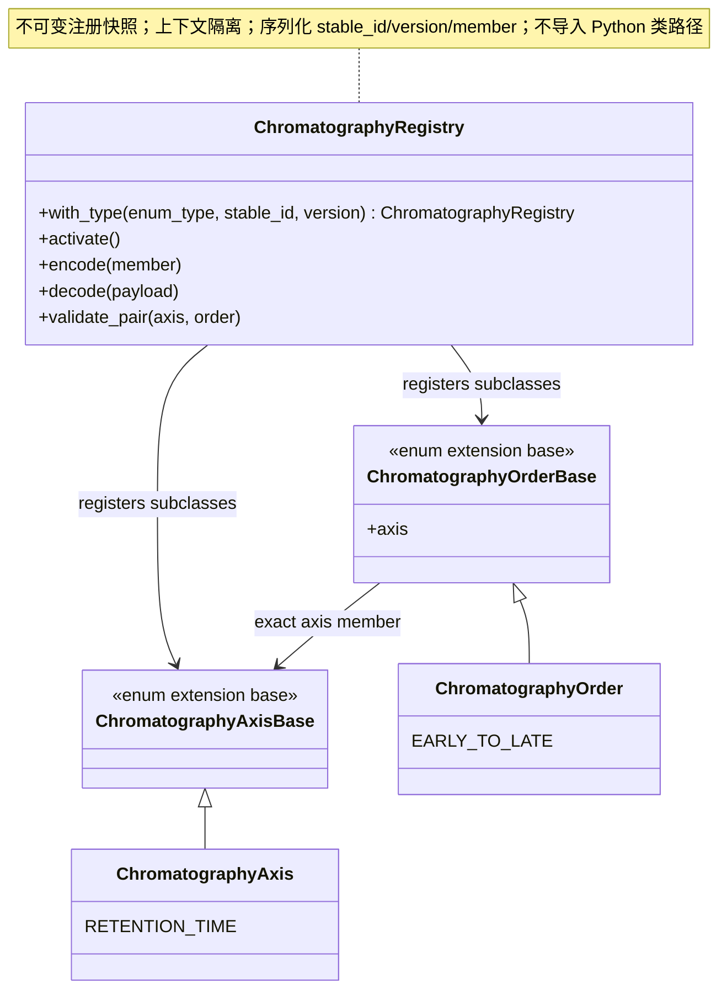
```mermaid
classDiagram
    class ChromatographyAxisBase {
        <<enum extension base>>
    }
    class ChromatographyOrderBase {
        <<enum extension base>>
        +axis
    }
    class ChromatographyAxis {
        RETENTION_TIME
    }
    class ChromatographyOrder {
        EARLY_TO_LATE
    }
    ChromatographyAxisBase <|-- ChromatographyAxis
    ChromatographyOrderBase <|-- ChromatographyOrder
    class ChromatographyRegistry {
        +with_type(enum_type, stable_id, version) ChromatographyRegistry
        +activate()
        +encode(member)
        +decode(payload)
        +validate_pair(axis, order)
    }
    ChromatographyRegistry --> ChromatographyAxisBase : registers subclasses
    ChromatographyRegistry --> ChromatographyOrderBase : registers subclasses
    ChromatographyOrderBase --> ChromatographyAxisBase : exact axis member
    note for ChromatographyRegistry "不可变注册快照；上下文隔离；序列化 stable_id/version/member；不导入 Python 类路径"
```

| Req ID | 决定 / 诊断归属 | 测试入口 |
| --- | --- | --- |
| CHROMA-REGISTER | 不修改已有枚举；继承领域空基类声明新枚举族；注册明确 stable_id/version；拒绝重复身份、覆盖内置类型、错误族、未注册轴、重复 wire 值；注册 API 抛 TypeError/ValueError | tests/test_chromatography_extensions.py |
| CHROMA-SCOPE | 注册表以不可变快照激活；作用域退出恢复，不污染其它编译/运行；正常变量绑定优先于类型名称 | tests/test_chromatography_frontend.py |
| CHROMA-COMPAT | 标准 retention_time/early_to_late 转标准成员；其它历史文本保持文本，不自动注册为扩展；不收紧历史文本对；含显式扩展时不得用未知文本绕过轴/方向匹配 | tests/test_chromatography_frontend.py |
| CHROMA-TYPE | 不同领域归 TYPE_EXTERNAL_ENUM_MISMATCH；错误成员和轴/方向组合归 SEM_INVALID_PROGRAM_ARG_VALUE；动态值在 PLAN_EXTERNAL_ENUM_INVALID / RT_EXTERNAL_ENUM_INVALID 复核 | tests/test_chromatography_frontend.py |
| CHROMA-WIRE | ChromatographyEnum 载荷只含领域、稳定身份、版本、成员；恢复需预安装同身份注册；未知版本明确失败，不动态 import；源码类名不作为 wire 身份 | tests/test_chromatography_extensions.py |
| CHROMA-EXEC | 标准词汇沿用现有 fractionation；扩展仅描述轴/方向，不新增分离算法；driver 显式声明支持的稳定类型身份，缺失时 RT_DRIVER_REQUIREMENT_UNSUPPORTED，执行前拒绝 | tests/test_chromatography_frontend.py |

已按上述 Req ID 贯通 source、alias、default、entry override、plan JSON 与 runtime；同领域子类可赋给同领域局部变量，跨领域赋值仍拒绝；控制流中的绑定标记保留至运行求值。开放 attrs、stream 与 constraint 已按各自领域完成接入，见下方实施契约。

#### Python 扩展安装与 Culsma 引用

```python
import culsma.enum_services  # assemble default extension services
from culsma.domains.fractionation import (
    ChromatographyAxisBase, ChromatographyOrderBase,
    STANDARD_CHROMATOGRAPHY_REGISTRY,
)

class LabAxis(ChromatographyAxisBase):
    ELUTION_VOLUME = "elution_volume"

class LabOrder(ChromatographyOrderBase):
    SMALL_TO_LARGE = ("small_to_large", LabAxis.ELUTION_VOLUME)

registry = (
    STANDARD_CHROMATOGRAPHY_REGISTRY
    .with_type(LabAxis, "example.chromatography.axis", version=1)
    .with_type(LabOrder, "example.chromatography.order", version=1)
)
# 在 with registry.activate(): 作用域内调用现有编译、校验、计划和运行 API。
```

已安装上述注册表后，协议使用现有成员表达式：

```culsma
protocol T(sample) {
    let fractions = frac(
        sample = sample,
        program = chromatography_program(
            axis = LabAxis.ELUTION_VOLUME,
            order = LabOrder.SMALL_TO_LARGE,
            bins = 8
        )
    );
}
```

| 使用边界 | 当前规则 |
| --- | --- |
| 安装 | 宿主显式加载扩展代码，并以不可变注册表激活上下文；退出自动恢复；Culsma import 不自动加载 Python |
| 身份与版本 | 每个 stable_id 当前仅安装一个版本；升级后回放需安装原版本；类名可变，稳定 ID、版本与成员名才是持久化身份 |
| driver 接入 | 可选属性 `supported_chromatography_types` 是 `(stable_id, version)` 的集合；默认空集，需同时支持扩展轴和方向 |
| 执行含义 | 扩展声明只增加轴和方向描述；沿用既有 frac 物料处理，不声称新增色谱分离科学算法；设备行为由明确支持该身份的 driver 提供 |
| 兼容 | 任意历史文本仍保留文本；只有标准词汇自动转换；文本不能代替已注册扩展身份；`pipeline/compat/external_enums.py` 独占该转换 |
| 验证 | `tests/test_chromatography_extensions.py` 与 `tests/test_chromatography_frontend.py` 覆盖身份、作用域、配对、动态赋值、JSON 回放和 driver 前拦截 |

### Program 字段与关联规则统一入口：已实现

各语法模块以 CALL_PARAMETER_CONTRACTS 声明调用参数契约，enum_services.py 以同名表汇总后供 ProgramSpec 与边界层共用；PARAMETER_CONTRACTS 是按（调用名、参数名）派生的字段索引，PARAMETER_ENUM_TYPES 是枚举类型索引。前端解析字段值并负责 SEM 诊断，计划/运行规范化负责各自诊断。领域规则只接收已解析值及参数存在集合，依赖值未确定时延迟，不读取 AST、IR 或诊断对象。

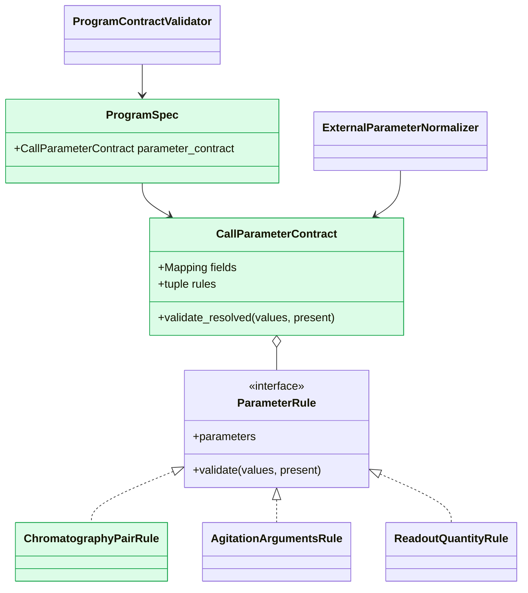
```mermaid
classDiagram
    class ProgramSpec {
        +CallParameterContract parameter_contract
    }
    class CallParameterContract {
        +Mapping fields
        +tuple rules
        +validate_resolved(values, present)
    }
    class ParameterRule {
        <<interface>>
        +parameters
        +validate(values, present)
    }
    class ChromatographyPairRule
    class AgitationArgumentsRule
    class ReadoutQuantityRule
    ProgramSpec --> CallParameterContract
    CallParameterContract o-- ParameterRule
    ParameterRule <|.. ChromatographyPairRule
    ParameterRule <|.. AgitationArgumentsRule
    ParameterRule <|.. ReadoutQuantityRule
    ProgramContractValidator --> ProgramSpec
    ExternalParameterNormalizer --> CallParameterContract
    style CallParameterContract fill:#dcfce7,stroke:#16a34a
    style ChromatographyPairRule fill:#dcfce7,stroke:#16a34a
    style ProgramSpec fill:#dcfce7,stroke:#16a34a
```

| Req ID | 不变量 / 诊断 | 验收 |
| --- | --- | --- |
| PROGRAM-CONTRACT | 字段契约与关联规则只有一份登记；ProgramSpec 和边界层复用；不按 program 名称分支 | tests/test_program_parameter_contracts.py |
| PROGRAM-DEFER | 只执行依赖已解析的规则；未知值延迟，但已知错误仍报告 | tests/test_chromatography_frontend.py |
| PROGRAM-DIAG | 错误类型保留 TYPE；非法成员与配对保留 SEM_INVALID_PROGRAM_ARG_VALUE；计划/运行诊断不变 | tests/test_chromatography_frontend.py、tests/test_external_enum_frontend.py |

## 1.0.8 剩余外部词汇：stream → constraint → attrs

三组均纳入本版本类型化范围；只整理标准类型、领域扩展与兼容边界，不新增科学解释或设备能力。三组已按 stream、constraint、attrs 顺序实现；绿色标记本批新增边界。

### Stream 观察单位：已实现的领域契约

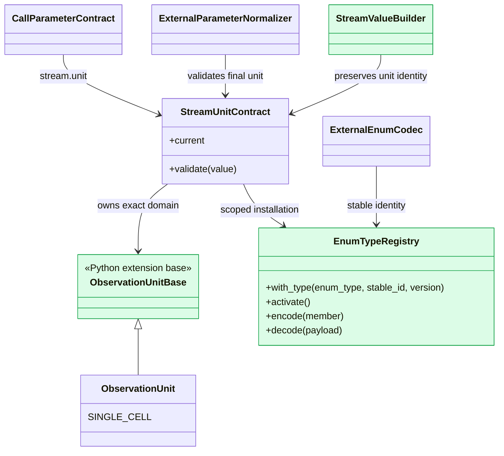
```mermaid
classDiagram
    class ObservationUnitBase {
        <<Python extension base>>
    }
    class ObservationUnit {
        SINGLE_CELL
    }
    ObservationUnitBase <|-- ObservationUnit
    class StreamUnitContract {
        +current
        +validate(value)
    }
    class EnumTypeRegistry {
        +with_type(enum_type, stable_id, version)
        +activate()
        +encode(member)
        +decode(payload)
    }
    StreamUnitContract --> ObservationUnitBase : owns exact domain
    StreamUnitContract --> EnumTypeRegistry : scoped installation
    CallParameterContract --> StreamUnitContract : stream.unit
    ExternalEnumCodec --> EnumTypeRegistry : stable identity
    ExternalParameterNormalizer --> StreamUnitContract : validates final unit
    StreamValueBuilder --> StreamUnitContract : preserves unit identity
    style ObservationUnitBase fill:#dcfce7,stroke:#16a34a
    style EnumTypeRegistry fill:#dcfce7,stroke:#16a34a
    style StreamValueBuilder fill:#dcfce7,stroke:#16a34a
```

| Req ID | 不变量 / 诊断归属 | 测试入口 |
| --- | --- | --- |
| STREAM-TYPE | 标准 ObservationUnit.SINGLE_CELL；扩展继承 ObservationUnitBase；错误族归 TYPE_EXTERNAL_ENUM_MISMATCH，未知成员归 SEM_INVALID_EXTERNAL_PARAMETER | tests/test_stream_vocabulary.py |
| STREAM-COMPAT | single_cell 旧词转标准类型；未知历史文本原样保留，不自动成为扩展；sample、panel、观察数据不变 | tests/test_stream_vocabulary.py、tests/test_cli_results.py |
| STREAM-BIND | 成员、别名、参数、控制流与名称遮蔽沿用现有解析；绑定后 PLAN_EXTERNAL_ENUM_INVALID，运行最终值错误 RT_EXTERNAL_ENUM_INVALID | tests/test_stream_vocabulary.py |
| STREAM-WIRE | 稳定领域 ID/version/member，不使用 Python 类路径；作用域退出不泄漏；恢复未知身份失败 | tests/test_stream_vocabulary.py |
| STREAM-RESULT | unit_kind 是既有结果字段；扩展额外保留 unit_type 身份及其派生 unit_ref 身份；不凭单位名称继承 single_cell 行为，不改变 seeded observation 的内容 | tests/test_stream_vocabulary.py |

### Constraint 类型化：已实现的领域契约

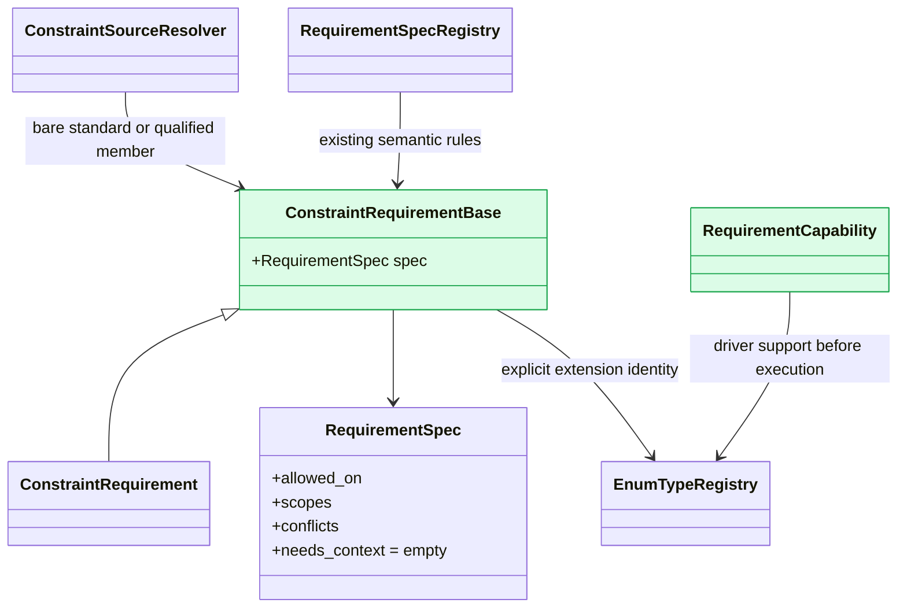
```mermaid
classDiagram
    class ConstraintRequirementBase {
        +RequirementSpec spec
    }
    class ConstraintRequirement
    ConstraintRequirementBase <|-- ConstraintRequirement
    class RequirementSpec {
        +allowed_on
        +scopes
        +conflicts
        +needs_context = empty
    }
    ConstraintRequirementBase --> RequirementSpec
    ConstraintRequirementBase --> EnumTypeRegistry : explicit extension identity
    ConstraintSourceResolver --> ConstraintRequirementBase : bare standard or qualified member
    RequirementSpecRegistry --> ConstraintRequirementBase : existing semantic rules
    RequirementCapability --> EnumTypeRegistry : driver support before execution
    style ConstraintRequirementBase fill:#dcfce7,stroke:#16a34a
    style RequirementCapability fill:#dcfce7,stroke:#16a34a
```

| Req ID | 不变量 / 诊断 | 验收 |
| --- | --- | --- |
| REQUIREMENT-TYPE | 标准词表迁入 ConstraintRequirement；原裸写保留，增加直接限定成员写法；此处仍是静态 requirement 声明，不新增变量求值语义；未知声明沿用 SEM_UNKNOWN_REQUIREMENT | tests/test_requirement_vocabulary.py |
| REQUIREMENT-RULES | 原作用域、适用操作、冲突、customized/schema_ref、cold_chain 与 sealed 规则保持；扩展基类必须声明 RequirementSpec；尚无实现的 context predicate 拒绝登记，不自动获得标准能力 | tests/test_requirement_vocabulary.py、既有 constraint 测试 |
| REQUIREMENT-EXT | Python 显式注册；仅限定类型成员可引入扩展；普通未知裸文本不得因扩展 wire 同名而获得身份 | tests/test_requirement_vocabulary.py |
| REQUIREMENT-WIRE | gate 保留现有 requirements，扩展额外保存 requirement_types；执行前恢复身份并要求 driver 明确支持，未知或不支持沿用 RT_DRIVER_REQUIREMENT_UNSUPPORTED | tests/test_requirement_vocabulary.py |

### Attrs 标准词汇：已实现的领域契约

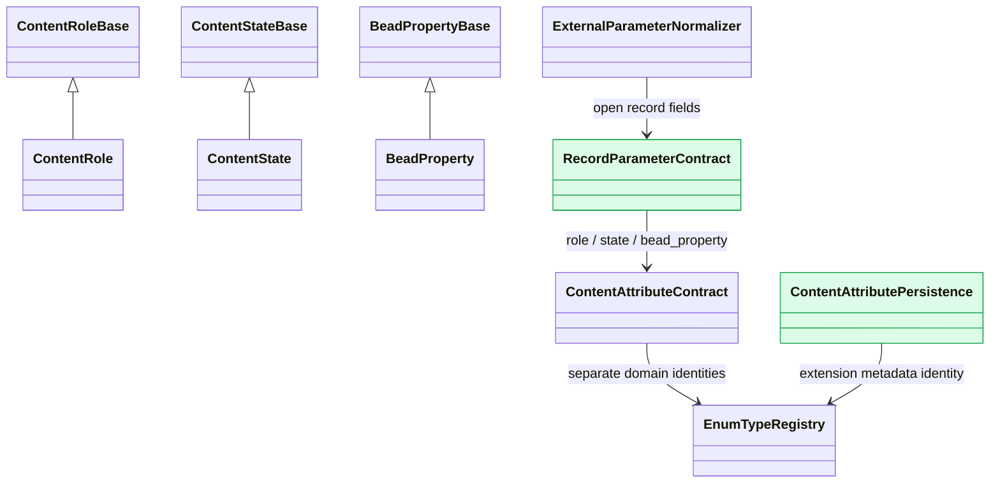
```mermaid
classDiagram
    class ContentRoleBase
    class ContentRole
    class ContentStateBase
    class ContentState
    class BeadPropertyBase
    class BeadProperty
    ContentRoleBase <|-- ContentRole
    ContentStateBase <|-- ContentState
    BeadPropertyBase <|-- BeadProperty
    RecordParameterContract --> ContentAttributeContract : role / state / bead_property
    ContentAttributeContract --> EnumTypeRegistry : separate domain identities
    ExternalParameterNormalizer --> RecordParameterContract : open record fields
    ContentAttributePersistence --> EnumTypeRegistry : extension metadata identity
    style RecordParameterContract fill:#dcfce7,stroke:#16a34a
    style ContentAttributePersistence fill:#dcfce7,stroke:#16a34a
```

| Req ID | 不变量 / 诊断 | 验收 |
| --- | --- | --- |
| ATTR-STANDARD | ContentRole 对照既有推荐表，保留 wash/washing 和 pH_adjuster；ContentState 与 BeadProperty 首批覆盖已有示例与兼容标准词，未知旧值继续开放 | tests/test_content_attribute_vocabulary.py |
| ATTR-OPEN | 不封闭 attrs，不把推荐 kind/type/role 组合变成限制；既有布尔等元数据路径不收紧；显式错误枚举族 TYPE_EXTERNAL_ENUM_MISMATCH，错误成员 SEM_INVALID_EXTERNAL_PARAMETER | tests/test_content_attribute_vocabulary.py |
| ATTR-BOUNDARY | 嵌套字段使用登记的 RecordParameterContract；绑定后由现有 PLAN/RT_EXTERNAL_ENUM_INVALID 拦截 | tests/test_content_attribute_vocabulary.py |
| ATTR-PERSIST | 标准成员在存储边界输出原字符串；扩展以 DomainEnum 数据载荷保留身份，普通科学消费者不把载荷当标准字符串；未知历史元数据仍保持开放，不动态加载代码 | tests/test_content_attribute_vocabulary.py |
| ATTR-NO-EFFECT | 子类声明仅赋予元数据身份；不直接增加物理状态、分离或约束行为 | tests/test_content_attribute_vocabulary.py、既有物料测试 |

### 类型名称归属：当前平铺实现

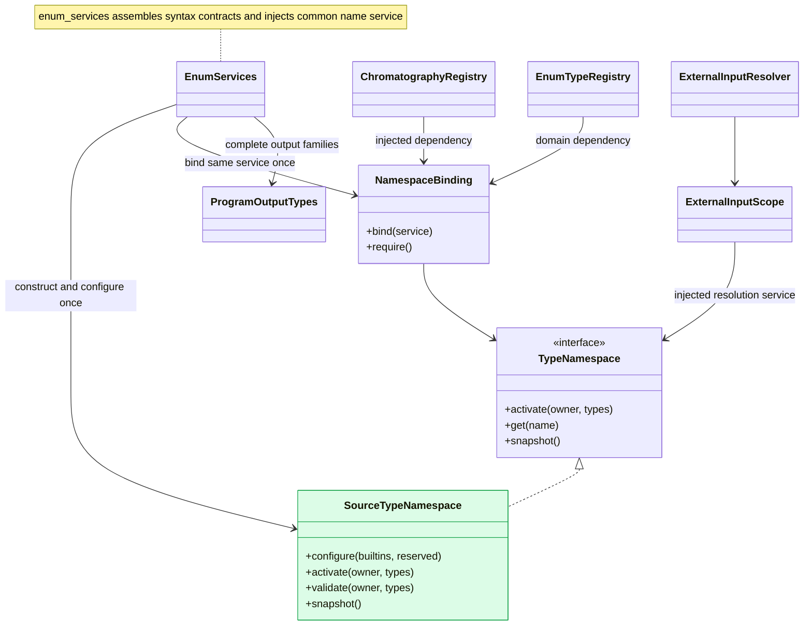
```mermaid
classDiagram
    class TypeNamespace {
        <<interface>>
        +activate(owner, types)
        +get(name)
        +snapshot()
    }
    class NamespaceBinding {
        +bind(service)
        +require()
    }
    TypeNamespace <|.. SourceTypeNamespace
    NamespaceBinding --> TypeNamespace
    class SourceTypeNamespace {
        +configure(builtins, reserved)
        +activate(owner, types)
        +validate(owner, types)
        +snapshot()
    }
    class EnumServices
    EnumServices --> SourceTypeNamespace : construct and configure once
    EnumServices --> NamespaceBinding : bind same service once
    ChromatographyRegistry --> NamespaceBinding : injected dependency
    EnumTypeRegistry --> NamespaceBinding : domain dependency
    ExternalInputScope --> TypeNamespace : injected resolution service
    ExternalInputResolver --> ExternalInputScope
    EnumServices --> ProgramOutputTypes : complete output families
    note for EnumServices "enum_services assembles syntax contracts and injects common name service"
    style SourceTypeNamespace fill:#dcfce7,stroke:#16a34a
```

| Req ID | 不变量 / 归属 | 验收 |
| --- | --- | --- |
| NAMESPACE-OWNER | 内建类型由组合层集中登记；领域注册表只依赖名称服务，不反向 import registry；空基类与 MaterialRelation 名称保留 | tests/test_source_type_namespace.py |
| NAMESPACE-COLLISION | 所有程序输出及内建类型不能被扩展覆盖；跨领域重名在 activate 前 ValueError；前端读取同一名称表 | tests/test_source_type_namespace.py |
| NAMESPACE-SCOPE | 同领域嵌套替换、异常恢复、跨上下文隔离；失败激活不改变任何域或名称状态 | tests/test_source_type_namespace.py |
| NAMESPACE-BOOT | 领域导入不装配应用；独立扩展宿主显式导入 enum_services 或注入名称服务；不加载 parser/pipeline/runtime | tests/test_domain_ownership.py、tests/test_source_type_namespace.py |
| NAMESPACE-PORT | TypeNamespace 为结构化接口；组合层构造实现并一次性注入独立的 NamespaceBinding；领域无具体实现 import；with_type 保留依赖；前端暴露接口视图 | tests/test_namespace_injection.py |

约束规则归属与 `constraint(Type.MEMBER)` 静态语法保持不变；本次修复只整理名称登记和解析一致性。


## 枚举契约的平铺归属调整

此前逐语法建立子包的大迁移草案已被平铺方案替代。总职责、模块归属与依赖方向统一见 [Global Architecture — Language Contract Ownership](../../global_architecture_diagrams.md#language-contract-ownership--agreed-flat-structure)。

| 原结构问题 | 当前实现 |
| --- | --- |
| VocabularyDomain 将五种字段组合成技术分类 | stream、constraint、content 各自声明明确的参数契约；仅登记与身份编解码复用 common 工具 |
| chromatography 拥有跨语法目录 | 色谱合并到 fractionation；全局目录由应用装配，不属于色谱 |
| content 分类与字段契约混淆 | common/content_contracts 保留共享分类；domains/content 负责语法字段与属性 |
| registry 定义业务字段并在 domain import 时装配 | 字段登记回到语法模块；enum_services 汇总，domains/__init__ 无隐式装配 |
| pipeline/runtime 按 Vocabulary 分类找规则 | 读取已登记的具体字段契约；持久化时按明确的类型身份处理器编码 |

已实现契约按语法归属；剩余过滤驱动与数据结果种类按下述契约补齐。旧字符串、扩展载荷与诊断保持兼容。


## 过滤驱动与数据引用种类：已实现

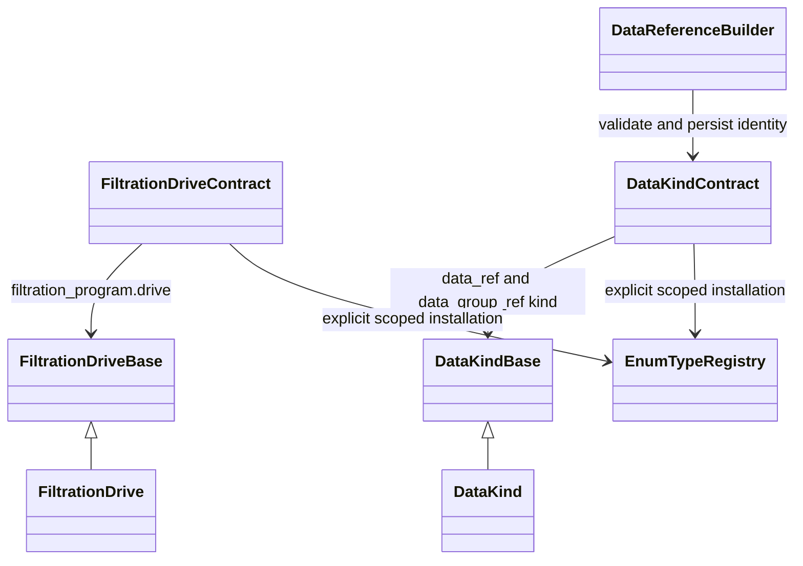
```mermaid
classDiagram
    FiltrationDriveBase <|-- FiltrationDrive
    DataKindBase <|-- DataKind
    FiltrationDriveContract --> FiltrationDriveBase : filtration_program.drive
    DataKindContract --> DataKindBase : data_ref and data_group_ref kind
    FiltrationDriveContract --> EnumTypeRegistry : explicit scoped installation
    DataKindContract --> EnumTypeRegistry : explicit scoped installation
    DataReferenceBuilder --> DataKindContract : validate and persist identity
```

| Req ID | 不变量与归属 | 诊断 / 验收 |
| --- | --- | --- |
| FILTER-TYPE | separation.py 拥有 FiltrationDriveBase/FiltrationDrive；标准 PRESSURE、ASPIRATION、CELL_LIFTER 对应已有词；离心过滤 drive 仍是离心物理量 | tests/test_remaining_external_enums.py；错误族 TYPE_EXTERNAL_ENUM_MISMATCH，错误成员 SEM_INVALID_PROGRAM_ARG_VALUE |
| DATA-TYPE | data.py 拥有 DataKindBase/DataKind；OBSERVATION、SEQUENCE_READ、SORT_RECORD；data_ref 与 data_group_ref 共享种类契约，result 仍开放 | tests/test_remaining_external_enums.py；错误族 TYPE_EXTERNAL_ENUM_MISMATCH，错误成员 SEM_INVALID_EXTERNAL_PARAMETER |
| OPEN-COMPAT | 标准旧词转枚举；其他历史文本保持文本，不自动登记为扩展；子类需显式注册，不凭名称获得材料或读出行为 | tests/test_remaining_external_enums.py；兼容适配仍归 pipeline/compat |
| OPEN-BOUNDARY | 前端、绑定后计划和运行最终值共用 CALL_PARAMETER_CONTRACTS；两个不同基础类型禁止互换 | tests/test_remaining_external_enums.py；PLAN_EXTERNAL_ENUM_INVALID / RT_EXTERNAL_ENUM_INVALID；未安装类型在先行分支赋值处沿用 RT_LOCAL_ASSIGN_UNRESOLVED |
| OPEN-WIRE | 扩展保留 DomainEnum 的稳定 ID/version/member；数据输出 data_kind 保留文本，扩展额外保存 data_kind_type；不改变物料去向或测量解释 | tests/test_remaining_external_enums.py；JSON 回放、作用域恢复、旧行为回归 |
| ENUM-OWNER-UNIQUE | 注册时只允许一个语法枚举继承族；允许该族的中间空基类与普通 Python mixin，不接受其它 Enum 族 | tests/test_enum_registration_boundaries.py；注册阶段 TypeError，不延迟到计划编码 |
| ENUM-WIRE-OWNER | ExternalEnum 只承载闭合类型；开放类型必须使用其领域身份载荷，按当前注册表校验版本及成员，编解码器快照不延长扩展作用域 | tests/test_enum_registration_boundaries.py；错误载荷 ValueError，计划回放沿用既有诊断 |
