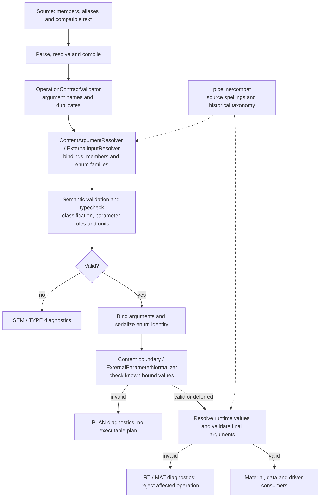
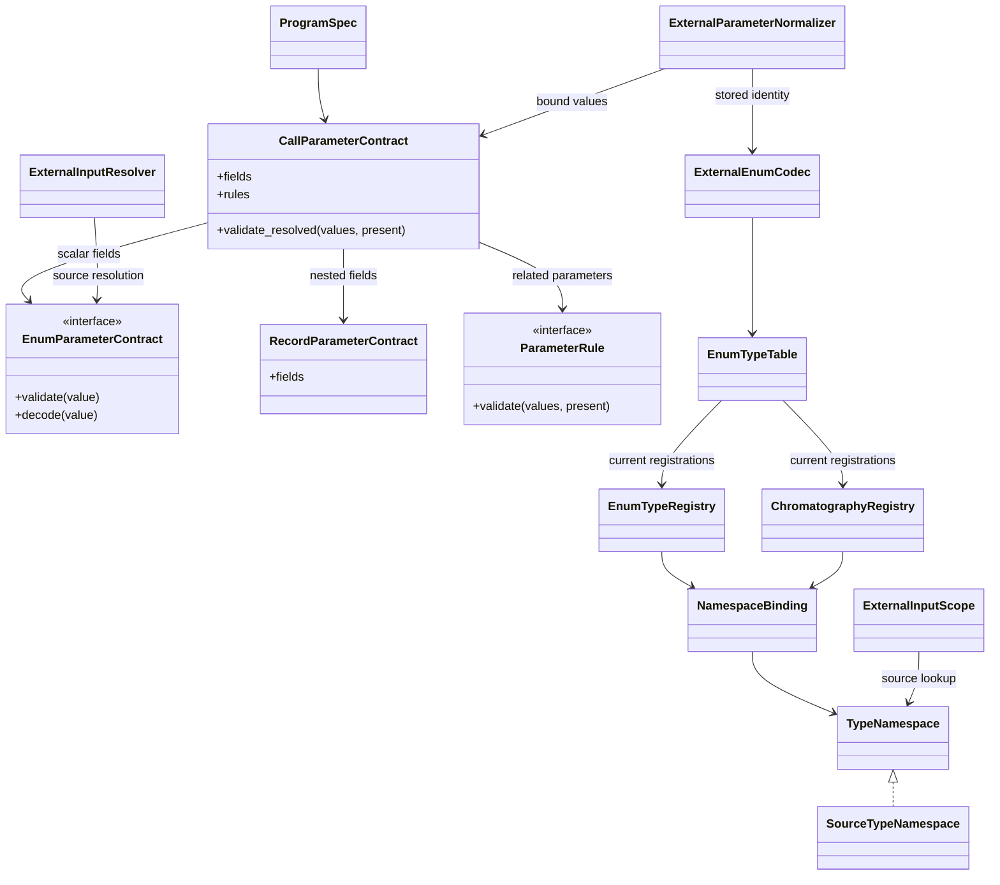
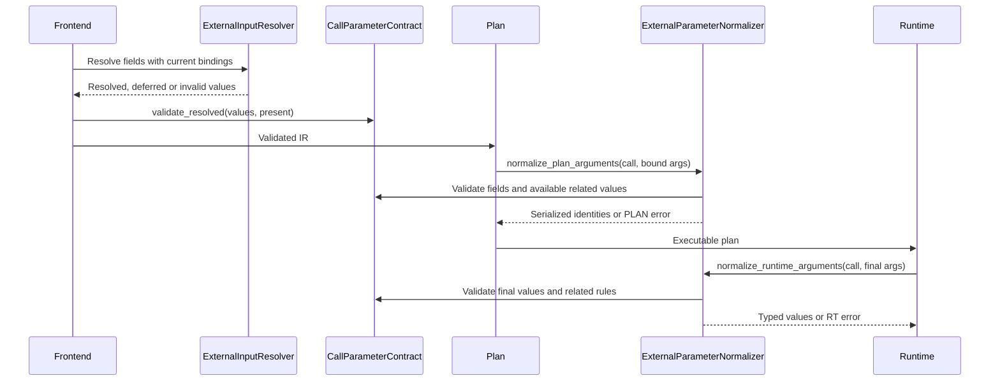
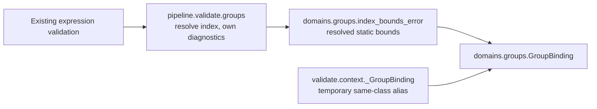
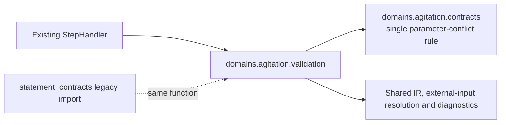

# Validation and Enum Contracts

## Validation Flow


```mermaid
flowchart TB
    Source["Source: members, aliases and compatible text"] --> Frontend["Parse, resolve and compile"]
    Frontend --> Names["OperationContractValidator<br/>argument names and duplicates"]
    Names --> Resolve["ContentArgumentResolver / ExternalInputResolver<br/>bindings, members and enum families"]
    Resolve --> Rules["Semantic validation and typecheck<br/>classification, parameter rules and units"]
    Rules --> Gate{"Valid?"}
    Gate -->|no| Reject["SEM / TYPE diagnostics"]
    Gate -->|yes| Plan["Bind arguments and serialize enum identity"]
    Plan --> Bound["Content boundary / ExternalParameterNormalizer<br/>check known bound values"]
    Bound -->|invalid| PlanReject["PLAN diagnostics; no executable plan"]
    Bound -->|valid or deferred| Runtime["Resolve runtime values and validate final arguments"]
    Runtime -->|invalid| RuntimeReject["RT / MAT diagnostics; reject affected operation"]
    Runtime -->|valid| Consume["Material, data and driver consumers"]
    Compat["pipeline/compat<br/>source spellings and historical taxonomy"] -.-> Resolve
    Compat -.-> Runtime
```

Unresolved bindings defer value checks without discarding their known enum family.
Explicit members never fall back to a compatible string of another family.
Repeated diagnostics are deduplicated only for the same source, code, message and severity.

## Contract Ownership

Module ownership is defined in the [global architecture](../../global_architecture_diagrams.md#language-contract-ownership).

| Owner | Contract |
| --- | --- |
| `common/content_contracts.py` | ContentKind, ContentType, ContainerKind, classification pairs and immutable ContentClassification |
| `domains/content.py` | Content fields and independent role, state and bead-property extensions |
| `domains/separation.py` | Program-owned outputs, disruption method, keep-source selection and filtration drives |
| `domains/fractionation.py` | Density-gradient types; chromatography axis/order types and pairing |
| `domains/data.py`, `domains/stream.py` | Data-reference kinds and observation units, respectively |
| `domains/constraints.py` | Requirement types, applicability, scopes and conflicts |
| `domains/readout.py` | Per-operation quantity membership and customized/schema_ref rule |
| `domains/agitation.py`, `labware.py`, `scheduling.py` | Agitation modes, plate layout and scheduling modes |
| `enum_services.py` | Assemble module declarations and bind the shared source-name service |

`CALL_PARAMETER_CONTRACTS` maps a call name to its field contracts and associated
rules. `PARAMETER_CONTRACTS` indexes those fields by `(call, parameter)`;
`PARAMETER_ENUM_TYPES` indexes their enum types. Stages own diagnostics; domain
rules accept resolved values and raise type/value errors.

## Shared Boundary


```mermaid
classDiagram
    class CallParameterContract {
        +fields
        +rules
        +validate_resolved(values, present)
    }
    class EnumParameterContract {
        <<interface>>
        +validate(value)
        +decode(value)
    }
    class RecordParameterContract {
        +fields
    }
    class ParameterRule {
        <<interface>>
        +validate(values, present)
    }
    CallParameterContract --> EnumParameterContract : scalar fields
    CallParameterContract --> RecordParameterContract : nested fields
    CallParameterContract --> ParameterRule : related parameters
    ProgramSpec --> CallParameterContract
    ExternalInputResolver --> EnumParameterContract : source resolution
    ExternalParameterNormalizer --> CallParameterContract : bound values
    ExternalParameterNormalizer --> ExternalEnumCodec : stored identity
    ExternalEnumCodec --> EnumTypeTable
    EnumTypeTable --> EnumTypeRegistry : current registrations
    EnumTypeTable --> ChromatographyRegistry : current registrations
    EnumTypeRegistry --> NamespaceBinding
    ChromatographyRegistry --> NamespaceBinding
    NamespaceBinding --> TypeNamespace
    TypeNamespace <|.. SourceTypeNamespace
    ExternalInputScope --> TypeNamespace : source lookup
```

`enum_services.py` supplies one name service to the default registries and source
resolver. Importing a domain alone does not assemble the application. Standalone
extension hosts import the assembly entry point or inject a naming service.

## Call Validation Sequence


```mermaid
sequenceDiagram
    participant Frontend
    participant Resolver as ExternalInputResolver
    participant Contract as CallParameterContract
    participant Plan
    participant Boundary as ExternalParameterNormalizer
    participant Runtime
    Frontend->>Resolver: Resolve fields with current bindings
    Resolver-->>Frontend: Resolved, deferred or invalid values
    Frontend->>Contract: validate_resolved(values, present)
    Frontend->>Plan: Validated IR
    Plan->>Boundary: normalize_plan_arguments(call, bound args)
    Boundary->>Contract: Validate fields and available related values
    Boundary-->>Plan: Serialized identities or PLAN error
    Plan->>Runtime: Executable plan
    Runtime->>Boundary: normalize_runtime_arguments(call, final args)
    Boundary->>Contract: Validate final values and related rules
    Boundary-->>Runtime: Typed values or RT error
```

Plate binding and allocation are described in [Plan: Plate Binding](./plan_module_diagrams.md#plate-binding).
Content classification uses `pipeline/content_boundary.py`; it keeps its own
kind/type pairing and material-write diagnostics.

## Compatibility and Persistence

| Surface | Boundary |
| --- | --- |
| Closed enums | Exact family/member checks; accepted old spellings convert through `compat/external_enums.py` |
| Open enum parameters | Explicitly registered Python subclasses; unknown historical text remains text, not a registered extension |
| Content attrs | Known fields are typed; unrelated fields and historical metadata remain open |
| Registration | One enum inheritance family per type; same-family intermediate bases and ordinary mixins are allowed |
| Source names | Built-in/reserved names and cross-family collisions are rejected; nested scopes restore on exit |
| Closed enum payloads | `ExternalEnum` carries a closed type name and member only |
| Open enum payloads | `DomainEnum` or `ChromatographyEnum` carries stable identity, version and member; decoding uses the current registry |
| Content classification payloads | `ContentEnum` preserves member identity; material records retain canonical text and compatible metadata |
| Data-reference kinds | `data_kind` remains text; extensions add `data_kind_type`; result schema rules remain unchanged |
| Filtration drives | Typed standard handling uses member identity; extensions do not inherit behavior through similar text |
| Requirement extensions | Declared rules and installed identity are checked; execution requires driver support |

## Diagnostic Ownership

| Boundary | Diagnostics |
| --- | --- |
| Argument names | `SEM_UNKNOWN_ARG`, `SEM_DUPLICATE_ARG` |
| Invalid content/container classification | Existing `SEM_INVALID_CONTENT_*`, `SEM_INVALID_CONTAINER_KIND` and content type diagnostics |
| Unknown program member / other parameter member | `SEM_INVALID_PROGRAM_ARG_VALUE` / `SEM_INVALID_EXTERNAL_PARAMETER` |
| Foreign enum family or invalid value type | `TYPE_EXTERNAL_ENUM_MISMATCH` |
| Bound external argument | `PLAN_EXTERNAL_ENUM_INVALID` |
| Bound content/container classification | `PLAN_CONTENT_CLASSIFICATION_INVALID`, `PLAN_CONTAINER_KIND_INVALID` |
| Final external argument | `RT_EXTERNAL_ENUM_INVALID`; earlier unresolved local assignments retain `RT_LOCAL_ASSIGN_UNRESOLVED` |
| Final material classification | `MAT_CONTENT_CLASSIFICATION_INVALID`, `MAT_CONTAINER_KIND_INVALID` |
| Unsupported requirement | `RT_DRIVER_REQUIREMENT_UNSUPPORTED` |

## Conformance and Tests

The independent reference defines behavior. `conformance/content_contract.py`
extracts the content contract into `content_reference.json`; `test_hooks.json`
maps requirements to implementation tests. Runtime does not read the reference.
The mechanical checker covers content taxonomy, recommended roles, compatibility
mappings and their diagnostics; it is not a checker for every language table.

| Evidence | Tests |
| --- | --- |
| Domain ownership and dependency injection | `test_domain_ownership.py`, `test_namespace_injection.py`, `test_source_type_namespace.py` |
| Source binding and shared parameter rules | `test_external_enum_frontend.py`, `test_program_parameter_contracts.py`, `test_external_boundary_classes.py` |
| Content behavior and reference alignment | `test_content_enum_execution.py`, `test_content_reference_conformance.py`, `test_content_contract_checker.py` |
| Open types, persistence and runtime behavior | `test_chromatography_extensions.py`, `test_stream_vocabulary.py`, `test_requirement_vocabulary.py`, `test_content_attribute_vocabulary.py`, `test_remaining_external_enums.py` |
| Unique inheritance family and scoped decoding | `test_enum_registration_boundaries.py` |

```bash
python -m conformance.content_contract --check
python -m conformance.content_contract --reference-root ../culsma-reference --check
```

## Group Bounds Ownership


```mermaid
flowchart LR
    Expr["Existing expression validation"] --> Adapter["pipeline.validate.groups<br/>resolve index, own diagnostics"]
    Adapter --> Rule["domains.groups.index_bounds_error<br/>resolved static bounds"]
    Rule --> Binding["domains.groups.GroupBinding"]
    Context["validate.context._GroupBinding<br/>temporary same-class alias"] --> Binding
```

Base checks and static integer resolution remain in validation. The domain returns
a bounds message; validation preserves its diagnostic code, source span and node ID.
The context alias serves existing validation imports and can be removed when those
consumers import the domain value directly. No runtime or pipeline dependency is
introduced into the domain.

## Agitation Frontend Ownership


```mermaid
flowchart LR
    Dispatch["Existing StepHandler"] --> Validation["domains.agitation.validation"]
    Validation --> Contracts["domains.agitation.contracts<br/>single parameter-conflict rule"]
    Validation --> Shared["Shared IR, external-input resolution and diagnostics"]
    Compat["statement_contracts legacy import"] -. "same function" .-> Validation
```

Contract-only imports remain stage-independent through the package root. Existing
source diagnostic codes, messages, argument spans and ordering are preserved.
Runtime and operation-spec assembly are outside this batch.

Quantity adapters extract shared `(number, unit)` values from IR and bound
arguments. Agitation contracts validate these values without depending on IR
serialization; the execution boundary invokes the same contract after binding.
