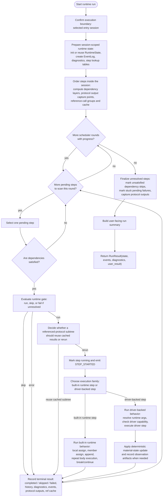
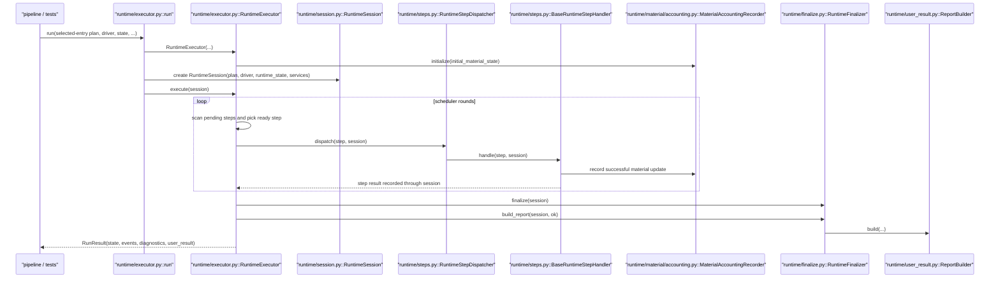
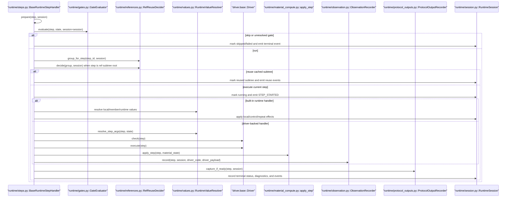
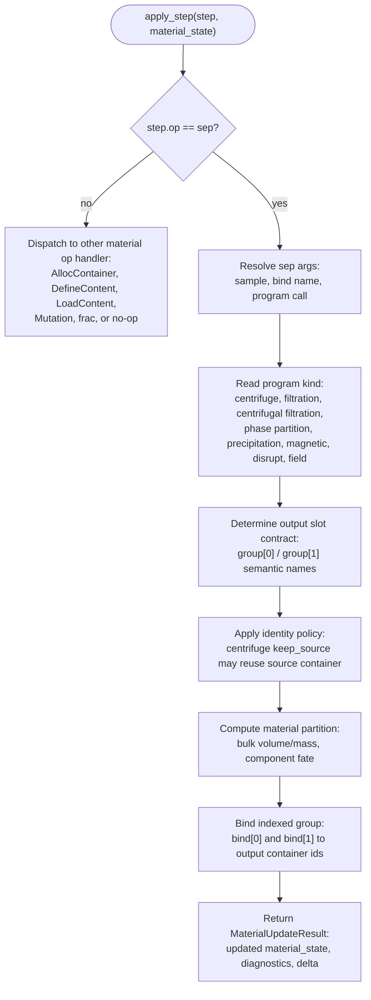
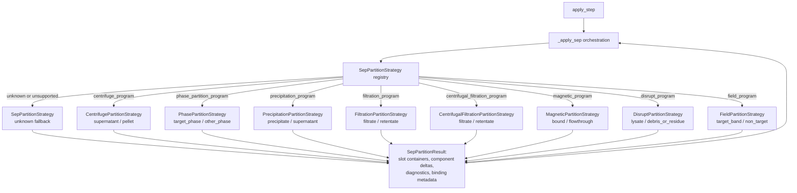
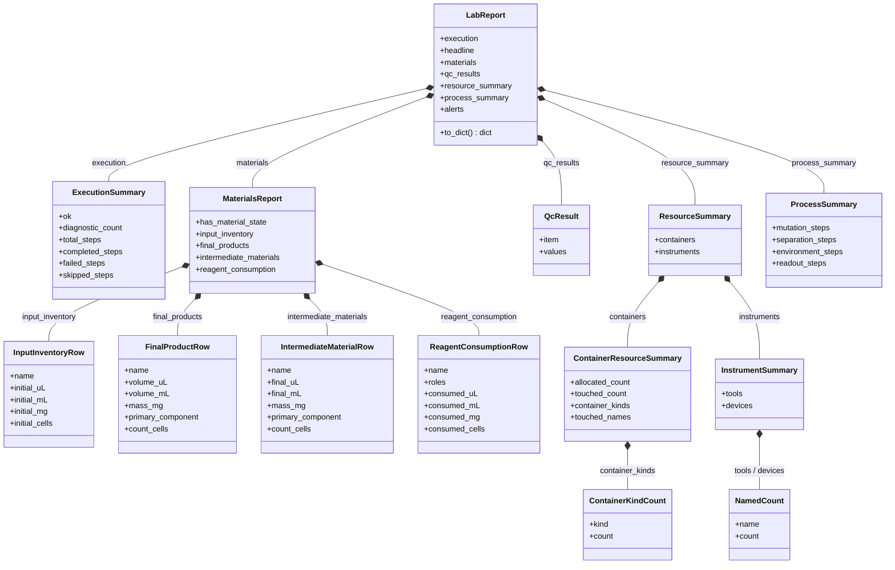
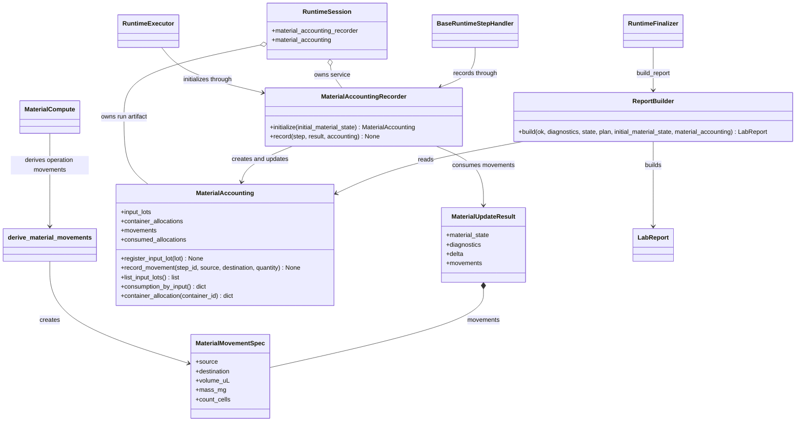
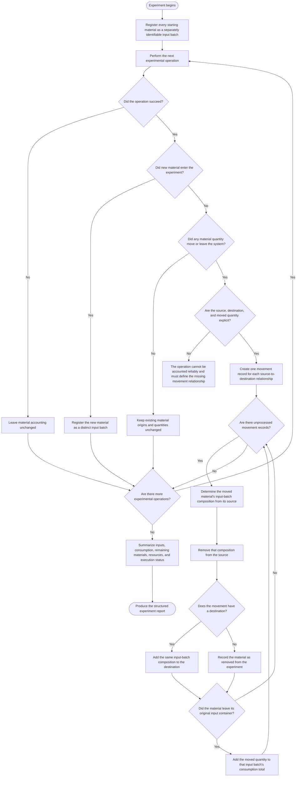
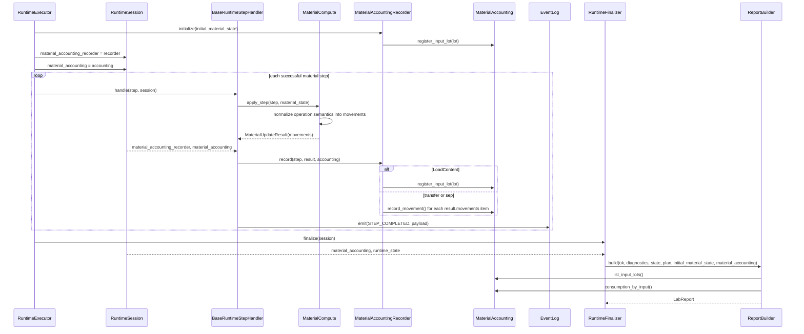

# Runtime Module Diagrams

Last updated: 2026-07-11

Related plan/runtime documents:

1. [plan_module_diagrams.md](./pipeline/plan_module_diagrams.md)
2. [material_compute_module_diagrams.md](./material_compute_module_diagrams.md)

## Scope

This document records the current runtime structure with one functional
flowchart plus material-compute detail diagrams and structural diagrams:

1. Functional flowchart: what runtime execution actually does.
2. Runtime sequence.
3. Runtime step detail sequence.
4. Runtime step detail flowchart.
5. Material compute `sep` detail flowchart.
6. Proposed `sep` partition strategy diagram.
7. Report data-structure diagram.
8. Report-accounting integration.
9. Class/module diagram.

Runtime consumes `PlanProgram` and returns `RunResult(state, events,
diagnostics, user_result)`. It owns deterministic scheduling, dependency and
runtime-gate checks, repeat/control handling, protocol-reference reuse
decisions, driver capability checks, driver execution, material-state compute,
observation recording, protocol-output capture, and user-facing run summary
generation. It does not parse source, validate IR, lower IR to plan, or define
driver backends.

For executable programs, `run()` is the only report-producing execution path.
If frontend errors prevent execution, the CLI preserves the output contract
with an explicitly unexecuted report; it does not treat that report as an
experiment result.

The implementation now follows a scheduler plus dispatcher plus handler split:

- `RuntimeExecutor` owns scheduler rounds and finalization
- `RuntimeSession` owns shared run state and services
- `RuntimeStepDispatcher` chooses a handler by step execution family
- `BaseRuntimeStepHandler` defines the ready-step lifecycle
- concrete handlers own built-in/runtime/driver-backed execution families
- helper services own gate evaluation, value resolution, ref reuse,
  observation capture, protocol-output capture, and finalization helpers

## Functional Flowchart

## Runtime Sequence

## Runtime Step Detail Sequence

## Runtime Step Detail Flowchart

| Phase | Semantic boundary | Typical owners |
| --- | --- | --- |
| `prepare` | Identify step family, preload step-local scratch state, and expose shared services. | every runtime step handler |
| `evaluate gate and ready-step policy` | Decide whether the already-ready step should run, skip, or fail before side effects begin. | gate evaluator, scheduler/handler boundary |
| `decide ref-subtree reuse or rerun` | Apply protocol-reference caching policy before executing a reference-root subtree. | ref reuse decider |
| `mark running and emit STEP_STARTED` | Publish the transition into active execution. | base handler / runtime session |
| `dispatch into built-in or driver-backed execution path` | Separate pure-runtime steps from driver-mediated steps. | step dispatcher / concrete handlers |
| `execute step-family behavior` | Perform local/control/repeat logic or driver check/execute logic. | concrete runtime handlers |
| `apply material, observation, protocol-output, and cache effects` | Push cross-cutting execution side effects into dedicated services. | material compute, observation recorder, protocol-output recorder, ref cache updater |
| `record terminal status, diagnostics, history, and events` | Close the step with one consistent terminal outcome. | runtime session / final recorder logic |

## Material Compute `sep` Detail Flowchart

This flowchart expands the `runtime/material_compute.py::apply_step` boundary
for `sep` operations. It documents the current responsibility split and the
program-specific material partition behavior.

Current implementation note:

1. `Program` reads `program_kind`.
2. `centrifugal_filtration_program(..., drive=..., duration=...)` is a distinct
   program kind whose slot contract remains filtrate / retentate.
3. `Identity` handles `centrifuge_program(..., keep_source=...)` source-container
   reuse.
4. `Partition` uses a strategy selected by `program_kind`.
5. Component fate uses program-specific ratios. Legacy volume/mass-only state
   retains conservative bulk accounting. When dimensioned cell-count content is
   present, volume-bearing component quantities determine bulk volume while
   count-bearing quantities remain outside capacity accounting. Without an
   explicit mass-bearing component quantity, output bulk mass follows the
   partitioned carrier-volume ratio and preserves total source mass. The
   partition delta records the selected bulk-quantity policy.

## Implemented `sep` Partition Strategy

The current runtime architecture already prefers dispatcher/handler ownership
over large conditional blocks. `sep` material partitioning follows the same
pattern. A compact strategy registry keeps `material_compute.apply_step`
responsible for orchestration while
letting each separation program own its own partition contract.

Design judgment:

1. Program-specific component fate is not implemented as a growing conditional
   ladder because each program has a different slot contract,
   residual/carryover rules, and diagnostics.
2. A strategy registry preserves the runtime boundary: the runtime executes
   explicit program semantics; it does not infer biological intent from labels
   or hard-coded component names.

## Report Data Structure

`ReportBuilder` builds these dataclasses from runtime state and online material
accounting. `LabReport.to_dict()` projects them to the compatible
`lab_report_v1` JSON format held in `RunResult.user_result`; it is not the
formal protocol return value.

## Report-Accounting Integration

`MaterialAccounting` is a runtime artifact. It is distinct from the existing
`MaterialLedger`, which mutates container quantities but does not keep input
provenance. Report calculation reads accounting directly; `EventLog` remains a
trace and diagnostic record, not the source of report accounting.

### Class Design

Names in this class diagram are exact Python symbols.

`MaterialAccountingRecorder` has two public lifecycle methods: `initialize()`
creates the run accounting from initial state, and `record()` applies one
successful material update. `MaterialAccounting` owns mutation and query
methods so `ReportBuilder` does not inspect its internal dictionaries. The
recorder is a `RuntimeSession` service: `RuntimeExecutor` uses it once for
initialization, and `BaseRuntimeStepHandler` uses it after each successful
material update.

### Accounting Activity

### Runtime Sequence

Accounting invariants:

1. Initial inventory and every `LoadContent` create distinct input lots, even
   when they share a container.
2. Every quantity-changing operation exposes normalized
   `MaterialUpdateResult.movements`; `MaterialAccountingRecorder` consumes only
   that contract and does not reconstruct movements from state differences.
3. `ReportBuilder` emits complete lists. Terminal and UI renderers own any
   top-N or compact display policy.
4. Multiple sources and targets are represented as separate movement records.
   Missing source-to-destination relations are an operation implementation gap,
   never an invitation to invent allocations from aggregate totals. A
   quantity-changing operation without movements fails with
   `MAT_MOVEMENT_CONTRACT_MISSING`.

## Class And Module Diagram

```mermaid
classDiagram
    class RuntimeAPI {
        +run(plan, driver, state, ...) RunResult
    }

    class RuntimeExecutor {
        +execute(session) RunResult
    }

    class RuntimeSession {
        +plan
        +driver
        +state
        +diagnostics
        +event_log
        +step_by_id
        +ordered_steps
        +ref_cache
        +mark_running(step) None
        +record_completed(step, payload) None
        +record_failed(step, reason, payload) None
        +record_skipped(step, reason) None
    }

    class RuntimeStepDispatcher {
        +dispatch(step, session) bool
    }

    class RuntimeStepState {
        +resolved_step
        +driver_code
        +driver_payload
        +material_delta
        +observation_delta
        +recorded
    }

    class BaseRuntimeStepHandler {
        +handle(step, session) bool
        #prepare(step, session) RuntimeStepState
        #execute_current_step(step, session, state) None
        #record_terminal_result(step, session, state) None
    }

    class ControlStepHandler
    class LocalStateStepHandler
    class RepeatStepHandler
    class DriverBackedStepHandler

    class RuntimeState {
        +step_status
        +artifacts
        +locks
        +history
        +to_dict() dict
    }

    class EventLog {
        +events
        +emit(kind, step_id, payload, span) RuntimeEvent
    }

    class RuntimeEvent {
        +seq
        +kind
        +step_id
        +payload
        +span
        +to_dict() dict
    }

    class Driver {
        +check(step) capability
        +execute(step) result
    }

    class GateEvaluator {
        +evaluate(step, state, session) str
    }

    class RefReuseDecider {
        +group_for_step(step_id, session) RefGroup
        +decide(group, session) RefDecision
    }

    class RuntimeValueResolver {
        +eval_expr(expr, state) object
        +resolve_step_args(step, state) PlanStep
    }

    class ObservationRecorder {
        +record(step, session, driver_code, driver_payload) dict
    }

    class ProtocolOutputRecorder {
        +capture_if_ready(step, session) None
        +capture_all(session) None
    }

    class RuntimeFinalizer {
        +finalize(session, *, aborted_due_to_error) None
        +build_report(session, *, ok) LabReport
    }

    class MaterialCompute {
        +apply_step(step, material_state) MaterialUpdateResult
    }

    class MaterialUpdateResult {
        +material_state
        +diagnostics
        +delta
        +ok
    }

    class MaterialAccountingRecorder {
        +initialize(initial_material_state) MaterialAccounting
        +record(step, result, accounting) None
    }

    class MaterialAccounting

    class ReportBuilder {
        +build(...) LabReport
    }

    class RunResult {
        +state
        +events
        +diagnostics
        +user_result
        +ok
    }

    class PlanStep

    RuntimeAPI --> RuntimeExecutor : creates
    RuntimeAPI --> RuntimeSession : builds
    RuntimeExecutor --> RuntimeSession : mutates
    RuntimeExecutor --> RuntimeStepDispatcher : dispatches through
    RuntimeExecutor --> RuntimeFinalizer : finalizes through
    RuntimeExecutor --> RunResult : returns
    RuntimeSession --> RuntimeState : wraps
    RuntimeSession --> EventLog : writes through
    EventLog --> RuntimeEvent : contains
    RuntimeStepDispatcher --> BaseRuntimeStepHandler : selects
    BaseRuntimeStepHandler --> RuntimeStepState : creates
    BaseRuntimeStepHandler --> RuntimeSession : records through
    BaseRuntimeStepHandler --> GateEvaluator : uses
    BaseRuntimeStepHandler --> RefReuseDecider : uses
    BaseRuntimeStepHandler --> RuntimeValueResolver : uses
    BaseRuntimeStepHandler --> ObservationRecorder : uses
    BaseRuntimeStepHandler --> ProtocolOutputRecorder : uses
    BaseRuntimeStepHandler --> Driver : uses
    BaseRuntimeStepHandler --> MaterialCompute : uses
    RuntimeExecutor --> MaterialAccountingRecorder : initializes through
    RuntimeSession --> MaterialAccountingRecorder : owns service
    RuntimeSession --> MaterialAccounting : owns run artifact
    BaseRuntimeStepHandler --> MaterialAccountingRecorder : records through
    MaterialAccountingRecorder --> MaterialAccounting : updates
    RuntimeFinalizer --> ReportBuilder : builds through
    MaterialCompute --> MaterialUpdateResult : returns
    BaseRuntimeStepHandler <|-- ControlStepHandler
    BaseRuntimeStepHandler <|-- LocalStateStepHandler
    BaseRuntimeStepHandler <|-- RepeatStepHandler
    BaseRuntimeStepHandler <|-- DriverBackedStepHandler
    RuntimeSession --> PlanStep : indexes
```

