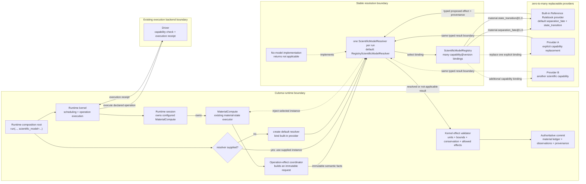
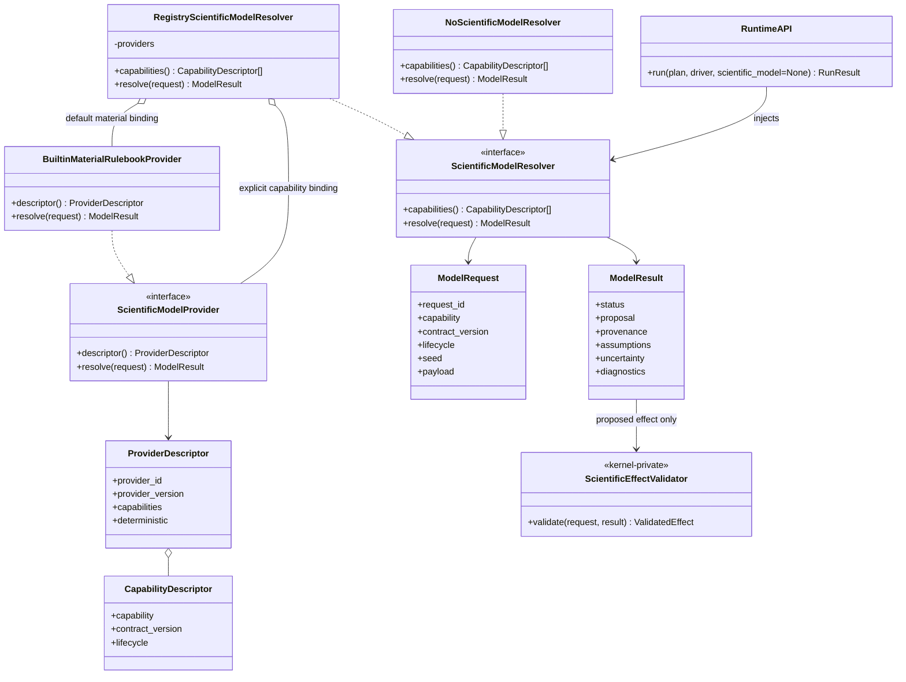
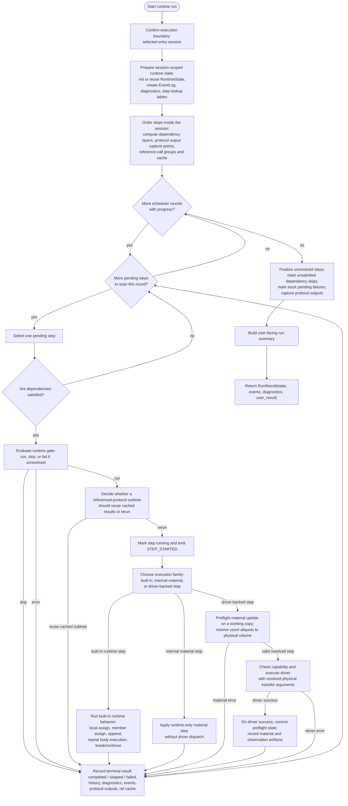
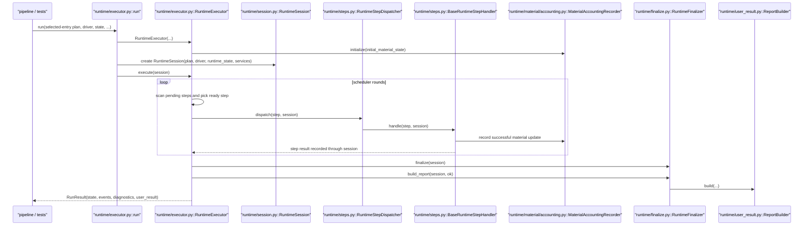
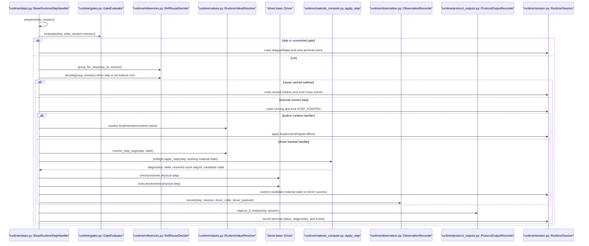
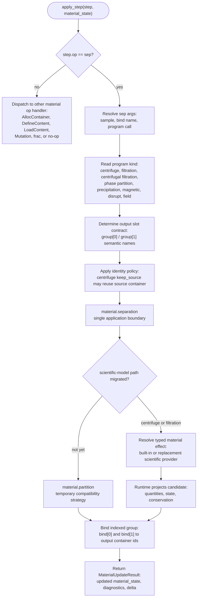
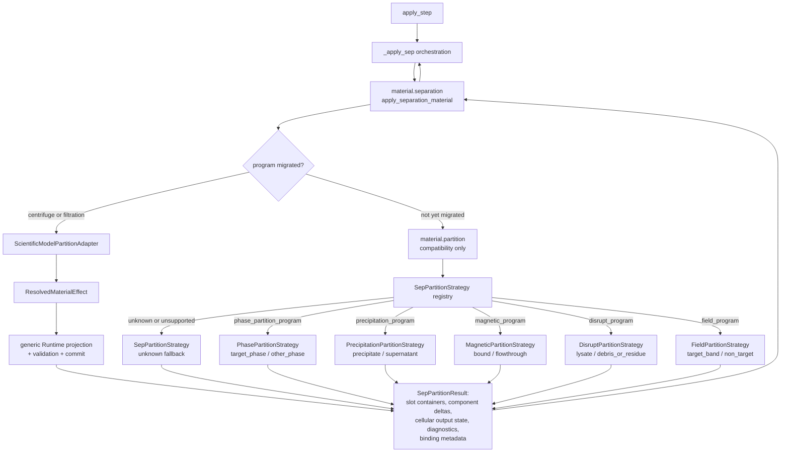
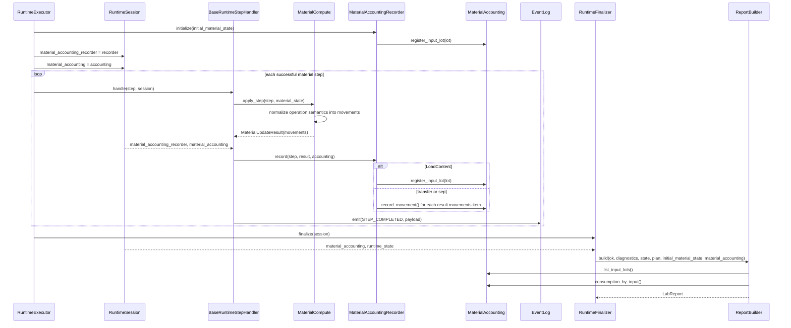

# Runtime Module Diagrams

Last updated: 2026-08-25

Related plan/runtime documents:

1. [plan_module_diagrams.md](./pipeline/plan_module_diagrams.md)
2. [material_compute_module_diagrams.md](./material_compute_module_diagrams.md)

## Scope

This document records the current runtime structure with one functional
flowchart plus material-compute detail diagrams and structural diagrams:

1. Functional flowchart: what runtime execution actually does.
2. Runtime sequence.
3. Runtime step detail sequence.
4. Runtime step detail flowchart.
5. Material compute `sep` detail flowchart.
6. Proposed `sep` partition strategy diagram.
7. Report data-structure diagram.
8. Report-accounting integration.
9. Class/module diagram.
10. Proposed pluggable scientific-model boundary.

Runtime consumes `PlanProgram` and returns `RunResult(state, events,
diagnostics, user_result)`. It owns deterministic scheduling, dependency and
runtime-gate checks, repeat/control handling, protocol-reference reuse
decisions, driver capability checks, driver execution, material-state compute,
observation recording, protocol-output capture, and user-facing run summary
generation. It does not parse source, validate IR, lower IR to plan, or define
driver backends.

For executable programs, `run()` is the only report-producing execution path.
If frontend errors prevent execution, the CLI preserves the output contract
with an explicitly unexecuted report; it does not treat that report as an
experiment result.

The implementation now follows a scheduler plus dispatcher plus handler split:

- `RuntimeExecutor` owns scheduler rounds and finalization
- `RuntimeSession` owns shared run state and services
- `RuntimeStepDispatcher` chooses a handler by step execution family
- `BaseRuntimeStepHandler` defines the ready-step lifecycle
- concrete handlers own built-in/runtime/driver-backed execution families
- helper services own gate evaluation, value resolution, ref reuse,
  observation capture, protocol-output capture, and finalization helpers

## Proposed Pluggable Scientific-Model Boundary

This is a component structure, not an execution-flow or concurrency diagram.
Arrows describe dependency and contract direction; they do not introduce a
runtime fork. The scientific-model boundary is run-scoped; custom injection
is optional because the default resolver binds the built-in Reference provider.



The ownership boundary is fixed:

| Owner | Responsibility |
| --- | --- |
| Runtime kernel | Scheduling, operation success, structural invariants, and commit timing |
| Runtime composition root | Select one resolver and construct `MaterialCompute` for the run |
| Runtime session | Own the configured `MaterialCompute`; no duplicate resolver reference |
| `MaterialCompute` | Existing material-state execution, validation, movement derivation, and commit boundary |
| Scientific Model Resolver | Capability selection and typed transport; no state mutation |
| Model provider | Proposed scientific effect, assumptions, uncertainty, model identity, and version |
| Kernel effect validator | Reject or accept the proposal against the operation contract and runtime invariants |
| Authoritative commit | Apply only validated effects and record their provenance |

With no resolver supplied, the runtime constructs one resolver whose two default
material bindings use the built-in Reference Rulebook provider. The resolver may
hold many providers at the same time, while each `capability@contract_version`
selects exactly one provider for that run. The no-model
implementation remains available for an explicitly disabled or unsupported
capability. Aggregate volume and mass stay inside the kernel and are projected
from the authoritative component-detail ledger.

## Proposed Scientific Model API Contract

The API has three layers. The caller injects one resolver, the resolver dispatches
to explicitly configured providers, and the kernel privately validates every
proposal. Providers never receive `RuntimeState` and never receive a commit
handle.



The public composition surface is intentionally small:

```python
result = run(
    plan=plan,
    driver=driver,
    scientific_model=resolver,  # optional
)
```

The stable provider-facing protocol is synchronous in Phase 1. A remote or
container adapter implements the same protocol and owns transport details.

```python
class ScientificModelResolver(Protocol):
    def capabilities(self) -> tuple[CapabilityDescriptor, ...]: ...
    def resolve(self, request: ModelRequest) -> ModelResult: ...


class ScientificModelProvider(Protocol):
    @property
    def descriptor(self) -> ProviderDescriptor: ...
    def resolve(self, request: ModelRequest) -> ModelResult: ...
```

Capability identifiers and contract versions are separate. The first binding
uses `capability="material.separation_fate"` and `contract_version="1.0"`;
the version is not embedded into the capability name.

### Common Request Envelope

| Field | Contract |
| --- | --- |
| `request_id` | Stable identifier for one resolution attempt within a run |
| `capability` | Names the requested scientific effect family |
| `contract_version` | Selects the typed payload/result schema |
| `lifecycle` | `runtime_precommit`, with future planning and post-run values reserved |
| `seed` | Optional deterministic seed selected by the runtime policy |
| `payload` | Immutable capability-specific semantic facts; never a mutable runtime object |

### Common Result Envelope

| Field | Contract |
| --- | --- |
| `status` | `resolved`, `not_applicable`, or `failed` |
| `proposal` | Capability-specific proposed effect; required only for `resolved` |
| `provenance` | Model ID, model version, provider ID, and optional calibration/dataset digest |
| `assumptions` | Explicit assumptions used by the provider |
| `uncertainty` | Optional typed interval, confidence, or provider-specific uncertainty record |
| `diagnostics` | Structured provider diagnostics; they do not directly become committed runtime diagnostics |

`rejected` is not a provider status. Rejection belongs to the kernel validator:
the provider may successfully produce a result that the kernel rejects as
out of bounds, non-conserving, incompatible with the operation contract, or
otherwise invalid.

### First Capability: `material.separation_fate`

The request contains every non-authored scientific fate candidate. Components
already owned by a validated author `component_fates` rule are resolved before
the resolver. The built-in Reference Rulebook is the default provider for the
remaining candidates; it is not a second fallback layer after the resolver.

| Request fact | Meaning |
| --- | --- |
| Operation descriptor | Separation program kind and complete declared arguments |
| Output contract | Stable part IDs plus semantic meanings such as `supernatant` and `pellet` |
| Environment | Declared thermal, duration, field, and other relevant execution facts |
| Component snapshot | Content ID, canonical kind/type, closed recognized attrs, native quantity axis, and quantity |
| Physical relationship | Association, accessibility, preservation state, and their provenance |
| Optional model context | Explicit calibration/device facts supplied by runtime configuration, not inferred from names |

The Phase 1 proposal is deliberately narrow:

```text
SeparationFateProposal
  component_fates[]
    component_id
    part_fractions[]
      part_id
      fraction
```

Every proposed component must exist in the request, every part ID must exist in
the output contract, each fraction must be finite and within `[0, 1]`, and the
fractions for one component must sum to `1` within the kernel tolerance. Loss,
new material identities, and state transformation are later capability versions
or separate capabilities; they are not implicit fields in the first contract.

Provider selection is explicit in Phase 1: one configured provider per
capability. The built-in Reference Rulebook is the default binding. An external
provider may replace it, and a chain, fallback, or ensemble is itself one
explicitly configured provider. This avoids hidden priority rules and makes run
reproduction depend only on recorded configuration and provenance.

The response path preserves current precedence:

```text
author rule
  -> provider selected by resolver
       default: built-in Reference Rulebook provider
       custom: external or composite provider
  -> explicit unresolved diagnostic
```

Provider exceptions are contained by the resolver and converted to `failed`.
A `not_applicable`/`failed` response does not trigger an implicit second
provider. A configured composite provider owns any desired fallback to the
built-in Rulebook. Otherwise runtime produces the documented unresolved
diagnostic without mutation.

## Functional Flowchart



## Runtime Sequence



## Runtime Step Detail Sequence



## Runtime Step Detail Flowchart


| Phase | Semantic boundary | Typical owners |
| --- | --- | --- |
| `prepare` | Identify step family, preload step-local scratch state, and expose shared services. | every runtime step handler |
| `evaluate gate and ready-step policy` | Decide whether the already-ready step should run, skip, or fail before side effects begin. | gate evaluator, scheduler/handler boundary |
| `decide ref-subtree reuse or rerun` | Apply protocol-reference caching policy before executing a reference-root subtree. | ref reuse decider |
| `mark running and emit STEP_STARTED` | Publish the transition into active execution. | base handler / runtime session |
| `dispatch into built-in, internal-material, or driver-backed execution path` | Keep runtime-only material finalization outside the physical driver boundary. | step dispatcher / concrete handlers |
| `execute step-family behavior` | Perform local/control/repeat logic, internal material logic, or material-preflight plus driver execution. | concrete runtime handlers |
| `apply material, observation, protocol-output, and cache effects` | Push cross-cutting execution side effects into dedicated services. | material compute, observation recorder, protocol-output recorder, ref cache updater |
| `record terminal status, diagnostics, history, and events` | Close the step with one consistent terminal outcome. | runtime session / final recorder logic |

## Material Compute `sep` Detail Flowchart

This flowchart expands the `runtime/material_compute.py::apply_step` boundary
for `sep` operations. It documents the Runtime/model handoff and the current
staged migration boundary.



Current implementation note:

1. `Program` reads `program_kind`.
2. `centrifugal_filtration_program(..., drive=..., duration=...)` is a distinct
   program kind whose slot contract remains filtrate / retentate.
3. `Identity` handles `centrifuge_program(..., keep_source=...)` source-container
   reuse.
4. `material.separation.apply_separation_material(...)` is the only application
   entry used by ordinary `sep` and the compatibility `source.partition(...)`
   syntax.
5. Centrifuge and both filtration programs enter the injected scientific-model
   adapter and return one immutable `ResolvedMaterialEffect`; Runtime projects
   and commits it inside `material.separation`.
6. Other `sep` programs temporarily delegate from `material.separation` to the
   legacy strategy registry in `material.partition` until
   their authoritative typed operation facts and Rulebook rules are complete.
7. Legacy volume/mass-only state
   retains conservative bulk accounting. When dimensioned cell-count content is
   present, volume-bearing component quantities determine bulk volume while
   count-bearing quantities remain outside capacity accounting. Without an
   explicit mass-bearing component quantity, output bulk mass follows the
   partitioned carrier-volume ratio. When explicit volume and mass quantities
   coexist, each explicit axis is applied first and the remaining legacy
   cross-axis bulk proxy follows the opposite explicit axis. Total source bulk
   volume and mass remain conserved. The partition delta records the selected
   bulk-quantity policy.

## Current `sep` Migration Boundary

Centrifuge and both filtration programs no longer have Runtime strategies.
Their scientific decisions cross one typed boundary; Runtime retains only
projection, validation, and commit. The remaining strategy registry is
compatibility-only and is deleted after the corresponding programs have
authoritative provider rules.



Migration rule:

1. New scientific behavior enters only through the resolver/adapter port.
2. Program Registry is the sole owner of output-slot roles.
3. Legacy ratios are not copied into the built-in Rulebook without an accepted
   scientific rule.
4. The final state contains no Runtime scientific strategy registry and no
   program-kind feature gate.

## Report Data Structure

`ReportBuilder` builds these dataclasses from runtime state and online material
accounting. `LabReport.to_dict()` projects them to the compatible
`lab_report_v1` JSON format held in `RunResult.user_result`; it is not the
formal protocol return value.


## Report-Accounting Integration

`MaterialAccounting` is a runtime artifact. It is distinct from the existing
`MaterialLedger`, which mutates container quantities but does not keep input
provenance. Report calculation reads accounting directly; `EventLog` remains a
trace and diagnostic record, not the source of report accounting.

### Class Design

Names in this class diagram are exact Python symbols.


`MaterialAccountingRecorder` has two public lifecycle methods: `initialize()`
creates the run accounting from initial state, and `record()` applies one
successful material update. `MaterialAccounting` owns mutation and query
methods so `ReportBuilder` does not inspect its internal dictionaries. The
recorder is a `RuntimeSession` service: `RuntimeExecutor` uses it once for
initialization, and `BaseRuntimeStepHandler` uses it after each successful
material update.

### Accounting Activity


### Runtime Sequence



Accounting invariants:

1. Initial inventory and every `LoadContent` create distinct input lots, even
   when they share a container.
2. Every quantity-changing operation exposes normalized
   `MaterialUpdateResult.movements`; `MaterialAccountingRecorder` consumes only
   that contract and does not reconstruct movements from state differences.
3. `ReportBuilder` emits complete lists. Terminal and UI renderers own any
   top-N or compact display policy.
4. Multiple sources and targets are represented as separate movement records.
   Missing source-to-destination relations are an operation implementation gap,
   never an invitation to invent allocations from aggregate totals. A
   quantity-changing operation without movements fails with
   `MAT_MOVEMENT_CONTRACT_MISSING`.

## Class And Module Diagram


