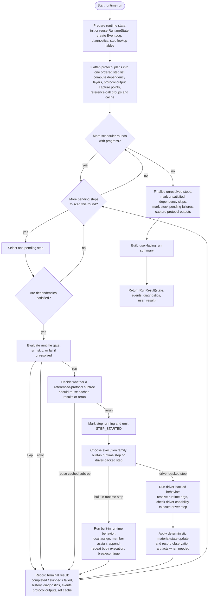
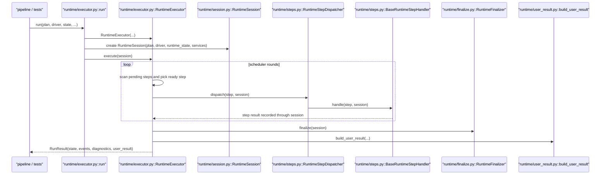
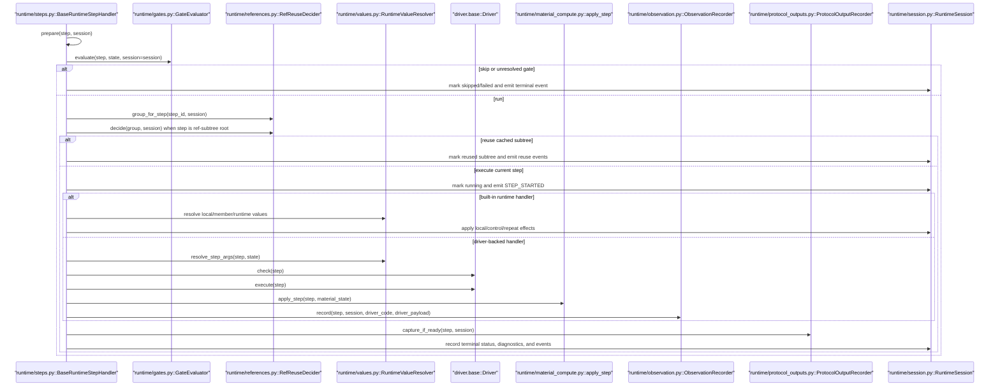
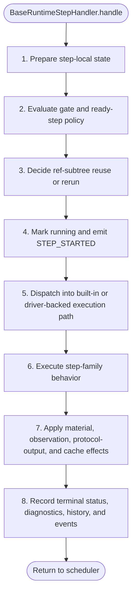

# Runtime Module Diagrams

Last updated: 2026-04-25

Related plan/runtime documents:

1. [plan_module_diagrams.md](https://github.com/culsma/culsma/blob/main/docs/architecture/plan_module_diagrams.md)

## Scope

This document records the current runtime structure with one functional
flowchart plus four structural diagrams:

1. Functional flowchart: what runtime execution actually does.
2. Runtime sequence.
3. Runtime step detail sequence.
4. Runtime step detail flowchart.
5. Class/module diagram.

Runtime consumes `PlanProgram` and returns `RunResult(state, events,
diagnostics, user_result)`. It owns deterministic scheduling, dependency and
runtime-gate checks, repeat/control handling, protocol-reference reuse
decisions, driver capability checks, driver execution, material-state compute,
observation recording, protocol-output capture, and user-facing run summary
generation. It does not parse source, validate IR, lower IR to plan, or define
driver backends.

The implementation now follows a scheduler plus dispatcher plus handler split:

- `RuntimeExecutor` owns scheduler rounds and finalization
- `RuntimeSession` owns shared run state and services
- `RuntimeStepDispatcher` chooses a handler by step execution family
- `BaseRuntimeStepHandler` defines the ready-step lifecycle
- concrete handlers own built-in/runtime/driver-backed execution families
- helper services own gate evaluation, value resolution, ref reuse,
  observation capture, protocol-output capture, and finalization helpers

## Functional Flowchart

## Runtime Sequence

## Runtime Step Detail Sequence

## Runtime Step Detail Flowchart

| Phase | Semantic boundary | Typical owners |
| --- | --- | --- |
| `prepare` | Identify step family, preload step-local scratch state, and expose shared services. | every runtime step handler |
| `evaluate gate and ready-step policy` | Decide whether the already-ready step should run, skip, or fail before side effects begin. | gate evaluator, scheduler/handler boundary |
| `decide ref-subtree reuse or rerun` | Apply protocol-reference caching policy before executing a reference-root subtree. | ref reuse decider |
| `mark running and emit STEP_STARTED` | Publish the transition into active execution. | base handler / runtime session |
| `dispatch into built-in or driver-backed execution path` | Separate pure-runtime steps from driver-mediated steps. | step dispatcher / concrete handlers |
| `execute step-family behavior` | Perform local/control/repeat logic or driver check/execute logic. | concrete runtime handlers |
| `apply material, observation, protocol-output, and cache effects` | Push cross-cutting execution side effects into dedicated services. | material compute, observation recorder, protocol-output recorder, ref cache updater |
| `record terminal status, diagnostics, history, and events` | Close the step with one consistent terminal outcome. | runtime session / final recorder logic |

## Class And Module Diagram

```mermaid
classDiagram
    class RuntimeAPI {
        +run(plan, driver, state, ...) RunResult
    }

    class RuntimeExecutor {
        +execute(session) RunResult
    }

    class RuntimeSession {
        +plan
        +driver
        +state
        +diagnostics
        +event_log
        +step_by_id
        +ordered_steps
        +ref_cache
        +mark_running(step) None
        +record_completed(step, payload) None
        +record_failed(step, reason, payload) None
        +record_skipped(step, reason) None
    }

    class RuntimeStepDispatcher {
        +dispatch(step, session) bool
    }

    class RuntimeStepState {
        +resolved_step
        +driver_code
        +driver_payload
        +material_delta
        +observation_delta
        +recorded
    }

    class BaseRuntimeStepHandler {
        +handle(step, session) bool
        #prepare(step, session) RuntimeStepState
        #execute_current_step(step, session, state) None
        #record_terminal_result(step, session, state) None
    }

    class ControlStepHandler
    class LocalStateStepHandler
    class RepeatStepHandler
    class DriverBackedStepHandler

    class RuntimeState {
        +step_status
        +artifacts
        +locks
        +history
        +to_dict() dict
    }

    class EventLog {
        +events
        +emit(kind, step_id, payload, span) RuntimeEvent
    }

    class RuntimeEvent {
        +seq
        +kind
        +step_id
        +payload
        +span
        +to_dict() dict
    }

    class Driver {
        +check(step) capability
        +execute(step) result
    }

    class GateEvaluator {
        +evaluate(step, state, session) str
    }

    class RefReuseDecider {
        +group_for_step(step_id, session) RefGroup
        +decide(group, session) RefDecision
    }

    class RuntimeValueResolver {
        +eval_expr(expr, state) object
        +resolve_step_args(step, state) PlanStep
    }

    class ObservationRecorder {
        +record(step, session, driver_code, driver_payload) dict
    }

    class ProtocolOutputRecorder {
        +capture_if_ready(step, session) None
        +capture_all(session) None
    }

    class RuntimeFinalizer {
        +finalize(session, *, aborted_due_to_error) None
    }

    class MaterialCompute {
        +apply_step(step, material_state) MaterialUpdateResult
    }

    class MaterialUpdateResult {
        +material_state
        +diagnostics
        +delta
        +ok
    }

    class UserResultBuilder {
        +build_user_result(ok, diagnostics, state, events, plan, initial_material_state) dict
    }

    class RunResult {
        +state
        +events
        +diagnostics
        +user_result
        +ok
    }

    class PlanStep

    RuntimeAPI --> RuntimeExecutor : creates
    RuntimeAPI --> RuntimeSession : builds
    RuntimeAPI --> UserResultBuilder : builds report through
    RuntimeExecutor --> RuntimeSession : mutates
    RuntimeExecutor --> RuntimeStepDispatcher : dispatches through
    RuntimeExecutor --> RuntimeFinalizer : finalizes through
    RuntimeExecutor --> RunResult : returns
    RuntimeSession --> RuntimeState : wraps
    RuntimeSession --> EventLog : writes through
    EventLog --> RuntimeEvent : contains
    RuntimeStepDispatcher --> BaseRuntimeStepHandler : selects
    BaseRuntimeStepHandler --> RuntimeStepState : creates
    BaseRuntimeStepHandler --> RuntimeSession : records through
    BaseRuntimeStepHandler --> GateEvaluator : uses
    BaseRuntimeStepHandler --> RefReuseDecider : uses
    BaseRuntimeStepHandler --> RuntimeValueResolver : uses
    BaseRuntimeStepHandler --> ObservationRecorder : uses
    BaseRuntimeStepHandler --> ProtocolOutputRecorder : uses
    BaseRuntimeStepHandler --> Driver : uses
    BaseRuntimeStepHandler --> MaterialCompute : uses
    MaterialCompute --> MaterialUpdateResult : returns
    BaseRuntimeStepHandler <|-- ControlStepHandler
    BaseRuntimeStepHandler <|-- LocalStateStepHandler
    BaseRuntimeStepHandler <|-- RepeatStepHandler
    BaseRuntimeStepHandler <|-- DriverBackedStepHandler
    RuntimeSession --> PlanStep : indexes
```

