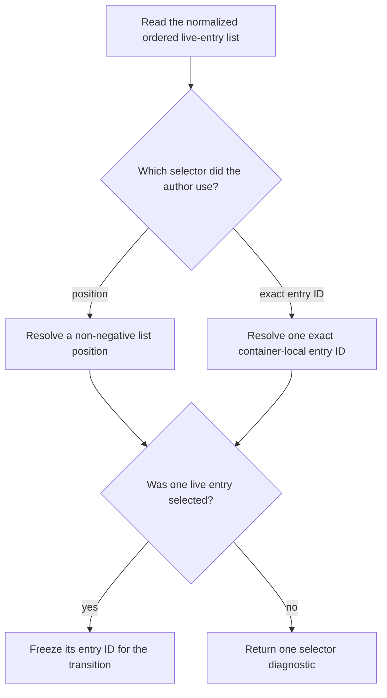

# Material Selection

`materials` is a container's read-only ordered list of live `MaterialEntry`
records after normalization. It is not the constructor's raw `load` list.

## Author Surface

Position selection remains valid:

```culsma
transition(
  subject = source.materials[0],
  output = FiltrationProgramOutput.RETENTATE,
  to = MaterialRelation.FREE
)
```

Exact container-local entry-ID selection is also available:

```culsma
transition(
  subject = source.materials.get("DNA_SAMPLE_1"),
  output = FieldProgramOutput.TARGET_BAND_FRACTION,
  to = MaterialRelation.FREE
)
```

`get(entry_id)` never matches `content_ref`. Missing IDs produce one diagnostic;
the implementation never falls back to the first same-content entry. The
general Material Runtime owns entry-ID creation and collision handling; see
[Component Entry Identity](../material_compute/component_entry_identity.md).
Statically resolvable local aliases may hold either the key or the complete
selector; Plan lowering emits the same exact serialized selector in both cases.


