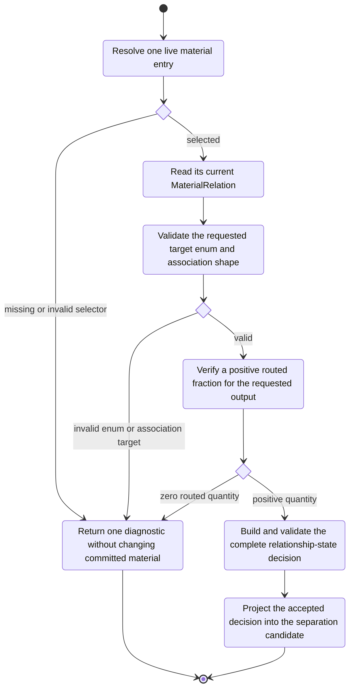

# Material Transition Semantics

The author supplies the subject, one program-owned output member, and the target
`MaterialRelation`. The current relation is read from the selected live entry;
the author does not repeat a `from` precondition.

| Target relation | Association category | Author supplies `associated_with` | Resolved target |
|---|---|---|---|
| `FREE` | none | no | association cleared |
| `CONTAINER_SURFACE` | output container | no | concrete output container |
| `PELLET` | output container | no | concrete output container |
| `PRECIPITATE` | output container | no | concrete output container |
| `DISRUPTED` | output-container-scoped state | no | concrete output container |
| `FIELD_RETAINED` | output-container-scoped retention | no | concrete output container |
| `BEAD_BOUND` | component entry | material selector required | selected bead entry in the same output |
| `MEMBRANE_BOUND` | component entry | material selector required | selected membrane entry in the same output |
| `CELL_BOUND` | component entry | material selector required | selected cell entry in the same output |
| `UNRESOLVED` | internal sentinel | invalid | transition rejected |

The author-settable state vocabulary is closed by `MaterialRelation`; transitions
between valid members are not restricted by a pair whitelist.
