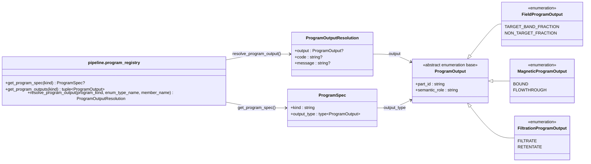

# Program-Owned Output Contract

Every concrete separation program owns its output enumeration. Frontend
validation and runtime resolution use the same `ProgramOutput` member; there is
no global material-output alias table.

| `ProgramSpec.output_type` | `part_id = "0"` | `part_id = "1"` |
|---|---|---|
| `CentrifugeProgramOutput` | `SUPERNATANT` | `PELLET` |
| `MagneticProgramOutput` | `BOUND` | `FLOWTHROUGH` |
| `DisruptProgramOutput` | `LYSATE` | `DEBRIS_OR_RESIDUE` |
| `FieldProgramOutput` | `TARGET_BAND_FRACTION` | `NON_TARGET_FRACTION` |
| `FiltrationProgramOutput` | `FILTRATE` | `RETENTATE` |
| `CentrifugalFiltrationProgramOutput` | `FILTRATE` | `RETENTATE` |
| `PhasePartitionProgramOutput` | `TARGET_PHASE` | `OTHER_PHASE` |
| `PrecipitationProgramOutput` | `PRECIPITATE` | `SUPERNATANT` |
| `SepProgramOutput` | `FRACTION_A` | `FRACTION_B` |

