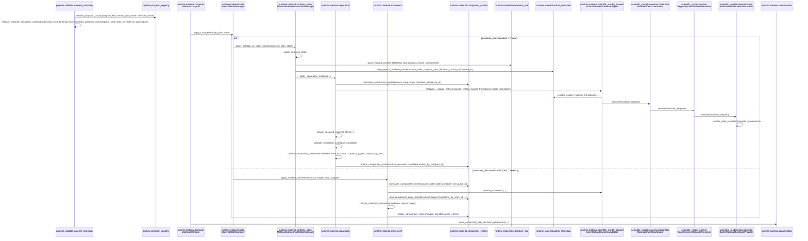

# Full Runtime Context

This detail keeps the wider runtime path out of the three-diagram overview.
Messages use exact implemented names.

```mermaid
sequenceDiagram
    participant Contract as pipeline.validate.material_transition
    participant Registry as pipeline.program_registry
    participant Compute as runtime.material.compute<br/>MaterialCompute
    participant State as runtime.material.state<br/>MaterialStateManager
    participant Indexed as runtime.material.contents_state<br/>MaterialIndexedPartsStateManager
    participant Separation as runtime.material.separation
    participant Movement as runtime.material.movement
    participant Entries as runtime.material.component_entries
    participant Fate as runtime.material.separation_fate
    participant Author as runtime.material.author_transition
    participant Adapter as runtime.material.scientific_model_adapter<br/>ScientificModelMaterialAdapter
    participant Coordinator as scientific_model.material.coordinator<br/>MaterialEffectCoordinator
    participant Resolver as scientific_model.resolver<br/>RegistryScientificModelResolver
    participant Provider as scientific_model.material.builtin<br/>BuiltinMaterialRulebookProvider
    participant Conservation as runtime.material.conservation

    Contract->>Registry: resolve_program_output(program_kind, enum_type_name, member_name)
    Contract->>Contract: validate_material_transitions_contract(args=args, expr_bindings=expr_bindings, program_kind=program_kind, node_id=node_id, span=span)
    Compute->>State: apply_change(change_plan, state)

    alt transition_plan.transition == "sep"
        State->>Indexed: apply_partition_or_index_change(contents_plan, state)
        Indexed->>Indexed: apply_sep(step, state)
        Indexed->>Fate: parse_explicit_content_fates(raw, slot_contract, known_components)
        Indexed->>Author: parse_explicit_material_transitions(raw_rules, program_kind, declared_source_ref, source_id)
        Indexed->>Separation: apply_separation_material(...)
        Separation->>Entries: normalize_component_entries(source, state=state, container_id=source_id)
        Separation->>Adapter: resolve(..., source_entries=source_entries, explicit_transitions=explicit_transitions)
        Adapter->>Author: resolve_explicit_material_transitions(...)
        Adapter->>Coordinator: resolve(transition_request)
        Coordinator->>Resolver: resolve(transition_request)
        Resolver->>Provider: resolve(transition_request)
        Provider->>Provider: resolve_state_transition(payload, provenance)
        Separation->>Separation: project_resolved_material_effect(...)
        Separation->>Separation: validate_separation_candidate(candidate)
        Separation->>Separation: commit_separation_candidate(candidate, source=source, outputs_by_part=outputs_by_part)
        Separation->>Entries: replace_component_entries(output_container, candidate.entries_by_part[part_id])
    else transition_plan.transition in {"add", "select"}
        State->>Movement: apply_material_movement(source, target, ratio, adapter)
        Movement->>Entries: normalize_component_entries(source, state=state, container_id=source_id)
        Movement->>Adapter: resolve_movement(...)
        Movement->>Entries: plan_component_entry_transfer(source, target, transitions_by_entry_id, ...)
        Movement->>Movement: commit_material_movement(candidate, source, target)
        Movement->>Entries: replace_component_entries(source, transfer.source_entries)
    end

    Compute->>Conservation: totals_conserved_with_declared_retirements(...)
```
