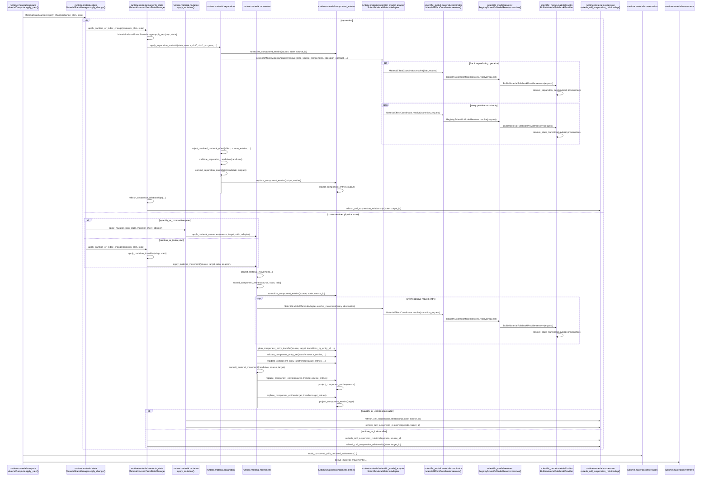
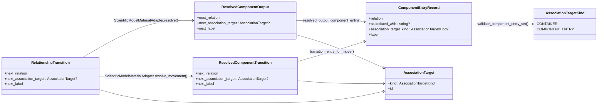

# Scientific Model Module Diagrams

## 1. Three-Stage Material Flow

```mermaid
flowchart LR
    subgraph Prepare["Stage 1 — Prepare material entries"]
        Input["Accept a separation or physical-move request"]
        Normalize["Entry normalization gate<br/>No operation may bypass it"]
        EntrySet["Canonical entry set<br/>unique entry_id · content_ref identity<br/>valid quantity · relation from the closed set"]
        Input --> Normalize --> EntrySet
    end

    subgraph Decide["Stage 2 — Resolve the scientific effect"]
        Classify["Rulebook classifies each entry from<br/>canonical identity and current relation"]
        Fate["Fraction-producing operation:<br/>resolve where each entry goes"]
        Transition["Resolve each positive output or moved entry:<br/>next relation · next association target · next label"]
        Effect["Return one complete transition<br/>per source entry_id"]
        Classify -->|separation| Fate --> Transition --> Effect
        Classify -->|physical move| Transition
    end

    subgraph Apply["Stage 3 — Apply and commit"]
        Project["Build complete separation or movement candidate<br/>from decisions keyed by entry_id"]
        Compare["Compare output entries without using entry_id:<br/>same content_ref, compatible quantity,<br/>compatible state and relationship"]
        Merge["Compatible entries:<br/>add quantities and keep one entry_id"]
        Separate["Incompatible entries:<br/>keep distinct entry_id values"]
        Validate["Candidate validation gate<br/>closed relation · typed association target<br/>target exists · unique identity · valid quantity · output contract"]
        Commit["Commit authoritative component_entries atomically"]
        EntryViews["Read-only entry projections:<br/>components, quantities and<br/>scientific_model_relation"]
        SuspensionView["Read-only cell_suspension projection:<br/>count entries + carrier volume<br/>→ concentration and transferability"]
        Accept["Runtime acceptance gate<br/>movement · capacity · conservation"]
        Compatibility["Publish accepted state and 1.x views"]
        Project --> Compare
        Compare -->|compatible| Merge --> Validate
        Compare -->|incompatible| Separate --> Validate
        Validate --> Commit
        Commit --> EntryViews --> Accept
        Commit --> SuspensionView --> Accept
        Accept --> Compatibility
    end

    EntrySet --> Classify
    Effect --> Project
```

## 2. Runtime Sequence Mapped to Classes and Methods

```mermaid
sequenceDiagram
    participant Compute as runtime.material.compute<br/>MaterialCompute.apply_step()
    participant State as runtime.material.state<br/>MaterialStateManager.apply_change()
    participant Indexed as runtime.material.contents_state<br/>MaterialIndexedPartsStateManager
    participant Mutation as runtime.material.mutation<br/>apply_mutation()
    participant Separation as runtime.material.separation
    participant Movement as runtime.material.movement
    participant Entries as runtime.material.component_entries
    participant Adapter as runtime.material.scientific_model_adapter<br/>ScientificModelMaterialAdapter
    participant Coordinator as scientific_model.material.coordinator<br/>MaterialEffectCoordinator.resolve()
    participant Resolver as scientific_model.resolver<br/>RegistryScientificModelResolver.resolve()
    participant Provider as scientific_model.material.builtin<br/>BuiltinMaterialRulebookProvider
    participant Suspension as runtime.material.suspension<br/>refresh_cell_suspension_relationship()
    participant Conservation as runtime.material.conservation
    participant MovementAudit as runtime.material.movements

    Compute->>State: MaterialStateManager.apply_change(change_plan, state)

    alt separation
        State->>Indexed: apply_partition_or_index_change(contents_plan, state)
        Indexed->>Indexed: MaterialIndexedPartsStateManager.apply_sep(step, state)
        Indexed->>Separation: apply_separation_material(state, source, slot0, slot1, program, ...)
        Separation->>Entries: normalize_component_entries(source, state, source_id)
        Separation->>Adapter: ScientificModelMaterialAdapter.resolve(state, source, components, operation_contract, ...)
        opt fraction-producing operation
            Adapter->>Coordinator: MaterialEffectCoordinator.resolve(fate_request)
            Coordinator->>Resolver: RegistryScientificModelResolver.resolve(request)
            Resolver->>Provider: BuiltinMaterialRulebookProvider.resolve(request)
            Provider->>Provider: resolve_separation_fate(payload, provenance)
        end
        loop every positive output entry
            Adapter->>Coordinator: MaterialEffectCoordinator.resolve(transition_request)
            Coordinator->>Resolver: RegistryScientificModelResolver.resolve(request)
            Resolver->>Provider: BuiltinMaterialRulebookProvider.resolve(request)
            Provider->>Provider: resolve_state_transition(payload, provenance)
        end
        Separation->>Separation: project_resolved_material_effect(effect, source_entries, ...)
        Separation->>Separation: validate_separation_candidate(candidate)
        Separation->>+Separation: commit_separation_candidate(candidate, outputs)
        Separation->>Entries: replace_component_entries(output, entries)
        Entries->>Entries: project_component_entries(output)
        deactivate Separation
        Indexed->>Indexed: refresh_separation_relationships(...)
        Indexed->>Suspension: refresh_cell_suspension_relationship(state, output_id)
    else cross-container physical move
        alt quantity_or_composition plan
            State->>Mutation: apply_mutation(step, state, material_effect_adapter)
            Mutation->>Movement: apply_material_movement(source, target, ratio, adapter)
        else partition_or_index plan
            State->>Indexed: apply_partition_or_index_change(contents_plan, state)
            Indexed->>Indexed: apply_mutation_transition(step, state)
            Indexed->>Movement: apply_material_movement(source, target, ratio, adapter)
        end
        Movement->>Movement: project_material_movement(...)
        Movement->>Movement: moved_component_entries(source, state, ratio)
        Movement->>Entries: normalize_component_entries(source, state, source_id)
        loop every positive moved entry
            Movement->>Adapter: ScientificModelMaterialAdapter.resolve_movement(entry, destination)
            Adapter->>Coordinator: MaterialEffectCoordinator.resolve(transition_request)
            Coordinator->>Resolver: RegistryScientificModelResolver.resolve(request)
            Resolver->>Provider: BuiltinMaterialRulebookProvider.resolve(request)
            Provider->>Provider: resolve_state_transition(payload, provenance)
        end
        Movement->>Entries: plan_component_entry_transfer(source, target, transitions_by_entry_id, ...)
        Movement->>Entries: validate_component_entry_set(transfer.source_entries, ...)
        Movement->>Entries: validate_component_entry_set(transfer.target_entries, ...)
        Movement->>+Movement: commit_material_movement(candidate, source, target)
        Movement->>Entries: replace_component_entries(source, transfer.source_entries)
        Entries->>Entries: project_component_entries(source)
        Movement->>Entries: replace_component_entries(target, transfer.target_entries)
        Entries->>Entries: project_component_entries(target)
        deactivate Movement
        alt quantity_or_composition caller
            Mutation->>Suspension: refresh_cell_suspension_relationship(state, source_id)
            Mutation->>Suspension: refresh_cell_suspension_relationship(state, target_id)
        else partition_or_index caller
            Indexed->>Suspension: refresh_cell_suspension_relationship(state, source_id)
            Indexed->>Suspension: refresh_cell_suspension_relationship(state, target_id)
        end
    end

    Compute->>Conservation: totals_conserved_with_declared_retirements(...)
    Compute->>MovementAudit: derive_material_movements(...)
```

### Association-Target Change Map

```mermaid
classDiagram
    direction LR

    class RelationshipTransition {
        +next_relation
        +next_association_target : AssociationTarget?
        +next_label
    }
    class ResolvedComponentOutput {
        +next_relation
        +next_association_target : AssociationTarget?
        +next_label
    }
    class ResolvedComponentTransition {
        +next_relation
        +next_association_target : AssociationTarget?
        +next_label
    }
    class ComponentEntryRecord {
        +relation
        +associated_with : string?
        +association_target_kind : AssociationTargetKind?
        +label
    }
    class AssociationTarget {
        +kind : AssociationTargetKind
        +id
    }
    class AssociationTargetKind {
        CONTAINER
        COMPONENT_ENTRY
    }

    RelationshipTransition --> ResolvedComponentOutput : ScientificModelMaterialAdapter.resolve()
    RelationshipTransition --> ResolvedComponentTransition : ScientificModelMaterialAdapter.resolve_movement()
    ResolvedComponentOutput --> ComponentEntryRecord : resolved_output_component_entry()
    ResolvedComponentTransition --> ComponentEntryRecord : transition_entry_for_move()
    RelationshipTransition --> AssociationTarget
    ResolvedComponentOutput --> AssociationTarget
    ResolvedComponentTransition --> AssociationTarget
    ComponentEntryRecord --> AssociationTargetKind : validate_component_entry_set()
```

## 3. Structural Class Diagram

```mermaid
classDiagram
    direction LR

    namespace Runtime {
        class MaterialCompute {
            +apply_step(step, material_state) MaterialUpdateResult
        }
        class MaterialStateManager {
            +apply_change(plan, state) MaterialUpdateResult
        }
        class MaterialIndexedPartsStateManager {
            +apply_sep(step, state) MaterialUpdateResult
        }
        class ScientificModelMaterialAdapter {
            +resolve(...) ResolvedMaterialEffect
            +resolve_movement(...) ResolvedMaterialTransition
            +build_component_snapshot(...) ComponentSnapshot
        }
        class MaterialSeparationCandidate {
            +effect
            +entries_by_part : complete output state
            +retired_quantities
        }
        class MaterialMovementBoundary {
            <<runtime.material.movement>>
            +apply_material_movement(...) MaterialMovementApplicationResult
            +project_material_movement(...) MaterialMovementCandidate
            +commit_material_movement(candidate)
        }
        class MaterialMovementCandidate {
            +transition
            +source_entries
            +target_entries
        }
        class ComponentEntryRecord {
            <<authoritative runtime record>>
            +entry_id : container-scoped identity
            +content_ref
            +amount
            +quantity
            +relation
            +associated_with : string?
            +association_target_kind : AssociationTargetKind?
            +preservation
            +label
        }
        class AssociationTarget {
            <<typed relationship target>>
            +kind : AssociationTargetKind
            +id
        }
        class AssociationTargetKind {
            <<enumeration>>
            CONTAINER
            COMPONENT_ENTRY
        }
        class ComponentEntryTransaction {
            <<runtime.material.component_entries>>
            +normalize_component_entries(container, state)
            +container_component_entries(container)
            +entries_can_compress(left, right)
            +plan_component_entry_transfer(source, target, ratio)
            +merge_transferred_entries(target_entries, moved_entries)
            +replace_component_entries(container, entries)
            +project_component_entries(container)
        }
        class MaterialCandidateValidation {
            <<runtime.material.separation>>
            +validate_separation_candidate(candidate)
        }
        class ScientificModelRelationship {
            <<derived compatibility record>>
            +component_entry_ids
            +dispersed_component_ids
            +material_state
            +associated_with
        }
        class CellSuspensionProjection {
            <<runtime.material.suspension>>
            +refresh_cell_suspension_relationship(state, container_id)
            +resolve_count_aliquot(...) CountAliquotResolution
        }
        class CellSuspensionRelationship {
            <<derived runtime relationship>>
            +dispersed_component_ids
            +carrier_component_ids
            +carrier_volume_uL
            +material_state
            +concentration
            +transferability
        }
        class ResolvedMaterialEffect {
            +operation_id
            +program_kind
            +outputs
            +component_effects
        }
        class ResolvedComponentEffect {
            +source_entry_id
            +source_content_ref
            +source_amount
            +source_relation
            +outputs
        }
        class ResolvedComponentOutput {
            +part_id
            +fraction
            +next_relation
            +next_association_target : AssociationTarget?
            +next_label
        }
        class ResolvedMaterialTransition {
            +operation_id
            +effect_kind
            +component_transitions
        }
        class ResolvedComponentTransition {
            +source_entry_id
            +next_relation
            +next_association_target : AssociationTarget?
            +next_label
            +provenance
        }
    }

    namespace ScientificModelPort {
        class ScientificModelResolver {
            <<interface>>
            +resolve(request) ModelResult
        }
        class ScientificModelProvider {
            <<interface>>
            +resolve(request) ModelResult
        }
        class ModelRequest {
            +request_id
            +capability
            +contract_version
            +payload
        }
        class ModelResult {
            +status
            +proposal
            +provenance
            +diagnostics
        }
    }

    namespace ScientificMaterialModel {
        class MaterialEffectCoordinator {
            +resolve(request, author_decision) CoordinatedDecision
        }
        class RegistryScientificModelResolver {
            +resolve(request) ModelResult
        }
        class BuiltinMaterialRulebookProvider {
            +resolve(request) ModelResult
            +resolve_separation_fate(payload) ModelResult
            +resolve_state_transition(payload) ModelResult
        }
        class MaterialModelPayload {
            +operation
            +components
            +context
        }
        class ComponentSnapshot {
            +entry_id
            +content_ref
            +canonical_kind
            +canonical_type
            +quantity
            +relationship
        }
        class SeparationDecision {
            +component_fates
            +decision_source
        }
        class StateTransitionDecision {
            +transitions
            +decision_source
        }
        class RelationshipTransition {
            +component_entry_id
            +next_relation
            +next_association_target : AssociationTarget?
            +next_label
        }
    }

    MaterialCompute *-- MaterialStateManager
    MaterialStateManager *-- MaterialIndexedPartsStateManager
    MaterialStateManager --> MaterialMovementBoundary
    MaterialCompute *-- ScientificModelMaterialAdapter
    ScientificModelMaterialAdapter *-- MaterialEffectCoordinator
    MaterialEffectCoordinator --> ScientificModelResolver
    RegistryScientificModelResolver ..|> ScientificModelResolver
    RegistryScientificModelResolver --> ScientificModelProvider : selected binding
    BuiltinMaterialRulebookProvider ..|> ScientificModelProvider

    ScientificModelMaterialAdapter --> ModelRequest : creates
    ModelRequest *-- MaterialModelPayload
    MaterialModelPayload *-- ComponentSnapshot
    ComponentSnapshot --> ComponentEntryRecord : immutable snapshot of
    ScientificModelProvider --> ModelResult : returns
    ModelResult --> SeparationDecision
    ModelResult --> StateTransitionDecision
    StateTransitionDecision *-- RelationshipTransition

    ScientificModelMaterialAdapter --> ResolvedMaterialEffect : creates
    ScientificModelMaterialAdapter --> ResolvedMaterialTransition : creates
    ResolvedMaterialEffect *-- ResolvedComponentEffect
    ResolvedComponentEffect *-- ResolvedComponentOutput
    ResolvedComponentEffect --> ComponentEntryRecord : source_entry_id
    ResolvedMaterialTransition *-- ResolvedComponentTransition
    ResolvedComponentTransition --> ComponentEntryRecord : source_entry_id
    RelationshipTransition --> ResolvedComponentOutput : adapter mapping
    RelationshipTransition --> ResolvedComponentTransition : adapter mapping
    ResolvedComponentOutput --> AssociationTarget : next target
    ResolvedComponentTransition --> AssociationTarget : next target
    ComponentEntryRecord --> AssociationTargetKind : association_target_kind
    AssociationTarget --> AssociationTargetKind : kind
    MaterialSeparationCandidate *-- ResolvedMaterialEffect
    MaterialSeparationCandidate *-- ComponentEntryRecord : output entries
    MaterialCandidateValidation --> MaterialSeparationCandidate : validates
    MaterialMovementBoundary *-- MaterialMovementCandidate
    MaterialMovementCandidate *-- ResolvedMaterialTransition
    MaterialMovementCandidate *-- ComponentEntryRecord : source + target candidates
    MaterialMovementBoundary --> ScientificModelMaterialAdapter
    ComponentEntryTransaction o-- ComponentEntryRecord
    ComponentEntryTransaction --> ScientificModelRelationship : read-only projection
    ComponentEntryRecord --> CellSuspensionProjection : read-only input
    CellSuspensionProjection --> CellSuspensionRelationship : creates
    MaterialIndexedPartsStateManager --> MaterialSeparationCandidate : applies
```
