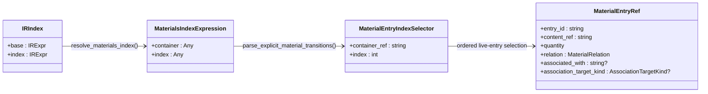
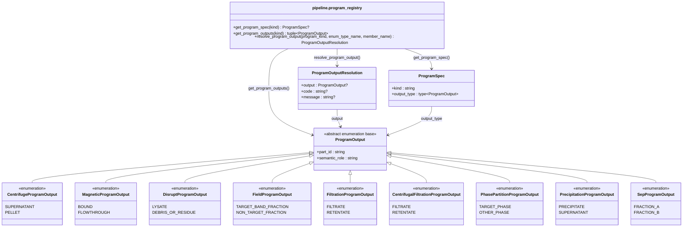
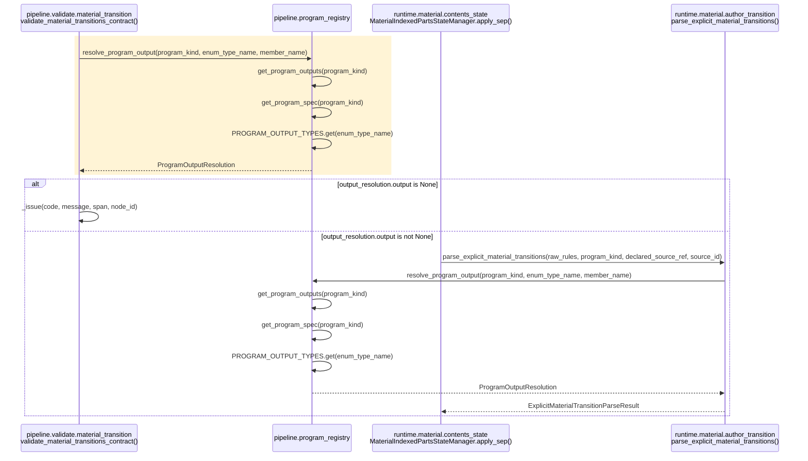
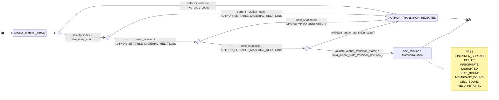

# Scientific Model Module Diagrams

This document describes the current author-supplied material relationship
transition and program-owned output-enum architecture. Electrophoresis lane
identity remains outside this document and is tracked separately by
`culsma/culsma-pm#100`.

## 1. Overall Three-Stage Material Flow

This is the complete prepare, decide, and apply activity. Separation and
physical movement are mutually exclusive branches and rejoin before candidate
validation.

```mermaid
stateDiagram-v2
    direction TB

    state "Accept a separation or cross-container physical-move request" as AcceptRequest
    state "Normalize the current material into canonical component entries" as NormalizeEntries
    state "Classify each entry from canonical identity and current relationship state" as ClassifyEntries
    state OperationKind <<choice>>
    state "Resolve material selectors and validate the target MaterialRelation" as ValidateAuthorContract
    state "Resolve the selected program and require output to use that program's output enum" as ValidateProgramOutput
    state "Resolve one conserved quantity split for every source entry" as ResolveFates
    state "Resolve each subject and optional component-entry association target" as ResolveAuthorSubjects
    state "Map the accepted program-output member to its declared output part" as ResolveProgramOutput
    state "For every positive separation output, prepare one relationship-state request" as PrepareSeparationTransitions
    state "Use the accepted author transition for the selected entry and output; otherwise use the provider" as ResolveSeparationTransitions
    state "Project the typed target relationship into the complete separation candidate" as ProjectSeparationCandidate
    state "Project the positive quantity moving from source to destination" as ProjectMovement
    state "Resolve the relationship state for every positive moved entry" as ResolveMovementTransitions
    state "Build one complete candidate keyed by source entry identity" as BuildCandidate
    state "Compare entries by content, compatible quantity, and relationship state" as CompareEntries
    state EntriesCompatible <<choice>>
    state "Merge quantities and retain one entry identity" as MergeEntries
    state "Keep incompatible entries under distinct identities" as KeepSeparate
    state "Validate relation enums, typed targets, identity, quantity, output contract, and conservation" as ValidateCandidate
    state CandidateValid <<choice>>
    state "Commit authoritative component_entries atomically" as CommitEntries
    state "Refresh read-only compatibility projections" as RefreshViews
    state "Apply movement, capacity, and conservation acceptance gates" as AcceptanceGate
    state "Publish the accepted state" as PublishState
    state "Return a diagnostic and preserve the original committed material" as RejectCandidate

    note right of NormalizeEntries
        Stage 1 — Prepare material entries
    end note
    note right of ClassifyEntries
        Stage 2 — Resolve the scientific effect
    end note
    note right of BuildCandidate
        Stage 3 — Apply, validate, and commit
    end note

    [*] --> AcceptRequest
    AcceptRequest --> NormalizeEntries
    NormalizeEntries --> ClassifyEntries
    ClassifyEntries --> OperationKind
    OperationKind --> ValidateAuthorContract : separation
    ValidateAuthorContract --> ValidateProgramOutput
    ValidateProgramOutput --> ResolveFates
    ResolveFates --> ResolveAuthorSubjects
    ResolveAuthorSubjects --> ResolveProgramOutput
    ResolveProgramOutput --> PrepareSeparationTransitions
    PrepareSeparationTransitions --> ResolveSeparationTransitions
    ResolveSeparationTransitions --> ProjectSeparationCandidate
    ProjectSeparationCandidate --> BuildCandidate
    OperationKind --> ProjectMovement : physical move
    ProjectMovement --> ResolveMovementTransitions
    ResolveMovementTransitions --> BuildCandidate
    BuildCandidate --> CompareEntries
    CompareEntries --> EntriesCompatible
    EntriesCompatible --> MergeEntries : compatible
    EntriesCompatible --> KeepSeparate : incompatible
    MergeEntries --> ValidateCandidate
    KeepSeparate --> ValidateCandidate
    ValidateCandidate --> CandidateValid
    CandidateValid --> RejectCandidate : invalid
    CandidateValid --> CommitEntries : valid
    CommitEntries --> RefreshViews
    RefreshViews --> AcceptanceGate
    AcceptanceGate --> PublishState
    RejectCandidate --> [*]
    PublishState --> [*]

```



## 2. Frontend Material Selection

`materials` is the tube's read-only ordered list of live `MaterialEntry`
records after normalization. It is not a dictionary and is not the constructor's
raw `load` list. An index is resolved against that pre-operation list and then
frozen as the selected entry's stable `entry_id`.

```culsma
let source = tube(
  label = "Source",
  load = [
    content(
      kind = bio_cellular,
      type = cell_line,
      code = "RPE1",
      attrs = { state: adherent }
    ):100000cells
  ]
);
let result = sep(
  sample = source,
  program = filtration_program(
    membrane = adherent_cell_surface,
    drive = aspiration
  ),
  transitions = [
    transition(
      subject = source.materials[0],
      output = FiltrationProgramOutput.RETENTATE,
      to = MaterialRelation.FREE
    )
  ]
);
```

A component-bound target uses the same ordered material view for its typed
association target:

```culsma
transition(
  subject = source.materials[1],
  output = MagneticProgramOutput.BOUND,
  to = MaterialRelation.BEAD_BOUND,
  associated_with = source.materials[0]
)
```



## 3. Program-Owned Output Contract

The output enum is owned by the concrete program definition. `ProgramSpec`,
frontend validation, plan serialization, and Runtime resolution all use the
same enum member. There is no global material-output enum and no independent
frontend alias table.



| `ProgramSpec.output_type` | `part_id = "0"` | `part_id = "1"` |
| --- | --- | --- |
| `CentrifugeProgramOutput` | `SUPERNATANT` | `PELLET` |
| `MagneticProgramOutput` | `BOUND` | `FLOWTHROUGH` |
| `DisruptProgramOutput` | `LYSATE` | `DEBRIS_OR_RESIDUE` |
| `FieldProgramOutput` | `TARGET_BAND_FRACTION` | `NON_TARGET_FRACTION` |
| `FiltrationProgramOutput` | `FILTRATE` | `RETENTATE` |
| `CentrifugalFiltrationProgramOutput` | `FILTRATE` | `RETENTATE` |
| `PhasePartitionProgramOutput` | `TARGET_PHASE` | `OTHER_PHASE` |
| `PrecipitationProgramOutput` | `PRECIPITATE` | `SUPERNATANT` |
| `SepProgramOutput` | `FRACTION_A` | `FRACTION_B` |

The dedicated sequence below isolates only enum resolution. Every message is
an exact implemented module method or field name.



## 4. Material Transition Core Activity

Every transition supplies the subject, program-owned output enum member, and
target relation enum. The current
relation and association target are read from the selected `MaterialEntry`; the
author does not repeat a `from` precondition. A component-bound target relation
also supplies `associated_with = sample.materials[index]`; non-bound target
relations infer their output-container target or clear it for `free`.

| `MaterialRelation` target | Association category | Author supplies `associated_with` | Resolved target |
|---|---|---|---|
| `FREE` | none | no | association cleared |
| `CONTAINER_SURFACE` | output container | no | concrete output container |
| `PELLET` | output container | no | concrete output container |
| `PRECIPITATE` | output container | no | concrete output container |
| `DISRUPTED` | output-container-scoped state | no | concrete output container |
| `FIELD_RETAINED` | output-container-scoped retention | no | concrete output container |
| `BEAD_BOUND` | component entry | `sample.materials[index]` required | selected bead entry in the same output |
| `MEMBRANE_BOUND` | component entry | `sample.materials[index]` required | selected membrane entry in the same output |
| `CELL_BOUND` | component entry | `sample.materials[index]` required | selected cell entry in the same output |
| `UNRESOLVED` | internal sentinel | invalid | transition rejected |

```mermaid
stateDiagram-v2
    direction TB

    state "Receive sep with optional transitions" as Receive
    state "Validate transition(subject, output, to, associated_with?)" as ValidateContract
    state ContractValid <<choice>>
    state "Resolve the program definition and its declared output enum type" as ResolveProgramContract
    state "Resolve output as EnumType.MEMBER without converting free text" as ResolveOutputMember
    state OutputTypeMatches <<choice>>
    state "Normalize sample into the authoritative list of MaterialEntry records" as NormalizeSource
    state "Evaluate subject as sample.materials[index]" as EvaluateIndex
    state "Filter zero-quantity compatibility entries while preserving authoritative order" as BuildLiveList
    state IndexInRange <<choice>>
    state "Freeze the selected entry_id and read its current MaterialRelation" as ReadCurrentState
    state "Resolve the optional associated_with material selector" as ResolveAssociation
    state "Validate target enum membership and association-target shape" as ValidateTargetState
    state TargetStateValid <<choice>>
    state "Read part_id and semantic_role from the accepted program-owned enum member" as ResolveOutput
    state "Verify that the selected entry has a positive routed fraction in that output" as ValidateFraction
    state PositiveFraction <<choice>>
    state "Index the rule by source entry identity and accepted output part_id" as IndexRule
    state "Resolve every other positive component output through the selected provider" as ResolveFallbacks
    state "Project the target MaterialRelation and typed association target" as ProjectTargetEntry
    state "Validate the complete separation candidate and conservation" as ValidateCandidate
    state CandidateValid <<choice>>
    state "Commit all output entries atomically" as CommitCandidate
    state "Return one diagnostic and preserve the committed source" as Reject

    [*] --> Receive
    Receive --> ValidateContract
    ValidateContract --> ContractValid
    ContractValid --> Reject : invalid contract
    ContractValid --> ResolveProgramContract : valid or omitted
    ResolveProgramContract --> ResolveOutputMember
    ResolveOutputMember --> OutputTypeMatches
    OutputTypeMatches --> Reject : enum type differs from the selected program output type
    OutputTypeMatches --> NormalizeSource : exact enum type match
    NormalizeSource --> EvaluateIndex
    EvaluateIndex --> BuildLiveList
    BuildLiveList --> IndexInRange
    IndexInRange --> Reject : index is out of range
    IndexInRange --> ReadCurrentState : index is in range
    ReadCurrentState --> ResolveAssociation
    ResolveAssociation --> ValidateTargetState
    ValidateTargetState --> TargetStateValid
    TargetStateValid --> Reject : undefined enum or invalid target shape
    TargetStateValid --> ResolveOutput : valid target state
    ResolveOutput --> ValidateFraction
    ValidateFraction --> PositiveFraction
    PositiveFraction --> Reject : zero routed quantity
    PositiveFraction --> IndexRule : positive routed quantity
    IndexRule --> ResolveFallbacks
    ResolveFallbacks --> ProjectTargetEntry
    ProjectTargetEntry --> ValidateCandidate
    ValidateCandidate --> CandidateValid
    CandidateValid --> Reject : invalid candidate
    CandidateValid --> CommitCandidate : valid candidate
    Reject --> [*]
    CommitCandidate --> [*]
```



## 5. Relationship State Machine

The state vocabulary is closed by `MaterialRelation`; the transition graph is
open between every author-settable member. `UNRESOLVED` is an internal sentinel
and cannot be authored. No source string is converted into a new state.



## 6. Material Transition Runtime Sequence

Participants and messages retain their exact implemented code names. The
sequence contains no descriptive prose calls.

```mermaid
sequenceDiagram
    participant Contract as pipeline.validate.material_transition
    participant Registry as pipeline.program_registry
    participant View as pipeline.container_views
    participant Indexed as runtime.material.contents_state
    participant Separation as runtime.material.separation
    participant Entries as runtime.material.component_entries
    participant Author as runtime.material.author_transition
    participant Adapter as runtime.material.scientific_model_adapter
    participant Validation as scientific_model.material.validation
    participant Coordinator as scientific_model.material.coordinator

    rect rgb(255, 244, 214)
        Contract->>View: resolve_materials_index(expr=transition.subject, expr_bindings=expr_bindings)
        View-->>Contract: MaterialsIndexExpression
        Contract->>Registry: resolve_program_output(program_kind, enum_type_name, member_name)
        Registry->>Registry: get_program_outputs(program_kind)
        Registry->>Registry: get_program_spec(program_kind)
        Registry-->>Contract: ProgramOutputResolution
        Contract->>Contract: validate_material_transitions_contract(args=args, expr_bindings=expr_bindings, program_kind=program_kind, node_id=node_id, span=span)
        Indexed->>Author: parse_explicit_material_transitions(step.args.get("transitions"), program_kind=program_kind, declared_source_ref=ref_display(sample_arg), source_id=source_id)
        Author->>Registry: resolve_program_output(program_kind, enum_type_name, member_name)
        Registry->>Registry: get_program_outputs(program_kind)
        Registry->>Registry: get_program_spec(program_kind)
        Registry-->>Author: ProgramOutputResolution
        Author-->>Indexed: ExplicitMaterialTransitionParseResult
    end

    alt parse_result.issues
        Indexed->>Indexed: diagnostic_result(step, state, parse_result.issues[0].code, parse_result.issues[0].message)
    else not parse_result.issues
        Indexed->>Indexed: working = deepcopy(state)
        Indexed->>Separation: apply_separation_material(state=working, source=source, slot0=slot0, slot1=slot1, program=program, explicit_fates=explicit_fates, explicit_transitions=parse_result.transitions, material_effect_adapter=self.material_effect_adapter, request_id=step.step_id, source_id=source_id, output_ids_by_part=output_ids_by_part)
        Separation->>Entries: normalize_component_entries(source, state=state, container_id=source_id)
        Entries-->>Separation: list[dict[str, Any]]
        Separation->>Adapter: ScientificModelMaterialAdapter.resolve(state=state, source=source, source_entries=source_entries, components=components, operation_contract=operation_contract, request_id=request_id, source_id=source_id, output_ids_by_part=output_ids_by_part, explicit_transitions=explicit_transitions)

        rect rgb(255, 244, 214)
            Adapter->>Author: resolve_explicit_material_transitions(transitions=explicit_transitions, source_id=source_id, source_entries=source_entries, output_bindings=resolved_outputs, fractions_by_component=fractions_by_component)
            Author->>Author: apply_explicit_material_transition(transition=transition, source_id=source_id, source_entries=source_entries)
            Author->>Author: resolve_material_entry(selector=transition.subject, source_id=source_id, entries=source_entries)
            opt transition.next_association_selector is not None
                Author->>Author: resolve_material_entry(selector=transition.next_association_selector, source_id=source_id, entries=source_entries)
            end
            Author->>Author: validate_author_transition_state(current_relation=source_entry.relation, next_relation=transition.next_relation, next_association_target=next_association_target)
            Author-->>Author: ExplicitMaterialTransitionResult
            Author->>Author: validate_positive_output_fraction(source_entry_id=result.transition.source_entry_id, output_part_id=result.transition.output.part_id, output_bindings=output_bindings, fractions_by_component=fractions_by_component)
            opt result.transition.next_association_target is not None
                Author->>Author: validate_positive_output_fraction(source_entry_id=result.transition.next_association_target.id, output_part_id=result.transition.output.part_id, output_bindings=output_bindings, fractions_by_component=fractions_by_component)
            end
            Author-->>Adapter: AuthorTransitionResolution
        end

        alt transition_resolution.issues
            Adapter-->>Separation: MaterialEffectFailure(code=transition_resolution.issues[0].code, message=transition_resolution.issues[0].message)
        else not transition_resolution.issues
            loop component in components.values()
                loop (output, fraction) in zip(bound_outputs, component_fractions)
                    Adapter->>Adapter: output_part_id = output.part_id
                    alt (component.entry_id, output_part_id) in transition_resolution.transitions_by_output
                        rect rgb(255, 244, 214)
                            Adapter->>Author: build_author_state_transition_decision(projected_entry_id=projected_snapshot.entry_id, transition=transition_resolution.transitions_by_output[(component.entry_id, output_part_id)], output_id=(output_ids_by_part or {}).get(output.part_id, output.part_id))
                            Author-->>Adapter: StateTransitionDecision
                            Adapter->>Validation: validate_state_transition_decision(transition_request.payload, author_decision)
                            Validation-->>Adapter: MaterialValidationResult
                            Adapter->>Coordinator: MaterialEffectCoordinator.resolve(transition_request, validated_author_decision=author_decision)
                        end
                    else (component.entry_id, output_part_id) not in transition_resolution.transitions_by_output
                        Adapter->>Coordinator: MaterialEffectCoordinator.resolve(transition_request)
                    end
                end
            end
            Adapter-->>Separation: ResolvedMaterialEffect
            rect rgb(255, 244, 214)
                Separation->>Separation: project_resolved_material_effect(effect, source_entries=source_entries, output_ids_by_part=output_ids_by_part, ...)
                Separation->>Separation: resolved_output_component_entry(component, output, source_entry=source_entry, ...)
                Separation->>Separation: validate_separation_candidate(candidate)
                Separation->>Separation: commit_separation_candidate(candidate, source=source, outputs_by_part=outputs_by_part)
                Separation->>Entries: replace_component_entries(output_container, candidate.entries_by_part[part_id])
            end
            Separation-->>Indexed: SeparationApplicationResult(record=record, effect=resolution)
        end
    end
```



## 7. Runtime Context Sequence

This retains the full runtime path. Messages use exact current names.

```mermaid
sequenceDiagram
    participant Contract as pipeline.validate.material_transition
    participant Registry as pipeline.program_registry
    participant Compute as runtime.material.compute<br/>MaterialCompute.apply_step()
    participant State as runtime.material.state<br/>MaterialStateManager.apply_change()
    participant Indexed as runtime.material.contents_state<br/>MaterialIndexedPartsStateManager.apply_partition_or_index_change()
    participant Mutation as runtime.material.mutation<br/>apply_mutation()
    participant Separation as runtime.material.separation<br/>apply_separation_material()
    participant Movement as runtime.material.movement<br/>apply_material_movement()
    participant Entries as runtime.material.component_entries<br/>normalize_component_entries()
    participant Fate as runtime.material.separation_fate<br/>parse_explicit_content_fates()
    participant Author as runtime.material.author_transition
    participant Adapter as runtime.material.scientific_model_adapter<br/>ScientificModelMaterialAdapter.resolve()
    participant Validation as scientific_model.material.validation<br/>validate_state_transition_decision()
    participant Coordinator as scientific_model.material.coordinator<br/>MaterialEffectCoordinator.resolve()
    participant Resolver as scientific_model.resolver<br/>RegistryScientificModelResolver.resolve()
    participant Provider as scientific_model.material.builtin<br/>BuiltinMaterialRulebookProvider.resolve()
    participant Suspension as runtime.material.suspension<br/>refresh_cell_suspension_relationship()
    participant Conservation as runtime.material.conservation<br/>totals_conserved_with_declared_retirements()
    participant MovementAudit as runtime.material.movements<br/>derive_material_movements()

    opt step.args.get("transitions") is not None
        Contract->>Registry: resolve_program_output(program_kind, enum_type_name, member_name)
        Registry->>Registry: get_program_outputs(program_kind)
        Registry->>Registry: get_program_spec(program_kind)
        Registry-->>Contract: ProgramOutputResolution
        Contract->>Contract: validate_material_transitions_contract(args=args, expr_bindings=expr_bindings, program_kind=program_kind, node_id=node_id, span=span)
    end

    Compute->>State: MaterialStateManager.apply_change(change_plan, state)

    alt transition_plan.transition == "sep"
        State->>Indexed: apply_partition_or_index_change(contents_plan, state)
        Indexed->>Indexed: MaterialIndexedPartsStateManager.apply_sep(step, state)
        Indexed->>Fate: parse_explicit_content_fates(step.args.get("component_fates"), slot_contract, known_components)
        Indexed->>Author: parse_explicit_material_transitions(step.args.get("transitions"), program_kind=program_kind, declared_source_ref=ref_display(sample_arg), source_id=source_id)
        Author->>Registry: resolve_program_output(program_kind, enum_type_name, member_name)
        Registry->>Registry: get_program_outputs(program_kind)
        Registry->>Registry: get_program_spec(program_kind)
        Registry-->>Author: ProgramOutputResolution
        Indexed->>Separation: apply_separation_material(state=working, source=source, slot0=slot0, slot1=slot1, program=program, explicit_fates=explicit_fates, explicit_transitions=parse_result.transitions, material_effect_adapter=self.material_effect_adapter, request_id=step.step_id, source_id=source_id, output_ids_by_part=output_ids_by_part)
        Separation->>Entries: normalize_component_entries(source, state=state, container_id=source_id)
        Separation->>Adapter: ScientificModelMaterialAdapter.resolve(state=state, source=source, source_entries=source_entries, components=components, operation_contract=operation_contract, request_id=request_id, source_id=source_id, output_ids_by_part=output_ids_by_part, explicit_transitions=explicit_transitions)
        Adapter->>Author: resolve_explicit_material_transitions(transitions=explicit_transitions, source_id=source_id, source_entries=source_entries, output_bindings=resolved_outputs, fractions_by_component=fractions_by_component)
        loop component in components.values()
            loop (output, fraction) in zip(bound_outputs, component_fractions)
                alt (component.entry_id, output.part_id) in transition_resolution.transitions_by_output
                    Adapter->>Author: build_author_state_transition_decision(projected_entry_id=projected_snapshot.entry_id, transition=transition_resolution.transitions_by_output[(component.entry_id, output.part_id)], output_id=(output_ids_by_part or {}).get(output.part_id, output.part_id))
                    Adapter->>Validation: validate_state_transition_decision(transition_request.payload, author_decision)
                    Adapter->>Coordinator: MaterialEffectCoordinator.resolve(transition_request, validated_author_decision=author_decision)
                else (component.entry_id, output.part_id) not in transition_resolution.transitions_by_output
                    Adapter->>Coordinator: MaterialEffectCoordinator.resolve(transition_request)
                    Coordinator->>Resolver: RegistryScientificModelResolver.resolve(transition_request)
                    Resolver->>Provider: BuiltinMaterialRulebookProvider.resolve(transition_request)
                    Provider->>Provider: resolve_state_transition(payload, provenance)
                end
            end
        end
        Separation->>Separation: project_resolved_material_effect(effect, source_entries=source_entries, output_ids_by_part=output_ids_by_part, ...)
        Separation->>Separation: resolved_output_component_entry(component, output, source_entry=source_entry, ...)
        Separation->>Separation: validate_separation_candidate(candidate)
        Separation->>+Separation: commit_separation_candidate(candidate, source=source, outputs_by_part=outputs_by_part)
        Separation->>Entries: replace_component_entries(output_container, candidate.entries_by_part[part_id])
        Entries->>Entries: project_component_entries(output_container)
        deactivate Separation
        Indexed->>Suspension: refresh_cell_suspension_relationship(working, output_id)
    else transition_plan.transition in {"add", "select"}
        alt transition_plan.plan_kind == "quantity_or_composition"
            State->>Mutation: apply_mutation(step, state, material_effect_adapter)
            Mutation->>Movement: apply_material_movement(source, target, ratio, adapter)
        else transition_plan.plan_kind == "partition_or_index"
            State->>Indexed: apply_partition_or_index_change(contents_plan, state)
            Indexed->>Indexed: apply_mutation_transition(step, state)
            Indexed->>Movement: apply_material_movement(source, target, ratio, adapter)
        end
        Movement->>Movement: project_material_movement(...)
        Movement->>Entries: normalize_component_entries(source, state=state, container_id=source_id)
        Movement->>Adapter: ScientificModelMaterialAdapter.resolve_movement(state=state, source=source, entries=entries, request_id=request_id, source_id=source_id, destination_id=destination_id)
        Adapter->>Coordinator: MaterialEffectCoordinator.resolve(transition_request)
        Coordinator->>Resolver: RegistryScientificModelResolver.resolve(transition_request)
        Resolver->>Provider: BuiltinMaterialRulebookProvider.resolve(transition_request)
        Provider->>Provider: resolve_state_transition(payload, provenance)
        Movement->>Entries: plan_component_entry_transfer(source, target, transitions_by_entry_id, ...)
        Movement->>+Movement: commit_material_movement(candidate, source, target)
        Movement->>Entries: replace_component_entries(source, transfer.source_entries)
        deactivate Movement
    end

    Compute->>Conservation: totals_conserved_with_declared_retirements(...)
    Compute->>MovementAudit: derive_material_movements(...)
```



## 8. Typed Class Diagram

The class diagram expresses the same design as the activity and sequence
diagrams. Runtime material entries are an ordered list; `MaterialsIndexExpression`
is the frontend pattern and `MaterialEntryIndexSelector` is its typed Runtime
form. There is no dictionary key and no author-supplied `from_precondition`. Every
implemented name below matches the program. `next_relation` remains typed as
`MaterialRelation`; `output` remains typed as the selected program's
`ProgramOutput` subtype.

```mermaid
classDiagram
    direction TB

    namespace Pipeline {
        class ProgramRegistryModule["pipeline.program_registry"] {
            +get_program_spec(kind) ProgramSpec?
            +get_program_outputs(kind) tuple~ProgramOutput~
            +resolve_program_output(program_kind, enum_type_name, member_name) ProgramOutputResolution
        }
        class ProgramSpec {
            +kind : string
            +output_type : type~ProgramOutput~
        }
        class ProgramOutput {
            <<abstract enumeration base>>
            +part_id : string
            +semantic_role : string
        }
        class ProgramOutputResolution {
            <<immutable value>>
            +output : ProgramOutput?
            +code : string?
            +message : string?
        }
        class FiltrationProgramOutput {
            <<enumeration>>
            FILTRATE
            RETENTATE
        }
        class MagneticProgramOutput {
            <<enumeration>>
            BOUND
            FLOWTHROUGH
        }
        class ContainerViewsModule["pipeline.container_views"] {
            +resolve_materials_index(expr, expr_bindings) MaterialsIndexExpression
        }
        class MaterialTransitionContractModule["pipeline.validate.material_transition"] {
            +validate_material_transitions_contract(args, expr_bindings, program_kind, node_id, span) list~Diagnostic~
        }
        class MaterialsIndexExpression {
            +container : Any
            +index : Any
        }
    }

    namespace Runtime {
        class AuthorTransitionCoreModule["runtime.material.author_transition"] {
            +resolve_material_entry(selector, source_id, entries) MaterialEntryResolution
            +validate_author_transition_state(current_relation, next_relation, next_association_target) AuthorTransitionStateValidation
            +project_component_relationship(source_entry, next_relation, next_association_target) ComponentRelationshipProjection
            +build_author_state_transition_decision(projected_entry_id, transition, output_id) StateTransitionDecision
            +apply_explicit_material_transition(transition, source_id, source_entries) ExplicitMaterialTransitionResult
        }
        class AuthorTransitionIntegrationModule["runtime.material.author_transition"] {
            +parse_explicit_material_transitions(raw_rules, program_kind, declared_source_ref, source_id) ExplicitMaterialTransitionParseResult
            +resolve_explicit_material_transitions(transitions, source_id, source_entries, output_bindings, fractions_by_component) AuthorTransitionResolution
            +validate_positive_output_fraction(source_entry_id, output_part_id, output_bindings, fractions_by_component) OutputFractionValidation
        }
        class MaterialEntryIndexSelector {
            <<IMPLEMENTED immutable value>>
            +container_ref : string
            +index : int
        }
        class MaterialEntryRef {
            <<IMPLEMENTED read-only value>>
            +entry_id : string
            +content_ref : string
            +amount : float
            +quantity : Mapping
            +relation : MaterialRelation
            +association_target : AssociationTarget?
            +preservation : string?
            +label : string?
        }
        class ExplicitMaterialTransition {
            +subject : MaterialEntryIndexSelector
            +output : ProgramOutput
            +next_relation : MaterialRelation
            +next_association_selector : MaterialEntryIndexSelector?
        }
        class ResolvedExplicitMaterialTransition {
            +source_entry_id : string
            +output : ProgramOutput
            +current_relation : MaterialRelation
            +current_association_target : AssociationTarget?
            +next_relation : MaterialRelation
            +next_association_target : AssociationTarget?
        }
        class ExplicitMaterialTransitionResult {
            <<IMPLEMENTED result>>
            +source_entry : MaterialEntryRef?
            +transition : ResolvedExplicitMaterialTransition?
            +projection : ComponentRelationshipProjection?
            +decision : StateTransitionDecision?
            +issues : tuple~AuthorTransitionIssue~
            +applied : bool
        }
        class ExplicitMaterialTransitionParseResult {
            +transitions : tuple~ExplicitMaterialTransition~
            +issues : tuple~AuthorTransitionIssue~
        }
        class MaterialEntryResolution {
            +entry : MaterialEntryRef?
            +index : int?
            +live_entry_count : int
            +issues : tuple~AuthorTransitionIssue~
            +resolved : bool
        }
        class AuthorTransitionStateValidation {
            +issues : tuple~AuthorTransitionIssue~
            +is_valid : bool
        }
        class OutputFractionValidation {
            +issues : tuple~AuthorTransitionIssue~
            +is_valid : bool
        }
        class AuthorTransitionResolution {
            +transitions_by_output : Mapping~tuple[source_entry_id, output_part_id], ResolvedExplicitMaterialTransition~
            +issues : tuple~AuthorTransitionIssue~
        }
        class ComponentRelationshipProjection {
            +relation : MaterialRelation
            +associated_with : string?
            +association_target_kind : AssociationTargetKind?
            +preservation
            +label
        }
        class ScientificModelMaterialAdapter {
            +resolve(..., source_entries, explicit_transitions) ResolvedMaterialEffect
        }
        class RuntimeSeparationModule["runtime.material.separation"] {
            +project_resolved_material_effect(...) MaterialSeparationCandidate
            +resolved_output_component_entry(...) dict
            +validate_separation_candidate(candidate) None
            +commit_separation_candidate(candidate, source, outputs_by_part) dict
        }
        class MaterialSeparationCandidate {
            +effect : ResolvedMaterialEffect
            +entries_by_part
            +retired_quantities
        }
    }

    namespace ScientificMaterialModel {
        class MaterialRelation {
            <<enumeration>>
            FREE
            CONTAINER_SURFACE
            PELLET
            PRECIPITATE
            DISRUPTED
            BEAD_BOUND
            MEMBRANE_BOUND
            CELL_BOUND
            FIELD_RETAINED
            UNRESOLVED
        }
        class MaterialRelationDomain {
            +AUTHOR_SETTABLE_MATERIAL_RELATIONS : frozenset~MaterialRelation~
            +COMPONENT_BOUND_MATERIAL_RELATIONS : frozenset~MaterialRelation~
        }
        class AssociationTargetKind {
            <<enumeration>>
            CONTAINER
            COMPONENT_ENTRY
        }
        class AssociationTarget {
            +kind : AssociationTargetKind
            +id : string
        }
        class StateTransitionDecision {
            +transitions : tuple~RelationshipTransition~
            +decision_source
        }
        class RelationshipTransition {
            +component_entry_id : string
            +next_relation : MaterialRelation
            +next_association_target : AssociationTarget?
            +next_label
        }
    }

    ProgramRegistryModule --> ProgramSpec : get_program_spec()
    ProgramRegistryModule --> ProgramOutput : get_program_outputs()
    ProgramRegistryModule --> ProgramOutputResolution : resolve_program_output()
    ProgramOutputResolution --> ProgramOutput : output
    ProgramSpec --> ProgramOutput : output_type
    ProgramOutput <|-- FiltrationProgramOutput
    ProgramOutput <|-- MagneticProgramOutput
    ContainerViewsModule --> MaterialsIndexExpression : resolves
    MaterialsIndexExpression --> MaterialEntryIndexSelector : serializes to
    MaterialTransitionContractModule --> ExplicitMaterialTransition : validates
    ExplicitMaterialTransition --> MaterialEntryIndexSelector : subject
    ExplicitMaterialTransition --> MaterialEntryIndexSelector : next_association_selector
    ExplicitMaterialTransition --> ProgramOutput : output
    ExplicitMaterialTransition --> MaterialRelation : next_relation
    AuthorTransitionIntegrationModule --> ExplicitMaterialTransitionParseResult : parses
    AuthorTransitionIntegrationModule --> OutputFractionValidation : validates
    AuthorTransitionCoreModule --> MaterialEntryResolution : resolve_material_entry()
    MaterialEntryResolution --> MaterialEntryRef : entry
    AuthorTransitionCoreModule --> AuthorTransitionStateValidation : validate_author_transition_state()
    AuthorTransitionCoreModule --> ResolvedExplicitMaterialTransition : resolves
    ResolvedExplicitMaterialTransition --> ProgramOutput : output
    AuthorTransitionCoreModule --> ExplicitMaterialTransitionResult : apply_explicit_material_transition()
    ExplicitMaterialTransitionResult --> ComponentRelationshipProjection : projection
    AuthorTransitionResolution --> ResolvedExplicitMaterialTransition : transitions_by_output
    AuthorTransitionResolution --> ScientificModelMaterialAdapter : transitions_by_output
    AuthorTransitionCoreModule --> StateTransitionDecision : build_author_state_transition_decision()
    StateTransitionDecision *-- RelationshipTransition
    RelationshipTransition --> MaterialRelation : next_relation
    RelationshipTransition --> AssociationTarget : next_association_target
    AssociationTarget --> AssociationTargetKind : kind
    AuthorTransitionCoreModule --> ComponentRelationshipProjection : project_component_relationship()
    ScientificModelMaterialAdapter --> MaterialSeparationCandidate : resolves
    RuntimeSeparationModule --> MaterialSeparationCandidate : validates and commits

    MaterialRelationDomain --> MaterialRelation : excludes UNRESOLVED from author targets

```


