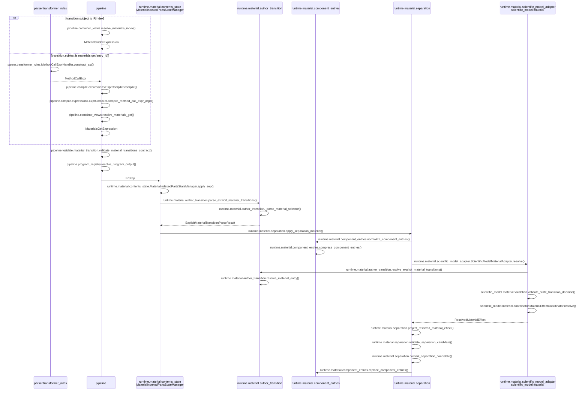

# Scientific Model Module Diagrams

This top-level view contains only the functional flow, implementation sequence,
and complete class map. Detailed subtopics live under
[`scientific_model/`](scientific_model/README.md).

Exact-entry lookup is owned by this integration. Generated entry-ID allocation
belongs to the general Material Runtime and is documented in
[Component Entry Identity](material_compute/component_entry_identity.md).

## 1. Functional Flow

This diagram uses natural language only. It describes the material-selection,
scientific-decision, and atomic-commit logic without implementation names.

```mermaid
flowchart LR
    subgraph SelectStage["1 — Select one live material"]
        direction TB
        Request["Accept a separation or physical-movement request"]
        Normalize["Normalize material into an ordered live-entry list"]
        SelectKind{"Select by position or exact entry ID?"}
        SelectIndex["Select the requested list position"]
        SelectId["Match the requested exact entry ID"]
        Selected{"Entry found?"}

        Request --> Normalize --> SelectKind
        SelectKind -->|position| SelectIndex --> Selected
        SelectKind -->|entry ID| SelectId --> Selected
    end

    subgraph DecideStage["2 — Resolve the scientific result"]
        direction TB
        Freeze["Freeze the selected entry identity"]
        Output["Validate output and target relationship state"]
        Quantities["Resolve conserved output quantities"]
        Decision["Use the author transition or scientific model"]
        Build["Build all candidate output entries"]

        Freeze --> Output --> Quantities --> Decision --> Build
    end

    subgraph CommitStage["3 — Validate and commit"]
        direction TB
        GeneralRuntime["Pass the candidate to the general Material Runtime"]
        Validate["Validate identity, state, output, and conservation"]
        Valid{"Complete candidate valid?"}
        Commit["Commit entries atomically and refresh views"]

        GeneralRuntime --> Validate
        Validate --> Valid -->|yes| Commit
    end

    Reject["Return one diagnostic and preserve committed material"]
    Selected -->|yes| Freeze
    Selected -->|no| Reject
    Build --> GeneralRuntime
    Valid -->|no| Reject

```

## 2. Implementation Sequence

Messages use exact module, class, and method names.

## 3. Complete Class Map

The class map is the implementation ownership boundary. Names match the
repository.

```mermaid
classDiagram
    direction TB

    namespace Pipeline {
        class ContainerViewsModule["pipeline.container_views"] {
            +resolve_materials_index(expr, expr_bindings) MaterialsIndexExpression
            +resolve_materials_get(expr, expr_bindings) MaterialsGetExpression
        }
        class MaterialTransitionContractModule["pipeline.validate.material_transition"] {
            +validate_material_transitions_contract(args, expr_bindings, program_kind, node_id, span) list~Diagnostic~
        }
        class ProgramRegistryModule["pipeline.program_registry"] {
            +get_program_spec(kind) ProgramSpec?
            +get_program_outputs(kind) tuple~ProgramOutput~
            +resolve_program_output(program_kind, enum_type_name, member_name) ProgramOutputResolution
        }
        class MaterialsIndexExpression {
            +container : Any
            +index : Any
        }
        class MaterialsGetExpression {
            +container : Any
            +entry_id : string
        }
        class ProgramSpec {
            +kind : string
            +output_type : type~ProgramOutput~
        }
        class ProgramOutputResolution {
            +output : ProgramOutput?
            +code : string?
            +message : string?
        }
    }

    namespace Runtime {
        class IndexedPartsModule["runtime.material.contents_state"] {
            +MaterialIndexedPartsStateManager.apply_partition_or_index_change(change, state) MaterialUpdateResult
            +MaterialIndexedPartsStateManager.apply_sep(step, state) MaterialUpdateResult
        }
        class AuthorTransitionModule["runtime.material.author_transition"] {
            +parse_explicit_material_transitions(raw_rules, program_kind, declared_source_ref, source_id) ExplicitMaterialTransitionParseResult
            +resolve_explicit_material_transitions(transitions, source_id, source_entries, output_bindings, fractions_by_component) AuthorTransitionResolution
            +resolve_material_entry(selector, source_id, entries) MaterialEntryResolution
            +validate_author_transition_state(current_relation, next_relation, next_association_target) AuthorTransitionStateValidation
            +build_author_state_transition_decision(projected_entry_id, transition, output_id) StateTransitionDecision
        }
        class ComponentEntriesModule["runtime.material.component_entries"] {
            +normalize_component_entries(container, state, container_id) list~dict~
            +replace_component_entries(container, entries)
            +project_component_entries(container)
        }
        class SeparationModule["runtime.material.separation"] {
            +apply_separation_material(..., explicit_transitions, material_effect_adapter, ...) SeparationApplicationResult
            +project_resolved_material_effect(effect, source_entries, output_ids_by_part, ...) MaterialSeparationCandidate
            +validate_separation_candidate(candidate) None
            +commit_separation_candidate(candidate, source, outputs_by_part) dict
        }
        class ScientificModelMaterialAdapter {
            +resolve(..., source_entries, explicit_transitions) ResolvedMaterialEffect
            +resolve_movement(..., entries, source_id, destination_id) ResolvedMaterialEffect
        }
        class MaterialEntryIndexSelector {
            +container_ref : string
            +index : int
        }
        class MaterialEntryIdSelector {
            +container_ref : string
            +entry_id : string
        }
        class MaterialEntryRef {
            +entry_id : string
            +content_ref : string
            +amount : float
            +quantity : Mapping?
            +relation : MaterialRelation
            +association_target : AssociationTarget?
        }
        class ExplicitMaterialTransition {
            +subject : MaterialEntryIndexSelector or MaterialEntryIdSelector
            +output : ProgramOutput
            +next_relation : MaterialRelation
            +next_association_selector : MaterialEntryIndexSelector or MaterialEntryIdSelector or None
        }
        class MaterialEntryResolution {
            +entry : MaterialEntryRef?
            +index : int?
            +live_entry_count : int
            +issues : tuple~AuthorTransitionIssue~
            +resolved : bool
        }
        class MaterialSeparationCandidate {
            +effect : ResolvedMaterialEffect
            +entries_by_part
            +retired_quantities
        }
    }

    namespace ScientificMaterialModel {
        class MaterialValidationModule["scientific_model.material.validation"] {
            +validate_state_transition_decision(payload, decision) MaterialValidationResult
        }
        class MaterialEffectCoordinator {
            +resolve(request, validated_author_decision) ResolvedMaterialEffect
        }
        class ProgramOutput {
            <<abstract enumeration base>>
            +part_id : string
            +semantic_role : string
        }
        class MaterialRelation {
            <<enumeration>>
            FREE
            CONTAINER_SURFACE
            PELLET
            PRECIPITATE
            DISRUPTED
            BEAD_BOUND
            MEMBRANE_BOUND
            CELL_BOUND
            FIELD_RETAINED
            UNRESOLVED
        }
        class AssociationTarget {
            +kind : AssociationTargetKind
            +id : string
        }
        class StateTransitionDecision {
            +transitions : tuple~RelationshipTransition~
            +decision_source
        }
        class RelationshipTransition {
            +component_entry_id : string
            +next_relation : MaterialRelation
            +next_association_target : AssociationTarget?
            +next_label
        }
    }

    ContainerViewsModule --> MaterialsIndexExpression : resolve_materials_index()
    ContainerViewsModule --> MaterialsGetExpression : resolve_materials_get()
    MaterialsIndexExpression --> MaterialEntryIndexSelector : serializes to
    MaterialsGetExpression --> MaterialEntryIdSelector : serializes to
    MaterialTransitionContractModule --> ExplicitMaterialTransition : validates
    MaterialTransitionContractModule --> ProgramRegistryModule : resolves output
    ProgramRegistryModule --> ProgramSpec : get_program_spec()
    ProgramRegistryModule --> ProgramOutputResolution : resolve_program_output()
    ProgramOutputResolution --> ProgramOutput : output
    ProgramSpec --> ProgramOutput : output_type
    IndexedPartsModule --> AuthorTransitionModule : parses transitions
    IndexedPartsModule --> SeparationModule : apply_separation_material()
    AuthorTransitionModule --> MaterialEntryResolution : resolve_material_entry()
    MaterialEntryResolution --> MaterialEntryRef : entry
    ExplicitMaterialTransition --> MaterialEntryIndexSelector : subject
    ExplicitMaterialTransition --> MaterialEntryIdSelector : subject
    ExplicitMaterialTransition --> ProgramOutput : output
    ExplicitMaterialTransition --> MaterialRelation : next_relation
    SeparationModule --> ComponentEntriesModule : normalizes and commits
    SeparationModule --> ScientificModelMaterialAdapter : resolve()
    ScientificModelMaterialAdapter --> MaterialValidationModule : validates author decision
    ScientificModelMaterialAdapter --> MaterialEffectCoordinator : resolves effect
    ScientificModelMaterialAdapter --> MaterialSeparationCandidate : projects
    MaterialEffectCoordinator --> StateTransitionDecision : returns
    StateTransitionDecision *-- RelationshipTransition
    RelationshipTransition --> MaterialRelation : next_relation
    RelationshipTransition --> AssociationTarget : next_association_target
    ComponentEntriesModule --> MaterialEntryRef : supplies authoritative entry data

```

