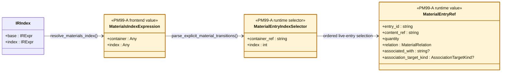
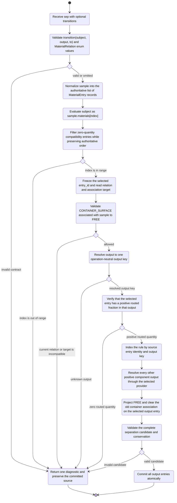
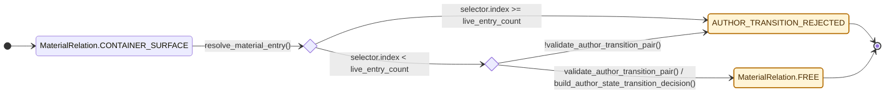

# Scientific Model Module Diagrams

`PM99-A` through `PM99-D` are insertion markers for the now-implemented
author-supplied material relationship transition. Yellow elements are new or
modified by #99; unmarked elements already exist. Electrophoresis lane
identity remains outside this document and is tracked separately by
`culsma/culsma-pm#100`.

## 1. Overall Three-Stage Material Flow

This is the complete prepare, decide, and apply activity. Separation and
physical movement are mutually exclusive branches and rejoin before candidate
validation. The yellow activities locate #99 in the existing flow.

```mermaid
stateDiagram-v2
    direction TB

    state "Accept a separation or cross-container physical-move request" as AcceptRequest
    state "Normalize the current material into canonical component entries" as NormalizeEntries
    state "Classify each entry from canonical identity and current relationship state" as ClassifyEntries
    state OperationKind <<choice>>
    state "PM99-A: validate transitions and resolve each source.materials[index] expression" as ValidateAuthorContract
    state "Resolve one conserved quantity split for every source entry" as ResolveFates
    state "PM99-B: uniquely select each MaterialEntry and read its current relation and association target" as ResolveAuthorSubjects
    state "For every positive separation output, prepare one relationship-state request" as PrepareSeparationTransitions
    state "PM99-C: use the accepted author transition for the selected entry and output; otherwise use the provider" as ResolveSeparationTransitions
    state "PM99-D: project the released relationship into the complete separation candidate" as ProjectSeparationCandidate
    state "Project the positive quantity moving from source to destination" as ProjectMovement
    state "Resolve the relationship state for every positive moved entry" as ResolveMovementTransitions
    state "Build one complete candidate keyed by source entry identity" as BuildCandidate
    state "Compare entries by content, compatible quantity, and relationship state" as CompareEntries
    state EntriesCompatible <<choice>>
    state "Merge quantities and retain one entry identity" as MergeEntries
    state "Keep incompatible entries under distinct identities" as KeepSeparate
    state "Validate relation enums, typed targets, identity, quantity, output contract, and conservation" as ValidateCandidate
    state CandidateValid <<choice>>
    state "Commit authoritative component_entries atomically" as CommitEntries
    state "Refresh read-only compatibility projections" as RefreshViews
    state "Apply movement, capacity, and conservation acceptance gates" as AcceptanceGate
    state "Publish the accepted state" as PublishState
    state "Return a diagnostic and preserve the original committed material" as RejectCandidate

    note right of NormalizeEntries
        Stage 1 — Prepare material entries
    end note
    note right of ClassifyEntries
        Stage 2 — Resolve the scientific effect
    end note
    note right of BuildCandidate
        Stage 3 — Apply, validate, and commit
    end note

    [*] --> AcceptRequest
    AcceptRequest --> NormalizeEntries
    NormalizeEntries --> ClassifyEntries
    ClassifyEntries --> OperationKind
    OperationKind --> ValidateAuthorContract : separation
    ValidateAuthorContract --> ResolveFates
    ResolveFates --> ResolveAuthorSubjects
    ResolveAuthorSubjects --> PrepareSeparationTransitions
    PrepareSeparationTransitions --> ResolveSeparationTransitions
    ResolveSeparationTransitions --> ProjectSeparationCandidate
    ProjectSeparationCandidate --> BuildCandidate
    OperationKind --> ProjectMovement : physical move
    ProjectMovement --> ResolveMovementTransitions
    ResolveMovementTransitions --> BuildCandidate
    BuildCandidate --> CompareEntries
    CompareEntries --> EntriesCompatible
    EntriesCompatible --> MergeEntries : compatible
    EntriesCompatible --> KeepSeparate : incompatible
    MergeEntries --> ValidateCandidate
    KeepSeparate --> ValidateCandidate
    ValidateCandidate --> CandidateValid
    CandidateValid --> RejectCandidate : invalid
    CandidateValid --> CommitEntries : valid
    CommitEntries --> RefreshViews
    RefreshViews --> AcceptanceGate
    AcceptanceGate --> PublishState
    RejectCandidate --> [*]
    PublishState --> [*]

    classDef pm99 fill:#fff4d6,stroke:#b36b00,stroke-width:2px,color:#4a2b00
    class ValidateAuthorContract,ResolveAuthorSubjects,ResolveSeparationTransitions,ProjectSeparationCandidate pm99
```



## 2. #99 Frontend Material Selection

`materials` is the tube's read-only ordered list of live `MaterialEntry`
records after normalization. It is not a dictionary and is not the constructor's
raw `load` list. An index is resolved against that pre-operation list and then
frozen as the selected entry's stable `entry_id`.

```culsma
let source = tube(
  label = "Source",
  load = [
    content(
      kind = bio_cellular,
      type = cell_line,
      code = "RPE1",
      attrs = { state: adherent }
    ):100000cells
  ]
);
let result = sep(
  sample = source,
  program = filtration_program(
    membrane = adherent_cell_surface,
    drive = aspiration
  ),
  transitions = [
    transition(
      subject = source.materials[0],
      output = retentate,
      to = free
    )
  ]
);
```



## 3. #99 Core Activity

The frontend supplies only the subject, output, and target enum. The current
relation and association target are read from the selected `MaterialEntry`; the
author does not repeat a `from` precondition.



## 4. #99 Relationship State Machine

This state machine is deliberately limited to the one #99 author transition.
Both values are members of `MaterialRelation`; neither is free text. Other
provider-owned transitions remain unchanged.



## 5. #99 Dedicated Runtime Sequence

Every participant and message below is an existing module, class, field, or
method name. The sequence contains no descriptive prose calls.

```mermaid
sequenceDiagram
    participant Contract as PM99-A<br/>pipeline.validate.material_transition
    participant View as PM99-A<br/>pipeline.container_views
    participant Indexed as runtime.material.contents_state
    participant Separation as runtime.material.separation
    participant Entries as runtime.material.component_entries
    participant Author as PM99-A/B/C<br/>runtime.material.author_transition
    participant Adapter as runtime.material.scientific_model_adapter
    participant Validation as scientific_model.material.validation
    participant Coordinator as scientific_model.material.coordinator

    rect rgb(255, 244, 214)
        Contract->>View: resolve_materials_index(expr=transition.subject, expr_bindings=expr_bindings)
        View-->>Contract: MaterialsIndexExpression
        Contract->>Contract: validate_material_transitions_contract(args=args, expr_bindings=expr_bindings, output_contract=output_contract, node_id=node_id, span=span)
        Indexed->>Author: parse_explicit_material_transitions(step.args.get("transitions"), output_contract=separation_slot_contract(program_kind), declared_source_ref=ref_display(sample_arg), source_id=source_id)
        Author-->>Indexed: ExplicitMaterialTransitionParseResult
    end

    alt parse_result.issues
        Indexed->>Indexed: diagnostic_result(step, state, parse_result.issues[0].code, parse_result.issues[0].message)
    else not parse_result.issues
        Indexed->>Indexed: working = deepcopy(state)
        Indexed->>Separation: apply_separation_material(state=working, source=source, slot0=slot0, slot1=slot1, program=program, explicit_fates=explicit_fates, explicit_transitions=parse_result.transitions, material_effect_adapter=self.material_effect_adapter, request_id=step.step_id, source_id=source_id, output_ids_by_part=output_ids_by_part)
        Separation->>Entries: normalize_component_entries(source, state=state, container_id=source_id)
        Entries-->>Separation: list[dict[str, Any]]
        Separation->>Adapter: ScientificModelMaterialAdapter.resolve(state=state, source=source, source_entries=source_entries, components=components, operation_contract=operation_contract, request_id=request_id, source_id=source_id, output_ids_by_part=output_ids_by_part, explicit_transitions=explicit_transitions)

        rect rgb(255, 244, 214)
            Adapter->>Author: resolve_explicit_material_transitions(transitions=explicit_transitions, source_id=source_id, source_entries=source_entries, output_bindings=resolved_outputs, fractions_by_component=fractions_by_component)
            Author->>Author: resolve_material_entry(selector=transition.subject, source_id=source_id, entries=source_entries)
            Author->>Author: validate_author_transition_pair(current_relation=source_entry.relation, current_target=source_entry.association_target, source_id=source_id, next_relation=transition.next_relation)
            Author->>Author: validate_positive_output_fraction(source_entry_id=source_entry.entry_id, output_key=output_key, output_bindings=output_bindings, fractions_by_component=fractions_by_component)
            Author-->>Adapter: AuthorTransitionResolution
        end

        alt transition_resolution.issues
            Adapter-->>Separation: MaterialEffectFailure(code=transition_resolution.issues[0].code, message=transition_resolution.issues[0].message)
        else not transition_resolution.issues
            loop component in components.values()
                loop (output, fraction) in zip(output_roles, component_fractions)
                    Adapter->>Adapter: output_key = output.part_id
                    alt (component.entry_id, output_key) in transition_resolution.transitions_by_output
                        rect rgb(255, 244, 214)
                            Adapter->>Author: build_author_state_transition_decision(projected_entry_id=projected_snapshot.entry_id, transition=transition_resolution.transitions_by_output[(component.entry_id, output_key)])
                            Author-->>Adapter: StateTransitionDecision
                            Adapter->>Validation: validate_state_transition_decision(transition_request.payload, author_decision)
                            Validation-->>Adapter: MaterialValidationResult
                            Adapter->>Coordinator: MaterialEffectCoordinator.resolve(transition_request, validated_author_decision=author_decision)
                        end
                    else (component.entry_id, output_key) not in transition_resolution.transitions_by_output
                        Adapter->>Coordinator: MaterialEffectCoordinator.resolve(transition_request)
                    end
                end
            end
            Adapter-->>Separation: ResolvedMaterialEffect
            rect rgb(255, 244, 214)
                Separation->>Separation: project_resolved_material_effect(effect, source_entries=source_entries, output_ids_by_part=output_ids_by_part, ...)
                Separation->>Separation: resolved_output_component_entry(component, output, source_entry=source_entry, ...)
                Separation->>Separation: validate_separation_candidate(candidate)
                Separation->>Separation: commit_separation_candidate(candidate, source=source, outputs_by_part=outputs_by_part)
                Separation->>Entries: replace_component_entries(output_container, candidate.entries_by_part[part_id])
            end
            Separation-->>Indexed: SeparationApplicationResult(record=record, effect=resolution)
        end
    end
```



## 6. Runtime Context Sequence

This retains the full runtime path and marks the #99 calls at their insertion
points. Sequence messages use exact current module and method names.

```mermaid
sequenceDiagram
    participant Contract as PM99-A<br/>pipeline.validate.material_transition
    participant Compute as runtime.material.compute<br/>MaterialCompute.apply_step()
    participant State as runtime.material.state<br/>MaterialStateManager.apply_change()
    participant Indexed as runtime.material.contents_state<br/>MaterialIndexedPartsStateManager.apply_partition_or_index_change()
    participant Mutation as runtime.material.mutation<br/>apply_mutation()
    participant Separation as runtime.material.separation<br/>apply_separation_material()
    participant Movement as runtime.material.movement<br/>apply_material_movement()
    participant Entries as runtime.material.component_entries<br/>normalize_component_entries()
    participant Fate as runtime.material.separation_fate<br/>parse_explicit_content_fates()
    participant Author as PM99-A/B/C<br/>runtime.material.author_transition
    participant Adapter as runtime.material.scientific_model_adapter<br/>ScientificModelMaterialAdapter.resolve()
    participant Validation as scientific_model.material.validation<br/>validate_state_transition_decision()
    participant Coordinator as scientific_model.material.coordinator<br/>MaterialEffectCoordinator.resolve()
    participant Resolver as scientific_model.resolver<br/>RegistryScientificModelResolver.resolve()
    participant Provider as scientific_model.material.builtin<br/>BuiltinMaterialRulebookProvider.resolve()
    participant Suspension as runtime.material.suspension<br/>refresh_cell_suspension_relationship()
    participant Conservation as runtime.material.conservation<br/>totals_conserved_with_declared_retirements()
    participant MovementAudit as runtime.material.movements<br/>derive_material_movements()

    opt step.args.get("transitions") is not None
        Contract->>Contract: validate_material_transitions_contract(args=args, expr_bindings=expr_bindings, output_contract=output_contract, node_id=node_id, span=span)
    end

    Compute->>State: MaterialStateManager.apply_change(change_plan, state)

    alt transition_plan.transition == "sep"
        State->>Indexed: apply_partition_or_index_change(contents_plan, state)
        Indexed->>Indexed: MaterialIndexedPartsStateManager.apply_sep(step, state)
        Indexed->>Fate: parse_explicit_content_fates(step.args.get("component_fates"), slot_contract, known_components)
        Indexed->>Author: parse_explicit_material_transitions(step.args.get("transitions"), output_contract=separation_slot_contract(program_kind), declared_source_ref=ref_display(sample_arg), source_id=source_id)
        Indexed->>Separation: apply_separation_material(state=working, source=source, slot0=slot0, slot1=slot1, program=program, explicit_fates=explicit_fates, explicit_transitions=parse_result.transitions, material_effect_adapter=self.material_effect_adapter, request_id=step.step_id, source_id=source_id, output_ids_by_part=output_ids_by_part)
        Separation->>Entries: normalize_component_entries(source, state=state, container_id=source_id)
        Separation->>Adapter: ScientificModelMaterialAdapter.resolve(state=state, source=source, source_entries=source_entries, components=components, operation_contract=operation_contract, request_id=request_id, source_id=source_id, output_ids_by_part=output_ids_by_part, explicit_transitions=explicit_transitions)
        Adapter->>Author: resolve_explicit_material_transitions(transitions=explicit_transitions, source_id=source_id, source_entries=source_entries, output_bindings=resolved_outputs, fractions_by_component=fractions_by_component)
        loop component in components.values()
            loop (output, fraction) in zip(output_roles, component_fractions)
                alt (component.entry_id, output.part_id) in transition_resolution.transitions_by_output
                    Adapter->>Author: build_author_state_transition_decision(projected_entry_id=projected_snapshot.entry_id, transition=transition_resolution.transitions_by_output[(component.entry_id, output.part_id)])
                    Adapter->>Validation: validate_state_transition_decision(transition_request.payload, author_decision)
                    Adapter->>Coordinator: MaterialEffectCoordinator.resolve(transition_request, validated_author_decision=author_decision)
                else (component.entry_id, output.part_id) not in transition_resolution.transitions_by_output
                    Adapter->>Coordinator: MaterialEffectCoordinator.resolve(transition_request)
                    Coordinator->>Resolver: RegistryScientificModelResolver.resolve(transition_request)
                    Resolver->>Provider: BuiltinMaterialRulebookProvider.resolve(transition_request)
                    Provider->>Provider: resolve_state_transition(payload, provenance)
                end
            end
        end
        Separation->>Separation: project_resolved_material_effect(effect, source_entries=source_entries, output_ids_by_part=output_ids_by_part, ...)
        Separation->>Separation: resolved_output_component_entry(component, output, source_entry=source_entry, ...)
        Separation->>Separation: validate_separation_candidate(candidate)
        Separation->>+Separation: commit_separation_candidate(candidate, source=source, outputs_by_part=outputs_by_part)
        Separation->>Entries: replace_component_entries(output_container, candidate.entries_by_part[part_id])
        Entries->>Entries: project_component_entries(output_container)
        deactivate Separation
        Indexed->>Suspension: refresh_cell_suspension_relationship(working, output_id)
    else transition_plan.transition in {"add", "select"}
        alt transition_plan.plan_kind == "quantity_or_composition"
            State->>Mutation: apply_mutation(step, state, material_effect_adapter)
            Mutation->>Movement: apply_material_movement(source, target, ratio, adapter)
        else transition_plan.plan_kind == "partition_or_index"
            State->>Indexed: apply_partition_or_index_change(contents_plan, state)
            Indexed->>Indexed: apply_mutation_transition(step, state)
            Indexed->>Movement: apply_material_movement(source, target, ratio, adapter)
        end
        Movement->>Movement: project_material_movement(...)
        Movement->>Entries: normalize_component_entries(source, state=state, container_id=source_id)
        Movement->>Adapter: ScientificModelMaterialAdapter.resolve_movement(state=state, source=source, entries=entries, request_id=request_id, source_id=source_id, destination_id=destination_id)
        Adapter->>Coordinator: MaterialEffectCoordinator.resolve(transition_request)
        Coordinator->>Resolver: RegistryScientificModelResolver.resolve(transition_request)
        Resolver->>Provider: BuiltinMaterialRulebookProvider.resolve(transition_request)
        Provider->>Provider: resolve_state_transition(payload, provenance)
        Movement->>Entries: plan_component_entry_transfer(source, target, transitions_by_entry_id, ...)
        Movement->>+Movement: commit_material_movement(candidate, source, target)
        Movement->>Entries: replace_component_entries(source, transfer.source_entries)
        deactivate Movement
    end

    Compute->>Conservation: totals_conserved_with_declared_retirements(...)
    Compute->>MovementAudit: derive_material_movements(...)
```



## 7. #99 Typed Class Diagram

The class diagram expresses the same design as the activity and sequence
diagrams. Runtime material entries are an ordered list; `MaterialsIndexExpression`
is the frontend pattern and `MaterialEntryIndexSelector` is its typed Runtime
form. There is no dictionary key and no author-supplied `from_precondition`. Every
named class and method below now exists in the program.

```mermaid
classDiagram
    direction TB

    namespace Pipeline {
        class ContainerViewsModule["pipeline.container_views"] {
            <<PM99-A>>
            +resolve_materials_index(expr, expr_bindings) MaterialsIndexExpression
        }
        class MaterialTransitionContractModule["pipeline.validate.material_transition"] {
            <<PM99-A>>
            +validate_material_transitions_contract(args, expr_bindings, output_contract, node_id, span) list~Diagnostic~
        }
        class MaterialsIndexExpression {
            <<PM99-A>>
            +container : Any
            +index : Any
        }
    }

    namespace Runtime {
        class AuthorTransitionCoreModule["runtime.material.author_transition"] {
            <<IMPLEMENTED PM99 CORE>>
            +ALLOWED_AUTHOR_TRANSITIONS : frozenset~tuple[MaterialRelation, MaterialRelation]~
            +resolve_material_entry(selector, source_id, entries) MaterialEntryResolution
            +validate_author_transition_pair(current_relation, current_target, source_id, next_relation) AuthorTransitionPairValidation
            +project_component_relationship(source_entry, next_relation) ComponentRelationshipProjection
            +build_author_state_transition_decision(projected_entry_id, transition) StateTransitionDecision
            +apply_explicit_material_transition(transition, source_id, source_entries) ExplicitMaterialTransitionResult
        }
        class AuthorTransitionIntegrationModule["runtime.material.author_transition"] {
            <<IMPLEMENTED PM99-A/B>>
            +parse_explicit_material_transitions(raw_rules, output_contract, declared_source_ref, source_id) ExplicitMaterialTransitionParseResult
            +resolve_explicit_material_transitions(transitions, source_id, source_entries, output_bindings, fractions_by_component) AuthorTransitionResolution
            +validate_positive_output_fraction(source_entry_id, output_key, output_bindings, fractions_by_component) OutputFractionValidation
        }
        class MaterialEntryIndexSelector {
            <<IMPLEMENTED immutable value>>
            +container_ref : string
            +index : int
        }
        class MaterialEntryRef {
            <<IMPLEMENTED read-only value>>
            +entry_id : string
            +content_ref : string
            +amount : float
            +quantity : Mapping
            +relation : MaterialRelation
            +association_target : AssociationTarget?
            +preservation : string?
            +label : string?
        }
        class ExplicitMaterialTransition {
            <<IMPLEMENTED typed input>>
            +subject : MaterialEntryIndexSelector
            +output_key : string
            +next_relation : MaterialRelation
        }
        class ResolvedExplicitMaterialTransition {
            <<IMPLEMENTED runtime value>>
            +source_entry_id : string
            +output_key : string
            +current_relation : MaterialRelation
            +current_association_target : AssociationTarget?
            +next_relation : MaterialRelation
        }
        class ExplicitMaterialTransitionResult {
            <<IMPLEMENTED result>>
            +source_entry : MaterialEntryRef?
            +transition : ResolvedExplicitMaterialTransition?
            +projection : ComponentRelationshipProjection?
            +decision : StateTransitionDecision?
            +issues : tuple~AuthorTransitionIssue~
            +applied : bool
        }
        class ExplicitMaterialTransitionParseResult {
            <<IMPLEMENTED PM99-A>>
            +transitions : tuple~ExplicitMaterialTransition~
            +issues : tuple~AuthorTransitionIssue~
        }
        class MaterialEntryResolution {
            <<IMPLEMENTED PM99 CORE>>
            +entry : MaterialEntryRef?
            +index : int?
            +live_entry_count : int
            +issues : tuple~AuthorTransitionIssue~
            +resolved : bool
        }
        class AuthorTransitionPairValidation {
            <<IMPLEMENTED PM99 CORE>>
            +issues : tuple~AuthorTransitionIssue~
            +is_valid : bool
        }
        class OutputFractionValidation {
            <<IMPLEMENTED PM99-B>>
            +issues : tuple~AuthorTransitionIssue~
            +is_valid : bool
        }
        class AuthorTransitionResolution {
            <<IMPLEMENTED PM99-B>>
            +transitions_by_output : Mapping~tuple[source_entry_id, output_key], ResolvedExplicitMaterialTransition~
            +issues : tuple~AuthorTransitionIssue~
        }
        class ComponentRelationshipProjection {
            <<IMPLEMENTED PM99 CORE>>
            +relation : MaterialRelation
            +associated_with : string?
            +association_target_kind : AssociationTargetKind?
            +preservation
            +label
        }
        class ScientificModelMaterialAdapter {
            <<IMPLEMENTED PM99-C>>
            +resolve(..., source_entries, explicit_transitions) ResolvedMaterialEffect
        }
        class RuntimeSeparationModule["runtime.material.separation"] {
            <<IMPLEMENTED PM99-D>>
            +project_resolved_material_effect(...) MaterialSeparationCandidate
            +resolved_output_component_entry(...) dict
            +validate_separation_candidate(candidate) None
            +commit_separation_candidate(candidate, source, outputs_by_part) dict
        }
        class MaterialSeparationCandidate {
            +effect : ResolvedMaterialEffect
            +entries_by_part
            +retired_quantities
        }
    }

    namespace ScientificMaterialModel {
        class MaterialRelation {
            <<enumeration>>
            FREE
            CONTAINER_SURFACE
            PELLET
            PRECIPITATE
            DISRUPTED
            BEAD_BOUND
            MEMBRANE_BOUND
            CELL_BOUND
            FIELD_RETAINED
            UNRESOLVED
        }
        class AssociationTargetKind {
            <<enumeration>>
            CONTAINER
            COMPONENT_ENTRY
        }
        class AssociationTarget {
            +kind : AssociationTargetKind
            +id : string
        }
        class StateTransitionDecision {
            +transitions : tuple~RelationshipTransition~
            +decision_source
        }
        class RelationshipTransition {
            +component_entry_id : string
            +next_relation : string
            +next_association_target : AssociationTarget?
            +next_label
        }
    }

    ContainerViewsModule --> MaterialsIndexExpression : resolves
    MaterialsIndexExpression --> MaterialEntryIndexSelector : serializes to
    MaterialTransitionContractModule --> ExplicitMaterialTransition : validates
    ExplicitMaterialTransition --> MaterialEntryIndexSelector : subject
    ExplicitMaterialTransition --> MaterialRelation : next_relation
    AuthorTransitionIntegrationModule --> ExplicitMaterialTransitionParseResult : parses
    AuthorTransitionIntegrationModule --> OutputFractionValidation : validates
    AuthorTransitionCoreModule --> MaterialEntryResolution : resolve_material_entry()
    MaterialEntryResolution --> MaterialEntryRef : entry
    AuthorTransitionCoreModule --> AuthorTransitionPairValidation : validate_author_transition_pair()
    AuthorTransitionCoreModule --> ResolvedExplicitMaterialTransition : resolves
    AuthorTransitionCoreModule --> ExplicitMaterialTransitionResult : apply_explicit_material_transition()
    ExplicitMaterialTransitionResult --> ComponentRelationshipProjection : projection
    AuthorTransitionResolution --> ResolvedExplicitMaterialTransition : transitions_by_output
    AuthorTransitionResolution --> ScientificModelMaterialAdapter : transitions_by_output
    AuthorTransitionCoreModule --> StateTransitionDecision : build_author_state_transition_decision()
    StateTransitionDecision *-- RelationshipTransition
    RelationshipTransition --> MaterialRelation : next_relation
    RelationshipTransition --> AssociationTarget : next_association_target
    AssociationTarget --> AssociationTargetKind : kind
    AuthorTransitionCoreModule --> ComponentRelationshipProjection : project_component_relationship()
    ScientificModelMaterialAdapter --> MaterialSeparationCandidate : resolves
    RuntimeSeparationModule --> MaterialSeparationCandidate : validates and commits

    note for AuthorTransitionCoreModule "ALLOWED_AUTHOR_TRANSITIONS = frozenset({(MaterialRelation.CONTAINER_SURFACE, MaterialRelation.FREE)})"

    style ContainerViewsModule fill:#fff4d6,stroke:#b36b00,stroke-width:2px,stroke-dasharray:6 4
    style MaterialTransitionContractModule fill:#fff4d6,stroke:#b36b00,stroke-width:2px,stroke-dasharray:6 4
    style MaterialsIndexExpression fill:#fff4d6,stroke:#b36b00,stroke-width:2px
    style AuthorTransitionIntegrationModule fill:#fff4d6,stroke:#b36b00,stroke-width:2px,stroke-dasharray:6 4
    style ExplicitMaterialTransitionParseResult fill:#fff4d6,stroke:#b36b00,stroke-width:2px
    style OutputFractionValidation fill:#fff4d6,stroke:#b36b00,stroke-width:2px
    style AuthorTransitionResolution fill:#fff4d6,stroke:#b36b00,stroke-width:2px
    style ScientificModelMaterialAdapter fill:#fff4d6,stroke:#b36b00,stroke-width:2px
    style RuntimeSeparationModule fill:#fff4d6,stroke:#b36b00,stroke-width:2px
    style AuthorTransitionCoreModule fill:#e8f5e9,stroke:#2e7d32,stroke-width:2px
    style MaterialEntryIndexSelector fill:#e8f5e9,stroke:#2e7d32,stroke-width:2px
    style MaterialEntryRef fill:#e8f5e9,stroke:#2e7d32,stroke-width:2px
    style ExplicitMaterialTransition fill:#e8f5e9,stroke:#2e7d32,stroke-width:2px
    style ResolvedExplicitMaterialTransition fill:#e8f5e9,stroke:#2e7d32,stroke-width:2px
    style ExplicitMaterialTransitionResult fill:#e8f5e9,stroke:#2e7d32,stroke-width:2px
    style MaterialEntryResolution fill:#e8f5e9,stroke:#2e7d32,stroke-width:2px
    style AuthorTransitionPairValidation fill:#e8f5e9,stroke:#2e7d32,stroke-width:2px
    style ComponentRelationshipProjection fill:#e8f5e9,stroke:#2e7d32,stroke-width:2px
```



## 8. PM99 Insertion Map

| Marker | Exact insertion locations |
| --- | --- |
| `PM99-A` | implemented `pipeline.container_views.resolve_materials_index()`, `pipeline.validate.material_transition.validate_material_transitions_contract()`, and `runtime.material.author_transition.parse_explicit_material_transitions()` |
| `PM99-B` | implemented `runtime.material.author_transition.resolve_material_entry()`, `validate_author_transition_pair()`, `resolve_explicit_material_transitions()`, and `validate_positive_output_fraction()` |
| `PM99-C` | implemented `runtime.material.author_transition.build_author_state_transition_decision()` and the adapter calls to `scientific_model.material.validation.validate_state_transition_decision()` and `scientific_model.material.coordinator.MaterialEffectCoordinator.resolve(validated_author_decision=...)` |
| `PM99-D` | implemented output projection through `runtime.material.separation.project_resolved_material_effect()`, `resolved_output_component_entry()`, `validate_separation_candidate()`, and `commit_separation_candidate()`; the author transition clears the old association and is recorded as `author_transition` |
