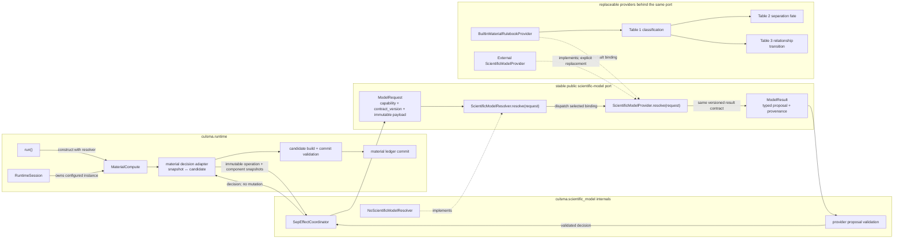
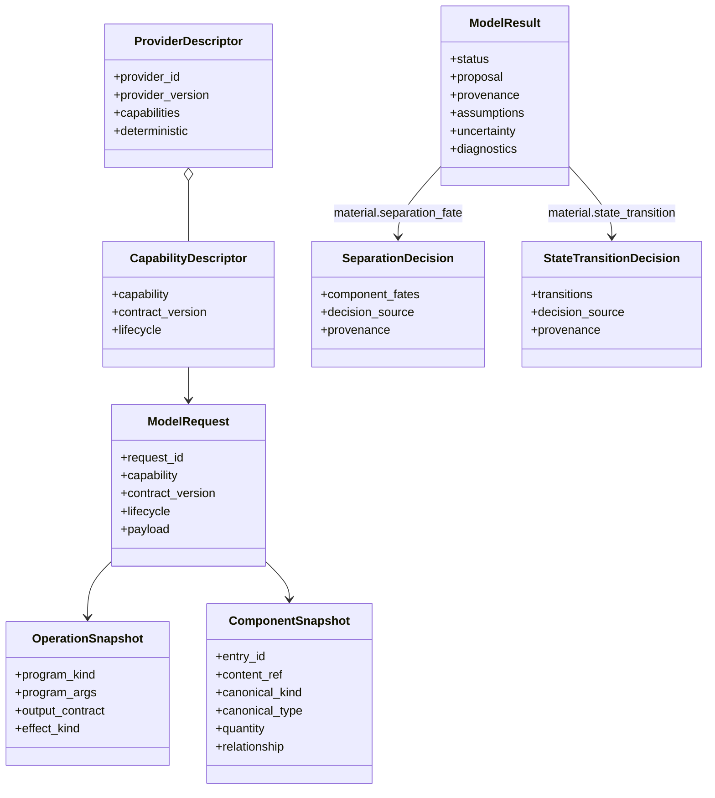
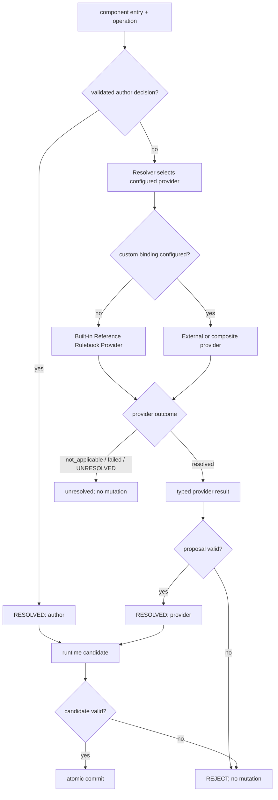
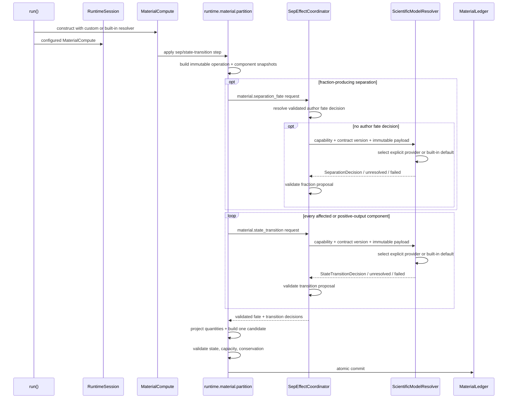
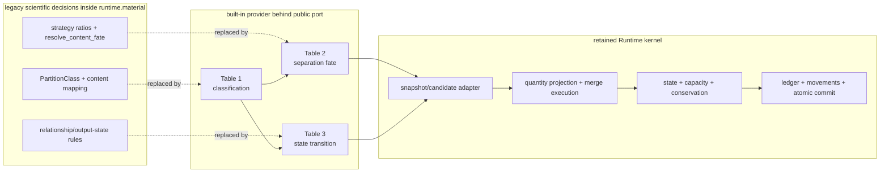

# Scientific Model Module Diagrams

Status: `implementation in progress`
Phase: `1 — material separation and state-transition decisions`
Current boundary: `framework and Runtime dependency wiring complete; provider decisions not yet authoritative`
Normative extension contract: `culsma-reference/extensions/scientific_model/README.md`
Built-in provider semantics: `culsma-reference/extensions/scientific_model/builtin_material_rulebook.md`

## 1. Architecture Decision

| Item | Decision |
| --- | --- |
| Architecture | Ports and adapters + pure decision core |
| Package | `src/culsma/scientific_model/` |
| Runtime integration | Explicit dependency injection |
| Plug-in discovery | Explicit provider registration in Phase 1 |
| Stable public unit | `capability + contract_version + ModelRequest/ModelResult` |
| Provider replacement | Change binding only; Runtime adapter remains unchanged |
| Default scientific implementation | Built-in Reference Rulebook Provider |
| Resolver scope | Resolve every non-authored scientific decision through the selected provider |
| Provider authority | Propose typed scientific effects |
| Commit authority | Runtime kernel only |
| Mutable runtime state across boundary | Forbidden |
| Default provider | `BuiltinMaterialRulebookProvider` |

## 2. Vocabulary Boundary

| Term | Meaning | Authority |
| --- | --- | --- |
| Built-in Reference Rulebook | Official default provider behavior; Tables 1–3 | Culsma Reference |
| Rulebook implementation | Built-in scientific-model provider | `scientific_model.material` |
| Scientific Model Resolver | Typed capability resolution | `scientific_model.resolver` |
| Scientific Provider | Replaceable source of typed scientific decisions | External or built-in adapter |
| Proposal validator | Validates untrusted provider output | Culsma kernel |
| Candidate validator | Validates quantities, state, conservation, and capacity | `runtime.material` |
| Commit | Atomic material-ledger mutation | `runtime.material` |

## 3. Dependency Boundary



Only the public port crosses the replaceable-model boundary. `MaterialCompute`,
runtime dictionaries, candidate construction, and ledger commit are not provider
APIs.

### Import Rules

| From | May import | Must not import |
| --- | --- | --- |
| `scientific_model` | standard library; its own public contracts | `runtime`, mutable material state, driver implementations |
| External provider | `scientific_model` public contracts | `runtime`, ledger, container dictionaries |
| `runtime.material` | `scientific_model` contracts/coordinator | external provider implementation |
| `pipeline.program_registry` | pipeline types | scientific calculation rules |
| `scientific_model.material` | normalized operation contract | parser AST, plan nodes, runtime dictionaries |

## 4. Package Layout

```text
src/culsma/
├── scientific_model/
│   ├── __init__.py
│   ├── contracts.py
│   ├── resolver.py
│   ├── registry.py
│   └── material/
│       ├── __init__.py
│       ├── contracts.py
│       ├── classification.py
│       ├── rulebook.py
│       ├── builtin.py
│       ├── coordinator.py
│       └── validation.py
│
└── runtime/
    ├── executor.py
    ├── session.py
    └── material/
        ├── compute.py
        ├── partition.py
        ├── separation_fate.py
        ├── contents_state.py
        ├── conservation.py
        └── ledger.py
```

## 5. Module Ownership

| Module | Owns | Does not own |
| --- | --- | --- |
| `scientific_model/contracts.py` | capability envelope, status, provenance, provider protocol | material-specific facts |
| `scientific_model/resolver.py` | provider selection, dispatch, exception containment, `NoModel` | provider rules, state mutation |
| `scientific_model/registry.py` | explicit `capability → provider` binding | automatic environment discovery |
| `material/contracts.py` | immutable operation/component/relationship snapshots and decisions | runtime dictionaries |
| `material/classification.py` | built-in provider Table 1: canonical `kind/type → G` | external provider behavior |
| `material/rulebook.py` | built-in provider Tables 2–3 | provider dispatch, quantity mutation |
| `material/builtin.py` | official provider implementing the Reference Rulebook | resolver selection, ledger commit |
| `material/coordinator.py` | author precedence, resolver request, final typed decision | ledger commit |
| `material/validation.py` | provider proposal shape, bounds, IDs, fraction sums | capacity and ledger conservation |
| `runtime/material/partition.py` | snapshot adapter, quantity projection, candidate construction | scientific classification and ratio tables |
| `runtime/material/conservation.py` | candidate conservation | scientific resolution |
| `runtime/material/ledger.py` | authoritative state mutation | scientific decisions |

## 6. Typed Contracts



One separation candidate may use the port twice before any mutation: Table 2
returns `SeparationDecision`, then Table 3 returns `StateTransitionDecision` for
the positive output entries. A state-transition-only program such as `disrupt`
uses only the second capability. Both decisions belong to one candidate and one
atomic commit.

## 7. Resolution Order



### Precedence Table

| Priority | Source | Can override earlier result? | Next step |
| ---: | --- | --- | --- |
| 1 | Validated author `component_fates` | No | candidate |
| 2 | Explicit resolver capability binding | Selects one provider or composite provider | result validation |
| 3 | Built-in Reference Rulebook Provider | Default when no custom binding exists | proposal validation or unresolved |
| 4 | No provider / not applicable / failed / `UNRESOLVED` | No | unresolved diagnostic |

## 8. Resolver Contract

```python
class ScientificModelResolver(Protocol):
    def capabilities(self) -> tuple[CapabilityDescriptor, ...]: ...
    def resolve(self, request: ModelRequest) -> ModelResult: ...


class ScientificModelProvider(Protocol):
    @property
    def descriptor(self) -> ProviderDescriptor: ...
    def resolve(self, request: ModelRequest) -> ModelResult: ...
```

| Rule | Phase 1 value |
| --- | --- |
| Capabilities | `material.separation_fate`, `material.state_transition` |
| Contract version | `1.0` |
| Lifecycle | `runtime_precommit` |
| Provider count | One configured provider per capability |
| Resolver count | One configured resolver per run |
| Providers per resolver | Zero to many; selected through capability bindings |
| Multiple models | A chain/ensemble implements one provider |
| Default capability bindings | Both material capabilities → `BuiltinMaterialRulebookProvider` |
| External component | Explicitly replaces or wraps the built-in provider |
| Implicit fallback chain | Forbidden |
| Transport | Synchronous interface; adapter owns remote/container transport |
| Provider statuses | `resolved`, `not_applicable`, `failed` |
| Kernel-only status | `rejected` |
| Discovery | Explicit injection; no package auto-discovery |

### Stable Public Replacement Contract

| Surface | Compatibility rule |
| --- | --- |
| `ScientificModelResolver.resolve(ModelRequest) -> ModelResult` | Stable public call boundary |
| `ScientificModelProvider.resolve(ModelRequest) -> ModelResult` | Every built-in, external, remote, or future provider implements the same boundary |
| `capability` | Selects the decision family without exposing provider internals |
| `contract_version` | Versions payload/result schemas independently of provider versions |
| Provider replacement | Change explicit capability binding; no Runtime adapter or ledger change |
| Contract upgrade | Add/version the capability contract; do not reinterpret an existing version |
| Runtime objects | Never cross the boundary |
| Commit authority | Never crosses the boundary |

## 9. Runtime Composition



### Runtime API

```python
result = run(
    plan=plan,
    driver=driver,
    scientific_model=resolver,  # optional
)
```

| Compatibility rule | Decision |
| --- | --- |
| Existing callers | Unchanged |
| Default parameter | `None` → resolver with built-in Reference provider |
| Default resolver implementation | `RegistryScientificModelResolver` from `create_default_scientific_model_resolver()` |
| Global resolver singleton | Forbidden |
| Session lifetime | One selected resolver per run |
| Resolver contents | Many providers permitted; one selected binding per `capability@contract_version` |
| Existing `apply_step(...)` facade | Retained temporarily |
| Internal execution path | `session.material_compute.apply_step(...)` |

## 10. Current-to-Target Move Map



| Current location | Current responsibility | Target |
| --- | --- | --- |
| `runtime/material/partition.py::PartitionClass` | calculation groups | `scientific_model/material/classification.py` |
| `runtime/material/partition.py::_CONTENT_CLASS_BY_KIND_TYPE` | Table 1 | `scientific_model/material/classification.py` |
| `runtime/material/partition.py::SepPartitionStrategy*` | ratios + output classes | `scientific_model/material/rulebook.py` |
| `runtime/material/separation_fate.py` | operation/relationship decisions | contracts + Rulebook + coordinator |
| `runtime/material/contents_state.py` relationship refresh | post-separation state decisions | apply validated Table 3 transitions only |
| `runtime/material/partition.py::partition_sep_material` | decision + quantity projection + mutation | runtime adapter: snapshots, decision application, candidate construction |
| `runtime/steps.py::apply_material_step` | global material-compute facade | session-owned `MaterialCompute` |
| `pipeline/program_registry.py` | program syntax/fields/result slots | unchanged |
| `runtime/material/ledger.py` | authoritative quantities | unchanged |

## 11. Implementation Slices

| Slice | Change | Exit condition |
| ---: | --- | --- |
| 1 | Add package, contracts, resolver, registry, built-in provider shell, and dependency wiring through `run → session → MaterialCompute` | isolated and Runtime injection tests pass |
| 2 | Implement built-in provider Table 1 classification | canonical classification conformance passes |
| 3 | Implement built-in centrifuge Table 2 fate and Table 3 transitions | exact fractions and output relationships pass conformance |
| 4 | Convert `partition.py` to adapter/applier and resolve both capabilities before candidate construction | Case 00 and Case 09 pass |
| 5 | Remove legacy centrifuge decision lookup | built-in default and third-party replacement both drive validated candidates through the same port |
| 6 | Migrate filtration, centrifugal filtration, precipitation, magnetic | existing separation regressions pass |
| 7 | Route phase partition, field, generic sep, disrupt through coordinator | every registered `sep` program has controlled outcome |
| 8 | Remove compatibility-only strategy logic | full suite and architecture checks pass |

## 12. Phase 1 Invariants

| Invariant | Required |
| --- | ---: |
| Provider receives immutable semantic snapshots only | Yes |
| Provider receives already-resolved components | No |
| Provider mutates runtime state | No |
| Provider introduces a new `content_ref` | No |
| Fractions are finite and in `[0, 1]` | Yes |
| Per-component output fractions sum to `1` | Yes |
| Built-in Rulebook is reached through the resolver | Yes |
| External provider selection is explicit and recorded | Yes |
| External provider may replace or wrap built-in provider | Yes |
| Runtime silently appends built-in fallback after an external provider | No |
| `UNRESOLVED` silently becomes `0.5/0.5` | No |
| Candidate commits before validation | No |
| Provenance is recorded with provider decisions | Yes |
| Next operation reclassifies committed components | Yes |
