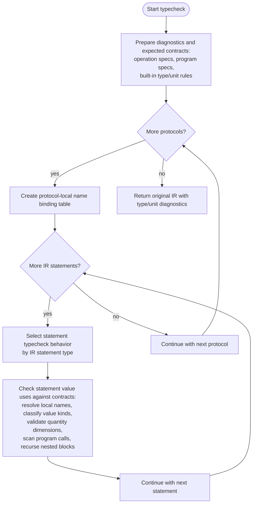
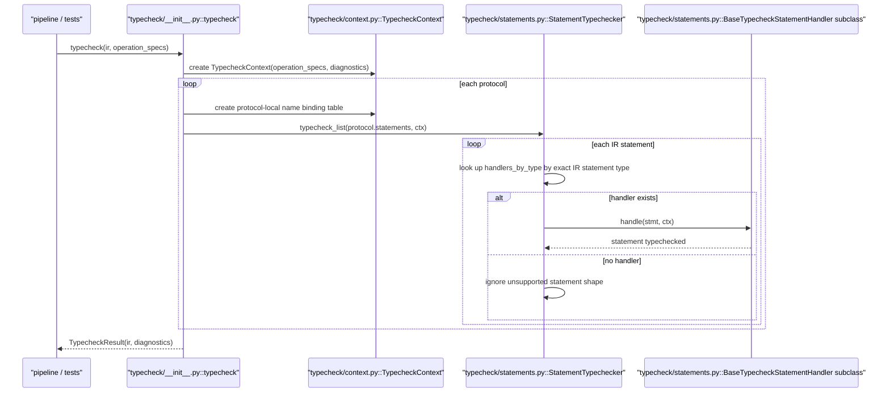
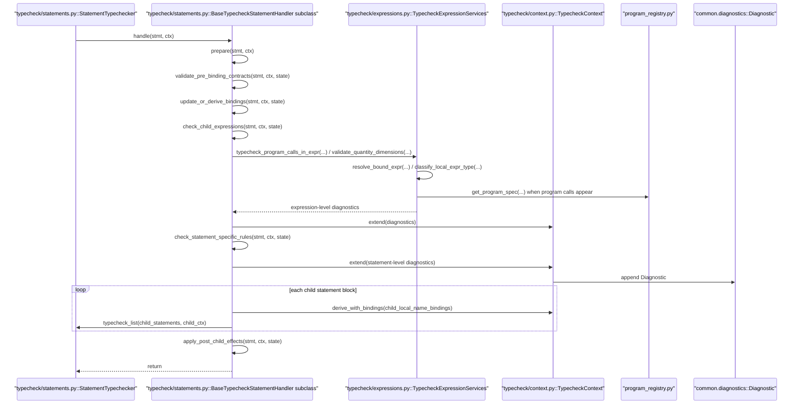
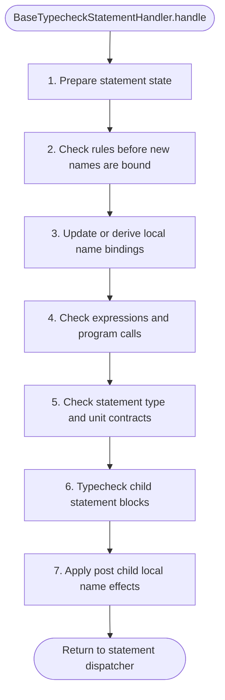
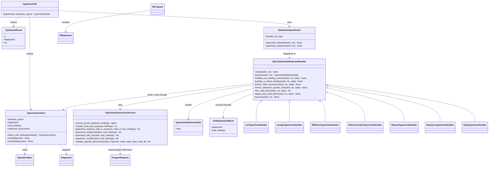

# Typecheck Module Diagrams

Last updated: 2026-04-23

Related IR document:

1. [ir_structure_diagrams.md](https://github.com/culsma/culsma/blob/main/docs/architecture/ir_structure_diagrams.md)

## Scope

This document has five diagrams only:

1. Functional flowchart: what typecheck actually does.
2. Runtime sequence: the current runtime call chain.
3. Statement typecheck detail sequence: how one handler run uses shared services.
4. Statement typecheck lifecycle template.
5. Class/module diagram: the ownership split in the current implementation.

Typecheck consumes Canonical IR and returns `TypecheckResult(ir, diagnostics)`.
It owns type and unit diagnostics for quantities, local scalar assignments,
member assignments, program-call fields, constructor content, mutation
quantities, step arguments, and environment arguments. It does not mutate IR,
perform semantic validation, lower to plan, execute runtime behavior, or resolve
source libraries.

The implementation follows the same dispatcher plus handler lifecycle pattern
used by parser rule conversion, statement compile, and validation:
`typecheck/__init__.py` owns the public API, `typecheck/context.py` owns shared state,
`typecheck/statements.py` owns statement dispatch and handlers, and
`typecheck/expressions.py` owns expression, local-name, program-call, and
quantity/unit helper services.

## Functional Flowchart

## Runtime Sequence

## Statement Typecheck Detail Sequence

## Statement Typecheck Lifecycle Template

`BaseTypecheckStatementHandler.handle` owns the statement lifecycle. Concrete
handlers override only the phases they need. Diagnostics are appended through
the shared context. Nested blocks recurse through the same statement dispatcher
with copied or derived local name binding tables.

| Phase | Semantic boundary | Typical owners |
| --- | --- | --- |
| `prepare` | Identify the IR statement shape and create handler-local state for later checks. | every statement handler |
| `validate_pre_binding_contracts` | Check rules that must run before this statement changes the local name table. The point is to avoid judging legality against names introduced by the statement itself. | assignment target shape, step operation lookup |
| `update_or_derive_bindings` | Update the local name table, meaning the map from a visible name to the expression it represents. `let volume = 10 mL` records `volume -> 10 mL`; repeat creates a child-only name for the loop variable. | let, repeat, nested block handlers |
| `check_child_expressions` | Resolve names inside expressions, scan nested program calls, and validate program-call argument kinds and dimensions. | let, assign, step, repeat, expression helpers |
| `check_statement_specific_rules` | Check this statement's own contracts: env dimensions, mutation amount dimensions, local assignment compatibility, step arg dimensions, content descriptor shapes, constructor load/capacity units. | with-env, mutation, assignment, step, constructor/program checks |
| `check_child_blocks` | Recurse into nested statement lists with copied or derived local name tables. | with-env, with-constraint, repeat |
| `apply_post_child_effects` | Apply after-child local name table changes if a future statement form needs them. | usually no-op in current behavior |

## Class And Module Diagram

