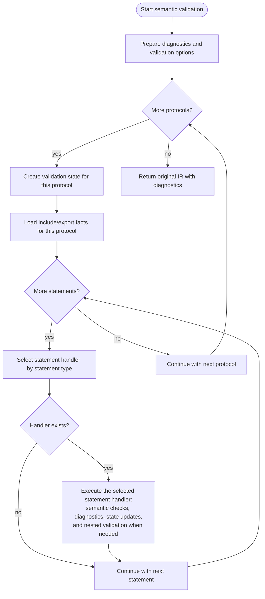
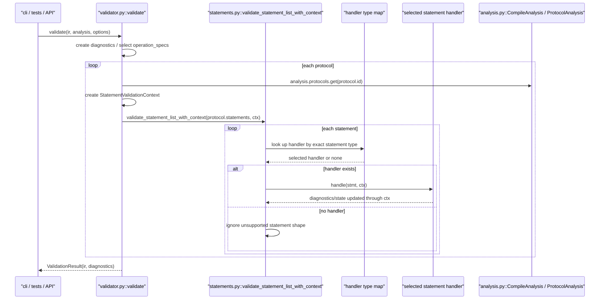
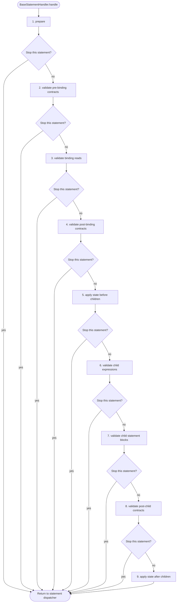
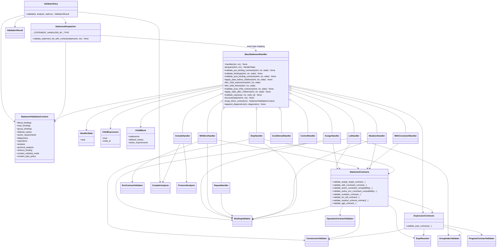

# Validate Module Diagrams

Last updated: 2026-04-21

Related IR document:

1. [ir_structure_diagrams.md](https://github.com/culsma/culsma/blob/main/docs/architecture/ir_structure_diagrams.md)

## Scope

This document has four diagrams only:

1. Functional flowchart: what `validate` actually does.
2. Runtime sequence: the main runtime call chain.
3. Handler lifecycle template: the common statement-handler validation sequence.
4. Class/module diagram: which files/classes own each part.

Semantic validation consumes Canonical IR plus compile analysis and returns
`ValidationResult(ir, diagnostics)`. It does not do typecheck, plan lowering,
runtime execution, or material-state mutation.

## Functional Flowchart

## Runtime Sequence

## Handler Lifecycle Template

The handler refactor makes `BaseStatementHandler.handle` own the validation
lifecycle. Concrete handlers only override the phases they need. Diagnostics
are appended when each validation phase runs, not collected as a separate
final phase. A phase can mark the handler state as stopped when later phases
would be invalid or redundant for the current statement.

| Phase | Semantic boundary | Typical owners |
| --- | --- | --- |
| `prepare` | Derive statement-local facts and decide whether validation can continue. | step operation lookup, builtin step classification |
| `validate_pre_binding_contracts` | Check rules that must use the incoming scope and statement declaration. | active constraint compatibility, unknown-step stop, assign target shape, let-call shape, step arg names, constructor/readout statement contracts |
| `validate_bindings` | Check all reads against names visible before the current statement mutates state. | unbound reads in let, assign, repeat, mutation, with-env, step |
| `validate_post_binding_contracts` | Check statement semantics that depend on binding or resolved values. | env contracts, mutation contracts |
| `apply_state_before_children` | Apply state that child expressions or blocks must see. | let expression/literal/group bindings, assign root binding, include exports |
| `validate_child_expressions` | Recurse into direct child expressions with shared expression contracts. | let value, assign target/value, step args, with-env args, repeat iterable, condition |
| `validate_child_blocks` | Recurse nested statement lists with derived block context. | with-env body, with-constraint body, repeat body, conditional branches |
| `validate_post_child_contracts` | Run checks intentionally placed after child expression validation. | agit-specific step checks, other order-sensitive checks |
| `apply_state_after_children` | Publish effects that should only affect later sibling statements. | let runtime name, step-defined names |

## Class And Module Diagram

