# Material State Transform Model

Status: draft
Date: 2026-06-09
Scope: material-state model, operation transforms, contents organization, standalone `sep` / `frac`, indexed `container.contents`
PM: https://github.com/culsma/culsma-pm/issues/54

## Goal

Culsma material behavior should be designed as a semantic state model, not as a
collection of one-off runtime calculations. Existing runtime behavior already
tracks volume, mass, component amounts, program-specific separation partitions,
and diagnostics. The goal of this design is to give those pieces one coherent
model:

```text
operation effect = transform(MaterialState, context) -> MaterialState + diagnostics
```

Culsma currently has two separation surfaces:

1. `let group = sep(...)` and `let group = frac(...)`, which perform an action
   and return an indexed external group.
2. `source.partition(program)[i]`, which performs source-local partition
   selection inside a transfer expression.

Those surfaces over-couple action and return. Some protocols need an operation
that acts on a container's contents and changes its internal organization
without immediately exporting a group:

```culsma
sep(sample = tube, program = magnetic_program(duration = 2min));
waste << [tube.contents[1]:180uL];
```

The first statement establishes an internal contents organization for `tube`.
The second statement reads one indexed portion from that current organization.

The design goal is to make that state explicit without redefining existing
group-return behavior or changing `source.partition(program)[i]`.

## Design Approach

This design uses a state-vector and transform model. It is inspired by clean
architecture's dependency direction, but the primary boundary is semantic
rather than API-oriented.

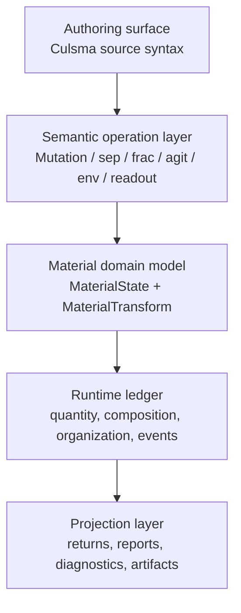

The dependency direction is:

```text
source syntax -> semantic operation -> material transform -> runtime ledger -> projection
```

The reverse direction should not hold. Runtime report shape, driver wording,
or a convenient syntax form should not define material truth.

## Material State Vector

Material state should not be modeled as one large enum. Real protocol cases
show that several state dimensions can be true at the same time. A magnetic
cleanup tube can be wet, bead-bound, magnetically retained, partitioned, and
partly removable at once.

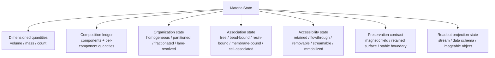

| Dimension | Existing evidence | Meaning |
| --- | --- | --- |
| `quantity` | runtime `volume_uL`, `mass_mg`, dimensioned `component_quantities` | Conservation-facing amount state across volume, mass, and count; count does not imply volume or capacity use. |
| `composition` | runtime `components`, `component_quantities`, content registry | What materials are present and the per-component quantities attached to them. |
| `organization` | `sep`, `frac`, `source.partition(...)`, `container.contents[i]` | How current contents are internally organized or indexed. |
| `association` | `attrs.state`, magnetic bead, resin, membrane, cell-retained cases | How components are bound or associated with supports/cells/surfaces. |
| `accessibility` | bound/flowthrough slot contracts, `stream`, waste routing | Which portion can be removed, retained, streamed, or observed. |
| `preservation` | `with env(field = magnetic_rack)`, stable retained-state workflows | Conditions under which organization/accessibility remain valid. |
| `readout` | `img`, `ecp`, `phy`, `markers`, `stream`, `data_schema` | Observation-facing projections, not proof of scientific interpretation. |

The first implementable slice is the `organization` dimension plus a narrow
`preservation` contract. The broader model exists so later material behavior
does not grow as unrelated special cases.

## Parallel State Machines

The state vector is a set of coordinated sub-state machines. Each dimension has
its own state space; an operation may update several dimensions at once.

```mermaid
stateDiagram-v2
    state "Quantity" as Quantity {
        [*] --> Empty
        Empty --> Loaded: load / transfer in
        Loaded --> PartiallyConsumed: quantified transfer out
        PartiallyConsumed --> Loaded: transfer in
        PartiallyConsumed --> Empty: remaining material removed
        Loaded --> Overflow: capacity violation
        PartiallyConsumed --> Overflow: capacity violation
    }

    state "Composition" as Composition {
        [*] --> Unknown
        Unknown --> KnownComponents: load content
        KnownComponents --> MixedComponents: merge sources
        MixedComponents --> PartitionedComponents: sep / frac component fate
        PartitionedComponents --> MixedComponents: agit / resuspend / merge retained part
        KnownComponents --> FallbackComposition: unsupported component class
        MixedComponents --> FallbackComposition: unsupported component class
    }

    state "Organization" as Organization {
        [*] --> Homogeneous
        Homogeneous --> Partitioned: sep(...)
        Homogeneous --> Fractionated: frac(...)
        Partitioned --> Homogeneous: agit / resuspend / mix
        Fractionated --> Homogeneous: agit / resuspend / mix
        Partitioned --> StaleOrganization: unclassified mutation
        Fractionated --> StaleOrganization: unclassified mutation
        StaleOrganization --> Partitioned: sep(...) again
        StaleOrganization --> Fractionated: frac(...) again
    }

    state "Association" as Association {
        [*] --> Unassociated
        Unassociated --> Bound: capture / bind / stain / adsorb
        Bound --> RetainedAssociation: sep retains support-bound material
        RetainedAssociation --> Released: elution / release condition
        Released --> Unassociated: material treated as free
        Bound --> UnknownAssociation: unsupported binding inference
    }

    state "Accessibility" as Accessibility {
        [*] --> Accessible
        Accessible --> Retained: retained slot / pellet / bound part
        Accessible --> Flowthrough: filtrate / supernatant / flowthrough slot
        Retained --> RemovablePhase: compatible liquid wash or elution
        Retained --> Immobilized: retained on surface / resin / membrane
        Accessible --> Streamable: stream(sample=..., unit=...)
    }

    state "Preservation" as Preservation {
        [*] --> NoContract
        NoContract --> RequiresContext: state has preservation contract
        RequiresContext --> Satisfied: active env / compatible constraint
        Satisfied --> Unsatisfied: context exits or incompatible mutation
        Unsatisfied --> Satisfied: context restored before mutation
        Unsatisfied --> NoContract: state cleared or overwritten
    }

    state "Readout" as Readout {
        [*] --> NotProjected
        NotProjected --> StreamProjected: stream(...)
        NotProjected --> ObservationProjected: img / ecp / phy
        StreamProjected --> ObservationProjected: img(stream, ...)
    }
```

This diagram does not mean every transition is implemented today. It records
the intended state dimensions so individual fixes can land in the right layer
instead of becoming isolated runtime patches.

## Operation Transform Families

Every material-affecting statement should be described as a transform over
`MaterialState`.

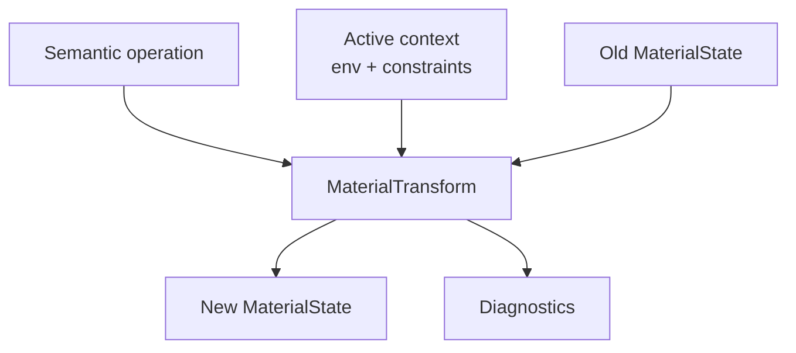

| Operation family | Transform responsibility |
| --- | --- |
| constructor/load | initialize quantity, composition, and default organization. |
| `<<` mutation | subtract, merge, and version material state; preserve organization only when proven. |
| `agit` | intentionally erase indexed organization and produce a mixed/homogeneous state. |
| `sep` | apply a program-specific partition transform and slot contract. |
| `frac` | apply an ordered fraction transform and fraction contract. |
| `with env` | provide context; it does not by itself mutate material, but may satisfy preservation contracts. |
| `hold` | keep a target under context without material mutation unless the enclosed semantics say otherwise. |
| `img` / `ecp` / `phy` | project state into observations without material mutation. |
| `stream` | project suitable material into a unit stream; it does not prove downstream analysis. |

## Operation Transform Matrix

An operation transform may update multiple state dimensions. The table below is
the design-level ownership map.

| Operation family | quantity | composition | organization | association | accessibility | preservation | readout |
| --- | --- | --- | --- | --- | --- | --- | --- |
| constructor/load | initialize | initialize | default homogeneous | optional attrs | accessible by default | none | none |
| `<<` mutation | subtract / add / capacity check | move / merge | preserve, stale, or homogenize | may carry source associations | source/target availability changes | may satisfy or break if context-sensitive | none |
| quantified self-transfer | usually unchanged | usually unchanged | may mix/homogenize | may disturb weak association | whole contents remains accessible | usually breaks indexed preservation unless defined | none |
| `agit` | unchanged | merge current parts | clear indexed state | may resuspend or disturb association | whole contents accessible | clear unless explicitly maintained | none |
| `sep` | split or route | component fate by strategy | partitioned | may retain bound/support material | retained + flowthrough slots | may create preservation contract | none |
| `frac` | split or route | component fate by fraction strategy | fractionated | may preserve lane/band association | ordered accessible fractions | may create stable-boundary contract | none |
| `source.partition(program)[i]` | transfer-local split | transfer-local component fate | no durable contents state | follows program strategy | selected source portion accessible | no durable contract | none |
| `with env` | no direct change | no direct change | no direct change | no direct change | no direct change | provides or removes context | none |
| `hold` marker | no direct change | no direct change | no direct change | no direct change | no direct change | declares env target; preservation comes from surrounding context | none |
| `stream` | no direct change | no direct change | no direct change | no direct change | project streamable units | no direct change | stream projection |
| `img` / `ecp` / `phy` | no direct change | no direct change | no direct change | no direct change | no direct change | no direct change | observation projection |

## Existing Runtime Computation Mapping

Several existing material-runtime problems fit naturally into this model.

| Existing issue or behavior | Current symptom | Model owner |
| --- | --- | --- |
| Volume and mass transfer accounting | `<<` must reduce source and increase target by the requested amount, enforce capacity, and handle density bridging. | `quantity` transform for mutation. |
| Container overflow diagnostics | Volume-increasing writes can exceed container capacity. | `quantity` state transition to overflow diagnostic; not an organization issue. |
| Component carry-forward during transfer | Reagents and samples move proportionally or by selected amount. | `composition` transform for mutation. |
| `sep` component partition ratios | Component classes use program-specific ratios to decide which slot gets DNA, cells, beads, wash liquid, etc. | `composition` fate transform coordinated with `organization = partitioned`. |
| Bulk volume and mass after `sep` | Dimensioned component quantities determine known output quantities. When count and carrier volume coexist without explicit mass, runtime preserves source mass in proportion to carrier volume; unsupported cases retain a conservative fallback. | `quantity` split/routing policy; separate from component fate ratios and future pluggable scientific prediction. |
| Filtration retentate/filtrate routing | Filtered material and liquid phase must land in the correct slots. | `organization` slot contract plus `accessibility` retained/flowthrough states. |
| Magnetic bead bound/flowthrough routing | Bead-bound material should stay retained while wash liquid is removable. | `association` bead-bound state + `accessibility` retained/flowthrough + `preservation` field contract. |
| Wash buffer dominating final product reports | Wash liquid may be present as process liquid but should not define target identity. | `composition` component fate plus projection/report policy; not a container identity issue. |
| `tube.contents[i]` after prior separation | A later transfer needs to read current internal parts without materializing a group. | `organization` indexed contents state with version checks. |
| Stale `tube.contents[i]` after mutation | Ordinary mutation may invalidate prior indexed organization. | `organization` stale transition, optionally guarded by `preservation`. |
| Spin-down without explicit return | The tube has been acted on even if no group is needed. | `organization` action without projection, if the operation is accepted as standalone. |

Design consequence:

1. Volume and mass fixes should be made in the `quantity` transform layer.
2. Separation-rate and component-fate fixes should be made in the `composition`
   transform layer, coordinated with the relevant `organization` slot contract.
3. Retention, bead/resin/membrane binding, and "still on magnet" behavior
   should not be encoded as volume or component hacks. They belong in
   `association`, `accessibility`, and `preservation`.
4. User-facing groups, `container.contents[i]`, reports, and final returns are
   projections from state, not independent material truth.

## Extension And Coordination Rules

The state-vector model is intentionally extensible. New dimensions may be added
later, but only when they pass an explicit design test.

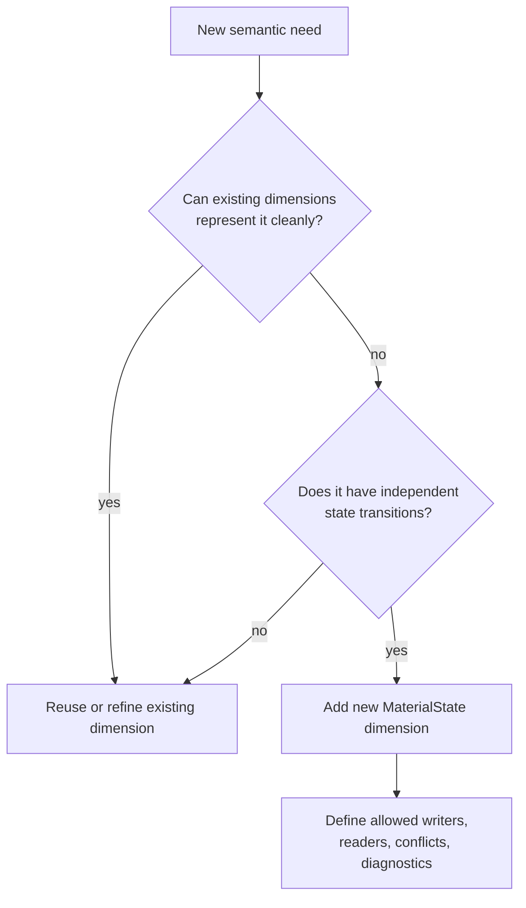

Candidate future dimensions include:

| Candidate dimension | Current judgment | Reason |
| --- | --- | --- |
| `quality` | possible future dimension | Drying, over-drying, degradation, photobleaching, and freeze-thaw damage are not quantity or composition. |
| `transformation` | possible future dimension | PCR amplification, lysis, digestion, and chemical conversion may create or convert material identity. |
| `spatial_distribution` | possible future dimension | Liquid surface, interface, gel band position, or localized surface layers may outgrow simple organization state. |
| `storage_stability` | undecided | May fit under preservation, but long-term storage windows may need their own lifecycle. |
| `analysis_state` | should stay outside material state by default | Gating, enrichment, QC pass, and interpretation belong to downstream data/readout analysis. |

Dimensions must not directly mutate one another. Coordination happens through
operation transforms.

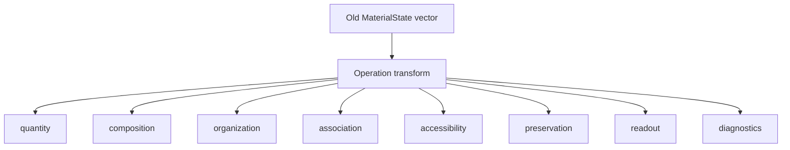

Coordination rules:

1. A dimension MUST NOT directly update another dimension.
2. Only an operation transform may update multiple dimensions in one step.
3. Each transform SHOULD declare which dimensions it reads and writes.
4. Projection layers MAY read material state but MUST NOT mutate it.
5. Conflicting dimension facts MUST produce diagnostics instead of silent
   resolution.
6. New dimensions MUST define their interaction with existing dimensions before
   implementation.

Example conflict handling:

```text
old state:
  organization = partitioned
  preservation = requires magnetic_field_active
context:
  magnetic field is no longer active
operation:
  tube << [wash_buffer]

transform result:
  organization -> stale
  diagnostic -> indexed contents no longer guaranteed
```

The `organization` dimension does not decide this alone. The mutation transform
reads `organization`, `preservation`, and active context, then writes the new
state and diagnostic.

## Design Principles

The language design principles for this model are:

1. **Semantic dependency direction.** Syntax lowers to semantic operations;
   semantic operations apply material transforms; transforms update runtime
   state; reports and driver text project from state. Projections must not
   define material truth.
2. **State-vector over flat enum.** Material state is composed from orthogonal
   dimensions. Avoid a single growing state enum that mixes physical form,
   association, organization, accessibility, and readout readiness.
3. **Operation-centered transformation.** The primary unit of meaning is what a
   Culsma operation does to state. Volume accounting, component fate,
   organization, and diagnostics should be different outputs of the same
   transform, not separate ad hoc subsystems.
4. **Conservative inference.** If the runtime cannot prove a material-state
   relationship, it must not silently infer it. Unknown behavior should produce
   fallback diagnostics, stale indexed state, or require explicit author input.
5. **Mechanism without device leakage.** Programs and environments may describe
   logical mechanisms such as magnetic retention, thermal hold, field-driven
   separation, or retained surface. They should not force instrument-specific
   concepts into core material semantics.
6. **Separation of action and projection.** `sep(...)` can be an action that
   changes material organization; `let g = sep(...)` and `container.contents[i]`
   are projections of action results. Do not make return shape the only way to
   represent state change.
7. **Compatibility by projection.** Existing forms such as materialized
   `sep`/`frac` groups and `source.partition(program)[i]` should remain stable
   projections. New state should explain them, not redefine them unexpectedly.
8. **Diagnostics as semantics.** Diagnostics are not only developer messages;
   they are part of the semantic contract when Culsma refuses unsupported
   scientific inference.

## Case Evidence

Protocol Hub cases motivate the state-vector model:

| Case | Evidence | Model implication |
| --- | --- | --- |
| RV04 magnetic-bead cDNA cleanup | bead-bound cDNA, magnetic rack washes, residual ethanol removal, drying, resuspension, final elution | Needs association, preservation, preparation form, and organization state. |
| STR07 magnetic bead IP + Western blot | retained bead-associated state, flowthrough, wash, elution, SDS-PAGE lanes, PVDF transfer, blot readout | Needs bound/free association, lane-resolved organization, surface/membrane retention, and readout projection. |
| TB05 flow cytometry | lysis, retained cell material, staining, fixation, resuspension, single-cell stream | Needs cell-retained accessibility, stained/fixed association or preparation state, and stream projection. |
| TB08 affinity purification | resin bed, flowthrough, wash pool, sequential elution fractions, gel lanes | Needs resin-bound association, retained column accessibility, elution fraction series, and lane-resolved readout preparation. |

## State Owner

The current concrete subproblem is contents organization. Contents state belongs
to the container's contents. It is not a new container, not a normal group
binding, and not a separate material ledger.

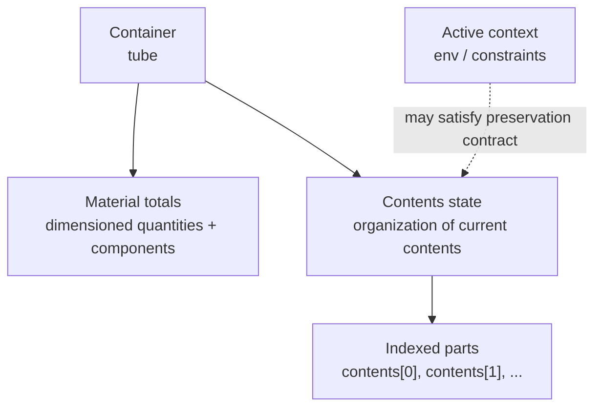

The container still owns total material. Contents state records how that owned
material is organized at a point in execution.

```text
containers[tube] = total material ledger
contents_states[tube] = current internal organization, if any
```

The contents-state manager owns the lifecycle of this internal organization:
homogeneous, partitioned, fractionated, mixed, stale, indexed selections, and
the narrow preservation impacts needed to decide whether an indexed organization
remains readable. It should not become the owner of the broader material-state
vector. Quantity accounting, component fate, association, accessibility,
environment satisfaction, and readout projection remain separate dimensions
coordinated by operation transforms.

## State Record

The runtime state should carry a record equivalent to:

```json
{
  "container_id": "tube",
  "kind": "partitioned",
  "state_id": "contents.s12",
  "producer_op": "sep",
  "program_kind": "magnetic_program",
  "source_version": 7,
  "slot_contract": {
    "0": "bound",
    "1": "flowthrough"
  },
  "preservation_contract": {
    "kind": "field_retention",
    "requires": "magnetic_field_active"
  },
  "parts": {
    "0": {
      "label": "bound",
      "components": {
        "BEADS": 19.8,
        "DNA": 9.5
      }
    },
    "1": {
      "label": "flowthrough",
      "components": {
        "WASH": 178.2,
        "DNA": 0.5
      }
    }
  }
}
```

`source_version` protects against stale reads. Ordinary material mutation
invalidates indexed reads from `tube.contents[i]` unless the operation updates
the selected part directly or satisfies an explicit preservation contract that
updates the compatible part.

## State Kinds

| Kind | Producer | Indexed access | Meaning |
| --- | --- | --- | --- |
| `homogeneous` | creation, load, mix, normalize | no | Contents are treated as one uniform material body. |
| `partitioned` | standalone `sep(...)` | yes | Contents have a binary program-defined organization. |
| `fractionated` | standalone `frac(...)` | yes | Contents have ordered program-defined fractions. |
| `mixed` | agitation, resuspension, explicit mixing | no | Previous indexed organization has been intentionally erased. |
| `stale` | unsupported or untracked mutation | no | Previous indexed organization may no longer match container totals. |

`stale` is a diagnostic state, not a physical state. It means Culsma refuses to
use an old index because it cannot prove the organization is still valid.

## Organization State Machine

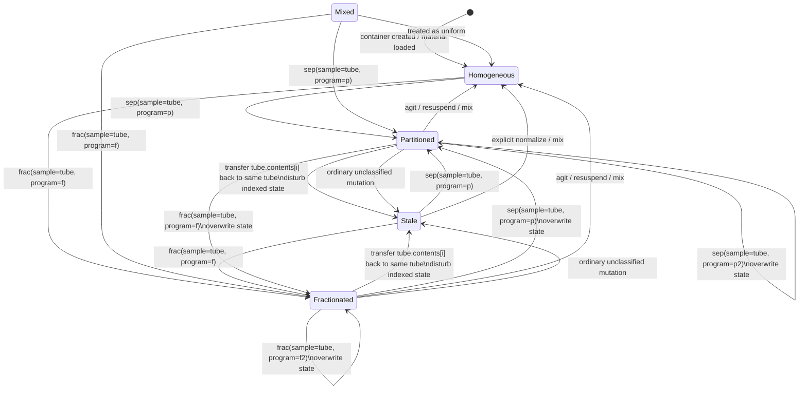

This closes the common protocol loop:

```text
homogeneous -> partitioned -> selected transfer -> homogeneous/mixed target
            -> partitioned again -> ...
```

## Preservation Contract

The runtime should not try to predefine every action that can preserve a
partition. That is not realistic. Instead, the operation that creates the state
may attach a conservative preservation contract.

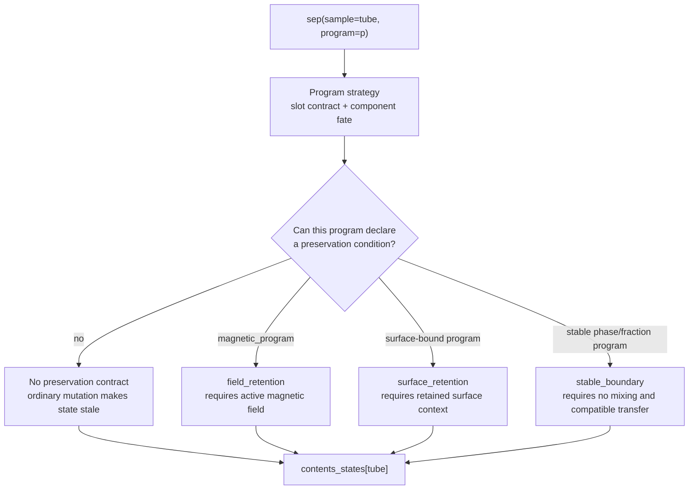

The default rule is conservative:

```text
If Culsma cannot prove that a mutation preserves the current indexed state,
the indexed state becomes stale.
```

This avoids a growing hard-coded list such as "ethanol wash preserves magnetic
beads" or "buffer wash preserves retained material". The stable semantic claim
is smaller: a magnetic separation state may remain valid while the required
magnetic field context is still active and the operation does not mix the
retained material.

## Mutation Impact Classes

Subsequent operations should be classified by how they affect current contents
state.

| Impact class | Example | State result |
| --- | --- | --- |
| observation-only | `hold(tube.contents)`, `img(...)`, `phy(...)`, `ecp(...)` | preserve current state |
| selected consume | `dest << [tube.contents[1]:180uL]` | preserve state and reduce selected part |
| same-container selected manipulation | `tube << [tube.contents[1]]` | material no-op, but mark indexed state `stale` |
| explicit mixing | `agit(...)`, resuspend, pipette mix | clear indexed state; become `homogeneous` / `mixed` |
| overwrite organization | `sep(sample=tube, ...)`, `frac(sample=tube, ...)` | replace old state with new indexed state |
| ordinary mutation | `tube << [source]` with no preservation proof | mark old state `stale` |
| partition-preserving mutation | adding/removing compatible material while preservation contract is satisfied | preserve state and update compatible part |

Partition-preserving mutation is intentionally narrow. It should require both:

1. a current contents state with a preservation contract; and
2. an active context or operation contract that satisfies it.

The active context is the lexical execution context carried by the current
`with env(...)` layer. Direct `hold(...)` declarations may appear anywhere in
the immediate body to record targets for pure holds or driver-facing target
reporting, but they are markers rather than executable steps and do not narrow
the environment scope for the executable statements in the block.

## Magnetic Wash Example

Magnetic bead cleanup is the first clear preservation case. The magnetic field
keeps captured material in the retained part while wash liquid is added and
removed from the flowthrough side.

```culsma
let mag = magnetic_program(duration = 2min);

with env(field = magnetic_rack) {
  sep(sample = tube, program = mag);
  tube << [ethanol_wash:200uL];
  waste << [tube.contents[1]:200uL];
}
```

```mermaid
sequenceDiagram
    participant E as "env(field=magnetic_rack)"
    participant T as "tube"
    participant S as "contents state"
    participant W as "waste"

    E->>E: enter magnetic field context
    T->>S: sep(sample=tube, program=mag)
    S->>S: Homogeneous -> Partitioned
    Note over S: preservation_contract = field_retention

    T->>S: tube << ethanol_wash
    S->>S: contract satisfied; add wash to flowthrough-compatible part

    S->>W: transfer tube.contents[1]
    S->>S: reduce flowthrough part
    E->>E: exit magnetic field context
```

The same mutation outside the magnetic context should be conservative:

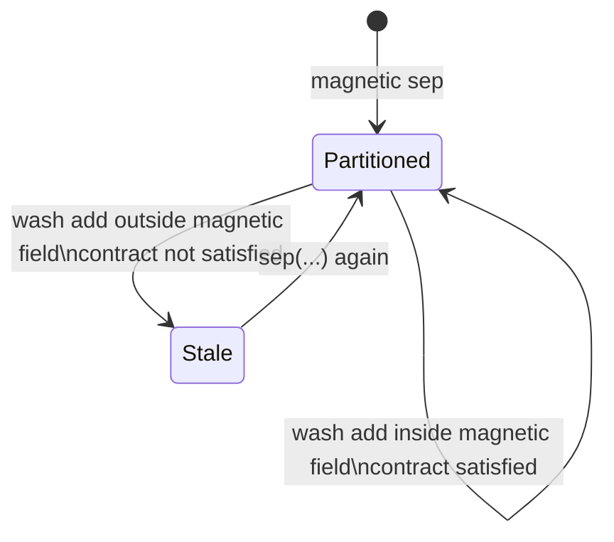

## Complex Workflow Loop

A typical cleanup workflow can repeatedly partition, move retained material,
mix or resuspend it, and partition again.

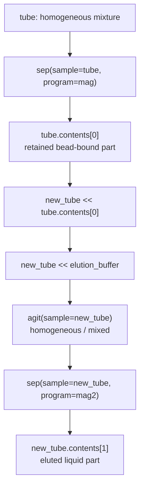

The state does not need a third action category beyond separating and mixing.
The additional model is only memory of the container's current organization, so
later reads can refer to the organization created by the previous operation.

## Validation Rules

`container.contents[i]` should be valid only when:

1. `container` resolves to a material-owning container;
2. `contents_states[container]` exists;
3. the state kind is `partitioned` or `fractionated`;
4. the state is not `stale`;
5. `state.source_version == container.contents_version`;
6. `i` is a static non-negative integer within the current state size.

This should not be implemented by treating `container.contents` as a normal
group binding. It is a container-owned indexed view.

## Runtime Boundaries

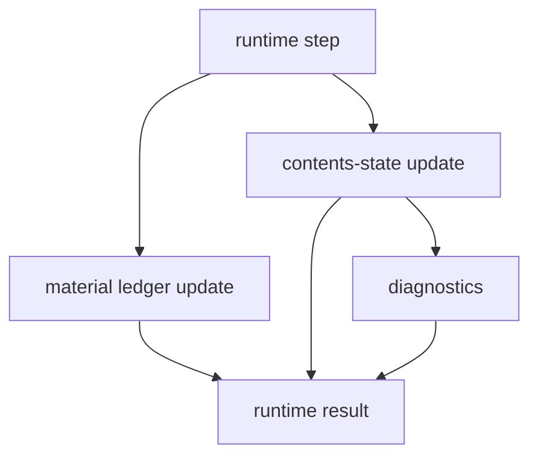

Runtime material totals remain the source of conservation accounting. Contents
state is an additional organization layer used for indexed access and
diagnostics.

Separation and fractionation handlers need two modes:

| Surface | Runtime mode |
| --- | --- |
| `let group = sep(...)` | current materialized group behavior |
| `let group = frac(...)` | current materialized fraction group behavior |
| `sep(sample=tube, program=p);` | contents-state mode |
| `frac(sample=tube, program=f);` | contents-state mode |
| `source.partition(program)[i]` | unchanged transfer-local selector |

## Implemented First Slice

The first implementation is deliberately narrow. The broader state-vector model
guides ownership, but it does not require a full material-runtime rewrite.

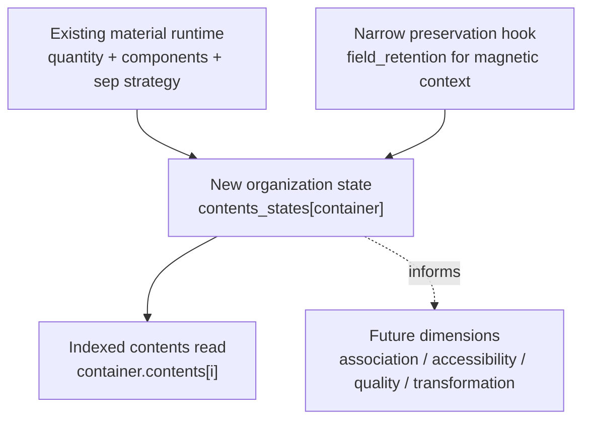

Phase 1 includes:

1. Standalone `sep(sample = container, program = p);` creates durable
   `organization = partitioned` state for that container.
2. Standalone `frac(sample = container, program = f);` creates durable
   `organization = fractionated` state for that container.
3. `container.contents[i]` reads a valid current indexed organization state and
   transfers from the selected part.
4. Existing sep/frac quantity and component-fate calculations are reused to
   populate indexed contents parts.
5. Ordinary material mutation invalidates the current indexed organization
   state for the mutated container unless it is a selected-part operation or a
   supported preservation-contract update.

Phase 1 should not include:

1. A complete rewrite of material quantity/component accounting.
2. A public syntax change for `source.partition(program)[i]`.
3. General `association` or `accessibility` persistence unless directly needed
   to support indexed contents behavior.
4. Scientific inference of binding, elution efficiency, capture success,
   reaction conversion, or readout interpretation.
5. A general preservation-contract framework beyond the narrow
   `field_retention` hook needed for retained magnetic state.

## Compatibility Boundaries

Existing public behavior should remain stable.

| Existing form | Compatibility rule |
| --- | --- |
| `let g = sep(...)` | Continue materializing `g[0]` / `g[1]`. |
| `let fg = frac(...)` | Continue materializing ordered `fg[i]`. |
| `source.partition(program)[i]` | Keep v1.0.3 mutation-source selector semantics. |
| `hold(tube.contents)` | Continue treating `contents` as a content-facing target view. |

Do not redefine `source.partition(program)[i]` as a reader of prior `sep`
state. Prior-state reads should use `container.contents[i]`.

## Non-Goals

1. Do not infer exact scientific yields.
2. Do not infer behavior from container names or component names alone.
3. Do not hard-code every wash or buffer as a special case.
4. Do not change current `source.partition(program)[i]` semantics.
5. Do not break materialized `sep` / `frac` group returns.
6. Do not allow `container.contents[i]` without an explicit current indexed
   contents state.

## Open Questions

1. Should `let g = sep(...)` also update `contents_states[tube]`, or should
   group-return mode leave only the materialized group for compatibility?
2. Which preservation contracts should be admitted in the first implementation:
   only `field_retention`, or also `surface_retention` / `stable_boundary`?
3. Should a stale contents state remain in runtime artifacts for diagnostics,
   or be removed immediately when it becomes unusable?
4. How should repeated partial transfers from the same indexed part report
   residual amount and trace carryover?
