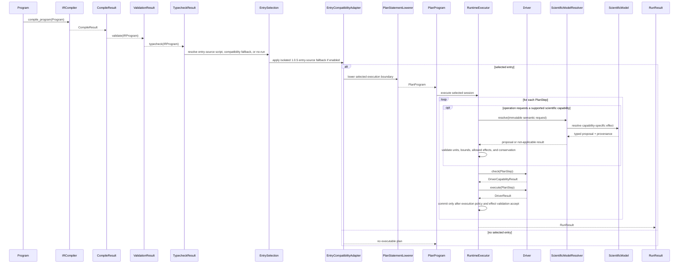
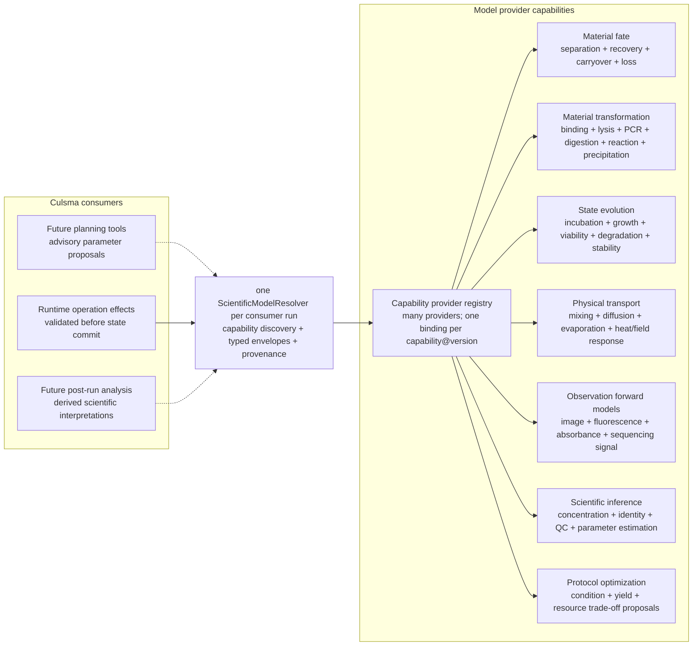
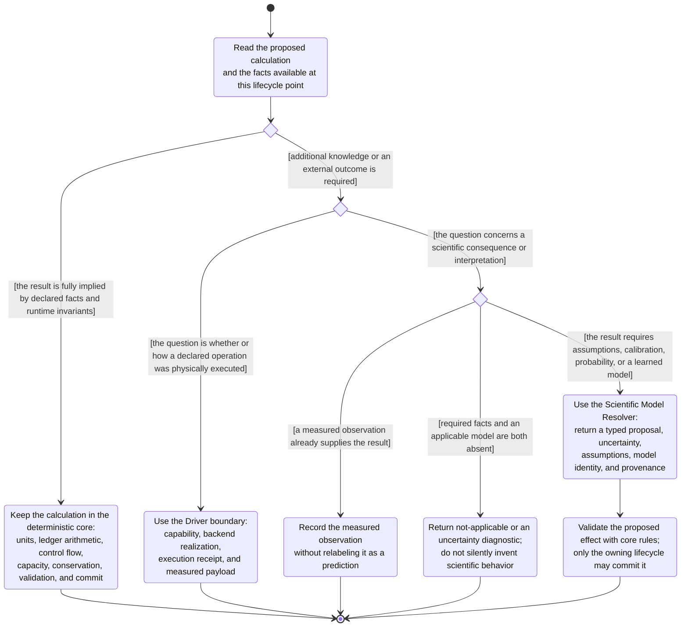

# Global Architecture Diagrams

Last updated: 2026-08-25

This document records the repository-level execution architecture. It gives the
global source-to-runtime flow first, then records cross-stage semantic
dependencies that are not themselves pipeline stages. Module-specific details
remain in the existing parser, compile, validate, typecheck, plan, runtime,
material, and driver documents.

## Global Execution Flow

This activity-style flowchart is the global pipeline. It intentionally uses
conceptual stage names rather than internal helper objects. Implementation
module names are included only to connect the architecture to the repository.

```mermaid
flowchart LR
    CLI["0. CLI run inputs<br/>one file or batch"]
    Batch{"Multiple input files?"}
    PerFile["Per-file run boundary<br/>independent state + output"]
    Source["1. Source files<br/>entry source + definition dependencies"]
    ParseCompile["2. Parse + compile<br/>parser, module roles,<br/>Canonical IR generation"]
    Validate["3. Semantic validation<br/>reference shape, contracts,<br/>lowering gates"]
    Typecheck["4. Type + unit checking<br/>dimensional and ordered-step consistency"]
    Entry["5. Entry resolution<br/>entry-source script,<br/>compatibility fallback,<br/>or no run"]
    Compat["6. 1.0.5 compatibility adapter<br/>unique unreferenced root protocol"]
    Plan["7. Plan lowering<br/>selected root, workflow plan,<br/>dependencies, execution gates"]
    Runtime["8. Runtime execution session<br/>scheduler, lifecycle, material compute,<br/>events, artifacts, user result"]
    Driver["Driver module<br/>backend realization"]
    Resolver["Scientific Model Resolver<br/>one Runtime port; default or injected"]
    Models["Pluggable scientific models<br/>many capability-specific providers"]

    CLI --> Batch
    Batch -->|one| Source
    Batch -->|many| PerFile
    PerFile --> Source
    Source --> ParseCompile
    ParseCompile --> Validate
    Validate --> Typecheck
    Typecheck --> Entry
    Entry --> Compat
    Compat --> Plan
    Plan --> Runtime
    Runtime --> Driver
    Runtime -. "immutable semantic request" .-> Resolver
    Resolver -. "typed proposed effect or not applicable" .-> Runtime
    Resolver --> Models
    Models --> Resolver
```

## Main Execution Sequence

This sequence diagram shows the main cross-module path. It uses representative
classes that exist in the implementation and omits internal helpers.

## Pluggable Scientific-Compute Capability Families

The resolver is a repository-level scientific-compute port. Runtime is its first
consumer, not its permanent exclusive owner. Future planning and post-run
analysis surfaces may use the same typed capability boundary, but they retain
their own validation and commit policies.

Capability families share the resolver contract but not one universal
prediction schema. Each family defines a typed request, typed result, model
applicability rules, assumptions, uncertainty, model identity, and version.

Providers implement capability protocols; they do not subclass or replace the
runtime kernel. A provider may use any of these implementation styles:

| Provider style | Typical use |
| --- | --- |
| Bundled reference provider | Preserve the documented coarse fallback behavior |
| Mechanistic formula provider | Apply a bounded physical or chemical equation when all required parameters are present |
| Lookup/calibration provider | Interpolate vendor, laboratory, or instrument-specific recovery tables |
| Statistical or ML provider | Produce empirical predictions with declared uncertainty and model provenance |
| Composite or ensemble provider | Select, chain, or compare several compatible providers without changing the kernel contract |

The same provider protocol may initially run in-process, then be exposed by an
external Python package, local service/container, or transport-neutral remote
adapter. Deployment location does not change the request/result contract.

The following computations remain inside Culsma and do not become plugins:

| Deterministic core responsibility | Reason |
| --- | --- |
| Parsing, validation, control flow, and scheduling | They define language and execution semantics |
| Units and dimensional arithmetic | Every external proposal must be checked against one authoritative unit system |
| Material-detail ledger and aggregate projection | There must remain one source of accounting truth |
| Conservation, capacity, bounds, and atomic commit | A model must not bypass runtime invariants |
| Separation slot meanings and explicit author rules | Declared language meaning takes precedence over prediction |
| Driver capability and execution receipts | Hardware realization is separate from scientific prediction |

Planning and optimization providers are advisory. Their proposals must return
through normal source/IR/plan validation before execution. Post-run inference
produces derived observations and does not retroactively rewrite the material
ledger. Runtime material-effect providers return proposed effects only; the
runtime kernel remains the sole state-commit authority.

## Scientific-Compute Ownership Boundary

The boundary is evidence-based rather than operation-name-based. A calculation
belongs to the deterministic core only when its result follows completely from
declared language facts, current authoritative state, and fixed runtime
invariants. A calculation belongs behind the Scientific Model Resolver when it
requires empirical parameters, natural-process assumptions, calibration,
probability, or learned behavior.

The shortest ownership test is:

> If changing laboratory, instrument calibration, biological context, empirical
> dataset, or scientific model could legitimately change the answer while the
> Culsma source remains identical, the calculation is not a core invariant and
> belongs behind a model capability or an explicit author rule.

| Example | Owner | Boundary reason |
| --- | --- | --- |
| Add `100uL + 200uL`, convert units, and check capacity | Core | Fully determined arithmetic and invariant checking |
| Project aggregate volume from routed component detail | Core | Accounting projection from the single authoritative ledger |
| Preserve explicitly surface-associated cells during declared aspiration | Core | Deterministic consequence of declared association and operation contract |
| Apply author-declared `component_fates` | Core | Execute an explicit source rule; no inference is required |
| Apply an author-declared transition between `MaterialRelation` enum members | Core | Execute a typed author decision; the enum domain and association invariants remain kernel-validated |
| Predict DNA recovery, pellet carryover, filtration retention, or magnetic capture efficiency | Scientific model | Depends on material, device, conditions, calibration, or empirical assumptions |
| Predict binding, lysis products, PCR yield, viability, degradation, or signal intensity | Scientific model | Natural-process outcome is not implied by workflow syntax |
| Select a robot command and report whether it executed | Driver | Hardware realization and execution receipt |
| Record an observed image, absorbance, or instrument measurement | Observation/Driver result | Measured evidence is not a model prediction |
| Interpret a measured signal as concentration, identity, or QC status | Scientific inference model or explicit analysis rule | Requires a calibration or interpretive model |
| No applicable model and insufficient facts | Explicit unknown/fallback | The system must expose uncertainty instead of claiming a prediction |

Current coarse `0.99/0.01`, `0.95/0.05`, and similar reference ratios are
compatibility behavior. Under this boundary they are not timeless core truths;
they should eventually be represented as a bundled reference model or clearly
provenanced fallback behind the same capability contract.
