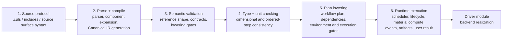
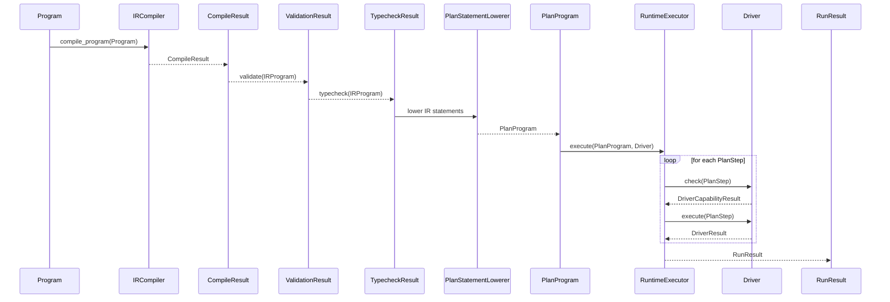

# Global Architecture Diagrams

Last updated: 2026-06-18

This document records the repository-level execution architecture. It gives the
global source-to-runtime flow first, then records cross-stage semantic
dependencies that are not themselves pipeline stages. Module-specific details
remain in the existing parser, compile, validate, typecheck, plan, runtime,
material, and driver documents.

## Global Execution Flow

This activity-style flowchart is the global pipeline. It intentionally uses
conceptual stage names rather than internal helper objects. Implementation
module names are included only to connect the architecture to the repository.

## Main Execution Sequence

This sequence diagram shows the main cross-module path. It uses representative
classes that exist in the implementation and omits internal helpers.

