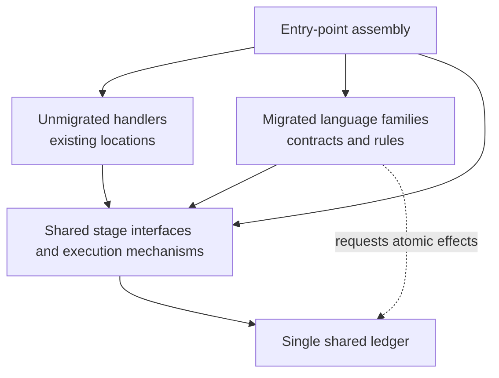
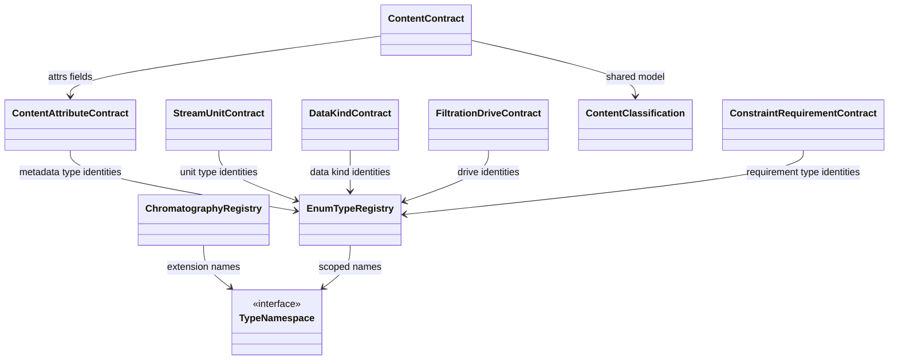
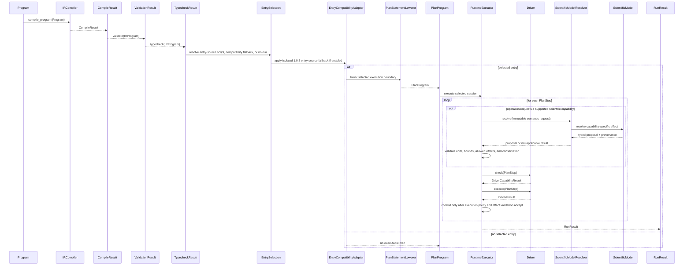
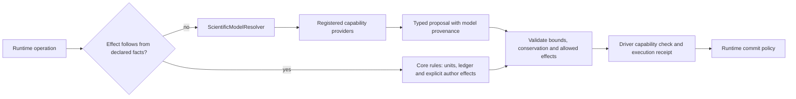

# Global Architecture Diagrams

## Proposed incremental language-module organization

Status: proposal, 2026-09-30. Coordination: [PM #126](https://github.com/culsma/culsma-pm/issues/126).
Migrate a small language responsibility when related work touches it; each batch
must remain independently releasable. This is not a 1.0.8 release prerequisite.
Reference continues to own semantics. Current architecture diagrams follow below.

| Today | Target |
| --- | --- |
| Language rules spread across compile/validate/plan/runtime | One primary module per language family, aligned with reference concepts |
| Large kernel tests mix language behavior and engine mechanisms | Language tests beside their family in the test tree; engine tests remain separate |
| `domains` already contains family contracts | One owner for each contract and rule; no permanent duplicate domains/language implementations |

```mermaid
flowchart TB
    Entry["Entry-point assembly"] --> Old["Unmigrated handlers<br/>existing locations"]
    Entry --> New["Migrated language families<br/>contracts and rules"]
    Entry --> Engine["Shared stage interfaces and execution mechanisms"]
    Old --> Engine
    New --> Engine
    New -. "requests atomic effects" .-> Ledger["Single shared ledger"]
    Engine --> Ledger
```

The diagram shows dependencies. Assembly selects exactly one handler per dispatch
key, old or migrated; it never executes both or retries the old handler on failure.
Keep Source → AST → IR → Validate/Typecheck → Plan → Runtime and existing public
entry points. Generic mechanisms call injected interfaces, not concrete family imports.

| Boundary | Ownership |
| --- | --- |
| Language family | Its contracts, validation and operation-specific lowering/execution; create only needed files |
| Shared foundation | Unified grammar/AST, IR/Plan, traversal, scope infrastructure, scheduling, events and atomic ledger updates |
| Assembly | Register old and new handlers together through existing interfaces; minimal wiring, no plugin framework |

The pilot chooses whether to extend `domains` or introduce `language`; do not
create both as permanent owners of the same family. Initially reuse existing
contracts in place. Move family-only contracts with their consumers when safe;
truly shared values remain shared. Contract-only imports must not pull in execution
modules through package initialization. Directory names do not require a new
`foundation/` tree or a file for every statement and stage.

| When related work occurs | Small migration opportunity | Keep outside that batch |
| --- | --- | --- |
| First pilot: groups / #122 follow-up | One group-index or binding rule, its callers and focused tests | Nested-group semantics and broad protocol refactoring |
| Protocol/import/return bug | One binding or output rule and its source regression | Entire resolver and scope engine |
| Labware, content or quantity bug | Touched selector, constructor or quantity rule | Shared value-model redesign |
| Constraint/environment bug | One scoped rule and its handler | Scheduler and new persistent seal semantics |
| Transfer/replace bug | One operation-specific rule and its tests | Shared ledger, conservation and transaction boundaries |
| Agitation, separation/fractionation or readout/data/control work | One touched operation family slice | Other operations, drivers and scientific-model redesign |

Only the groups pilot is first; subsequent order follows actual bugs/features.
Moving all tests before any implementation is not required. If extraction needs
unrelated rewrites, fix the bug in place and record a bounded follow-up in PM #126.

| Step within one batch | Completion condition |
| --- | --- |
| 1. Bound the change | Identify one rule, consumers, tests and target owner; record the slice in PM |
| 2. Establish behavior | Reproduce/fix the bug with a focused regression; keep the behavior change distinguishable from the move |
| 3. Extract the slice | Move the implementation and relevant tests; old entry points delegate or assembly routes to the new owner |
| 4. Verify coexistence | Exercise migrated and unmigrated operations in one source program; preserve diagnostics, outputs and single execution |
| 5. Retire the bridge | Once internal consumers move, remove unused forwarding code; retain published compatibility where required |

A temporary bridge delegates old → new with no copied rules. Do not add a bridge
without an existing consumer. Record its consumers and removal condition in the
batch; new code uses the new owner. Do not route back through the old dispatcher
from the new implementation. Unrelated legacy code may remain until touched.

Tests use complete source examples and direct real IR/value objects, without
mocks where real inputs suffice. Use owner-qualified filenames, e.g.
`tests/language/groups/test_groups_rules.py`; keep setup separate from cases.
For moves, preserve assertions, parameter cases and skip/xfail metadata; update
node-ID mappings, `conformance/test_hooks.json`, CI/scripts and cross-test imports.
Run affected and mixed-path tests; shared dispatcher/runtime changes require the
full suite. Check import cycles and public entry points. Update the owning diagram
and PM slice status: **legacy → mixed → migrated**; compatibility removal is tracked
explicitly. No global import-mode, syntax or serialization change accompanies a move.

### Groups pilot: mixed state

| Slice | Current ownership |
| --- | --- |
| Binding value and resolved static upper bounds | `domains/groups.py`: `GroupBinding`, `index_bounds_error`; pure values, no stage imports |
| Expression resolution, base/integer checks, source diagnostics | Existing `pipeline/validate/groups.py`, delegating bounds checks to the domain |
| Compatibility | `validate/context.py` re-exports `_GroupBinding` as the same class for existing validation consumers; remove alias once those imports migrate |
| Tests | Seven source regressions moved unchanged to `tests/language/groups/test_groups_frontend.py`; direct boundary cases in `test_groups_rules.py` |
| Coexistence | Existing protocol/group runtime regressions exercise the new bounds rule with unchanged protocol, plan and material execution |

This pilot extends existing `domains` without adding `language`. It extracts one
pure rule, so handler registration changes are unnecessary. Remaining group
classification and protocol binding work stays in its current location.

## Execution Flow

```mermaid
flowchart LR
    CLI["0. CLI run inputs<br/>one file or batch"]
    Batch{"Multiple input files?"}
    PerFile["Per-file run boundary<br/>independent state + output"]
    Source["1. Source files<br/>entry source + definition dependencies"]
    ParseCompile["2. Parse + compile<br/>parser, module roles,<br/>Canonical IR generation"]
    Validate["3. Semantic validation<br/>reference shape, contracts,<br/>lowering gates"]
    Typecheck["4. Type + unit checking<br/>dimensional and ordered-step consistency"]
    Entry["5. Entry resolution<br/>entry-source script,<br/>compatibility fallback,<br/>or no run"]
    Compat["6. 1.0.5 compatibility adapter<br/>unique unreferenced root protocol"]
    Plan["7. Plan lowering<br/>selected root, workflow plan,<br/>dependencies, execution gates"]
    Runtime["8. Runtime execution session<br/>scheduler, lifecycle, material compute,<br/>events, artifacts, user result"]
    Driver["Driver module<br/>backend realization"]
    Resolver["Scientific Model Resolver<br/>one Runtime port; default or injected"]
    Models["Pluggable scientific models<br/>many capability-specific providers"]

    Domains["domains: language contracts by syntax<br/>allowed enum types, members and combinations"]
    Common["common: shared models and technical tools<br/>content classification, names and identity encoding"]
    ParseCompile -. "typed declarations" .-> Domains
    Validate -. "member and combination rules" .-> Domains
    Typecheck -. "parameter types" .-> Domains
    Plan -. "bound parameter checks" .-> Domains
    Runtime -. "final value checks" .-> Domains
    Domains -. "uses" .-> Common

    CLI --> Batch
    Batch -->|one| Source
    Batch -->|many| PerFile
    PerFile --> Source
    Source --> ParseCompile
    ParseCompile --> Validate
    Validate --> Typecheck
    Typecheck --> Entry
    Entry --> Compat
    Compat --> Plan
    Plan --> Runtime
    Runtime --> Driver
    Runtime -. "immutable semantic request" .-> Resolver
    Resolver -. "typed proposed effect or not applicable" .-> Runtime
    Resolver --> Models
    Models --> Resolver
```

## Language Contract Ownership

Domains are language contracts, not an execution stage. Solid arrows above are execution flow; dashed arrows to domains/common are dependencies. The independent reference owns semantics. Common may contain shared semantic models such as content classification; domains supplies syntax-specific field contracts. Neither layer imports parser, pipeline, runtime or drivers.

```mermaid
classDiagram
    class ContentContract
    class StreamUnitContract
    class ConstraintRequirementContract
    class ChromatographyRegistry
    class DataKindContract
    class FiltrationDriveContract
    class ContentClassification
    class EnumTypeRegistry
    class TypeNamespace {
        <<interface>>
    }
    ContentContract --> ContentClassification : shared model
    ContentContract --> ContentAttributeContract : attrs fields
    ContentAttributeContract --> EnumTypeRegistry : metadata type identities
    StreamUnitContract --> EnumTypeRegistry : unit type identities
    DataKindContract --> EnumTypeRegistry : data kind identities
    FiltrationDriveContract --> EnumTypeRegistry : drive identities
    ConstraintRequirementContract --> EnumTypeRegistry : requirement type identities
    ChromatographyRegistry --> TypeNamespace : extension names
    EnumTypeRegistry --> TypeNamespace : scoped names
```

| Flat owner | Reference concept | Boundary |
| --- | --- | --- |
| domains/content.py | content constructor and attrs, §6.2.4–6.2.8 | Owns field contracts and attribute extensions; reuses common/content_contracts.py classification |
| domains/data.py | data_ref and data_group_ref kind | Owns data kind identity; result schemas and measurement behavior remain separate |
| domains/stream.py | stream units, §4.6.2 | Independent of readout measurement quantities |
| domains/constraints.py | execution requirements, §4.3 | Owns applicability, scopes and conflicts |
| domains/fractionation.py | density-gradient and chromatography programs, §6.3.13 | Owns both programs and chromatography pairing |
| domains/separation.py | binary separation outputs and parameters, §6.3.12 | Owns program-specific outputs and parameter restrictions |
| domains/readout.py | img/ecp/phy, §6.3.16 | Shared family with operation-specific allowed quantities |
| domains/agitation.py, labware.py, scheduling.py | agit, plate, schedule | Owns modes, plate layout and scheduling |
| common/enum_registration.py, enum_parameters.py, type_names.py, type_name_contracts.py | Implementation mechanisms | Parameter, registration and naming mechanics; no domain imports |
| enum_services.py | Application composition | Only assembles module-provided declarations and injected name services |

Domain imports do not assemble application services. `enum_services.py` collects
syntax declarations and injects the shared name service. Standalone extension
hosts import that entry point or supply a `TypeNamespace` implementation.

## Execution Sequence

```mermaid
sequenceDiagram
    participant Program
    participant IRCompiler
    participant CompileResult
    participant ValidationResult
    participant TypecheckResult
    participant EntrySelection
    participant EntryCompatibilityAdapter
    participant PlanStatementLowerer
    participant PlanProgram
    participant RuntimeExecutor
    participant Driver
    participant ScientificModelResolver
    participant ScientificModel
    participant RunResult

    Program->>IRCompiler: compile_program(Program)
    IRCompiler-->>CompileResult: CompileResult
    CompileResult-->>ValidationResult: validate(IRProgram)
    ValidationResult-->>TypecheckResult: typecheck(IRProgram)
    TypecheckResult->>EntrySelection: resolve entry-source script, compatibility fallback, or no-run
    EntrySelection->>EntryCompatibilityAdapter: apply isolated 1.0.5 entry-source fallback if enabled
    alt selected entry
        EntryCompatibilityAdapter->>PlanStatementLowerer: lower selected execution boundary
        PlanStatementLowerer-->>PlanProgram: PlanProgram
        PlanProgram->>RuntimeExecutor: execute selected session
        loop for each PlanStep
            opt operation requests a supported scientific capability
                RuntimeExecutor->>ScientificModelResolver: resolve(immutable semantic request)
                ScientificModelResolver->>ScientificModel: resolve capability-specific effect
                ScientificModel-->>ScientificModelResolver: typed proposal + provenance
                ScientificModelResolver-->>RuntimeExecutor: proposal or not-applicable result
                RuntimeExecutor->>RuntimeExecutor: validate units, bounds, allowed effects, and conservation
            end
            RuntimeExecutor->>Driver: check(PlanStep)
            Driver-->>RuntimeExecutor: DriverCapabilityResult
            RuntimeExecutor->>Driver: execute(PlanStep)
            Driver-->>RuntimeExecutor: DriverResult
            RuntimeExecutor->>RuntimeExecutor: commit only after execution policy and effect validation accept
        end
        RuntimeExecutor-->>RunResult: RunResult
    else no selected entry
        EntryCompatibilityAdapter-->>PlanProgram: no executable plan
    end
```

## Runtime, Models and Drivers

```mermaid
flowchart LR
    Runtime["Runtime operation"] --> Facts{"Effect follows from declared facts?"}
    Facts -->|yes| Core["Core rules: units, ledger and explicit author effects"]
    Facts -->|no| Resolver["ScientificModelResolver"]
    Resolver --> Providers["Registered capability providers"]
    Providers --> Proposal["Typed proposal with model provenance"]
    Proposal --> Validate["Validate bounds, conservation and allowed effects"]
    Core --> Validate
    Validate --> Driver["Driver capability check and execution receipt"]
    Driver --> Commit["Runtime commit policy"]
```

| Owner | Responsibility |
| --- | --- |
| Core | Language semantics, units, material accounting, capacity, conservation and explicit author rules |
| Scientific model | Effects requiring empirical parameters, calibration or scientific assumptions; returns proposals |
| Driver | Backend execution, capability checks, receipts and measured payloads |
| Runtime | Validate effects and control state commits; a provider cannot write the material ledger directly |

See the [runtime](architecture/runtime_module_diagrams.md),
[material compute](architecture/material_compute_module_diagrams.md) and
[driver](architecture/driver_module_diagrams.md) diagrams for implementation detail.
