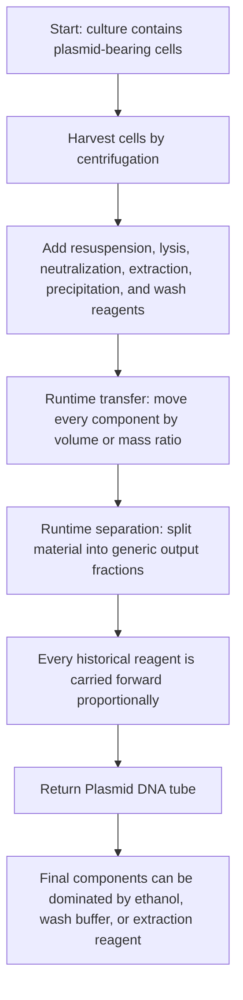
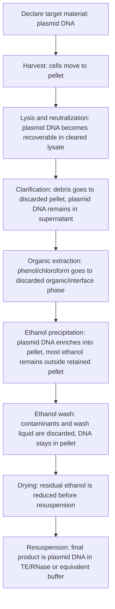

# DNA Cleanup Material Tracking Design Draft

Status: draft
Date: 2026-05-08
Scope: runtime material tracking, separation semantics, DNA cleanup stdlib behavior

## Problem

Plasmid miniprep protocols currently validate and run, but final material tracking can report ethanol, wash buffer, and extraction reagents as major final product components.

This is not a binding-name bug. The current runtime material model treats transfers and separations as generic conserved liquid movement:

- transfer moves source components into the destination by volume or mass ratio;
- separation splits the input into output fractions with a generic ratio;
- the runtime does not know that DNA should enrich into a pellet during ethanol precipitation;
- the runtime does not know that phenol/chloroform should be excluded from the retained aqueous phase;
- the runtime does not know that wash reagent should mostly leave with the discarded wash fraction;
- the runtime does not know that drying reduces residual ethanol before resuspension.

So the final tube has the right container identity and plausible volume, but the wrong biological material identity.

## Current Behavior Flow

## Intended Domain Flow

## Design Direction

The fix should be semantic, not name-based. Do not hard-code component names such as `ETOH_ABS`, `ETOH70`, `PCI`, or `Plasmid DNA` into the runtime as special cases.

The material model needs a way to express component fate across separation and cleanup operations:

- target analyte or retained material class;
- retained fraction, discarded fraction, and optional waste output;
- partition behavior for background matrix, wash buffers, organic extraction reagents, and target analytes;
- carryover or residual amount after wash and drying;
- final product identity separate from solvent or buffer matrix.

## Proposed Implementation Plan

1. Freeze a decision card for cleanup/separation semantics.
   Define invariants before code changes. The key invariant is that a domain cleanup operation must preserve intended target identity while allowing non-target reagents to be removed or reduced.

2. Add conformance requirements.
   The miniprep case should become a regression scenario. The first test should assert qualitative invariants, not exact biochemical yields:

   - final product is not primarily ethanol or phenol/chloroform;
   - DNA-containing material reaches the returned tube;
   - wash and extraction reagents are not major retained components after wash, drying, and resuspension.

3. Extend separation or cleanup semantics.
   Prefer a general model such as annotated separation or cleanup programs over protocol-specific hard-coding. Possible author-facing concepts:

   - keep target material in pellet or supernatant;
   - discard wash fraction;
   - remove background reagent with an efficiency or residual fraction;
   - resuspend retained target into a new buffer matrix.

4. Update stdlib DNA extraction protocols.
   `ExtractDNAPrecipitation` should expand to primitives that preserve the target-material semantics. A future `PlasmidMiniprep` protocol can build on the same primitives.

5. Update final product reporting.
   Reports should distinguish target analyte, buffer matrix, and residual contaminants. A final DNA product can be "DNA in TE buffer" even if TE is the largest volume component.

## Open Questions

- Should analyte fate be specified directly on `sep` programs, or should there be explicit cleanup operations such as precipitation, wash, dry, and resuspend?
- Should component fate be deterministic only, or should it allow approximate efficiency parameters?
- How should component metadata distinguish analyte, matrix, wash reagent, extraction reagent, and contaminant?
- Which diagnostic should fire when a protocol asks generic `sep` to model a domain cleanup without enough semantic annotations?

## Non-Goals

- Do not make `ETOH_ABS`, `ETOH70`, or `PCI` special runtime names.
- Do not infer biological semantics from container labels alone.
- Do not claim miniprep material tracking is correct while using only proportional generic separation.
- Do not expose kernel-internal operations as the user-facing fix.
